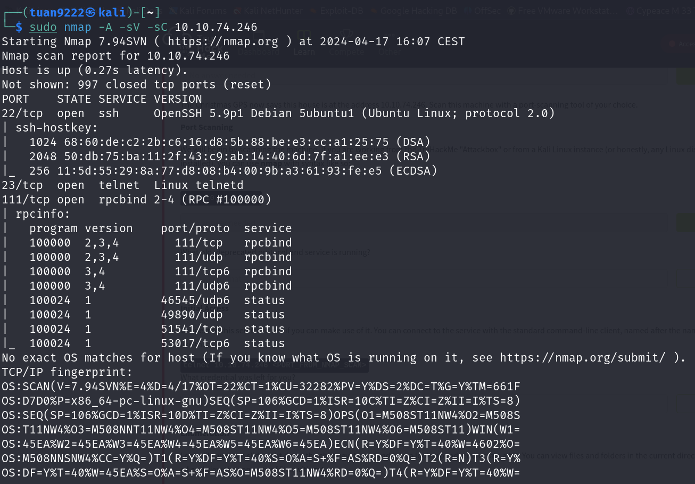

# 25 Days of Cyber Security

### [Day 13] [Networking] Coal for Christmas

* Category: Networking
* Difficulty: **Easy**

#### Challenge

We are given the machine's address, let's scan it for open port with `nmap`.

We can see that telnet service is running on port 23. Let's try to connect to this machine's telnet.

An account is already created for us! Let's use it to login.

Now let's look around for more infomation about this machine.

The machine is running a very old version of Linux. This machine might be vulnerable to kernel exploit. Let's look further in the files that is left for us.

Urghhh! The Grinch has eaten half of our cookies! It looks like our *cooklies_and_milk.txt* is a modified version of a **DirtyCow** exploit. Let's find the original version of it and try out the exploitation.

We have found the original code, now we need to copy it to our machine using a text editor.

From the code comment, we can see the compile command and usage instruction. Let's compile the code and run it.

We have created a new user with our code! Let's log in with this account!

We now have root privilege! And look like there is something left for us by the annoying Grinch.

Let's follow his instructions and get the flag!

