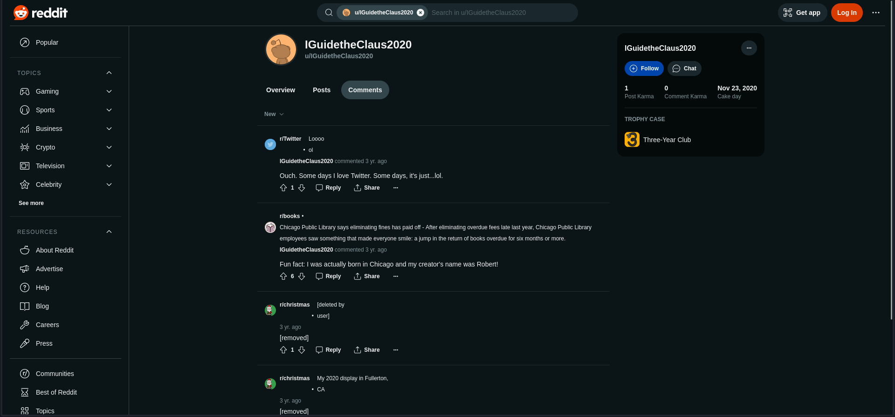
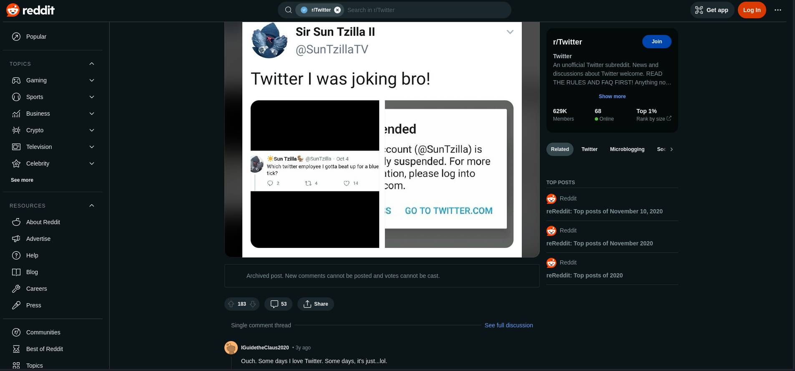
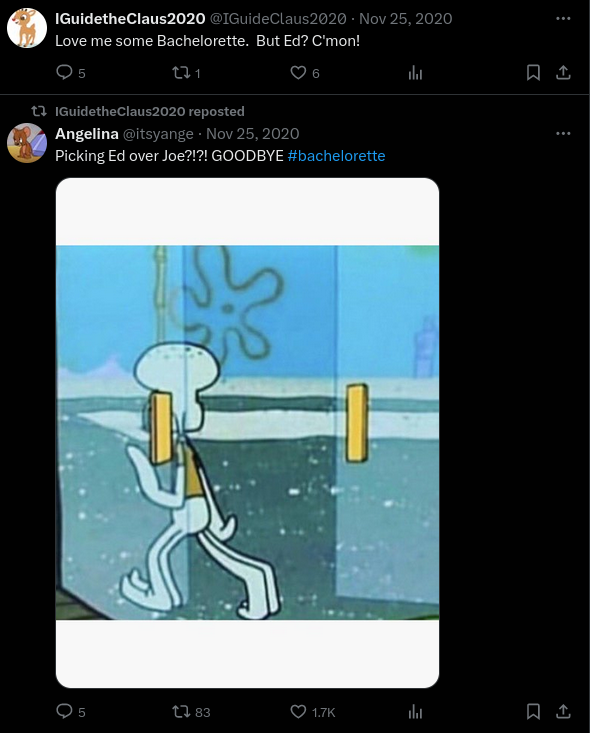
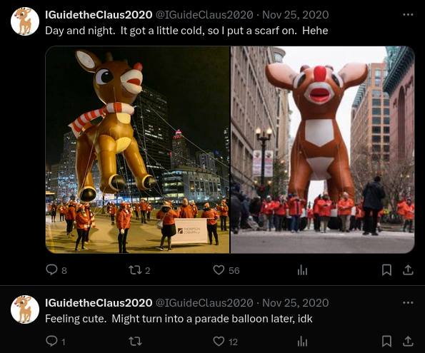
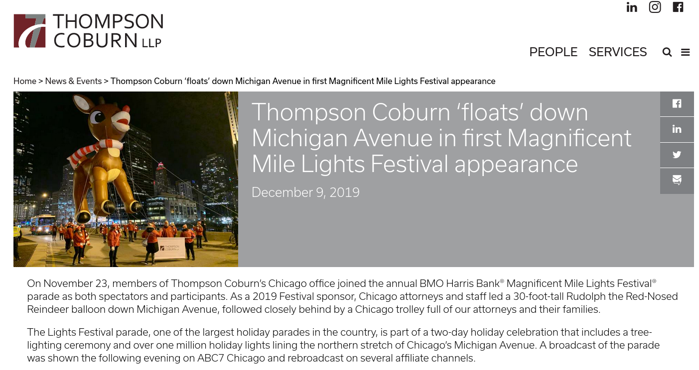
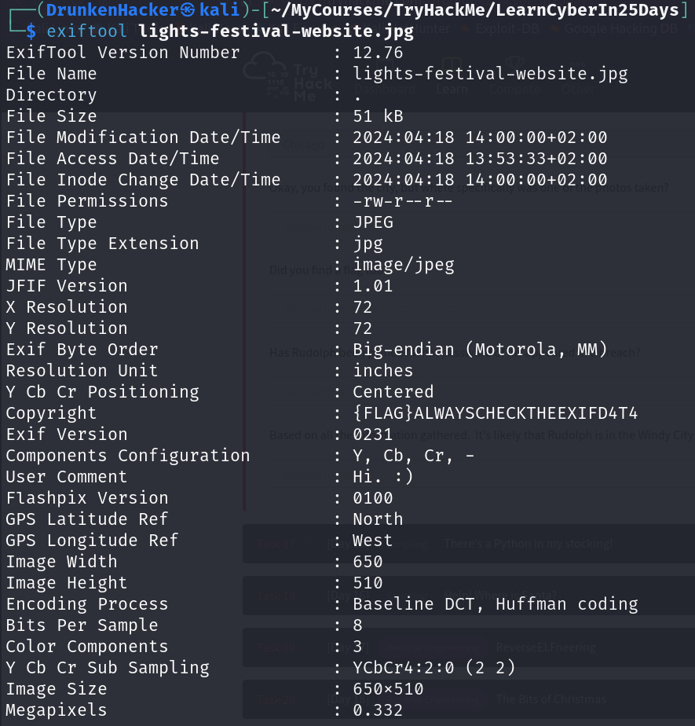
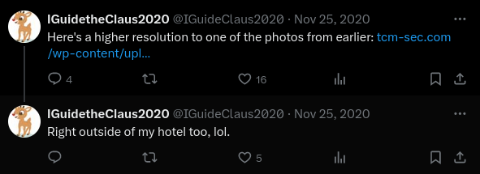
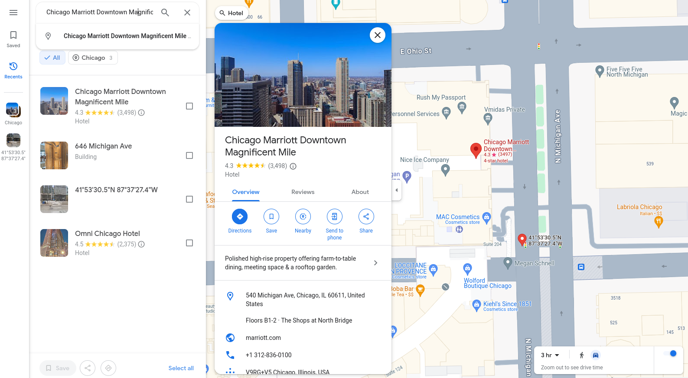

# 25 Days of Cyber Security

## [Day 14] [OSINT] Where's Rudolph?

* Category: OSINT
* Difficulty: Easy

### Challenge

Our task is to find Rudolph given that he loved to use Reddit and his username was **IGuidetheClaus2020**.  
First, we check out Reddit and find his account.

As we click on the comment section, we can see his comment history. The URL of this page is the answer to the first question.  
We can also see one comment where he said he was born in Chicago. This is our answer to the second question.  
In the comment, he also mentioned his creator's name - Robert. Let's look up his full name on Google.

We now have the answer to the third question.  
From the comment history, we can see that Rudolph also used Twitter. This is the answer for our fourth question.

As we go to X (formerly Twitter) and search for his username, we find his account. In the account details, we can see his username. This is the answer for the fifth question.

As we look further into his posts, we can find a post about Bachelorette and multiple reposts related to this. It seems like he is very passionate about this. This is clearly the answer for our sixth question.

For the seventh question, there is a post about Rudolph going to a parade.

Let's search for the image on Yandex to see if there is any information about this.

There is an article from *Thompson Coburn*, whose name also appears in the image, about the parade.

Information from the article tells us that the parade took place in Chicago. This is the answer for our question.  
For the eighth question, we need to get the exact location of the place where the picture was taken. It is a great idea to look for these kinds of information in the exif data so I save the original image and use `exiftool` to print out the exif data.

From the exif data, there is a GPS location. All we need to do is to search for the coordinates on Google Maps and copy the decimal coordinates to our answer.  
There is also a flag for the nineth question in the exif data.  
For the tenth question, let's go to https://haveibeenpwned.com and check if the email that appears on Rudolph's X account has been breached.

The email is breached but no further details is given. We are supposed to go to https://scylla.sh if we want to see these information. However, at the time of this challenge, Scylla is down so I take the answer from another user.

For the last question, we can see a post from X where Rudolph said
> Right outside of my hotel too, lol.

According to the coordinates found, we can locate a hotel named Chicago Marriott Downtown Magnificient Mile just nearby. This should be where Rudolph is.

