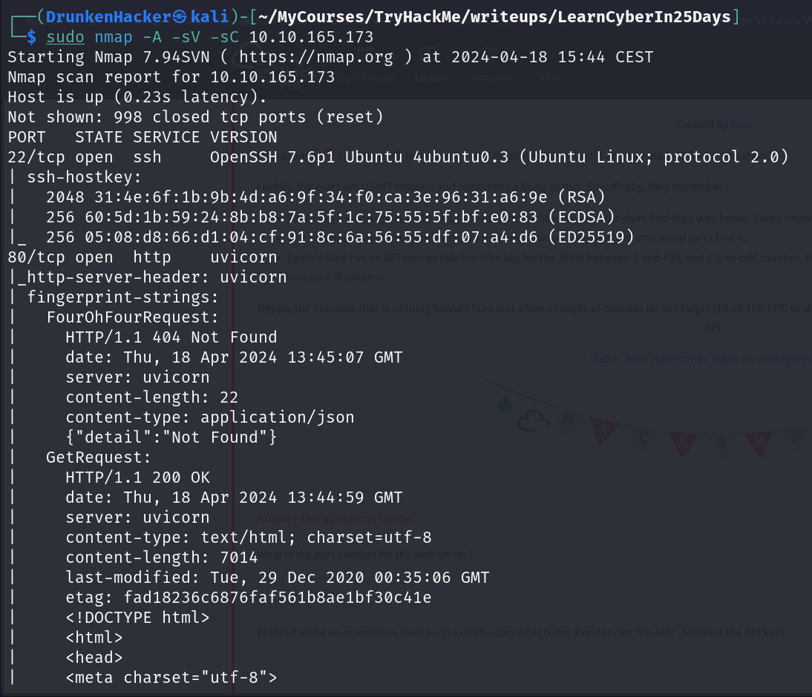
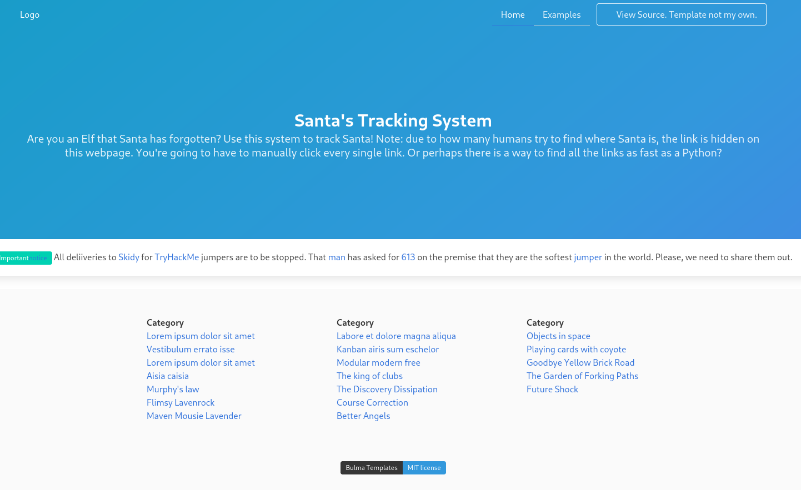
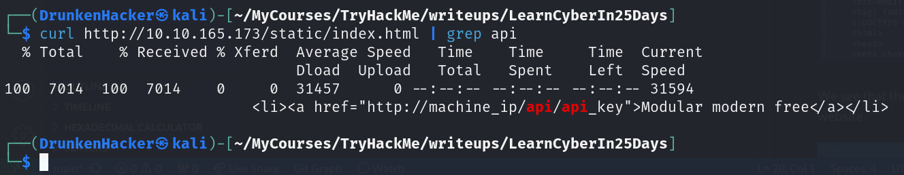
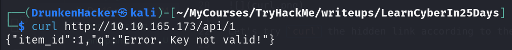
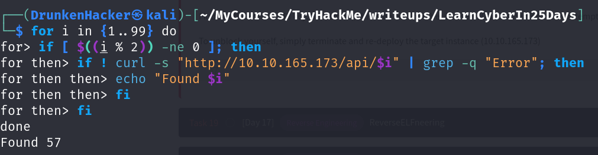
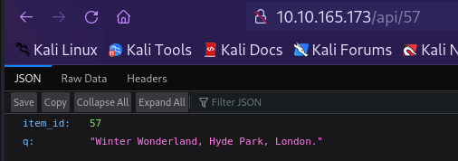

# 25 Days of Cyber Security

## [Day 16] [Scripting] Help! Where is Santa?

* Category: Scripting
* Difficulty: **Easy**

### Challenge

We are given the IP of the machine. Let's use `nmap` to scan the machine for open ports.

We see that there is a web server running on port 80. Let's visit the website.

There is a hidden link on the page! Clicking on every link of the page is going to be insufficient. Let's try using `curl` to get the source code of the page and pipe it to `grep` and see if we can find it.

Let's try `curl` the hidden link according to the hint.

We see that the response when we enter the wrong API key contains the word *Error*. Let's try to use `curl` to brute force the API key. The idea is to try all odd number as the hint suggested and the response without the word *Error* is the correct API key.

Now that we have the correct API key, let's connect to the API and see where Santa is.

