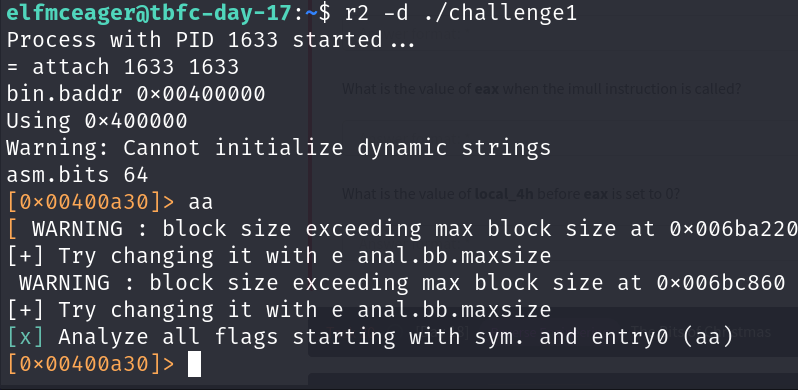

# 25 Days of Cyber Security

## [Day 17] [Reverse Engineering] ReverseELFneering

* Category: Reverse Engineering
* Difficulty: **Easy**

### Knowledge section

#### x86-64 Assembly

* Instruction set architecture **most commonly found** in modern systems
* **Computers execute machine code** encoded as bytes
* Machine code is usually produced by a compiler which takes the source code going through several intermediate stages to produce executable machine code
* There are *16-bit*, *32-bit* and *64-bit* instruction sets, all of which are ***backward compatible***. This means that 64-bit processors can run 32-bit and 16-bit code.
* *Source code* is first compiled to *assembly* (.s files) then an assembler converts it to an *object program* (.o files), and operations with a linker make it an *executable*
* A framework for reverse engineering and analysing binaries: `radare2`

#### Radare2

To open a program in **debugging mode**, run `r2 -d <PROGRAM_FILE>`.  
Type `?` for **help** or `a?` to understand a specific feature.  
Type `aa` to analyze the program. This is the most common analysis command as it **analyses all symbols and entry points** in the executable.  
Type `afl` to find a **list of function**.  
Type `pdf @<FUNCTION_NAME>` (**print disassembly function**) to examine the assembly code at the function.  
Type `db <ADDRESS>` to **set breakpoint**.  
Type `dc` to **execute** a program **until a breakpoint** is hit.  
Type `px @<ADDRESS>` to **view the content of memory**.  
Type `ds` to **go to next instruction**.  
Type `dr` to **view registers**.  
Type `ood` to **reload the program**.

#### Dealing with assembly

|Initial Data Type|Suffix|Size(bytes)|
|-|-|-|
|Byte|b|1|
|Word|w|2|
|Double Word|l|4|
|Quad|q|8|
|Single Precision|s|4|
|Double Precision|l|8|

When dealing with memory manipulation using registers, there are other cases to be considered:
* (Rb, Ri) = MemoryLocation[Rb + Ri]
* D(Rb, Ri) = MemoryLocation[Rb + Ri + D]
* (Rb, Ri, S) = MemoryLocation[Rb + Ri * S]
* D(Rb, Ri, S) = MemoryLocation[Rb + Ri * S + D]

#### Important instructions

* `leaq source, destination`: sets destination to the address denoted by the expression in source
* `addq source, destination`: destination = destination **+** source
* `subq source, destination`: destination = destination **-** source
* `imulq source, destination`: destination = destination **\*** source
* `salq source, destination`: destination = destination **<<** source
* `sarq source, destination`: destination = destination **>>** source
* `xorq source, destination`: destination = destination **$\oplus$** source
* `andq source, destination`: destination = destination **&** source
* `orq source, destination`: destination = destination **|** source

### Challenge

First, we log into the machine with the given account.

Now we open `radare2` to anylyze our program ***challenge1*** and run `aa`.

Let's type `pdf @main` to see instructions in the main function.

The assembly seems to be very simple so we may be able to deduce from it and not look at the memory value as it runs.  
Here, we can see that there are 3 local variables **local_ch**, **local_8h** and **local_4h**. We can also see that the first time **local_ch** is called is when it is assigned with the value *1*. Then **local_8h** is assigned with the value *6*, register **eax** is assigned with the value of **local_ch**, which is *1*. **eax** is then multiplied by **local_8h** which has value *6*. Therefore, after the multiplication, **eax** has value *6*. This result is then transfered to **local_4h** before **eax** is set to *0* and the function is returned.