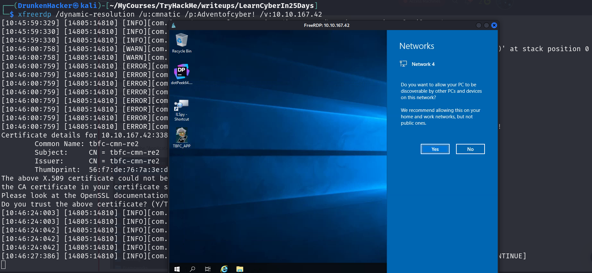

# 25 Days of Cyber Security

## [Day 18] [Reverse Engineering] The Bits of Christmas

* Category: Reverse Engineering
* Difficulty: **Easy**

### Challenge

We are given an account to the machine, let's use RDP to login to the machine.

Let's first check out what our TBFC_APP does.

Sounds like we need to get the password from the app. Let's we run ILspy and open the TBFC_APP application to analyze it.

We can see some functions and attributes here. The CrackMe function looks quite interesting. Let's check it out.

There are 2 forms here, an AboutForm and a MainForm. Let's first check out the AboutForm.

Hmm! It seems like the AboutForm is not important. Let's check out the MainForm.

This seems like what renders the app as we see earlier when we were asked to enter the password. Let's look for the function that checks the password.

We have found Santa's password and the flag is also here.