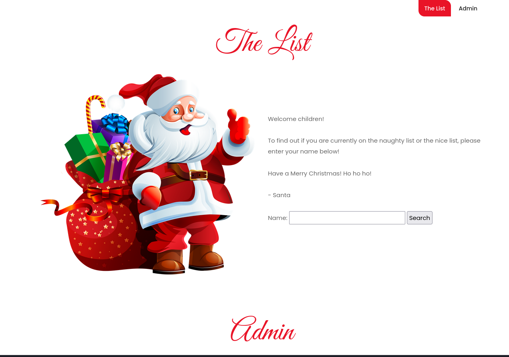
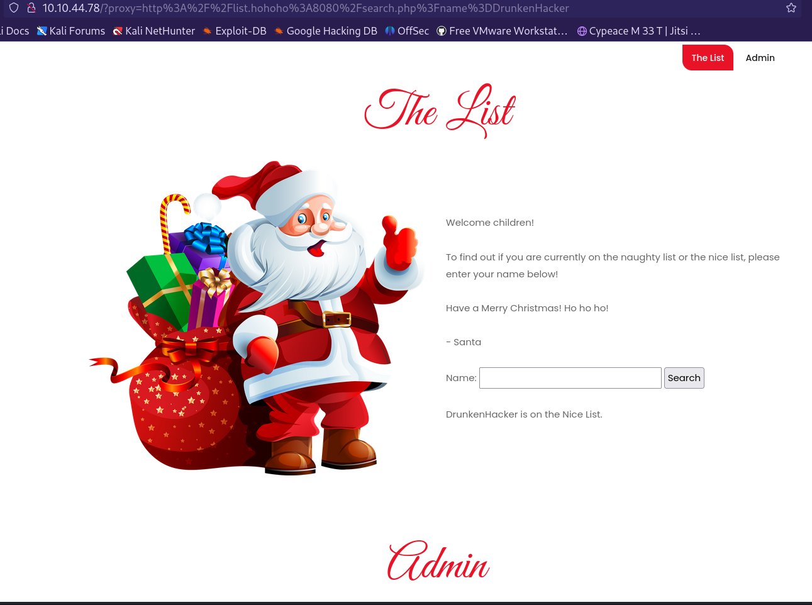
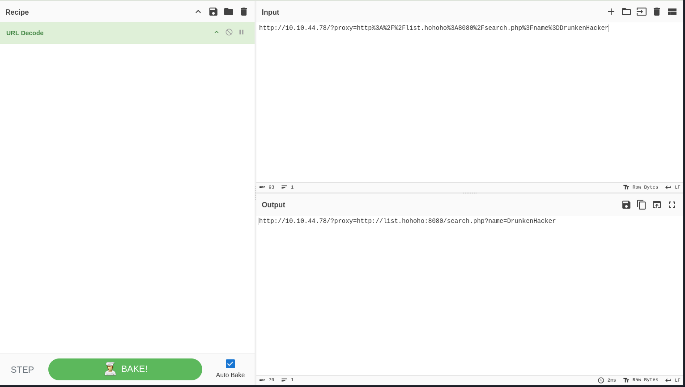
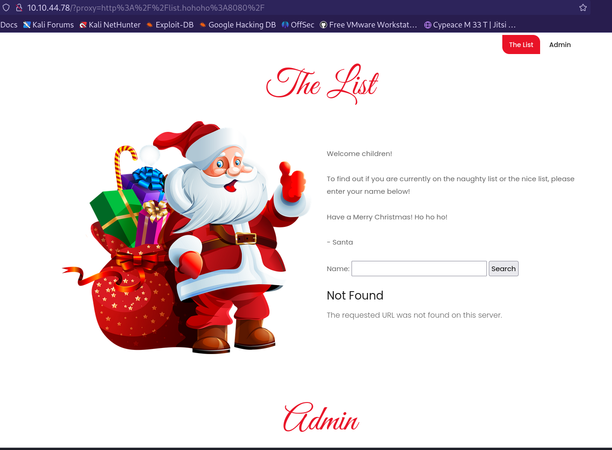
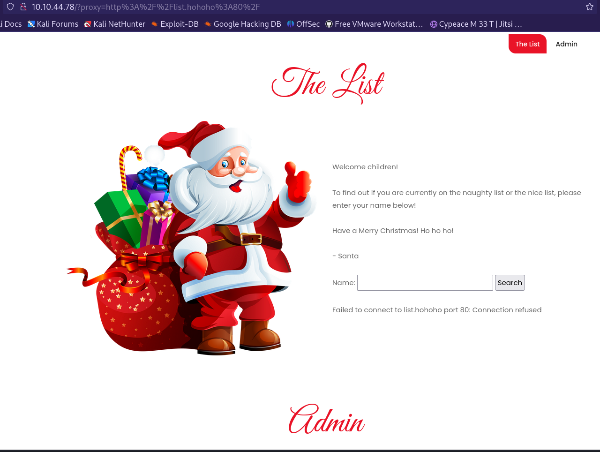
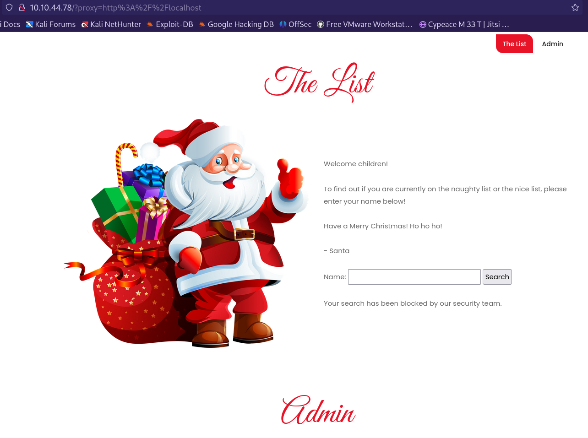
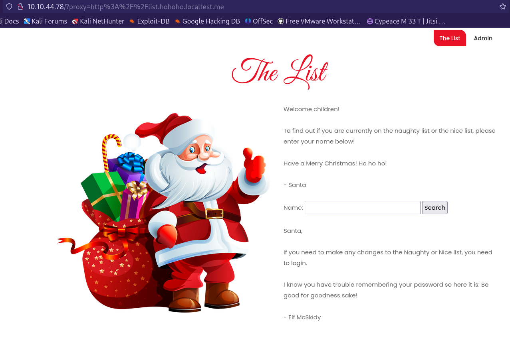
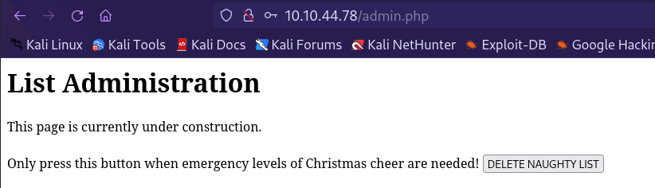

# 25 Days of Cyber Security

## [Day 19] [Web Exploitation] The Naughty or Nice List

* Category: Web Exploitation
* Difficulty: **Easy**

### Challenge

First, let's visit the given URL.

Let's try search for a name and see what happens.

I'm on the nice list! That's good to know. Let's inspect the URL and see if we can exploit it.

Sounds like the app is looking for name from a backend server as list.hohoho is not a valid DNS name. This is potentially vulnerable to **SSRF** (**Server-Side Request Forgery**) Let's try to change the URL and see what happens.

We get a Not Found response as we delete the *search.php* part from the URL. Let's try changing the port to 80.

Seems like the 80 port is blocked. Let's try to connect to the *localhost*.

We are blocked by the security team. However, this may not be the end of the world. Maybe there is a check for the URL as we send the request. It is possible that the app is checking if the URL requested starts with *http://list.hohoho*. Let's try to bypass this. We know that the domain localtest.me resolves every subdomains to 127.0.0.1, which is the *localhost*. Let's try to use this domain.

It works! And there is the password left by McSkidy! Now let's try to login to the app as admin using the password. We have not yet found the username so we might need to guess a few common ones.

A lucky guess with **Santa** and we are in! Now all we have to do is delete the naughty list so everyone can get presents this year. As we clicked the delete button, we get the flag.