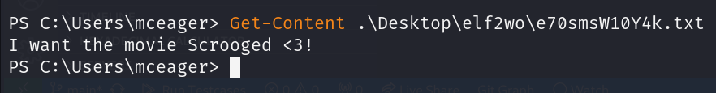

# 25 Days of Cyber Security

## [Day 20] [Blue Teaming] PowershELlF to the rescue

* Category: Blue Teaming
* Difficulty: **Easy**

### Knowledge section

#### PowerShell

**PowerShell** is a *cross-platform task automation and configuration management framework*, consisting of a command-line shell and scripting language. Unlike most shells, which accept and return text, PowerShell is *built on top of the .NET Common Language Runtime (CLR)*, and accepts and returns .NET objects.  

Some of the basic commands in PowerShell are:
* `Get-ChildItem` - **List the files and folders** in the current directory. Some common options of it are:
  * `-Path` - **Specifies the path** to the items.
  * `-File/-Directory` - Specifies that **only files or directories** are returned.
  * `-Filter` - **Specifies a filter** in the format `*.<extension>`.
  * `-Recurse` - Specifies that the operation is performed on **all items** in the specified path and in **all child items** of the path.
  * `-Hidden` - Specifies that **hidden items** are included in the operation.
  * `-ErrorAction` - Specifies how to **handle errors**.
* `Get-Content` - **See the content** of a file. The result can be piped to `Measure-Object` to count the number of lines.
* `Set-Location` - **Change the current location** to a specified location.
* `Select-String` - **Search a particular file for a pattern**.
* `Get-Help` - **Get help** about a cmdlet or function.

### Challenge

We are given the account for the machine, let's first log into it with SSH.

Now we launch the PowerShell and see what we can do.

We need to see what is hidden inside the *Documents* folder. Let's use the `Get-ChildItem` command.

We see a file named **e1fone.txt**. Let's see what is inside it.

We now know what the first elf wants.  
We know that there is a hidden folder on the desktop. Let's check it out.

There is a folder named **elf2wo** here. Let's see what is inside it.

There is a text file inside of it. Let's see its content.

And now we know what the second elf wants.  
For the third elf, we need to find a hidden folder that contains files for him in the *Windows* folder. Let's first change our location to the *Windows* folder.

There is a lot of files and folders here so maybe we should apply a filter to see what file contains number *3*.

The command looks for any hidden folder containing number *3* so (even with the filter) it yields an enormous results. We need to narrow it down first and work from there. Let's just search for any hidden folder in the next level.

Sounds like we found the folder. Let's see what is inside it.

Let's see what is in side the first file.

Now that is a lot of words. Let's count the number of words in the file.

Now we need to get the 551th and 6991th words from the file.

Now we have the first half of the third elf's request. Let's see what is in the second file.

Sounds like there is a bunch of phrases here. Maybe we should look for the phrase that contains the first half.

My first attempt did not yield any results. I then noticed that the phrase does not contain any spaces. As I tried again, I found what the third elf wants.