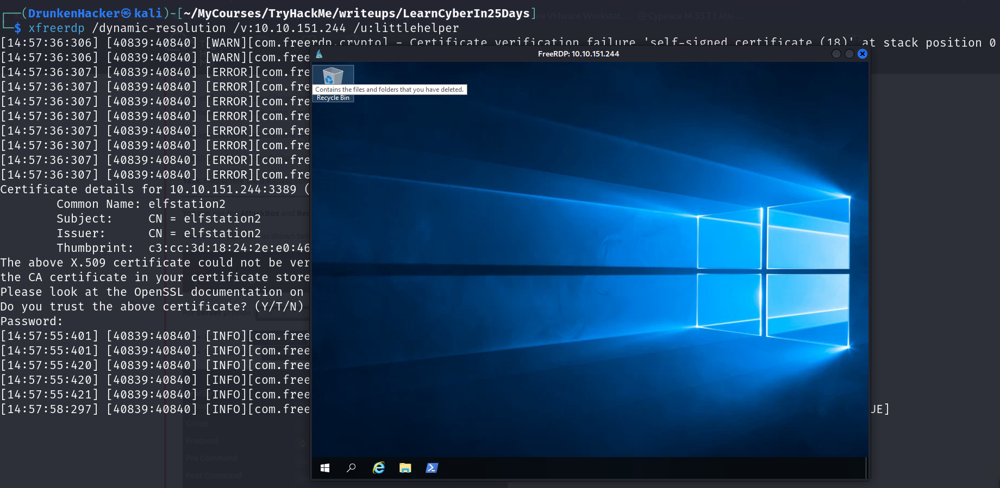
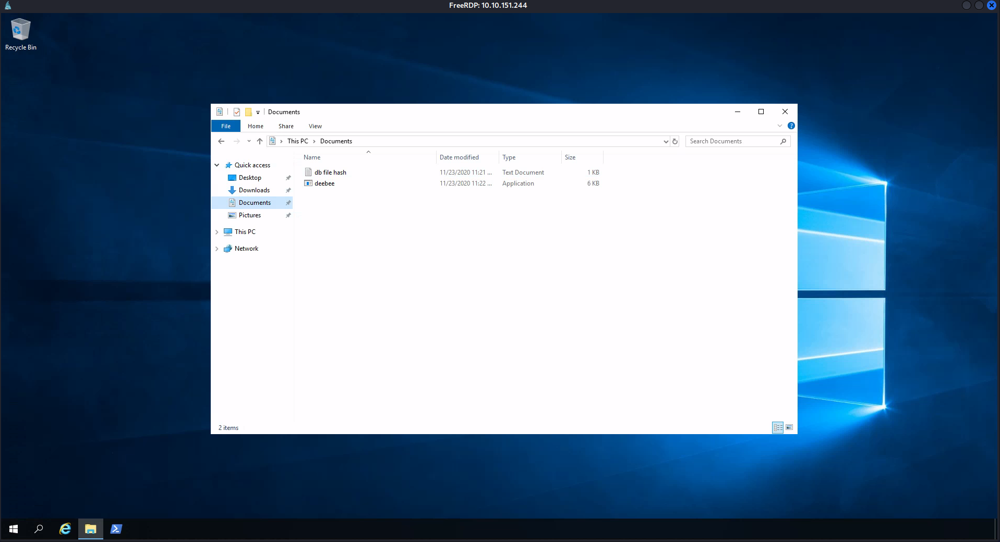
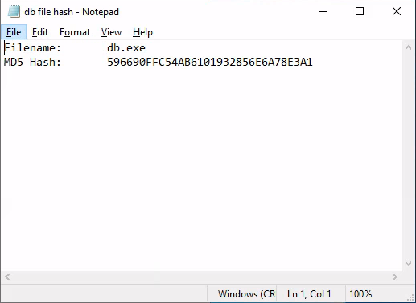
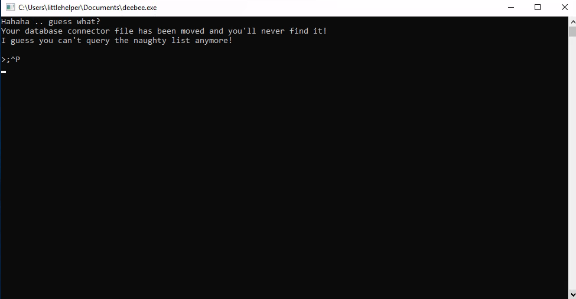
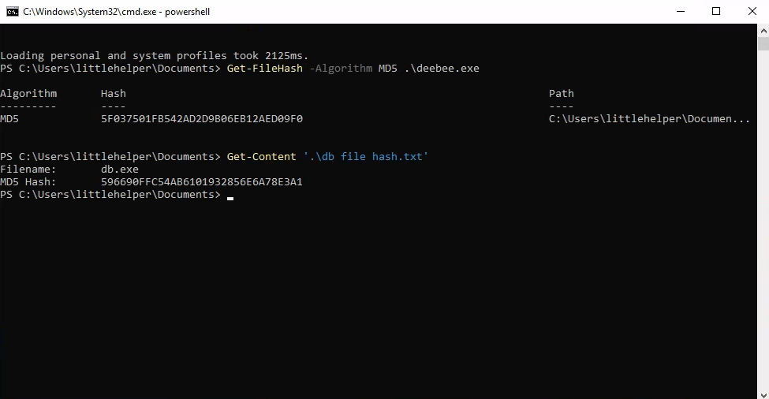
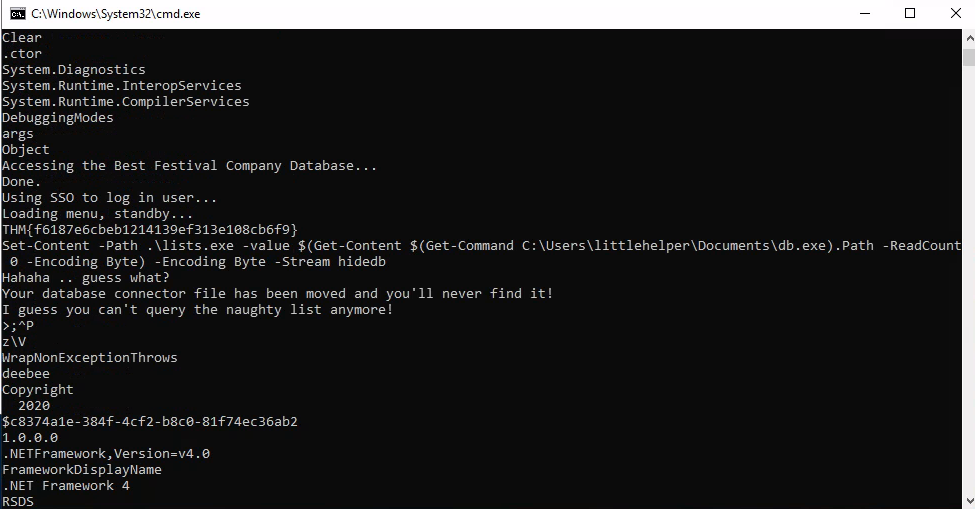
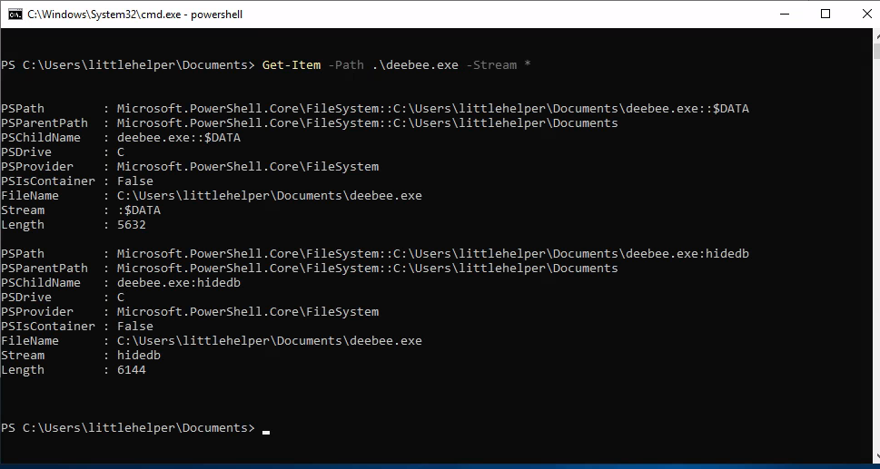
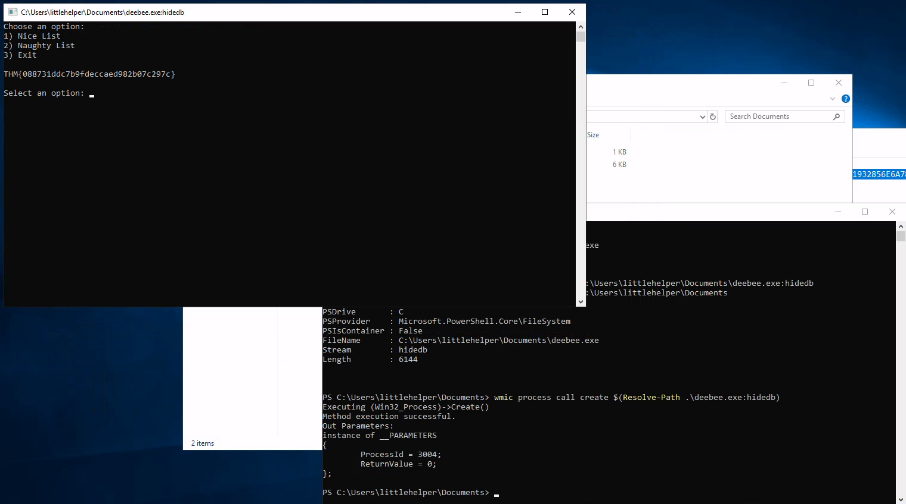

# 25 Days of Cyber Security

## [Day 21] [Blue Teaming] Time for some ELForensics

* Category: Blue Teaming
* Difficulty: **Easy**

### Knowledge section

* A file hash acts as a signature for the file.
* A file hash can be obtained by running: `Get-FileHash -Algorithm MD5 -Path <file>`
* `Strings.exe` is a tool located in `C:\Tools` that can be used to extract ASCII and Unicode strings from binary files.
* The command to run **Strings** tool is: `C:\Tools\strings64.exe -accepteula <file>`.
* **Alternate Data Streams (ADS)** is a file attribute specific to Windows **NTFS (New Technology File System)**. It allows more than one data stream to be associated with a file.
* The command to view ADS using Powershell: `Get-Item -Path <file> -Stream *`.
* If an executable is hidden within an ADS for another file, use **Windows Management Instrumentation (WMIC)** to launch it: `wmic process call create $(Resolve-Path <file>:<stream>)`.

### Challenge

We are given the account for the machine, let's first log into it with RDP.

Now we need to file the database connector file. Let's look around.

We seem to find the database connector file's hash. But the executable in the folder seems to be suspicious. Let's check out the hash first.

It says here that the file should be `db.exe`, not `deebee.exe` as we found. It is likely that the original file is altered or moved. Let's try and run the `deebee.exe` file and see what happens.

Uh oh! It says that our database connector is moved. Let's check this file's hash to confirm our suspicion.

The hash is completely different from what we expect. This confirms our suspicion. The file is not the original one. Let's peek into the suspicious file using the `strings` tool and see if we can find anything.

There is a flag here. And there is also a command with something called **hidedb**. Let's check the file ADS to see what **hidedb** is.

Sounds like we found the data stream to our hidden database connector. Let's run our database connector using the WMIC command.

We found the database connector. And we also found the flag.