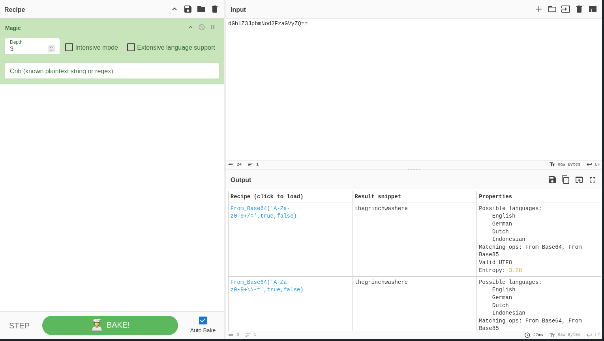
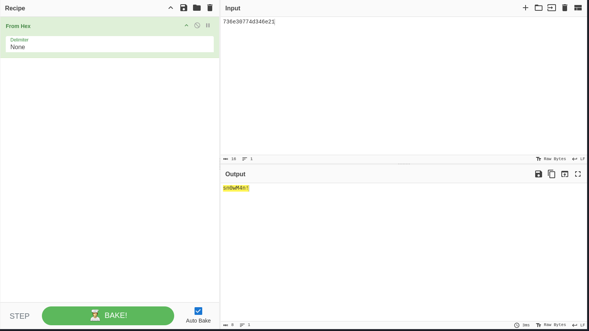

# 25 Days of Cyber Security

## [Day 22] [Blue Teaming] Elf McEager becomes CyberElf

* Category: Blue Teaming
* Difficulty: **Easy**

### Challenge

We are given the account for the machine, let's first log into it with RDP.

Now let's go to the folder on the *Desktop* and run KeePass.

We are give the master key of McEager. Let's try it out.

Hmm! The key is incorrect. Let's look around the folder and see if we can find the correct key.

The folder's name looks kind of cryptic. Let's paste it to CyberChef and see if we can find anything.

It was a base64 encoded string. And sounds like the Grinch messed something up again. Let's try the decoded string as the master key.

Yes! We got in! But seems like all our passwords are now encrypted. First, we try to decode the password for *Elf Server*.

That was a success. Next, we try to decode the password for ElfMail.

Another success! Let's go for the last one!

Sounds like this is not the password but there is a note. Let's paste the note to CyberChef and see what it says.

This seems to be a JavaScript code based on the `eval` function and the `String.fromCharCode` function. Let's try adding ***From CharCode*** with comma as delimiter and base 10 to the recipe and see what we get.

We got some JavaScript code. Let's add ***From CharCode*** another time with comma as delimiter and base 10 to the recipe and see what we get.

We got a link! Unfortunately, the link is no longer available at the time of writing so I took the answer from a walkthrough.