# 25 Days of Cyber Security

## [Day 23] [Blue Teaming] The Grinch strikes again

* Category: Blue Teaming
* Difficulty: **Easy**

### Knowledge section

* The **Volume Shadow Copy Service (VSS)** coordinates the actions that are required to create a consistent shadow copy (also known as a snapshot or a point-in-time copy) of the data that is to be backed up.
* Malware writers know of this Windows feature and write code in their malware to look for these files and delete them. Doing so makes it impossible to recover from a ransomware attack unless you have an offline/off-site backup. Not all malware deletes the volume shadow copies though.
* The **Task Scheduler** enables you to automatically perform routine tasks on a chosen computer. Task Scheduler does this by monitoring whatever criteria you choose (referred to as triggers) and then executing the tasks when those criteria are met.
* The command to interact with **VSS** is `vssadmin`. Two commands of particular interest are `list volumes` and `list shadows`.
* **Disk Management** is a system utility in Windows that enables you to perform advanced storage tasks.

### Challenge

We are given the account for the machine, let's first log into it with RDP.

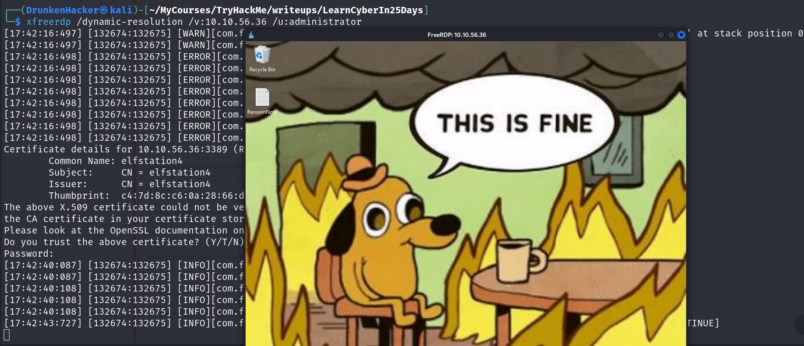

There is a ransom note on the desktop. Let's see what it says.

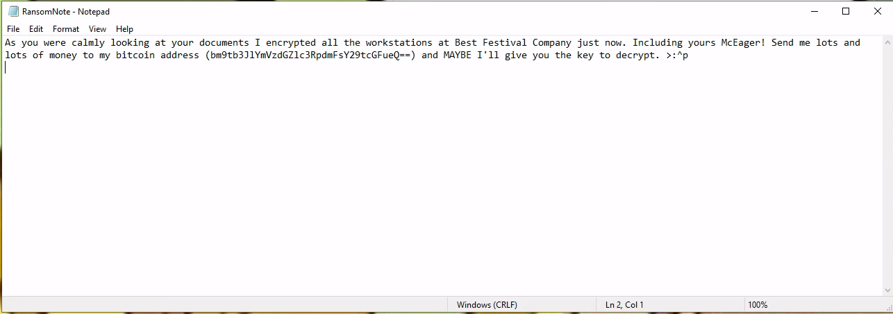

Let's pass the address to CyberChef and see if we can find anything.

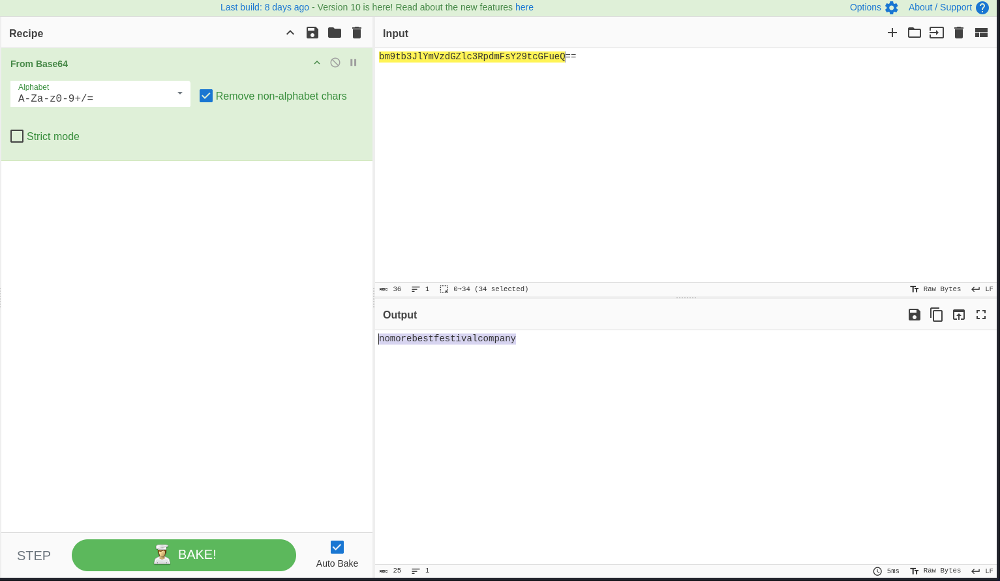

Let's go to *Documents* and see what kind of data has been encrypted.

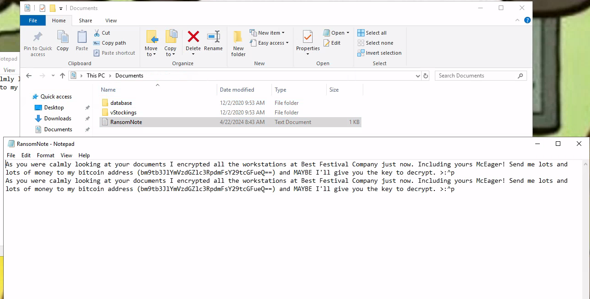

Let's first have a look at the *database* folder.

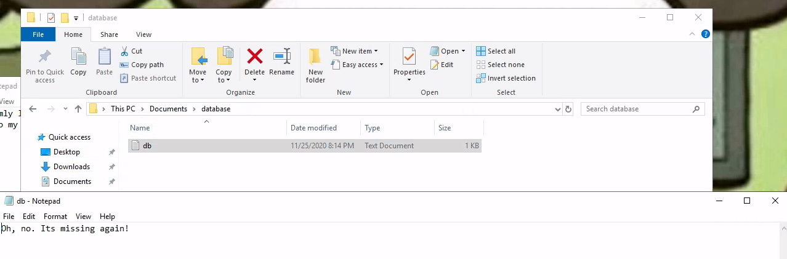

Great! The database is missing again. Let's now check the *vStockings* folder.

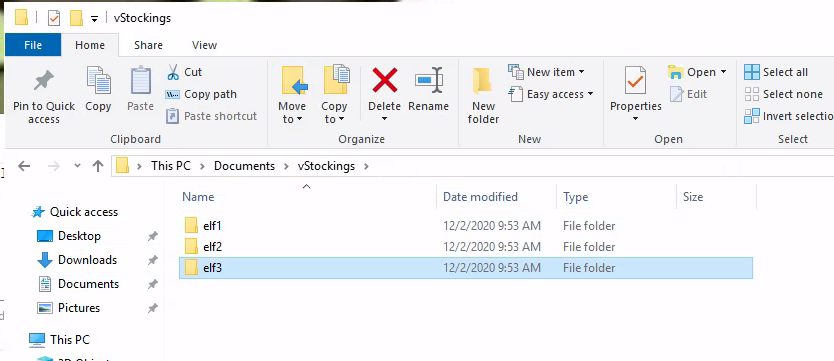

There are 3 folders for the 3 elves. Let's check them out.

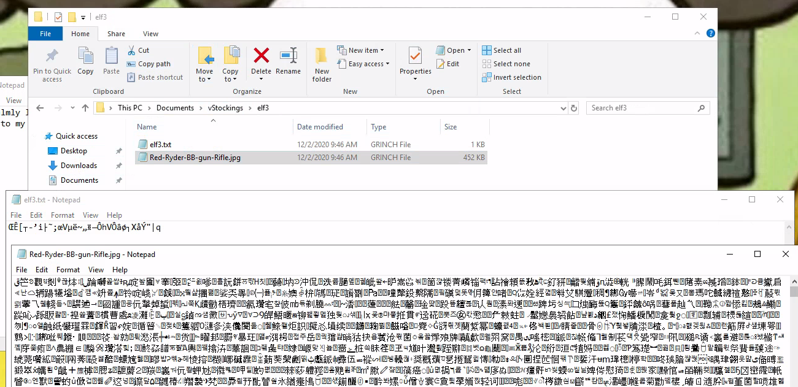

Seems like all of them are encrypted as **.GRINCH** files. Looking back to the ransom note, it says that as we were looking at the documents, files were being encrypted. Maybe the Grinch has scheduled a task to encrypt the files. Let's check the *Task Scheduler*.

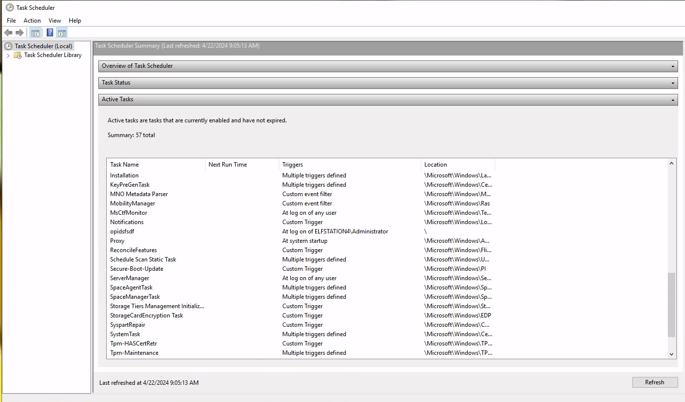

There is a lot of task scheduled here. However, there is one that seems a bit suspicious as it only runs every time the admin logs in. Let's further inspect it.

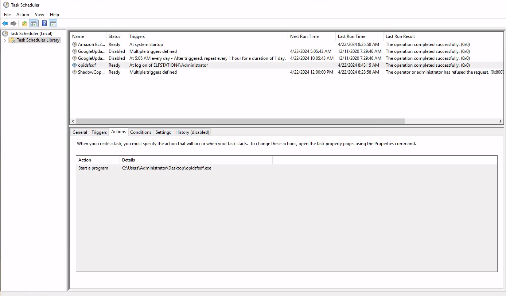

We found the path to the executable. Let's check out other tasks.

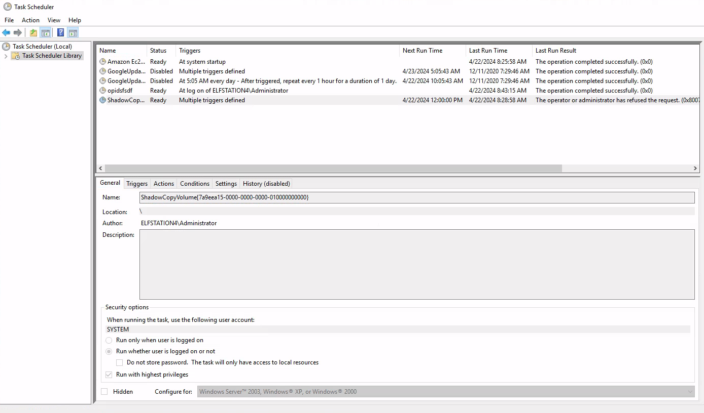

There seems to be a task named **ShadowCopyVolume** with an ID following it. Let's inspect its actions.

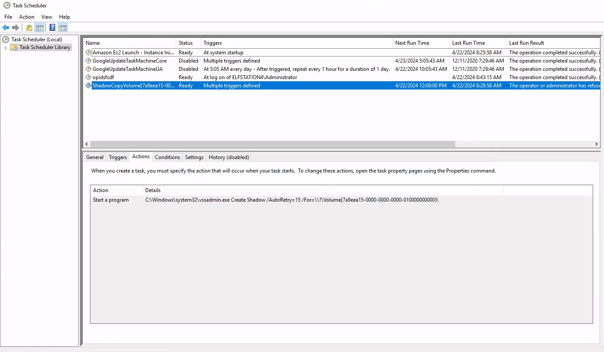

We can see that every 15 seconds, it tries to create a shadow copy of the volume. Let's look for the volume and shadow copies using the `vssadmin` command.

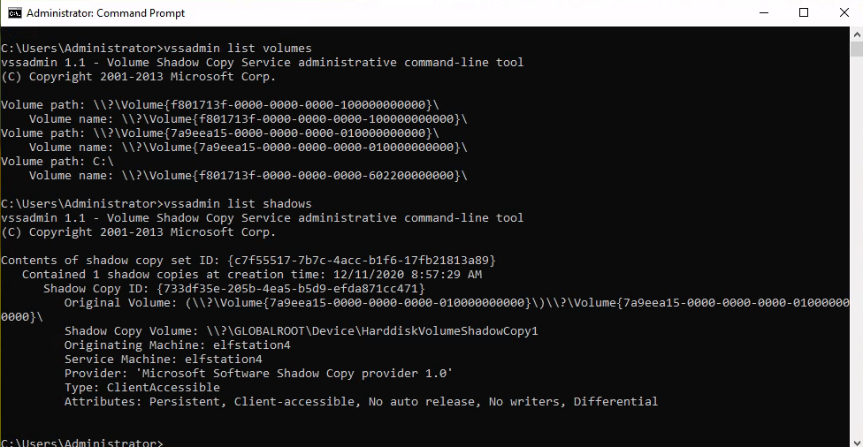

We can see that our volume is hidden. And there is a shadow copy of it. Let's try to recover the files from the shadow copy. First, we need to find the volume with **Disk Management**.

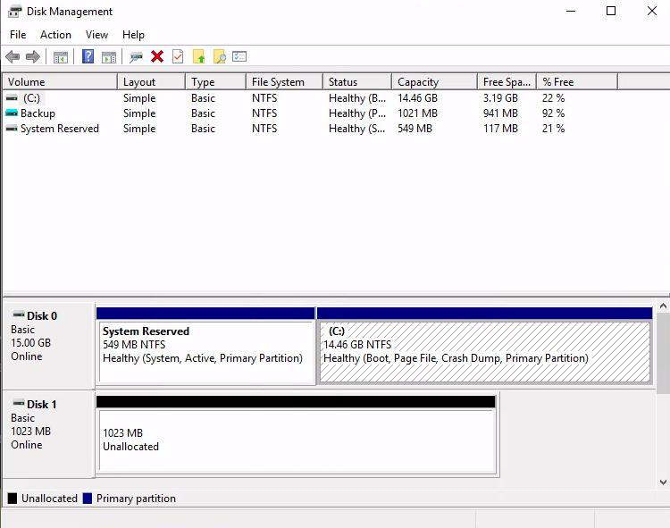

There is a *Backup* volume here. Let's check if this is our volume.

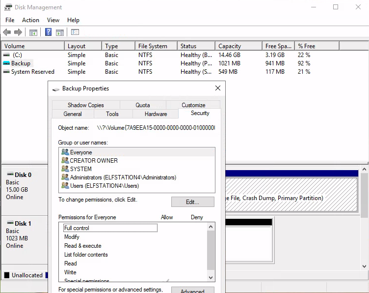

It seems like this is our volume. Let's check the shadow copies.

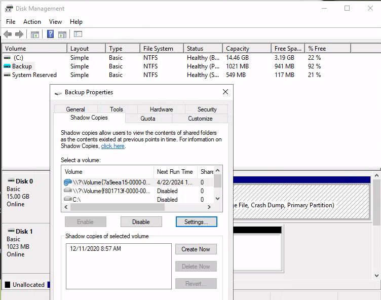

Seems like everything check out but our volume is still hidden. Let's assign a drive letter to it.

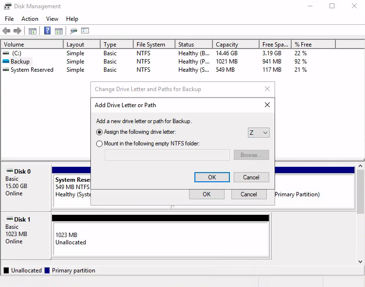

Now let's check for the volume in *File Explorer*. We should be able to see it there.

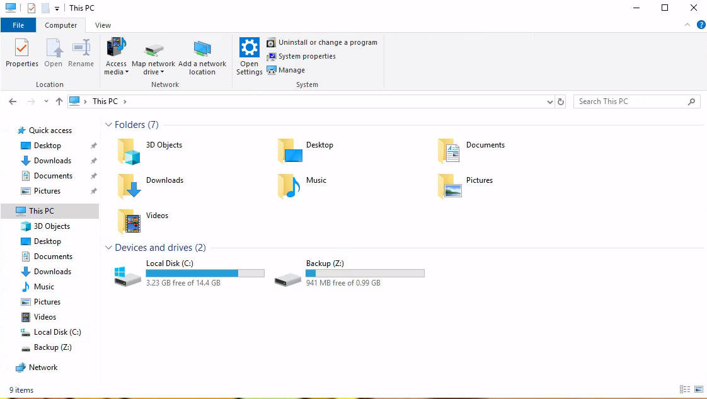

Excellent! Now we check out the volume.

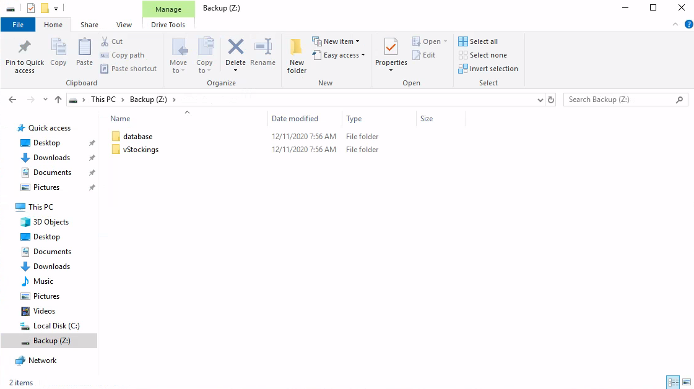

Hmm! Seems like there is no improvement here. Or maybe there is something here that we have not seen yet. Let's check for hidden files.

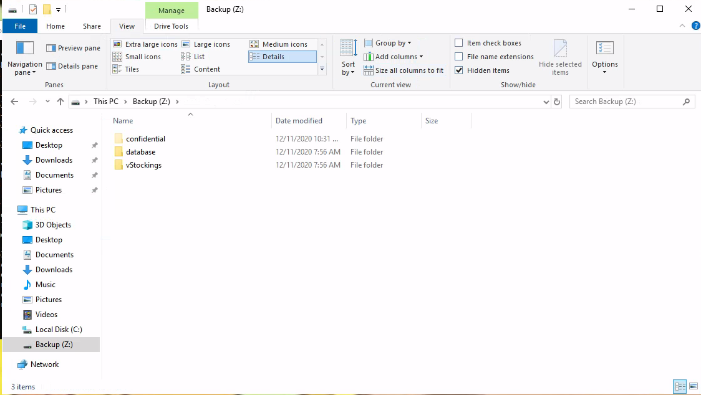

Ah! There is a hidden folder here. Let's check it out.

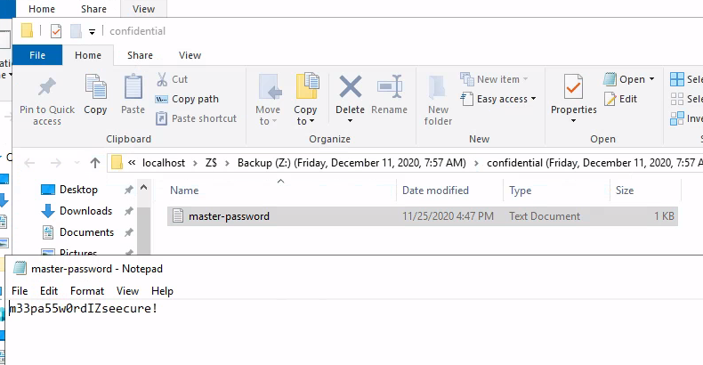

And we found the master password for the Grinch's encryption.