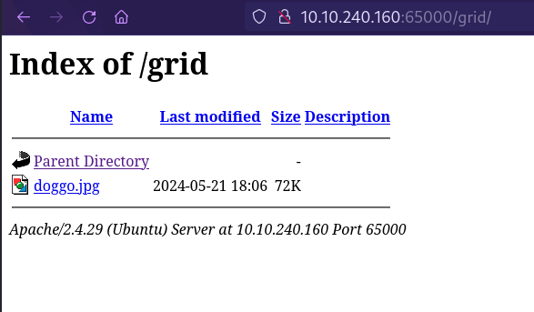
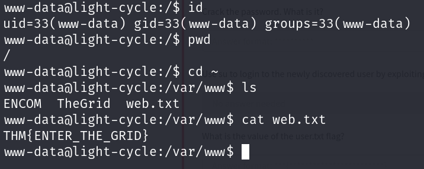
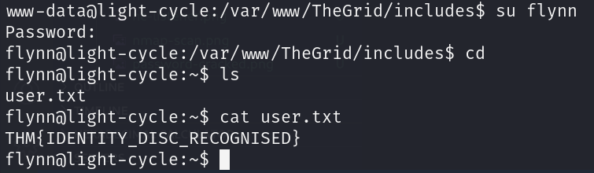
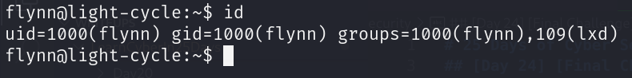

# 25 Days of Cyber Security

## [Day 24] [Final Challenge] The Trial Before Christmas

* Category: Web Exploitation, Privilege Escalation, MySQL, Password Cracking
* Difficulty: **Easy**

### Knowledge section

**1. Client-Side Filters**

* *Client-side filters* are easier to bypass than server-side filters. *Client-side filters* execute on the attacking machine, so the attacker can modify or disable them. Therefore, they should never be the sole measure of security.

**2. Shell Upgrading and Stabilization**

* *Stabilizing shells* is an important skill to provide a nicer working environment as well as fixing problems such as `Ctrl+C` kills the entire shell, `Tab` completion doesn't work, cannot use arrow keys, etc.

* To stabilize a reverse shell:
  * Use `python -c 'import pty; pty.spawn("/bin/bash")'` to spawn a better-featured bash shell. At this point, the shell is a bit prettier but still not perfect.
  * `export TERM=xterm` to set the terminal to xterm. This gives us access to terminal features like `Ctrl+C`, `Tab` completion, and arrow keys.
  * Finally (and most importantly), we background the shell using `Ctrl+Z`. Back in our terminal we use `stty raw -echo; fg`. This does two things: first, it turns off our terminal echo (so we don't see our commands when we type them), and second, it brings the shell back to the foreground. Now we have a fully interactive shell!
  * If the shell dies, we can use `reset` to reset the terminal.

**3. MySQL Client**

* Databases are used by virtually every web application on the planet to some extent or another. Some common database servers include MySQL, MariaDB (a free fork of MySQL that has identical syntax and accessing way), etc.
* Interactions on MySQL:
  * `mysql -u<USERNAME> -p` can be used to manually access the database as \<USERNAME> using **MySQL client**.
  * Use `show databases;` to list all databases.
  * `use <DATABASE>;` selects a database.
  * `show tables;` lists all tables in the selected database.
  * `select * from <TABLE>;` shows all data in the selected table.

**4. Online Password Cracking**

* Some common online password cracking tools include:
  * [**CrackStation**](https://crackstation.net/)
  * [**https://md5decrypt.net**](https://md5decrypt.net/en)
  * [**https://hashes.com/en/decrypt/hash**](https://hashes.com/en/decrypt/hash)

**5. Privilege Escalation with LXD**

* This technique involves leveraging a flaw in **lxd**, a program used to spin up containers much akin to Docker. This exploit abuses mount points to mount volumes from our victim machine (the machine we're attacking) within a container that we shouldn't be able to access/read. However, we have root powers on lxd containers - thus bypassing the read permission checks and escalate our privileges.
* Steps to perform this exploit:
  * Check if user is in the `lxd` group.
  * On the attacking machine, download build-alpine on local machine. With root user, execute the script `./build-alpine` that will build the latest Alpine image as a compressed file. Then transfer the file to the victim machine.
  * On the victim machine, download the alpine image and import it to lxd with `lxc image import <IMAGE-FILE> --alias <IMAGE-ALIAS>`.
  * Check for any imported images with `lxc image list`.
  * Initiate a new container with the imported image with `lxc init <IMAGE-ALIAS> <CONTAINER-NAME> -c security.privileged=true`.
  * Use `lxc config device add <CONTAINER-NAME> <DEVICE-NAME> disk source=/ path=/mnt/root recursive=true` to mount the root directory of the victim machine to the container.
  * Start the container with `lxc start <CONTAINER-NAME>`.
  * Run `lxc exec <CONTAINER-NAME> /bin/sh` to access the container shell. Now we can run a few commands (`id`, `cd /mnt/root/root`, etc.) to verify that we have escalated to root. 

### Challenge

We are given the IP address of the machine. Let's scan it with Nmap.

Here we can see that there are 2 websites running on 2 different ports. Let's check them out.

The website runing on port 80 is just a duplicate of TryHackMe's website. Let's check the hidden one.

We can see that the website has a login page. Let's use `gobuster` to see if there are any hidden pages.

We can see that there is a hidden `uploads.php` page. Let's check the `uploads.php` page.

Let's try to upload a file. Let's first try a `.jpg` file.

The website says `Invalid file type`. This is normal but the website seems response immediately as the file is chosen. This seems like there is a check on the client side. Let's verify this with the **Inspect** tool from the browser.

There is a JavaScript file named `filter.js` that is loaded as we access the website. Our hypothesis seems to be correct. Let's try to intercept and drop the filter with Burp Suite.  
First, we need to configure the Burp Suite proxy to intercept the JavaScript file. We need to go to **Proxy** $\rarr$ **Proxy Settings** $\rarr$ **Request Interception Rules** and edit the rule to intercept the JavaScript file.

Next, we turn on the proxy, drop the filter and then try uploading the file again.

The file is successfully uploaded. Let's try to find our uploaded file.  
We can recall from the `gobuster` scan that there is a `grid` directory that is quite suspicious. Let's check it out.

Our uploaded file ends up in the `grid` directory! And we can access the file!  
Now let's try to upload a **PHP reverse shell**. We can use the **PHP reverse shell** from **Pentest Monkey**.

All we need to do is replace the IP address and the port number with our own. Now we can upload the reverse shell.

We cannot upload the PHP file. Let's try tricking the website by changing the file extension to `.jpg.php`.

The file is successfully uploaded. Now we need to set up a listener on our machine to catch the reverse shell. We can use `nc` for this.

Now we load the reverse shell by accessing the file from the browser.

We have a shell! Let's stabilize the shell.

We have a stable shell! Now we can start enumerating the machine.

We have the first flag! And we found 2 directories: `ENCOM` and `TheGrid`. Let's checkout the `TheGrid` directory.

In the directory, we found a Rick Roll video, a `public_html` directory which contains everything we found on the scan with `gobuster` and an `includes` directory. There are PHP files in the directory. Let's check them out.

Just a simple file upload page with a simple extension check. Let's checkout another file.

Just a simple file to call an API.

A login page. What else are there?

A register page. One more file to check.

A database authentication file. All 5 of the files seems to correspond to the login page we found when we first accessed the website. The *usernames* and *passwords* are stored in a database queried by the `dbauth.php` file. Let's try to connect to the database from our shell.

And we are in! Let's check for data in the database.

The `users` table contains the usernames and passwords. Let's dump the data.

The password is hashed. Let's try to crack the password with CrackStation.

Now let's try to login with the *username* and *password* found.

Nooo! We got Rick Rolled! But the *username* and *password* are correct. They must be used somewhere else other than here. Let's check for other users in our shell.

There is a user named `flynn`! Let's try to login with the *username* and *password* we found.

We are in! And also found the second flag! Let's continue and try to escalate our privileges. First, we need to do some enumeration.

The user `flynn` is in the `lxd` group. We can try to escalate our privileges with the `lxd` group.

There is already an **Alpine** image in the machine. How convenient! Let's try to escalate our privileges with the image.

We now have root privileges! Let's find the last flag. Usually, the last flag is in the `/root` directory. However, the `/` directory is mounted by the container to `/mnt/root`. So our flag should be in `/mnt/root/root`.

And we found the last flag! We have completed the challenge!