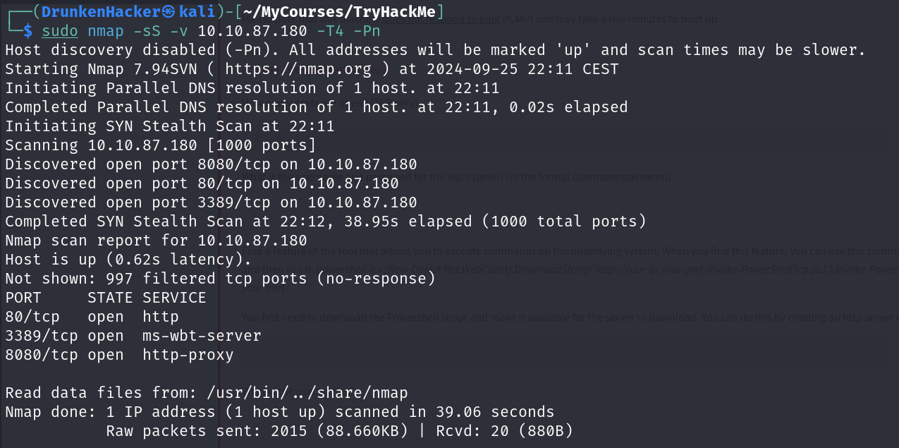
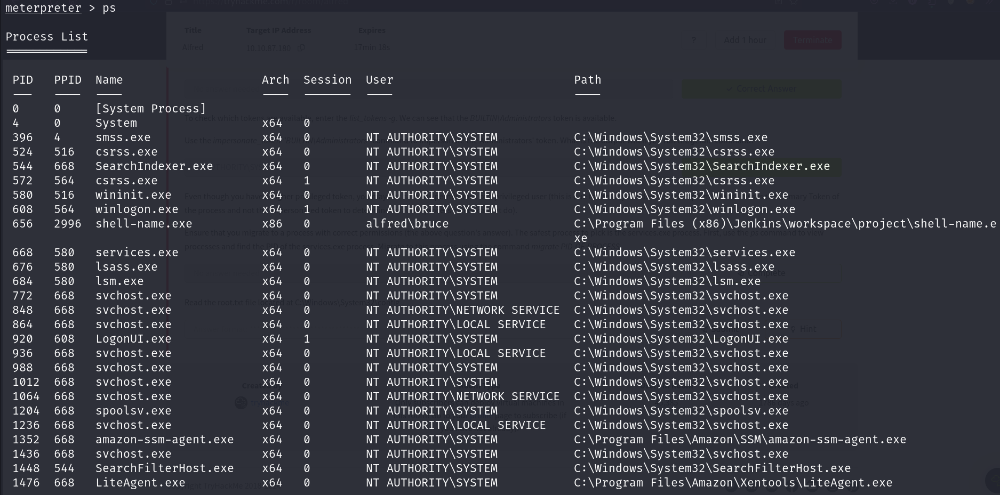

# Alfred

## Description

Exploit Jenkins to gain an initial shell, then escalate our privileges by exploiting Windows authentication tokens.
* Category: Walkthrough

## Initial Access

As we got the IP address, we started with the nmap scan to find the open ports and services running on the target machine.

We found 3 open ports: 80, 3389, and 8080. We started by visiting the web server running on port 80.

RIP Bruce Wayne! Nothing much on this page except for the email of Alfred. Let's see what we can find on port 8080.

It's a Jenkins login page. But we don't have any credentials yet. Let's try some default credentials.

Surprisingly, `admin:admin` worked. We are in! Let's try to create a reverse shell to get the initial access. First, we need to find a place to upload our reverse shell.

After looking around for a while, we found the build command option where we can execute commands. We will use this to execute our reverse shell. Now time to host our reverse shell.

Now we need to start a listener on our machine, retrieve the reverse shell with a command from Jenkins and then build to execute the command.

We got the reverse shell.

We found the user flag in our user's `Desktop` folder.

## Switching Shells

To make things easier in this room, we will switch to a meterpreter shell. First, we need to recreate the reverse shell with a meterpreter payload. Then we host the meterpreter payload just like we did with the reverse shell.

Now we need to start a handler on our machine, retrieve the meterpreter reverse shell with a command from Jenkins and then build to execute the command.

We got the meterpreter shell. Time to escalate our privileges.

## Privilege Escalation

We first try to see what all privileges we have.

We can see that we have `SeDebugPrivilege` and `SeImpersonatePrivilege` privileges enabled. Let's try to exploit these privileges with `Incognito` module. After loading the module, we list all the tokens.

We can see that the `BUILTIN\Administrators` token is available. Let's impersonate this token and see what we get running `getuid`.

We successfully escalated our privileges to `NT AUTHORITY\SYSTEM`. However, we don't have permissions of a privileged user yet. We need to migrate to another process.

`services.exe` is a good process to migrate to. Let's migrate to this process.

We successfully migrated to the `services.exe` process. Now we can run any command as `NT AUTHORITY\SYSTEM`. All there is left is to find the root flag.

And we completed the room!