# Basic Pentesting

## Description

This is a machine that allows you to practise web app hacking and privilege escalation.
* Difficulty: **Easy**
* Categories: #TODO

## Write-up

We are given the IP address of the machine, let's start by scanning the machine with `nmap`.

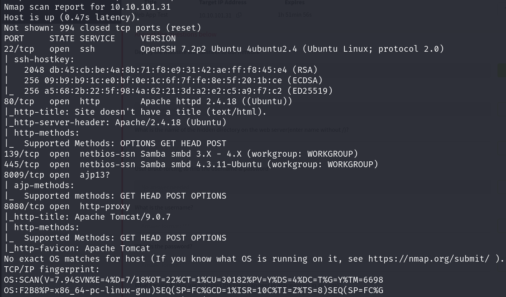

Our `nmap` scan shows that the machine is an Ubuntu machine with SSH on port 22, Samba on port 139 and 445, an Apache web server on port 80 and Apache Tomcat services on port 8009 and 8080. Let's start by visiting the web server on port 80.

Well, the website is undergoing maintenance. There seems to be nothing interesting here.

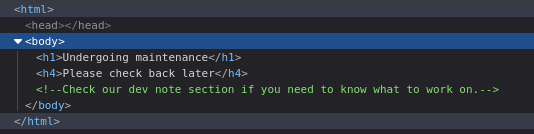

A little peak at the source code of the website gives us a comment `Check our dev note section if you need to know what to work on.`. That is worth noting. Next stop: the Apache Tomcat website on port 8080.

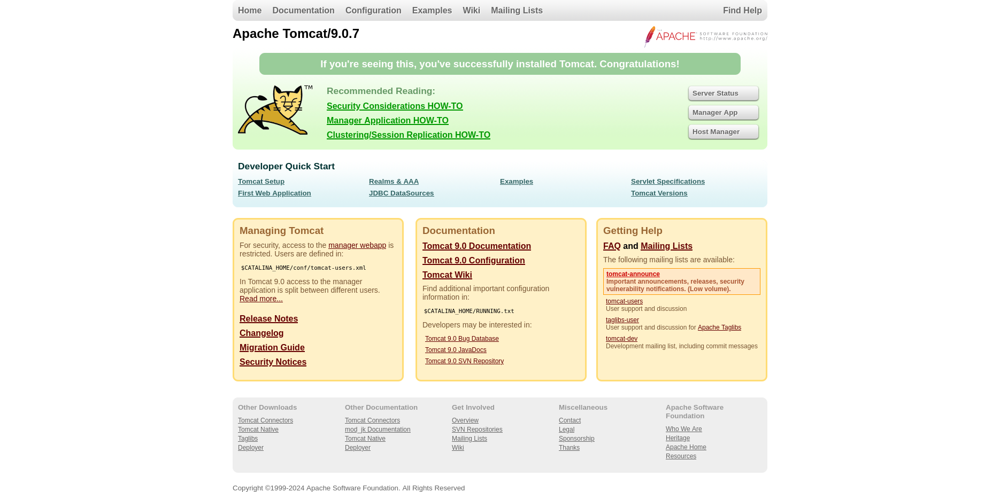

Just a default Apache Tomcat page. Nothing interesting here. We cannot access the manager on port 8009 with our browser so it is a good idea to head back to the Apache web server on port 80 to check for hidden directories.

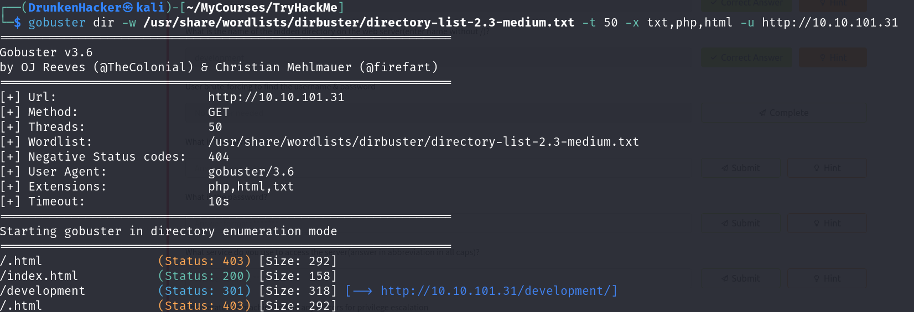

We find a hidden directory `/development/`. Let's check it out.

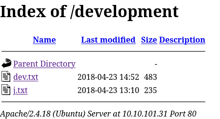

The directory contains a `dev.txt` and a `j.txt` file. The comment from the source code said to check the dev note section so let's check the `dev.txt` file first.

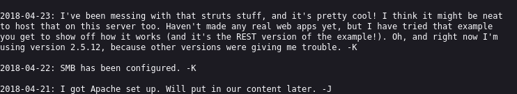

This note is a conversation between the developers - J and K. They said that they have set up Apache and they would put in the content later. They have also configured SMB on the server as we saw in the `nmap` scan. The latest message mentions the struts framework. They were using the REST version of the example. And they are using version 2.5.12. This is a good hint. Let's check the `j.txt` file.

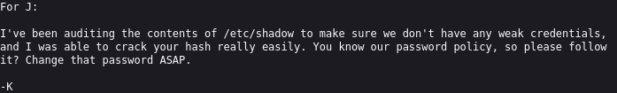

This one is a note from K to J. He says that he was able to crack J's password hash from `/etc/shadow` file and it needs fixing. This is a good place to look later on if we are able to get a foothold on the machine.

Up until now, we have not found anything concrete to exploit. Let's recon some more with `enum4linux`.

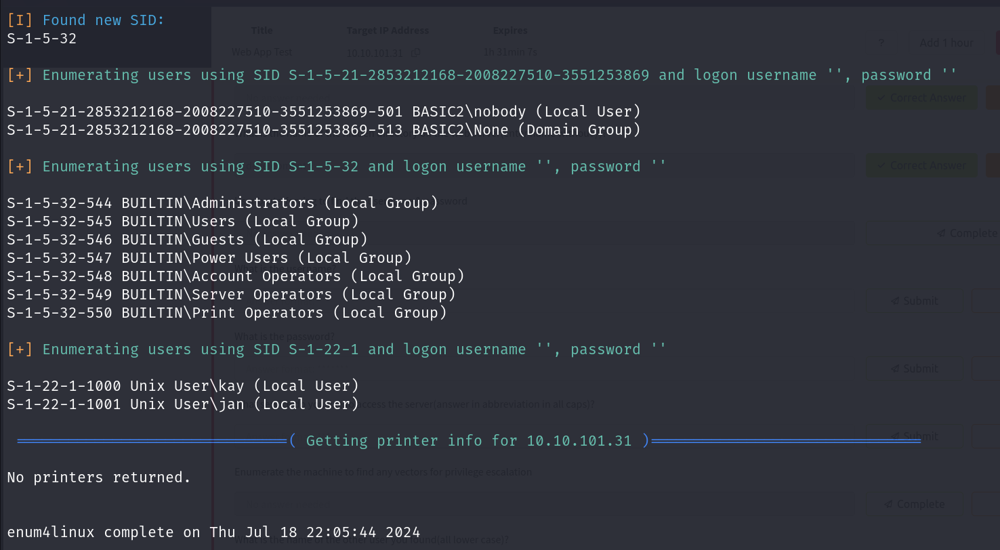

There are a lot of information here. One interesting thing is that we found 2 users: `jan` and `kay`. We see that there is SSH service running on the machine. We can try to brute force the SSH login with the usernames we found. Let's try that using `hydra`.

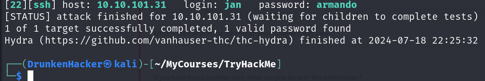

We were able to crack the password for the user `jan`. Let's login to the machine with the credentials we found.

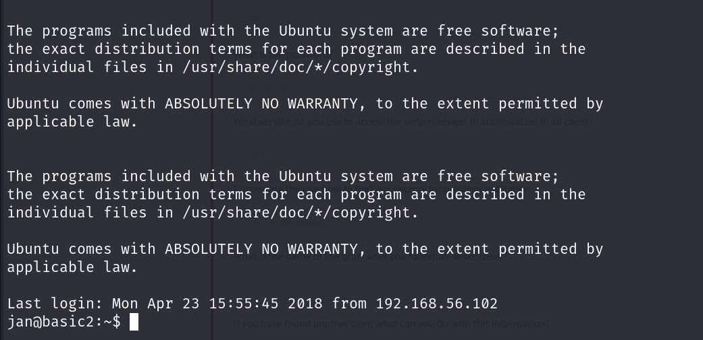

As mentioned in the `j.txt` file, we can check the `/etc/shadow` file for the password hashes.

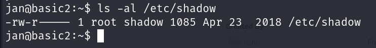

The shadow permissions are set correctly so we are going to need to find another way to escalate our privileges. Let's check the `sudo` permissions for the user `jan`.

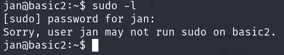

Tough luck. The user `jan` does not have any `sudo` permissions. We know there is another user `kay` on the machine. Let's look at his home directory.

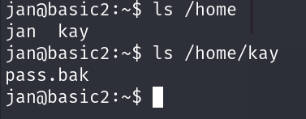

There is a `pass.bak` file in the home directory of `kay`. Let's check what type of file it is.

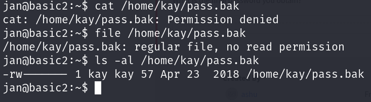

It is just a regular file and no one else except `kay` has any permissions on the file. From the name of the file, it seems like it is a password file. We may have to do some lateral movement into the account of `kay` to get the password. Let's look around to see if he has anything interesting lying around.

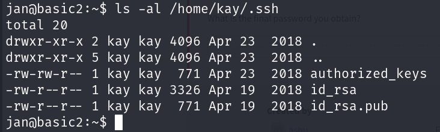

We see that `kay` has an SSH key in his `.ssh` directory and seems like we can read it. Let's copy the key and try to login to the machine as `kay`.

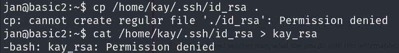

We were not able to copy the key with `cp` or with redirection. This is weird because this is `jan`'s home directory.

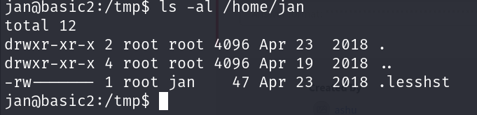

After inspecting the permissions of `jan`'s home directory, we see that since the directory is owned by `root`, we cannot do anything here. Let's just move to `/tmp` and proceed instead.

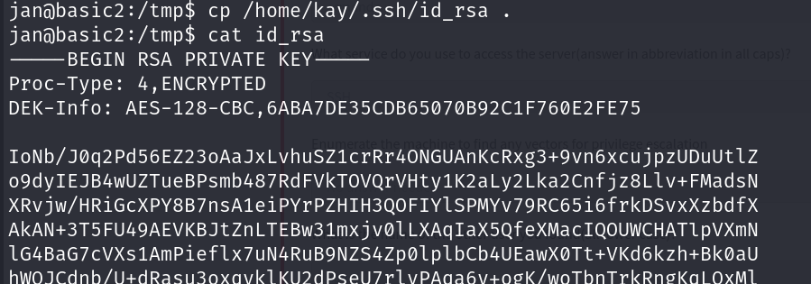

We successfully copied the key. Time to login to the machine as `kay`.

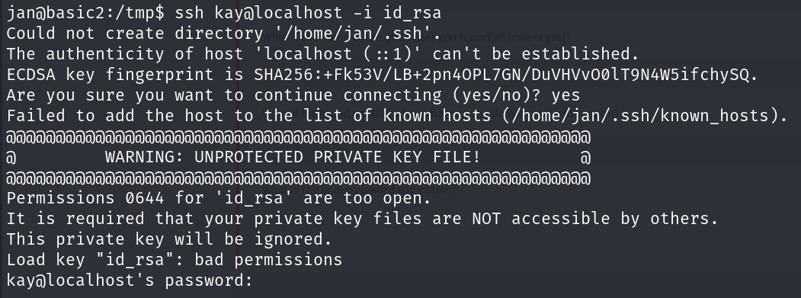

It says that our key is too open so it was ignored. We need to change the permissions of the key to `600` and try again.

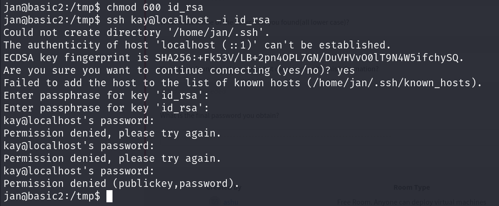

The key is passphrase protected. We need to crack the passphrase to login to the machine as `kay`. Let's use `john` to crack the passphrase.

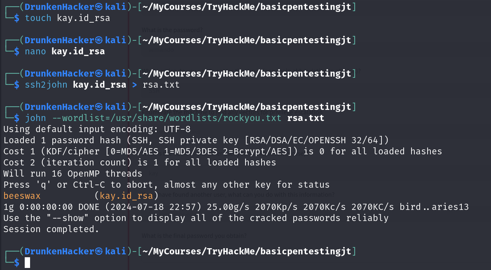

Now that we have the passphrase, let's login to the machine as `kay`.

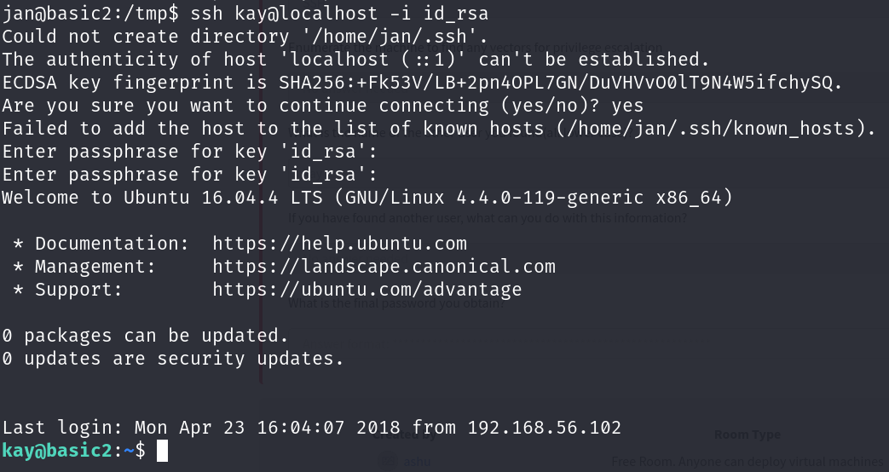

We are in! Let's check the `pass.bak` file at the home directory.

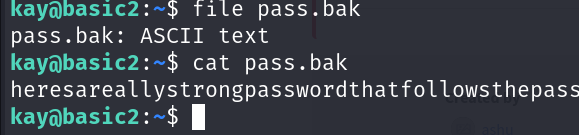

And we found the password in the `pass.bak` file.