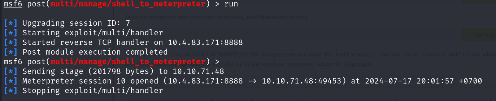
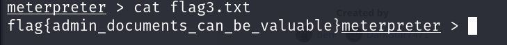

# Blue

## Description

Deploy & hack into a Windows machine, leveraging common misconfigurations issues.
* Category: Walkthrough

## Recon

We are given the IP address of the target machine. Let's start by scanning the target machine with Nmap.

Nmap reveals that the target is running Windows 7, and has RPC, SMB and Netbios-ssn services open. Let's enumerate the SMB service with Metasploit.

After some SMB scan with Metasploit, we found that the target machine is likely vulnerable to the MS17-010 exploit.

## Gain Access

Now that we know the target machine is vulnerable to MS17-010, we need to search for an exploit on Metasploit.

Let's use the `exploit/windows/smb/ms17_010_eternalblue`. We need to set some options and then run the exploit. After some try and error, we find that we need to set the `payload` to `windows/x64/shell/reverse_tcp` for the exploit to work.

And we got a session!

## Escalate

Now that we have a session, let's first upgrade the shell to a meterpreter shell for better control.

The upgrade is successful. Now let's select the session and interact with it.

Now let's run the `getsystem` command to escalate our privileges.

We have already escalated our privileges to `NT AUTHORITY\SYSTEM`. Now let's run `ps` to list all the processes running on the target machine.

There are a lot of processes running as `NT AUTHORITY\SYSTEM`. Let's try to migrate to a `lsass.exe` process.

The migration is successful. Let's move on to the next stage.

## Cracking

Time to dump some hashes! Let's run the `hashdump` command to dump all the hashes on the target machine.

We can see a non-default user `Jon` with a hash. Let's crack the hash with CrackStation.

We successfully cracked the password. Let's move on to the next stage.

## Find flags!

For our first flag, our clue is that it can be found at the system root. Let's navigate to `C:\` and see if we can find the flag.

We found the first flag! Let's get the content of the flag.

For our second flag, our clue is that it can be found where passwords are stored. Let's navigate to the `C:\Windows\System32\config` directory and see if we can find the flag.

We found the second flag! Let's get the content of the flag.

For our third and final flag, our clue is that it can be found in an excellent place to loot. Let's navigate to the `C:\Users\Jon\Documents` directory and see if we can find the flag.

We found the third flag! Let's get the content of the flag.

And that's it! We have successfully completed the Blue room.