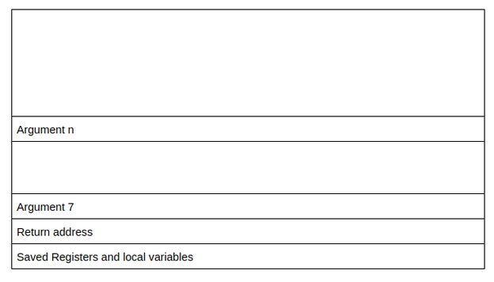

# Buffer Overflows

## Description

Learn how to get started with basic Buffer Overflows!
* Difficulty: Easy
* Category: Walkthrough

## Introduction

In this room, we aim to explore simple stack buffer overflows (without any mitigations) on x86-64 linux programs. We will use radare2 (r2) to examine the memory layout.

We are given credentials to log in to the machine with SSH. Time to get started!

## Process Layout

When a program runs on a machine, the computer runs the program as a process. Current computer architecture allows multiple processes to be run concurrently(at the same time by a computer).

While these processes may appear to run at the same time, the computer actually switches between the processes very quickly and makes it look like they are running at the same time. Switching between processes is called a context switch. Since each process may need different information to run, the operating system has to keep track of all the information in a process. The memory in the process is organised sequentially and has the following layout:


User stack contains the information required to run the program. This information would include the current program counter, saved registers and more information. The section after the user stack is unused memory and it is used in case the stack grows.

Shared library regions are used to either statically/dynamically link libraries that are used by the program.

The heap increases and decreases dynamically depending on whether a program dynamically assigns memory. Notice there is a section that is unassigned above the heap which is used in the event that the size of the heap increases.

The program code and data stores the program executable and initialised variables.

## x86-64 Procedures

A program would usually comprise of multiple functions and there needs to be a way of tracking which function has been called, and which data is passed from one function to another. The stack is a region of contiguous memory addresses and it is used to make it easy to transfer control and data between functions. The top of the stack is at the lowest memory address and the stack grows towards lower memory addresses. The most common operations of the stack are:
* **Pushing:** used to add data onto the stack
* **Popping:** used to remove data from the stack

### push var

This is the assembly instruction to push a value onto the stack. It does the following:
* Uses var or value stored in memory location of var.
* Decreases the stack pointer (`rsp`) by the size of var.
* Writes above value to new location of `rsp`, which is now top of the stack.

### pop var

This is an assembly instruction to read a value and pop it off the stack. It does the following:
* Reads the value at the address given by the stack pointer.
* Store the value that was read from `rsp` into var.
* Increases the stack pointer (`rsp`) by the size of var.

It’s important to note that the memory does not change when popping values of the stack - it is only the value of the stack pointer that changes!

Each compiled program may include multiple functions, where each function would need to store local variables, arguments passed to the function and more. To make this easy to manage, each function has its own separate stack frame, where each new stack frame is allocated when a function is called, and deallocated when the function is complete.

## Procedures Continued

Take this code as an example:
```c
int add(int a, int b){
   int new = a + b;
   return new;
}

int calc(int a, int b){
   int final = add(a, b);
   return final;
}

calc(4, 5);
```


The explanation assumes that the current point of execution is inside the calc function. In this case calc is known as the caller function and add is known as the callee function.

The add function is invoked using the `call` operand in assembly, in this case `callq sym.add`. The `call` operand can either take a label as an argument, or it can take a memory address as an offset to the location of the start of the function in the form of call value.

Once the add function is invoked, the program would need to know what point to continue in the program. To do this, the computer pushes the address of the next instruction onto the stack, in this case the address of the instruction on the line that contains `movl %eax, local_4h`. After this, the program would allocate a stack frame for the new function, change the current instruction pointer to the first instruction in the function, change the stack pointer (`rsp`) to the top of the stack, and change the frame pointer (`rbp`) to point to the start of the new frame.

Once the function is finished executing, it will call the return instruction (`retq`). This instruction will pop the value of the return address of the stack, deallocate the stack frame for the add function, change the instruction pointer to the value of the return address, change the stack pointer (`rsp`) to the top of the stack and change the frame pointer (`rbp`) to the stack frame of calc.

Now that we've understood how control is transferred through functions, let's look at how data is transferred.

In the above example, we said that functions take arguments. The calc function takes 2 arguments (a and b). Upto 6 arguments for functions can be stored in the following registers:
* `rdi`
* `rsi`
* `rdx`
* `rcx`
* `r8`
* `r9`

**Note: `rax` is a special register that stores the return values of the functions(if any).**

If a function has anymore arguments, these arguments would be stored on the functions stack frame.

We can now see that a caller function may save values in their registers, but what happens if a callee function also wants to save values in the registers? To ensure the values are not overwritten, the callee values first save the values of the registers on their stack frame, use the registers and then load the values back into the registers. The caller function can also save values on the caller function frame to prevent the values from being overwritten. Here are some rules around which registers are caller and callee saved:
* `rax` is caller saved.
* `rdi`, `rsi`, `rdx`, `rcx`, `r8`, `r9` are caller saved (and they are usually arguments for functions).
* `r10`, `r11` are caller saved.
* `rbx`, `r12`, `r13`, `r14` are callee saved.
* `rbp` is also callee saved (and can be optionally used as a frame pointer).
* `rsp` is also callee saved.

So far, this is a more thorough example of the run time stack:



## Endianess

In the above programs, we can see that the binary information is represented in hexadecimal format. Different architectures actually represent the same hexadecimal number in different ways, and this is what is referred to as Endianess.

Let’s take the value of 0x12345678 as an example. Here the least significant value is the right most value (78) while the most significant value is the left most value (12).

Little Endian is where the value is arranged from the least significant byte to the most significant byte:


Big Endian is where the value is arranged from the most significant byte to the least significant byte:


Here, each “value” requires at least a byte to represent, as part of a multi-byte object.

## Overwriting Variables

Now that we’ve looked at all the background information, let’s explore how the overflows actually work. If we take a look at the overflow-1 folder, we’ll notice some C code with a binary program.

```c
#include <stdlib.h>
#include <unistd.h>
#include <stdio.h>

int main(int argc, char **argv)
{
  volatile int variable = 0;
  char buffer[14];

  gets(buffer);

  if(variable != 0) {
      printf("You have changed the value of the variable\n");
  } else {
      printf("Try again?\n");
  }
}
```

Our goal is to change the value of the integer variable.

From the C code we can see that the integer variable and character buffer have been allocated next to each other - since memory is allocated in contiguous bytes, we can assume that the integer variable and character buffer are allocated next to each other.

**Note: this may not always be the case. With how the compiler and stack are configured, when variables are allocated, they would need to be aligned to particular size boundaries(e.g. 8 bytes, 16 byte) to make it easier for memory allocation/deallocation. So if a 12 byte array is allocated where the stack is aligned for 16 bytes this is what the memory would look like:**


The compiler would automatically add 4 bytes to ensure that the size of the variable aligns with the stack size. From the image of the stack above, we can assume that the stack frame for the main function looks like this:


Even though the stack grows downwards, when data is copied/written into the buffer, it is copied from lower to higher addresess. Depending on how data is entered into the buffer, it means that it's possible to overwrite the integer variable.

From the C code, we can see that the `gets` function is used to enter data into the buffer from standard input. The `gets` function is dangerous because it doesn't really have a length check - This would mean that we can enter more than 14 bytes of data, which would then overwrite the integer variable.

--------------------------------------------------------

For the rest of the room, we will follow the instructions as given in the room to get results.