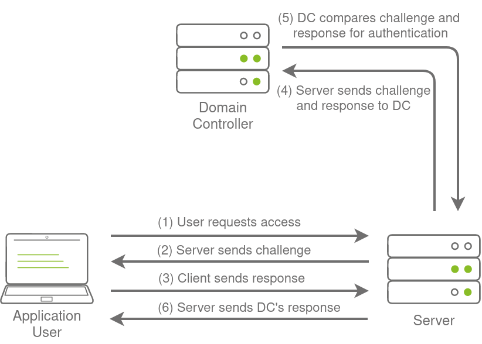
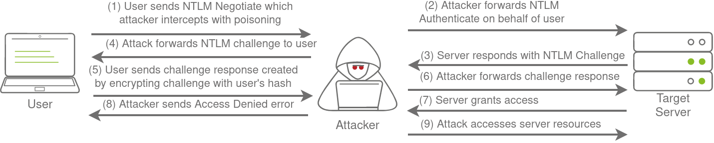
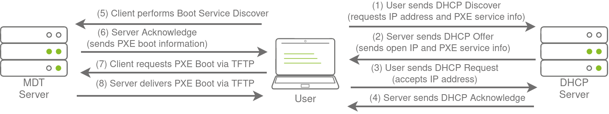

# Breaching Active Directory

## Description

This network covers techniques and tools that can be used to acquire that first set of AD credentials that can then be used to enumerate AD.
* Category: Walkthrough

## Introduction to AD Breaches

Active Directory (AD) is used by approximately 90% of the Global Fortune 1000 companies. If an organisation's estate uses Microsoft Windows, we are almost guaranteed to find AD. Microsoft AD is the dominant suite used to manage Windows domain networks. However, since AD is used for Identity and Access Management of the entire estate, it holds the keys to the kingdom, making it a very likely target for attackers.

### Breaching Active Directory

Before we can exploit AD misconfigurations for privilege escalation, lateral movement, and goal execution, we need initial access first. We need to acquire an initial set of valid AD credentials. Due to the number of AD services and features, the attack surface for gaining an initial set of AD credentials is usually significant. In this room, we will discuss several avenues, but this is by no means an exhaustive list.

When looking for that first set of credentials, we don't focus on the permissions associated with the account; thus, even a low-privileged account would be sufficient. We are just looking for a way to authenticate to AD, allowing us to do further enumeration on AD itself.

Some common methods to recover AD credentials include:
* NTLM Authenticated Services
* LDAP Bind Credentials
* Authentication Relays
* Microsoft Deployment Toolkit
* Configuration Files

We can use these techniques on a security assessment either by targeting systems of an organisation that are internet-facing or by implanting a rogue device on the organisation's network.

## OSINT and Phishing

Two popular methods for gaining access to that first set of AD credentials is Open Source Intelligence (OSINT) and Phishing.

### OSINT

OSINT is used to discover information that has been publicly disclosed. In terms of AD credentials, this can happen for several reasons, such as:
* Users who ask questions on public forums such as *Stack Overflow* but disclose sensitive information such as their credentials in the question.
* Developers that upload scripts to services such as *Github* with credentials hardcoded.
* Credentials being disclosed in past breaches since employees used their work accounts to sign up for other external websites. Websites such as *HaveIBeenPwned* and *DeHashed* provide excellent platforms to determine if someone's information, such as work email, was ever involved in a publicly known data breach.

By using OSINT techniques, it may be possible to recover publicly disclosed credentials. If we are lucky enough to find credentials, we will still need to find a way to test whether they are valid or not since OSINT information can be outdated.

### Phishing

Phishing is another excellent method to breach AD. Phishing usually entices users to either provide their credentials on a malicious web page or ask them to run a specific application that would install a Remote Access Trojan (RAT) in the background. This is a prevalent method since the RAT would execute in the user's context, immediately allowing us to impersonate that user's AD account. This is why phishing is such a big topic for both Red and Blue teams.

## NTLM Authenticated Services

### NTLM and NetNTLM

New Technology LAN Manager (NTLM) is the suite of security protocols used to authenticate users' identities in AD. NTLM can be used for authentication by using a challenge-response-based scheme called NetNTLM. This authentication mechanism is heavily used by the services on a network. However, services that use NetNTLM can also be exposed to the internet. The following are some of the popular examples:
* Internally-hosted Exchange (Mail) servers that expose an Outlook Web App (OWA) login portal.
* Remote Desktop Protocol (RDP) service of a server being exposed to the internet.
* Exposed VPN endpoints that were integrated with AD.
* Web applications that are internet-facing and make use of NetNTLM.

NetNTLM, also often referred to as Windows Authentication or just NTLM Authentication, allows the application to play the role of a middle man between the client and AD. All authentication material is forwarded to a Domain Controller in the form of a challenge, and if completed successfully, the application will authenticate the user.

This means that the application is authenticating on behalf of the user and not authenticating the user directly on the application itself. This prevents the application from storing AD credentials, which should only be stored on a Domain Controller. This process is shown in the diagram below:

### Brute-force Login Attacks

As mentioned, exposed services provide an excellent location to test credentials discovered using other means. However, these services can also be used directly in an attempt to recover an initial set of valid AD credentials. We could perhaps try to use these for brute force attacks if we recovered information such as valid email addresses during our initial red team recon.

Since most AD environments have account lockout configured, we won't be able to run a full brute-force attack. Instead, we need to perform a password spraying attack. Instead of trying multiple different passwords, which may trigger the account lockout mechanism, we choose and use one password and attempt to authenticate with all the usernames we have acquired. However, it should be noted that these types of attacks can be detected due to the amount of failed authentication attempts they will generate.

## LDAP Bind Credentials

### LDAP

Another method of AD authentication that applications can use is Lightweight Directory Access Protocol (LDAP) authentication. LDAP authentication is similar to NTLM authentication. However, with LDAP authentication, the application directly verifies the user's credentials. The application has a pair of AD credentials that it can use first to query LDAP and then verify the AD user's credentials.

LDAP authentication is a popular mechanism with third-party (non-Microsoft) applications that integrate with AD. These include applications and systems such as:
* GitLab
* Jenkins
* Custom-developed web applications
* Printers
* VPNs

If any of these applications or services are exposed on the internet, the same type of attacks as those leveraged against NTLM authenticated systems can be used. However, since a service using LDAP authentication requires a set of AD credentials, it opens up additional attack avenues. In essence, we can attempt to recover the AD credentials used by the service to gain authenticated access to AD. The process of authentication through LDAP is shown below:

If we could gain a foothold on the correct host, such as a Gitlab server, it might be as simple as reading the configuration files to recover these AD credentials. These credentials are often stored in plain text in configuration files since the security model relies on keeping the location and storage configuration file secure rather than its contents.

### LDAP Pass-back Attacks

However, one other very interesting attack can be performed against LDAP authentication mechanisms, called an LDAP Pass-back attack. This is a common attack against network devices, such as printers, when we have gained initial access to the internal network, such as plugging in a rogue device in a boardroom.

LDAP Pass-back attacks can be performed when we gain access to a device's configuration where the LDAP parameters are specified. This can be, for example, the web interface of a network printer. Usually, the credentials for these interfaces are kept to the default ones, such as `admin:admin` or `admin:password`.

Here, we won't be able to directly extract the LDAP credentials since the password is usually hidden. However, we can alter the LDAP configuration, such as the IP or hostname of the LDAP server. In an LDAP Pass-back attack, we can modify this IP to our IP and then test the LDAP configuration, which will force the device to attempt LDAP authentication to our rogue device. We can intercept this authentication attempt to recover the LDAP credentials.

## Authentication Relays

Continuing with attacks that can be staged from our rogue device, we will now look at attacks against broader network authentication protocols. In Windows networks, there are a significant amount of services talking to each other, allowing users to make use of the services provided by the network.

These services have to use built-in authentication methods to verify the identity of incoming connections. Previously, we explored NTLM Authentication used on a web application. In this task, we will dive a bit deeper to look at how this authentication looks from the network's perspective. However, for this task, we will focus on NetNTLM authentication used by SMB.

### Server Message Block

The Server Message Block (SMB) protocol allows clients (like workstations) to communicate with a server (like a file share). In networks that use Microsoft AD, SMB governs everything from inter-network file-sharing to remote administration. Even the "out of paper" alert our computer receives when we try to print a document is the work of the SMB protocol.

However, the security of earlier versions of the SMB protocol was deemed insufficient. Several vulnerabilities and exploits were discovered that could be leveraged to recover credentials or even gain code execution on devices. Although some of these vulnerabilities were resolved in newer versions of the protocol, often organisations do not enforce the use of more recent versions since legacy systems do not support them. We will be looking at two different exploits for NetNTLM authentication with SMB:
* Since the NTLM Challenges can be intercepted, we can use offline cracking techniques to recover the password associated with the NTLM Challenge. However, this cracking process is significantly slower than cracking NTLM hashes directly.
* We can use our rogue device to stage a man in the middle attack, relaying the SMB authentication between the client and server, which will provide us with an active authenticated session and access to the target server.

### LLMNR, NBT-NS and WPAD

In this task, we will take a bit of a look at the authentication that occurs during the use of SMB. We will use Responder to attempt to intercept the NetNTLM challenge to crack it. There are usually a lot of these challenges flying around on the network. Some security solutions even perform a sweep of entire IP ranges to recover information from hosts. Sometimes due to stale DNS records, these authentication challenges can end up hitting our rogue device instead of the intended host.

Responder allows us to perform Man-in-the-Middle attacks by poisoning the responses during NetNTLM authentication, tricking the client into talking to us instead of the actual server they wanted to connect to.

On a real LAN, Responder will attempt to poison any Link-Local Multicast Name Resolution (LLMNR), NetBIOS Name Service (NBT-NS), and Web Proxy Auto-Discovery (WPAD) requests that are detected. On large Windows networks, these protocols allow hosts to perform their own local DNS resolution for all hosts on the same local network.

Rather than overburdening network resources such as the DNS servers, hosts can first attempt to determine if the host they are looking for is on the same local network by sending out LLMNR requests and seeing if any hosts respond. The NBT-NS is the precursor protocol to LLMNR, and WPAD requests are made to try and find a proxy for future HTTP(s) connections.

Since these protocols rely on requests broadcasted on the local network, our rogue device would also receive these requests. Usually, these requests would simply be dropped since they were not meant for our host. However, Responder will actively listen to the requests and send poisoned responses telling the requesting host that our IP is associated with the requested hostname. By poisoning these requests, Responder attempts to force the client to connect to our machine. In the same line, it starts to host several servers such as SMB, HTTP, SQL, and others to capture these requests and force authentication.

### Intercepting NetNTLM Challenge

One thing to note is that Responder essentially tries to win the race condition by poisoning the connections to ensure that we intercept the connection. This means that Responder is usually limited to poisoning authentication challenges on the local network.

Since we are connected via a VPN to the network, we will only be able to poison authentication challenges that occur on this VPN network. For this reason, we have simulated an authentication request that can be poisoned that runs every 30 minutes. This means that we may have to wait a bit before we can intercept the NetNTLM challenge and response.

Although Responder would be able to intercept and poison more authentication requests when executed from our rogue device connected to the LAN of an organisation, it is crucial to understand that this behaviour can be disruptive and thus detected.

By poisoning authentication requests, normal network authentication attempts would fail, meaning users and services would not connect to the hosts and shares they intend to.

We will set Responder to run on the interface connected to the VPN. Responder will now listen for any LLMNR, NBT-NS, or WPAD requests that are coming in. We would leave Responder to run for a bit on a real LAN. However, in our case, we have to simulate this poisoning by having one of the servers attempt to authenticate to machines on the VPN. If we leave Responder running for a bit, we should receive an SMBv2 connection which Responder can use to entice and extract an NTLMv2-SSP response.

If we were using our rogue device, we would probably run Responder for quite some time, capturing several responses. Once we have a couple, we can start to perform some offline cracking of the responses in the hopes of recovering their associated NTLM passwords.

If the accounts have weak passwords configured, we have a good chance of successfully cracking them. We can then copy the NTLMv2-SSP Hash to a textfile. We will then use the password list provided in the downloadable files for this task and Hashcat in an attempt to crack the hash.

### Relaying the Challenge

In some instances, however, we can take this a step further by trying to relay the challenge instead of just capturing it directly. This is a little bit more difficult to do without prior knowledge of the accounts since this attack depends on the permissions of the associated account. We need a couple of things to play in our favour:
* SMB Signing should either be disabled or enabled but not enforced. When we perform a relay, we make minor changes to the request to pass it along. If SMB signing is enabled, we won't be able to forge the message signature, meaning the server would reject it.
* The associated account needs the relevant permissions on the server to access the requested resources. Ideally, we are looking to relay the challenge and response of an account with administrative privileges over the server, as this would allow us to gain a foothold on the host.
* Since we technically don't yet have an AD foothold, some guesswork is involved into what accounts will have permissions on which hosts. If we had already breached AD, we could perform some initial enumeration first, which is usually the case.

This is why blind relays are not usually popular. Ideally, we would first breach AD using another method and then perform enumeration to determine the privileges associated with the account we have compromised. From here, we can usually perform lateral movement for privilege escalation across the domain. However, it is still good to fundamentally under how a relay attack works, as shown in the diagram below:

## Microsoft Deployment Toolkit

Large organisations need tools to deploy and manage the infrastructure of the estate. In massive organisations, we can't have our IT personnel using DVDs or even USB Flash drives running around installing software on every single machine. Luckily, Microsoft already provides the tools required to manage the estate. However, we can exploit misconfigurations in these tools to also breach AD.

### MDT and SCCM

Microsoft Deployment Toolkit (MDT) is a Microsoft service that assists with automating the deployment of Microsoft Operating Systems (OS). Large organisations use services such as MDT to help deploy new images in their estate more efficiently since the base images can be maintained and updated in a central location.

Usually, MDT is integrated with Microsoft's System Center Configuration Manager (SCCM), which manages all updates for all Microsoft applications, services, and operating systems.

MDT is used for new deployments. Essentially it allows the IT team to preconfigure and manage boot images. Hence, if they need to configure a new machine, they just need to plug in a network cable, and everything happens automatically. They can make various changes to the boot image, such as already installing default software like Office365 and the organisation's anti-virus of choice. It can also ensure that the new build is updated the first time the installation runs.

SCCM can be seen as almost an expansion and the big brother to MDT. What happens to the software after it is installed? Well, SCCM does this type of patch management. It allows the IT team to review available updates to all software installed across the estate.

The team can also test these patches in a sandbox environment to ensure they are stable before centrally deploying them to all domain-joined machines. It makes the life of the IT team significantly easier.

However, anything that provides central management of infrastructure such as MDT and SCCM can also be targetted by attackers in an attempt to take over large portions of critical functions in the estate. Although MDT can be configured in various ways, for this task, we will focus exclusively on a configuration called Preboot Execution Environment (PXE) boot.

### PXE Boot

Large organisations use PXE boot to allow new devices that are connected to the network to load and install the OS directly over a network connection. MDT can be used to create, manage, and host PXE boot images. PXE boot is usually integrated with DHCP, which means that if DHCP assigns an IP lease, the host is allowed to request the PXE boot image and start the network OS installation process. The communication flow is shown in the diagram below:

Once the process is performed, the client will use a TFTP connection to download the PXE boot image. We can exploit the PXE boot image for two different purposes:
* Inject a privilege escalation vector, such as a Local Administrator account, to gain Administrative access to the OS once the PXE boot has been completed.
* Perform password scraping attacks to recover AD credentials used during the install.

In this task, we will focus on the latter. We will attempt to recover the deployment service account associated with the MDT service during installation for this password scraping attack. Furthermore, there is also the possibility of retrieving other AD accounts used for the unattended installation of applications and services.

### PXE Boot Image Retrieval

Since DHCP is a bit finicky, we will bypass the initial steps of this attack. We will skip the part where we attempt to request an IP and the PXE boot preconfigure details from DHCP. We will perform the rest of the attack from this step in the process manually.

The first piece of information regarding the PXE Boot preconfigure we would have received via DHCP is the IP of the MDT server. In our case, we can recover that information from the TryHackMe network diagram.

The second piece of information we would have received was the names of the BCD files. These files store the information relevant to PXE Boots for the different types of architecture.

We first create our own folder and copy the **powerpxe** repo into the folder. We then navigate to the folder and download the BCD files to read the configuration of the MDT server. Since we cannot list file like FTP, we need to accurately specify files and file paths when sending file requests.

Once the BCD file is recovered, we use powerpxe to read its contents. Powerpxe is a PowerShell script that automatically performs this type of attack but usually with varying results, so it is better to perform a manual approach. We will use the Get-WimFile function of powerpxe to recover the locations of the PXE Boot images from the BCD file.

WIM files are bootable images in the Windows Imaging Format (WIM). Now that we have the location of the PXE Boot image, we can again use TFTP to download this image.

### Recovering Credentials from a PXE Boot Image

Now that we have recovered the PXE Boot image, we can exfiltrate stored credentials. It should be noted that there are various attacks that we could stage. We could inject a local administrator user, so we have admin access as soon as the image boots, we could install the image to have a domain-joined machine. This exercise will focus on a simple attack of just attempting to exfiltrate credentials.

Again we will use powerpxe to recover the credentials, but we could also do this step manually by extracting the image and looking for the `bootstrap.ini` file, where these types of credentials are often stored.

## Configuration Files

The last enumeration avenue we will explore in this network is configuration files. Suppose we were lucky enough to cause a breach that gave us access to a host on the organisation's network. In that case, configuration files are an excellent avenue to explore in an attempt to recover AD credentials. Depending on the host that was breached, various configuration files may be of value for enumeration:
* Web application config files
* Service configuration files
* Registry keys
* Centrally deployed application

Several enumeration scripts, such as Seatbelt, can be used to automate this process.

### Configuration File Credentials

However, we will focus on recovering credentials from a centrally deployed application in this task. Usually, these applications need a method to authenticate to the domain during both the installation and execution phases. An example of such as application is McAfee Enterprise Endpoint Security, which organisations can use as the endpoint detection and response tool for security.

McAfee embeds the credentials used during installation to connect back to the orchestrator in a file called `ma.db`. This database file can be retrieved and read with local access to the host to recover the associated AD service account.

To read the database file, we will use a tool called `sqlitebrowser`. Using `sqlitebrowser`, we will select the Browse Data option and focus on the `AGENT_REPOSITORIES` table.

We are particularly interested in the second entry focusing on the `DOMAIN`, `AUTH_USER`, and `AUTH_PASSWD` field entries. However, the `AUTH_PASSWD` field is encrypted. Luckily, McAfee encrypts this field with a known key. Therefore, we will use an old python2 script to decrypt the password.

By providing the script with our base64 encoded and encrypted password, the script will provide the decrypted password.

## Conclusion

A significant amount of attack avenues can be followed to breach AD. We covered some of those commonly seen being used during a red team exercise in this network. Due to the sheer size of the attack surface, new avenues to recover that first set of AD credentials are constantly being discovered. Building a proper enumeration methodology and continuously updating it will be required to find that initial pair of credentials.

### Mitigations

In terms of mitigations, there are some steps that organisations can take:
* User awareness and training - The weakest link in the cybersecurity chain is almost always users. Training users and making them aware that they should be careful about disclosing sensitive information such as credentials and not trust suspicious emails reduces this attack surface.
* Limit the exposure of AD services and applications online - Not all applications must be accessible from the internet, especially those that support NTLM and LDAP authentication. Instead, these applications should be placed in an intranet that can be accessed through a VPN. The VPN can then support multi-factor authentication for added security.
* Enforce Network Access Control (NAC) - NAC can prevent attackers from connecting rogue devices on the network. However, it will require quite a bit of effort since legitimate devices will have to be allowlisted.
* Enforce SMB Signing - By enforcing SMB signing, SMB relay attacks are not possible.
* Follow the principle of least privileges - In most cases, an attacker will be able to recover a set of AD credentials. By following the principle of least privilege, especially for credentials used for services, the risk associated with these credentials being compromised can be significantly reduced.