# Buffer Overflow Prep

## Description

Practice stack based buffer overflows!
* **Category**: Walkthrough

## Deploy VM

This room uses a 32-bit Windows 7 VM with Immunity Debugger and Putty preinstalled. Windows Firewall and Defender have both been disabled to make exploit writing easier.

On our Desktop there should be a folder called `vulnerable-apps`. Inside this folder are a number of binaries which are vulnerable to simple stack based buffer overflows (the type taught on the PWK/OSCP course):
* The SLMail installer
* The brainpan binary
* The dostackbufferoverflowgood binary
* The vulnserver binary
* A custom written "oscp" binary which contains 10 buffer overflows, each with a different EIP offset and set of badchars.

## oscp.exe - OVERFLOW1

We first run the Immunity Debugger as Administrator and open the `oscp.exe` binary. We then start Debugging and the program tells us that it is listening on port `1337`.

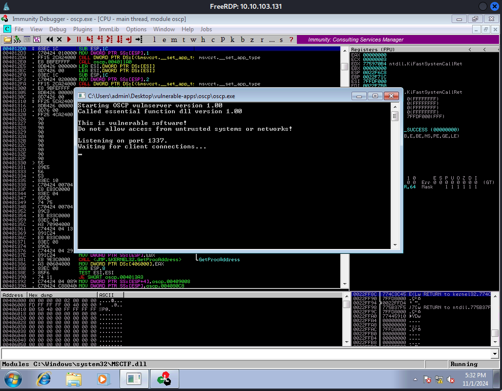

We can connect to this using netcat.

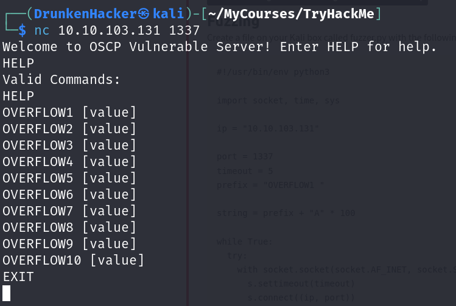

### Mona Configuration

The mona script has been preinstalled, however to make it easier to work with, we should configure a working folder using the following command, which we can run in the command input box at the bottom of the Immunity Debugger window: `!mona config -set workingfolder c:\mona\%p`.

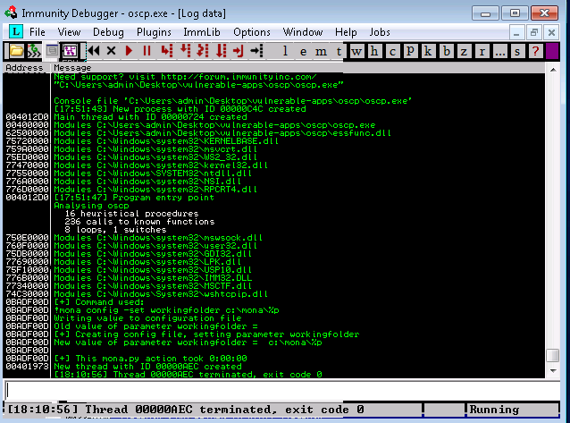

### Fuzzing

We create a `fuzzer.py` on our Kali machine with the following content.

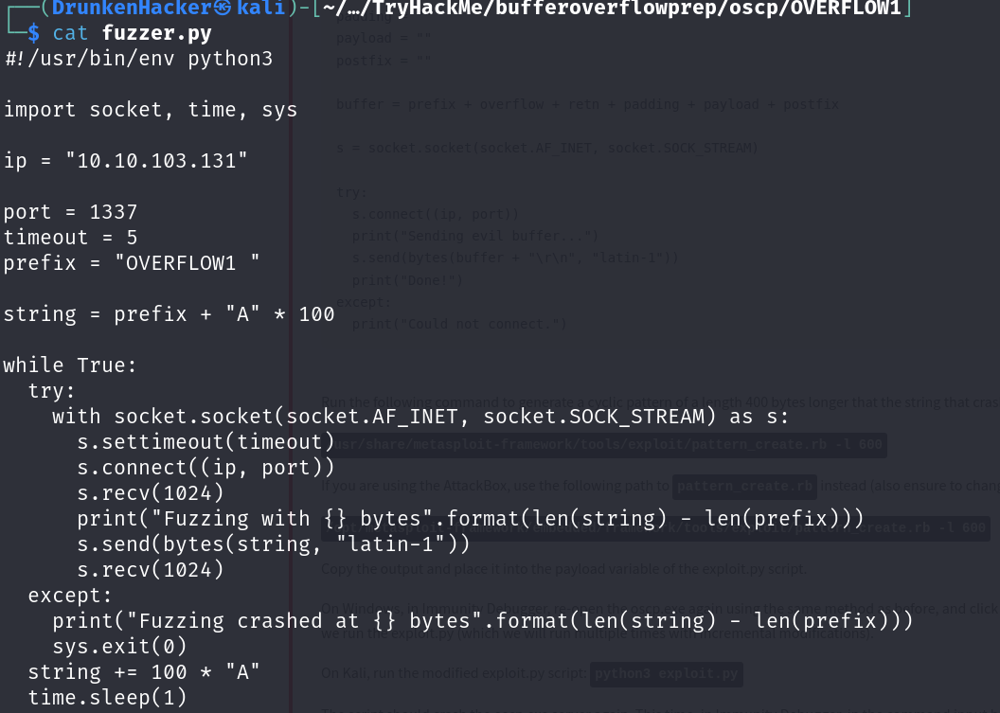

Now we can run the fuzzer.

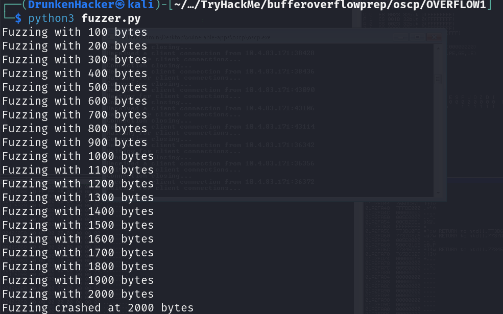

We can see that the program crashes at 2000 bytes.

### Crash Replication & Controlling EIP

Now we create an `exploit.py` on our Kali machine with the following content.

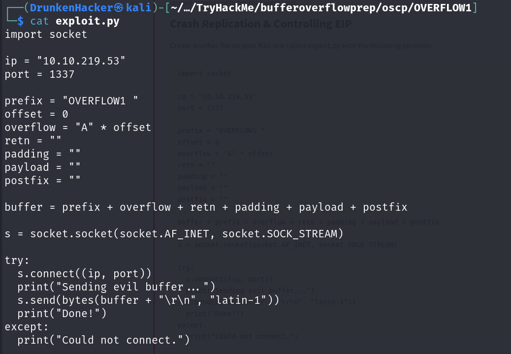

Now we need to create a pattern that is 400 characters longer than the one that caused the crash. We can do this with `pattern_create.rb` from the Metasploit Framework.

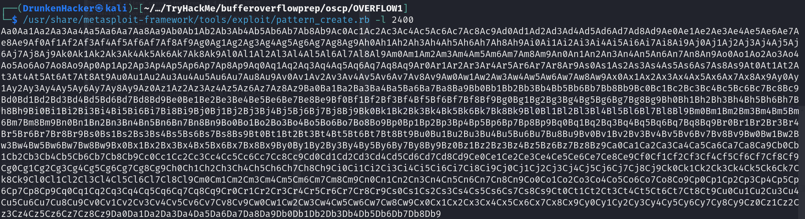

We copy the pattern into the `payload` parameter of our `exploit.py` script and run it.

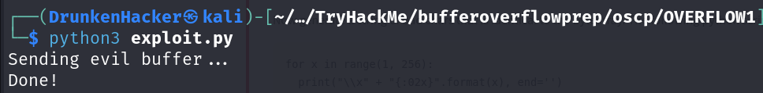

Now in Immunity Debugger, we run `!mona findmsp -distance 2400` to find the offset.

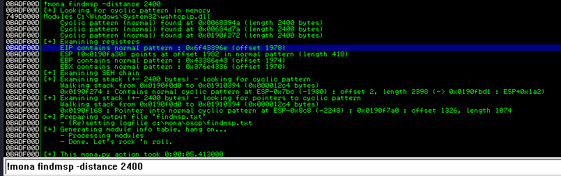

We can see the EIP offset. Now we set the `payload` parameter of our `exploit.py` script to empty, the `offset` parameter to the offset we found and the `retn` parameter to `BBBB`. Then we run the script again.

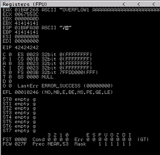

We can see that the EIP is now overwritten with `42424242`.

### Finding Bad Characters

Now we generate a bytearray using `!mona bytearray -b "\x00"`.

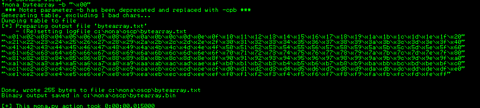

We copy the bytearray into the `payload` parameter of our `exploit.py` script and run it again.

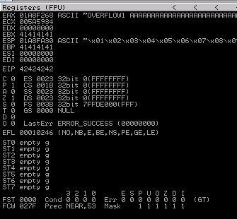

We take note of the ESP address then we run `!mona compare -f bytearray.bin -a <ESP_ADDRESS>` to find the bad characters.

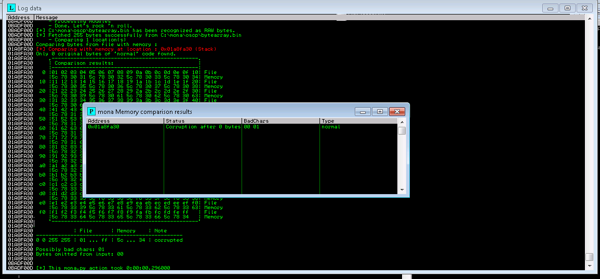

We found bad characters. We need to remove them from our `exploit.py` script.

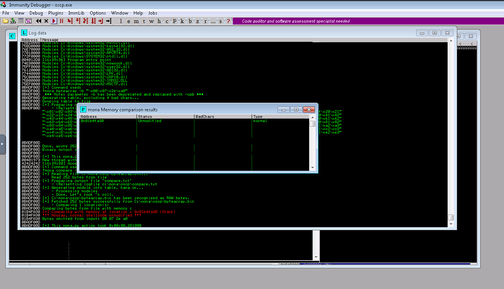

After a few tries, we successfully removed all bad characters.

### Finding a Jump Point

With the program in a crasher state, we run `!mona jmp -r esp -cpb <badchars>` to find a jump point.

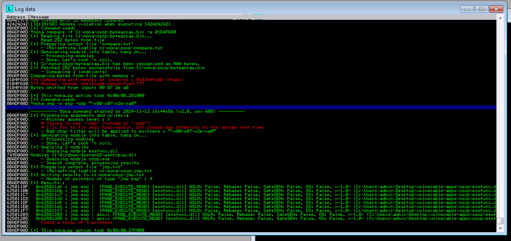

We found some jump points. We choose the first one and set the `retn` parameter of our `exploit.py` script to the address of the jump point in little endian format.

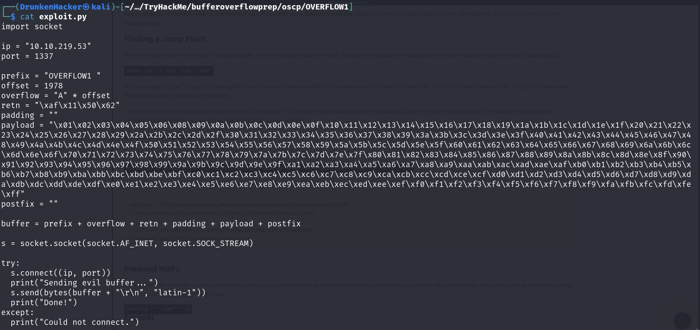

### Generate Payload

We generate a reverse shell payload using `msfvenom` and copy it into the `payload` parameter of our `exploit.py` script.

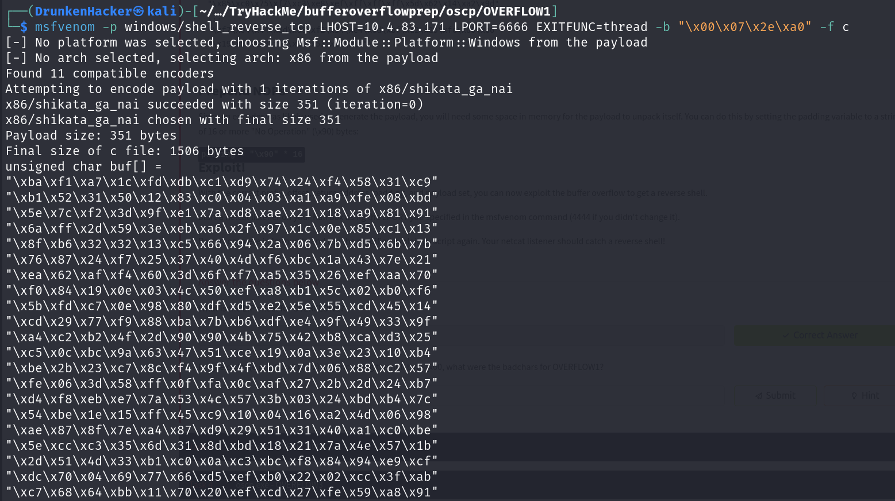

### Prepend NOPs

Since an encoder was likely used to generate the payload, we will need some space in memory for the payload to unpack itself. We can do this by setting the padding variable to a string of 16 or more "No Operation" (`\x90`) bytes.

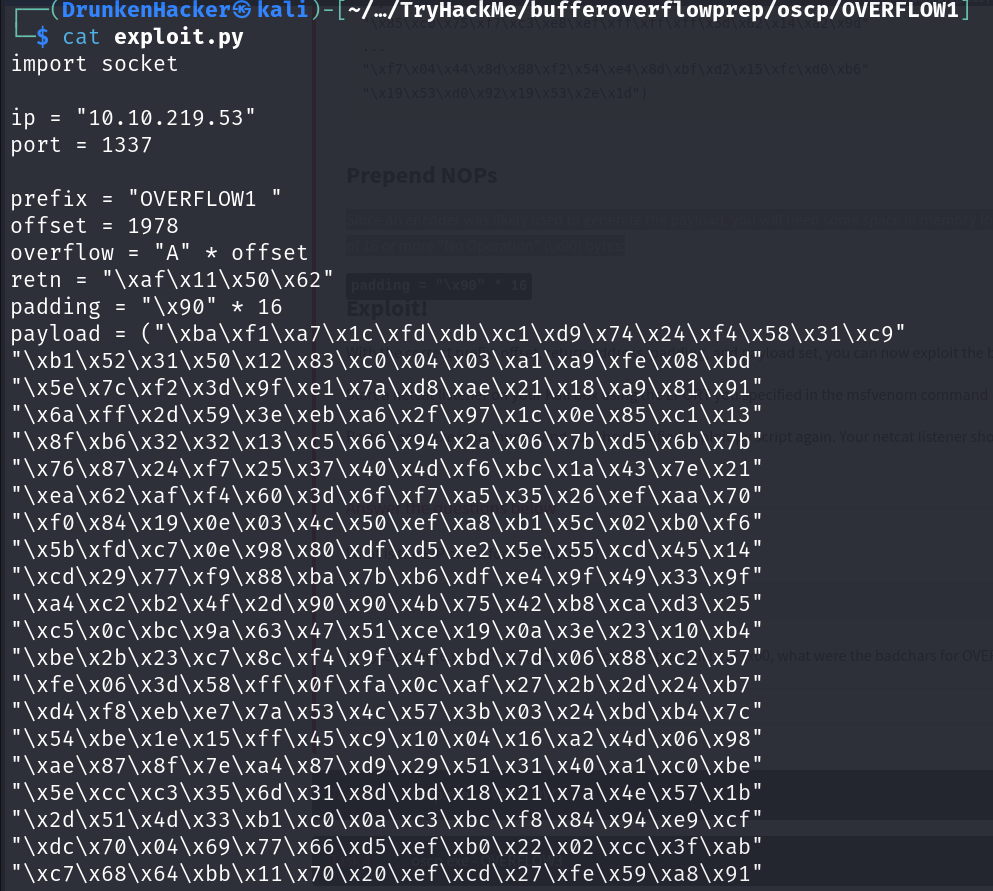

### Exploit

We run the script again and get a reverse shell.

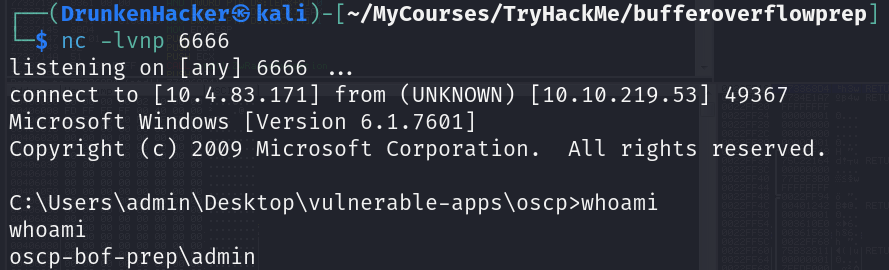

## oscp.exe - from OVERFLOW2 to OVERFLOW10

We repeat the same steps to answer the questions.