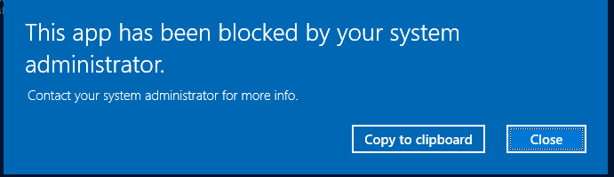
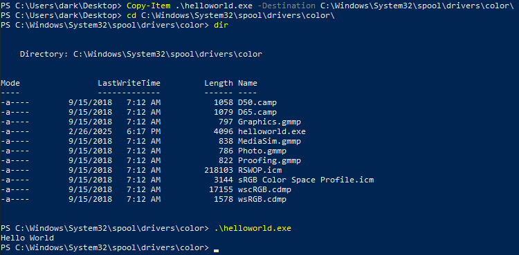
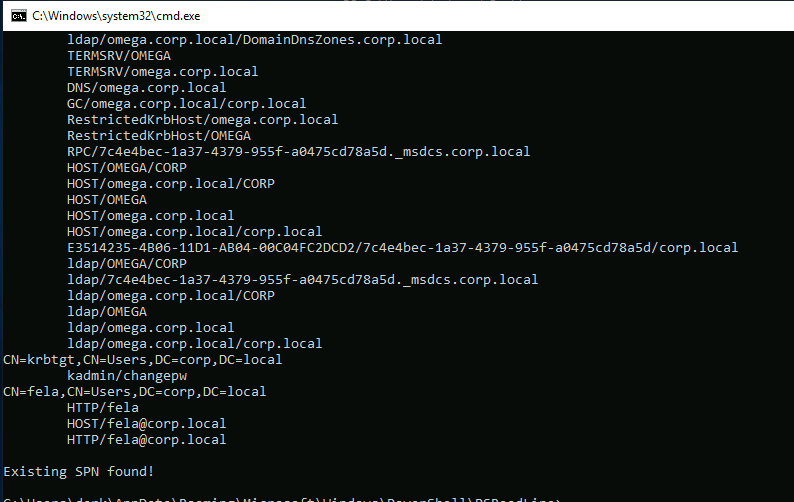
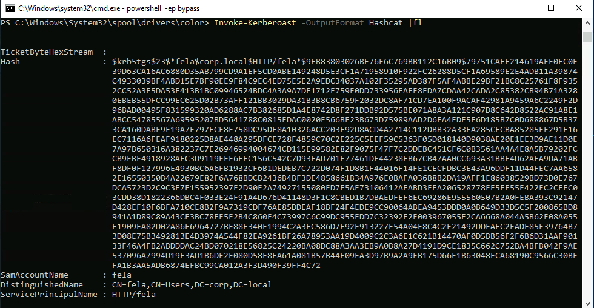
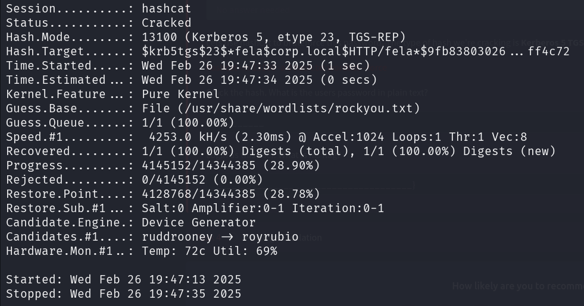
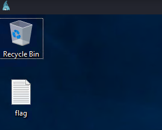

# Corp

## Description

Bypass Windows Applocker and escalate your privileges. You will learn about kerberoasting, evading AV, bypassing applocker and escalating your privileges on a Windows system.
* Category: Walkthrough

## Bypassing Applocker

AppLocker is an application whitelisting technology introduced with Windows 7. It allows restricting which programs users can execute based on the programs path, publisher, and hash.

As we download a `helloworld.exe` file and try to execute it, we get an error message that the file is blocked from AppLocker. Still, there are ways to bypass AppLocker.

If AppLocker is configured with default AppLocker rules, we can bypass it by placing our executable in the following directory: `C:\Windows\System32\spool\drivers\color` - This is whitelisted by default.

As we can see, since the app is copied to the whitelist directory, we can execute it without any issues.

## Kerberoasting

Kerberos is the authentication system for Windows and Active Directory networks. There are many attacks against Kerberos, in this room we will use a Powershell script to request a service ticket for an account and acquire a ticket hash. We can then crack this hash to get access to another user account!

By running `setspn -T medin -Q */*`, we can see that there are a few services that have SPNs associated with them, one of which is for a user `fela`. Now we need to download `Invoke-Kerberoast.ps1` and run it to request a service ticket for the user `fela`.

We can now crack the ticket hash using `hashcat` and get the password for the user `fela`.

Now we can login using RDP.

We find the flag in the user's desktop.

## Privilege Escalation

For this part, we check out `C:\Windows\Panther\Unattend\Unattended.xml` and found a password to login as `Administrator`. Then the flag is found at the desktop.