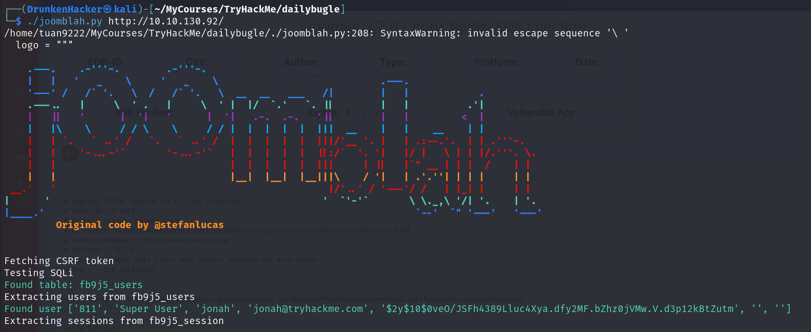
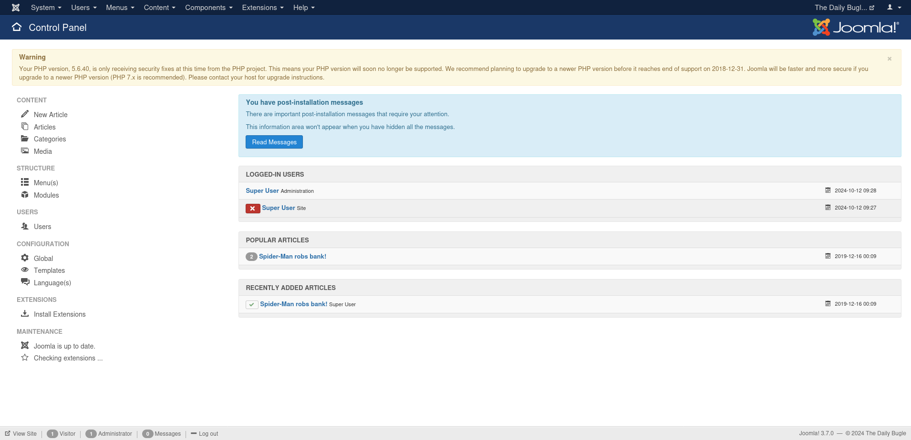

# Daily Bugle

## Description

Compromise a Joomla CMS account via SQLi, practise cracking hashes and escalate our privileges by taking advantage of yum.
* **Difficulty:** **Hard**
* **Categories:** SQLi, Reverse Shell, Password Cracking, Privilege Escalation

## Write-up

As always, we received an IP address. We start by enumerating it with nmap.

We can see there is a web server running on port 80. There seems to be a Joomla CMS running on the same server. Apart from that, there is an SSH server running on port 22 and a MySQL server running on port 3306. It's a good idea to start by checking out the web server.

This is a front page of Daily Bugle. We can see that there is a login page of what we assumed to be a Joomla CMS. Let's run gobuster to find any hidden directories.

We can see a lot of directories here, many of which are Joomla related. There are `.txt` files as well. Let's check them out before we move on to the `administrator` directory.

The `README.txt` shows us that the Joomla version is `3.7`. Let's check out the `LICENSE.txt` file.

Nothing much here. Let's move on to the `htaccess.txt` file.

It seems like the `htaccess.txt` file is trying to block us from seeing the directory listing. Let's move on to the `robots.txt` file.

Nothing much that we haven't known already. Let's move on to the `administrator` directory.

The `/administrator` directory is the login page for the Joomla CMS. We don't have any credentials to login. Since we know the Joomla version, let's try to find if there are any vulnerabilities for this version.

As we look up for the Joomla version on Exploit-DB, we find several SQL injection vulnerabilities related to Joomla 3.7. One of them is `CVE-2017-8917`. Let's try to exploit this vulnerability. We found a Python script that can exploit this vulnerability. Let's run it.

The script was able to give us the username and the password hash. Let's crack the hash using `john`.

We found the password for the user `jonah`. Let's login to the Joomla CMS using these credentials.

After looking around, we found the template manager. Let's try to load a reverse shell using the template manager. First, there are 2 templates available. We need to modify the `index.php` file of the template to check which one is being used.

Now we go back to the front page of Daily Bugle to check.

We can confirm that the `protostar` template is being used. Now we add the Monkey reverse shell to the `index.php` file of the `protostar` template.

Now we start a listener on our machine and visit the front page of Daily Bugle.

We have a reverse shell. Let's upgrade it to a TTY shell.

Now time to look around. From the gobuster scan, we knew that there was a `configuration.php` file. Let's check it out.

All the database credentials are here. We can of course use these credentials to login to the MySQL server. But let's look around more.

We found a user `jjameson`. Let's try to login with SSH using this username.

We are in. Let's look around.

We found the user flag. Now let's escalate our privileges. Let's start by running `sudo -l`.

We can see that we can run `sudo yum` without a password. Let's try to exploit this.

With the help of GTFOBins, we were able to escalate our privileges. Let's read the root flag.

And that's it. We have finished the Daily Bugle room.