# File Inclusion

## Description

This room introduces file inclusion vulnerabilities, including Local File Inclusion (LFI), Remote File Inclusion (RFI), and directory traversal.
* Category: Walkthrough

## Introduction

In some scenarios, web applications are written to request access to files on a given system, including images, static text, and so on via parameters. Parameters are query parameter strings attached to the URL that could be used to retrieve data or perform actions based on user input.

### Why do File inclusion vulnerabilities happen?

File inclusion vulnerabilities are commonly found and exploited in various programming languages for web applications, such as PHP that are poorly written and implemented.

The main issue of these vulnerabilities is the input validation, in which the user inputs are not sanitized or validated, and the user controls them. When the input is not validated, the user can pass any input to the function, causing the vulnerability.

### What is the risk of File inclusion?

By default, an attacker can leverage file inclusion vulnerabilities to leak data, such as code, credentials or other important files related to the web application or operating system.

Moreover, if the attacker can write files to the server by any other means, file inclusion might be used in tandem to gain remote command execution (RCE).

## Path Traversal

Also known as **Directory traversal**, a web security vulnerability allows an attacker to read operating system resources, such as local files on the server running an application.

The attacker exploits this vulnerability by manipulating and abusing the web application's URL to locate and access files or directories stored outside the application's root directory.

Path traversal vulnerabilities occur when the user's input is passed to a function such as `file_get_contents` in PHP. It's important to note that the function is not the main contributor to the vulnerability. Often poor input validation or filtering is the cause of the vulnerability. In PHP, we can use the `file_get_contents` to read the content of a file.

We can test out the URL parameter by adding payloads to see how the web application behaves. Path traversal attacks, also known as the *dot-dot-slash attack*, take advantage of moving the directory one step up using the double dots `../`. If the attacker finds the entry point then the attacker may send something as follows `http://webapp.thm/get.php?file=../../../../etc/passwd`.

Suppose there isn't input validation, and instead of accessing a file at the supposed directory, the web application retrieves files from other directories, which in this case `/etc/passwd`. Each `..` entry moves one directory until it reaches the root directory `/`. Then it changes the directory to `/etc`, and from there, it read the `passwd` file. As a result, the web application sends back the file's content to the user.

Similarly, if the web application runs on a Windows server, the attacker needs to provide Windows paths. For example, if the attacker wants to read the `boot.ini` file located in `c:\boot.ini`, then the attacker can try the following depending on the target OS version: `http://webapp.thm/get.php?file=../../../../boot.ini` or `http://webapp.thm/get.php?file=../../../../windows/win.ini`.

The same concept applies here as with Linux operating systems, where we climb up directories until it reaches the root directory, which is usually `c:\`.

Sometimes, developers will add filters to limit access to only certain files or directories. Below are some common OS files we could use when testing.

| **Location** | **Description** |
| - | - |
| `/etc/issues` | contains a message or system identification to be printed before the login prompt. |
| `/etc/profile` | controls system-wide default variables, such as Export variables, File creation mask (umask), Terminal types, Mail messages to indicate when new mail has arrived |
| `/proc/version` | specifies the version of the Linux kernel |
| `/etc/passwd` | has all registered user that has access to a system |
| `/etc/shadow` | contains information about the system's users' passwords |
| `/root/.bash_history` | contains the history commands for root user |
| `/var/log/dmessage` | contains global system messages, including the messages that are logged during system startup |
| `/var/mail/root` | all emails for root user |
| `/var/log/apache2/access.log` | the accessed requests for Apache webserver |
| `C:\boot.ini` | contains the boot options for computers with BIOS firmware |

## Local File Inclusion - LFI

LFI attacks against web applications are often due to a developers' lack of security awareness. With PHP, using functions such as `include`, `require`, `include_once`, and `require_once` often contribute to vulnerable web applications. LFI vulnerabilities also occur when using other languages such as ASP, JSP, or even in Node.js apps. LFI exploits follow the same concepts as path traversal.

### Steps for testing for LFI

1. Find an entry point that could be via `GET`, `POST`, `COOKIE`, or HTTP header values!
2. Enter a valid input to see how the web server behaves.
3. Enter invalid inputs, including special characters and common file names.
4. Don't always trust what we supply in input forms is what we intended! Use either a browser address bar or a tool such as Burpsuite.
5. Look for errors while entering invalid input to disclose the current path of the web application. If there are no errors, then trial and error might be our best option.
6. Understand the input validation and if there are any filters!
7. Try the inject a valid entry to read sensitive files

## Remote File Inclusion - RFI

Remote File Inclusion (RFI) is a technique to include remote files into a vulnerable application. Like LFI, the RFI occurs when improperly sanitizing user input, allowing an attacker to inject an external URL into include function. One requirement for RFI is that the `allow_url_fopen` option needs to be on.

The risk of RFI is higher than LFI since RFI vulnerabilities allow an attacker to gain Remote Command Execution (RCE) on the server. Other consequences of a successful RFI attack include:
* Sensitive Information Disclosure
* Cross-Site Scripting (XSS)
* Denial of Service (DoS)

An external server must communicate with the application server for a successful RFI attack where the attacker hosts malicious files on their server. Then the malicious file is injected into the include function via HTTP requests, and the content of the malicious file executes on the vulnerable application server.

### RFI Steps

First, the attacker injects the malicious URL, which points to the attacker's server. If there is no input validation, then the malicious URL passes into the include function. Next, the web app server will send a **GET** request to the malicious server to fetch the file. As a result, the web app includes the remote file into include function to execute the PHP file within the page and send the execution content to the attacker.

## Remediation

As a developer, it's important to be aware of web application vulnerabilities, how to find them, and prevention methods. To prevent the file inclusion vulnerabilities, some common suggestions include:
1. Keep system and services, including web application frameworks, updated with the latest version.
2. Turn off PHP errors to avoid leaking the path of the application and other potentially revealing information.
3. A Web Application Firewall (WAF) is a good option to help mitigate web application attacks.
4. Disable some PHP features that cause file inclusion vulnerabilities if our web app doesn't need them, such as `allow_url_fopen` on and `allow_url_include`.
5. Carefully analyze the web application and allow only protocols and PHP wrappers that are in need.
6. Never trust user input, and make sure to implement proper input validation against file inclusion.
7. Implement whitelisting for file names and locations as well as blacklisting.

## Challenge

We are given a web application to exploit. There are 3 challenges to complete.

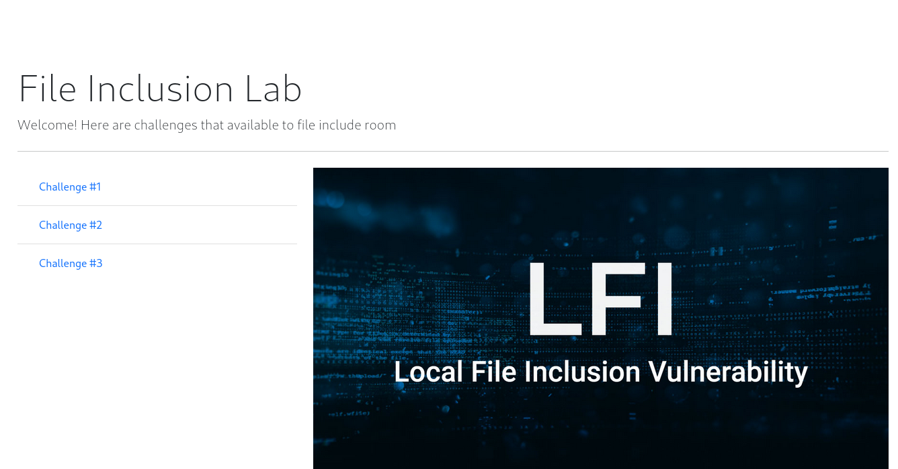

Let's start with the first challenge.

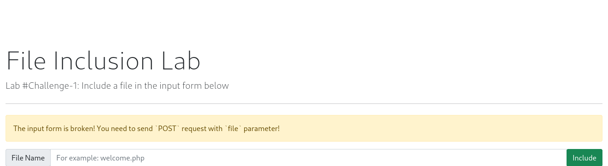

It says that the input form is broken and we need to send `POST` requests with the `file` parameter. We need to use `curl` to send the request.

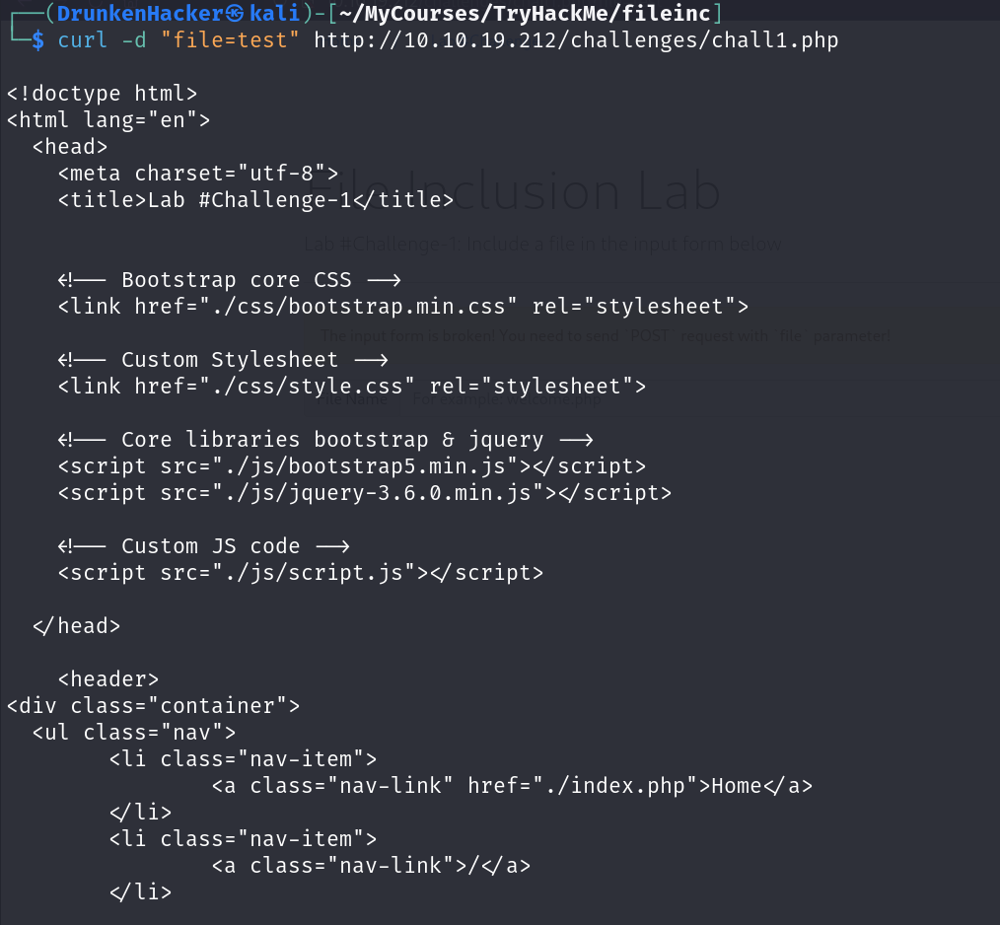

The response says that it failed to open our `test` file because of the `include` function. We know that our flag is at `/etc/flag1` so this time we will try to read the flag with parameter `file=/etc/flag1`.

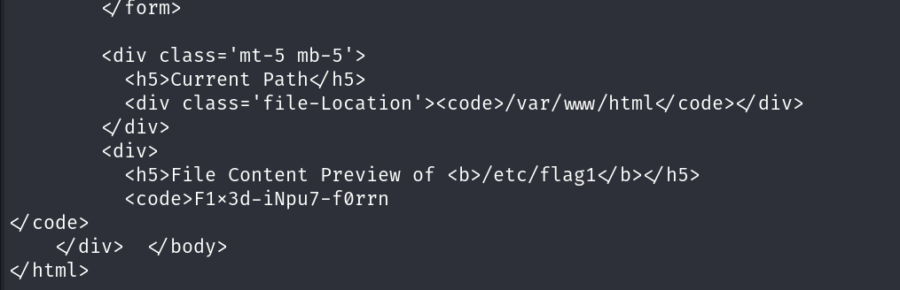

We got the flag for the first challenge. Let's move to the second challenge.

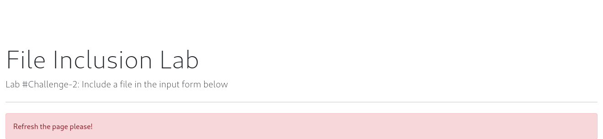

It tells us to refresh the page. Weird but okay.

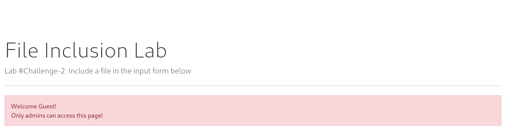

It is saying that only admins can access the page and we are guest so we cannot. Let's look around to find something that can help us bypass this. We notice that this only happens after the first time we refresh the page so we can suspect that there is a cookie set for this. Let's check the cookies at the browser.

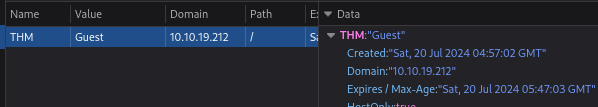

Our suspicion was correct. There is a cookie named `THM` with the value `Guest`. Let's change the value to `Admin` and refresh the page.

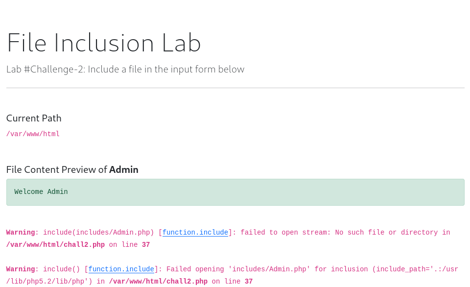

We can see that it failed to include the `includes/Admin.php` file. We know that the flag is at `/etc/flag2` so we can try setting our cookie to `Admin/../../../../../etc/flag2` to reach our flag. Moreover, the website is appending `.php` to the file name so we need to add `%00` to the end of our cookie to bypass this.

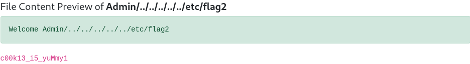

We got the flag for the second challenge. Let's move to the third challenge.

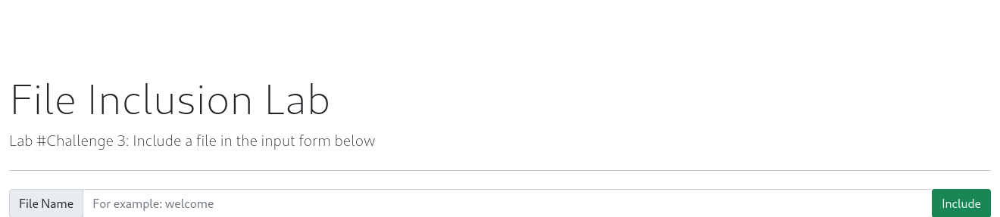

Seems pretty normal. Let's try including a file and see what happens.

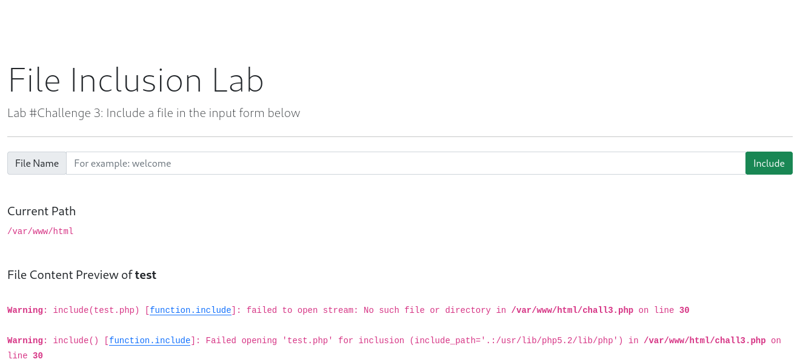

It says that it failed to open our `test` file because of the `include` function. We know that our flag is at `/etc/flag3` so let's try type in `/etc/flag3` as the input.

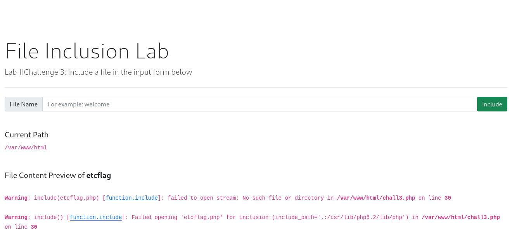

It filtered out our `/` and `.` character. After a few tries, we realize that not only special characters are filtered but also capital letters and numbers. We tried every bypass we know but none of them worked. Then we captured the request with Burp Suite to analyze it further.

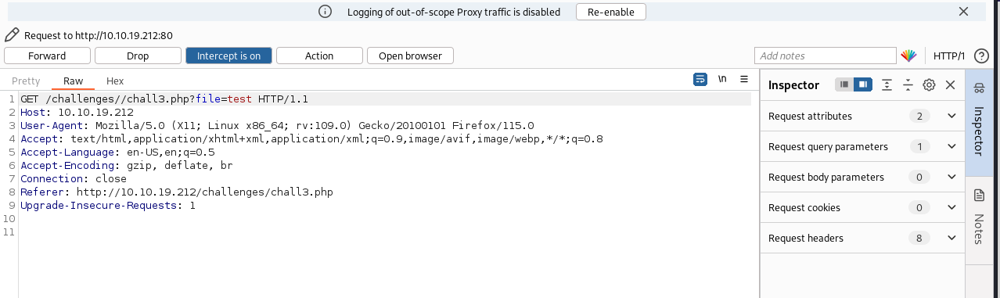

We can see that the request is a `GET`. What if the filter only works for the `GET` requests we sent from the browser? Maybe we can bypass the filter by sending a `POST` request with `curl`.

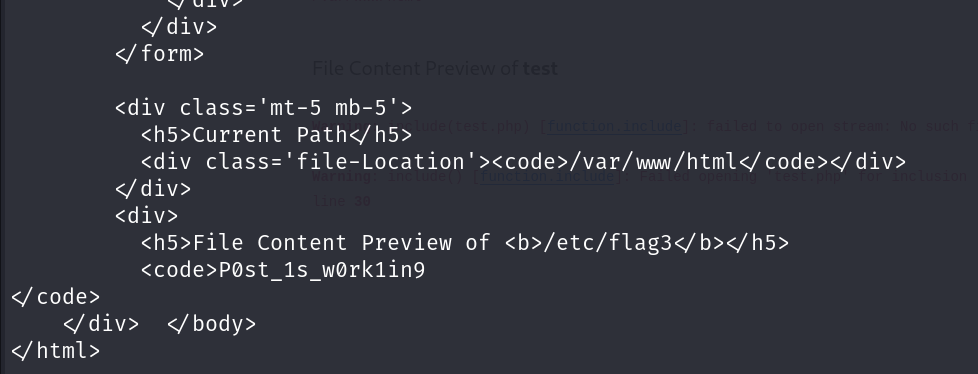

We got the flag for the third challenge. One last challenge to go.

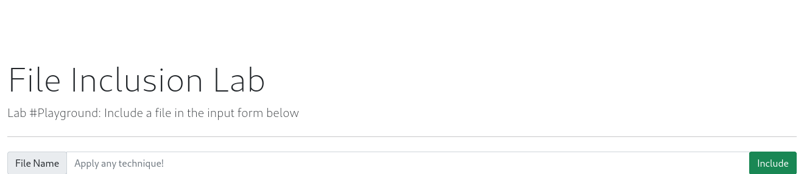

For this challenge, we need to execute `hostname` command with RFI. First, we need to create a PHP file that executes our command.

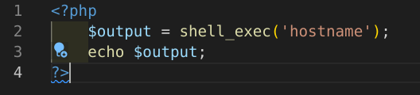

Next, we need to host this file on a web server. We can use `python3 -m http.server` to host the file.

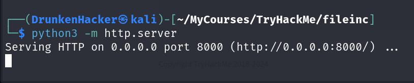

Our last step is to include this file in the web application.

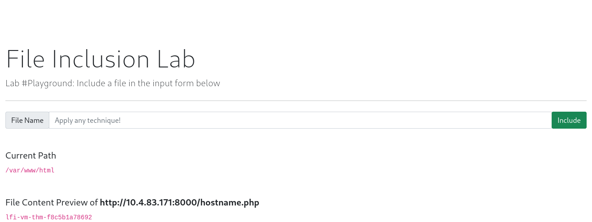

We got the flag for the last challenge. We have completed all the challenges.