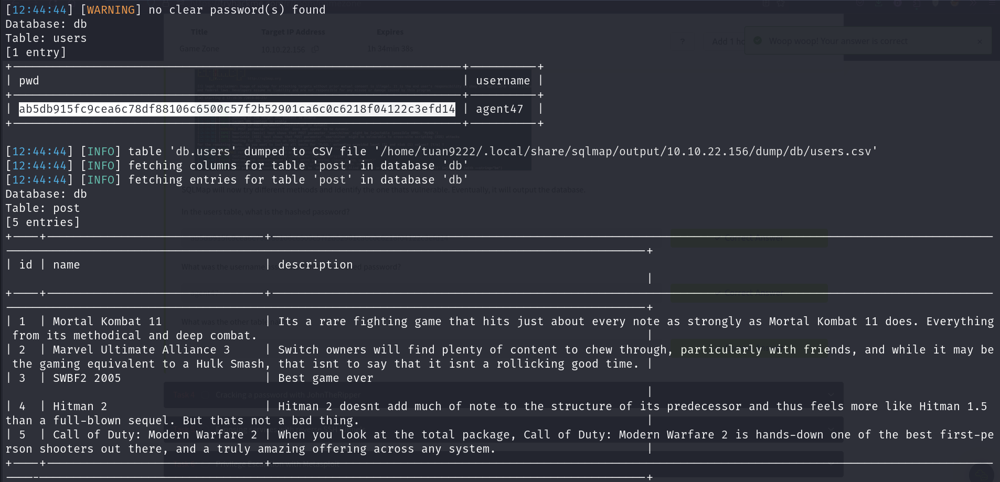
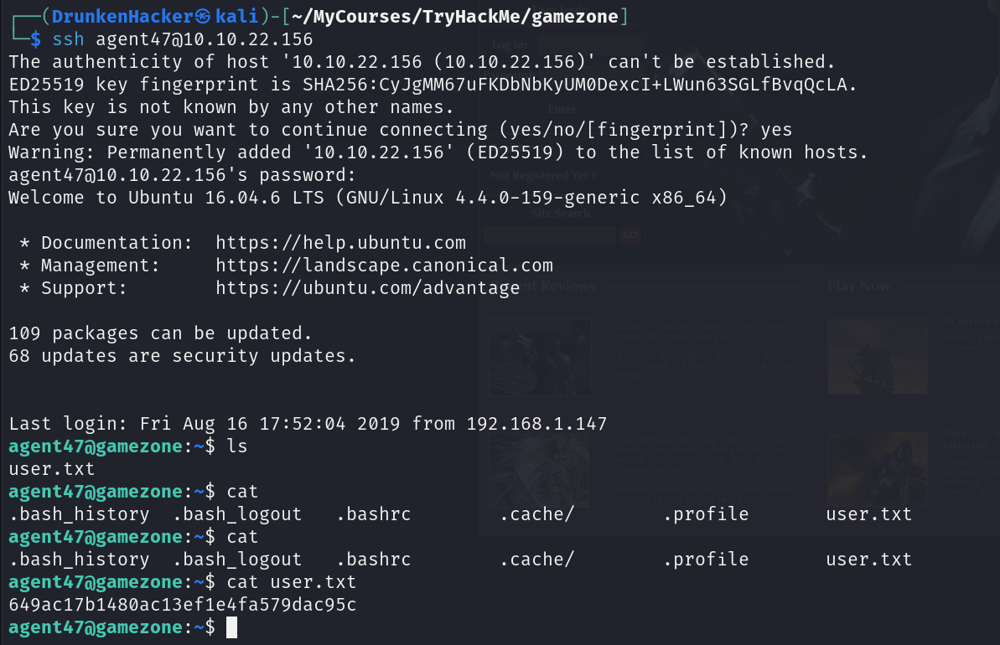
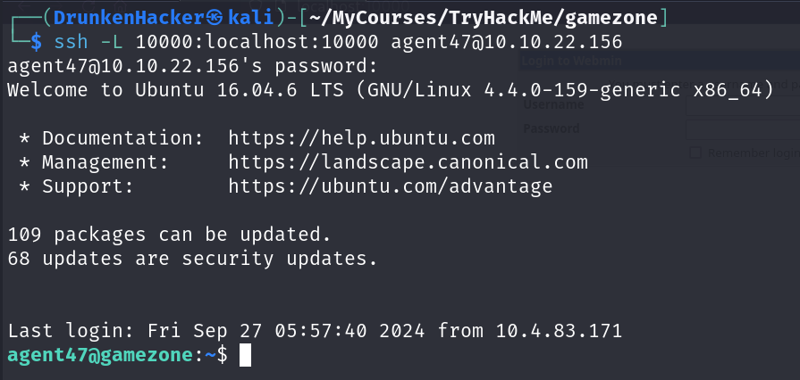
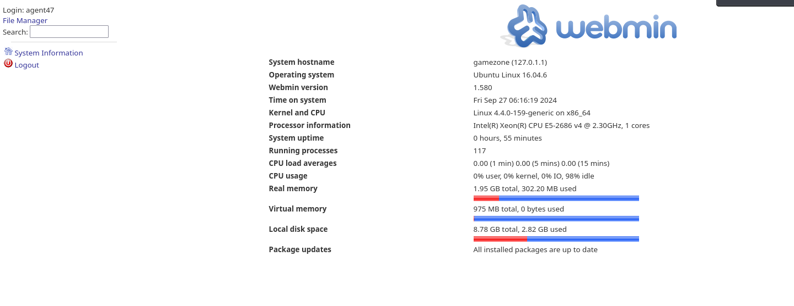

# Game Zone

## Description

Learn to hack into this machine. Understand how to use SQLMap, crack some passwords, reveal services using a reverse SSH tunnel and escalate our privileges to root!
* Category: Walkthrough

## Deploy the vulnerable machine

As we deploy the machine, we are given the IP address of the machine. Let's see if we can access it from our browser.

It's a login page with an image of Agent 47 from the Hitman series.

## Obtain access via SQLi

We try to login with some random credentials. Luckily, as we try `' OR 1=1 -- -` as the username and leave the password field empty, we are able to login.

We are greeted with a portal page. We tried several things but nothing worked.

## Using SQLMap

Let's try catching the search request in Burp Suite.

We see that the search request is a POST request. Let's save the request and use SQLMap to dump the database.

After a while, we get our result.

## Cracking the password with JohnTheRipper

We can see from our SQLMap result, there is a hash of `agent47` user's password. From the result, we also know that the hash is SHA256. Let's copy the hash to a file and crack it with JohnTheRipper.

We got the pair of credentials. Let's check where can we use this.

A quick Nmap scan reveals that the SSH port is open. Let's try connect to the machine with SSH.

We are in! And we also got a flag.

## Exposing services with reverse SSH

Let's enumerate a bit while we are in.

We found the list of listening ports. There is one weird `10000` port that we have not seen from Nmap scan. Maybe this is blocked by a firewall. Let's try exposing this using reverse SSH tunnel.

Now that the reverse tunnel is ready, let's try going to `localhost:10000` and check if we can find anything.

It's a Webmin login page. Let's try using the credentials we obtained earlier to login.

And we are in! There are a lot of information of this server.

## Privilege escalation with Metasploit

Let's use Metasploit to search for vulnerabilities with these informations.

We found exploits related to webmin. Let's try setting options and running it to see if the exploit works.

Our exploit ran successfully and we got a shell. Let's check if we can find the root flag.

And we got the root flag!