# Internal

## Description

Penetration Testing Challenge
* **Difficulty:** **Hard**
* **Categories:** WordPress, Kernel Exploitation

## Pre-engagement Briefing

We have been assigned to a client that wants a penetration test conducted on an environment due to be released to production in three weeks.

### Scope of Work

The client requests that an engineer conducts an external, web app, and internal assessment of the provided virtual environment. The client has asked that minimal information be provided about the assessment, wanting the engagement conducted from the eyes of a malicious actor (black box penetration test). The client has asked that us secure two flags (no location provided) as proof of exploitation:
* `User.txt`
* `Root.txt`

Additionally, the client has provided the following scope allowances:
* Ensure that we modify our hosts file to reflect `internal.thm`
* Any tools or techniques are permitted in this engagement
* Locate and note all vulnerabilities found
* Submit the flags discovered to the dashboard
* Only the IP address assigned to the machine is in scope

## Write-up

We are given the IP address of the target machine, and we are asked to modify our hosts file to reflect `internal.thm`.

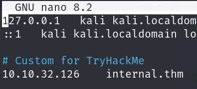

Now we enumerate the target. We can start with an Nmap port scan.

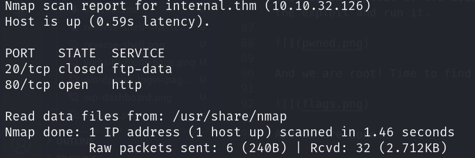

We can see that only two ports are open: 22 and 80. We can start by visiting the web server.

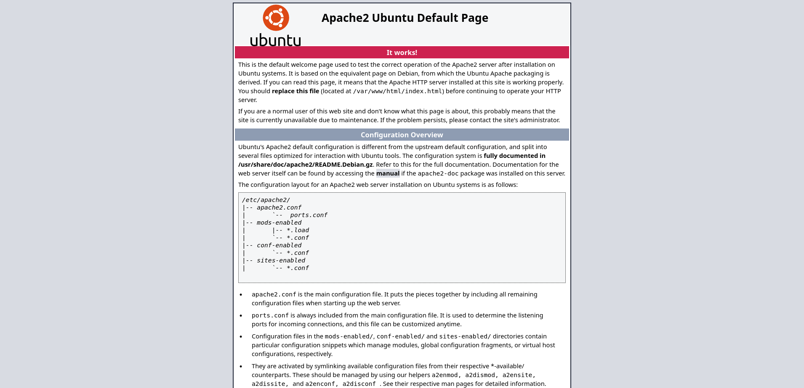

It's a default Apache page. We need to run a Gobuster scan to find hidden directories or else we won't find anything interesting.

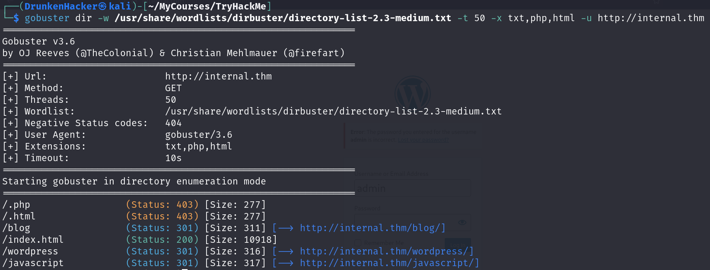

We can see that there is a `/blog`, a `/phpmyadmin`, and a `/wordpress` directory that can be interesting. Let's start with the `/blog` directory.

It is just a WordPress site of Internal. Move on to the `/phpmyadmin` directory.

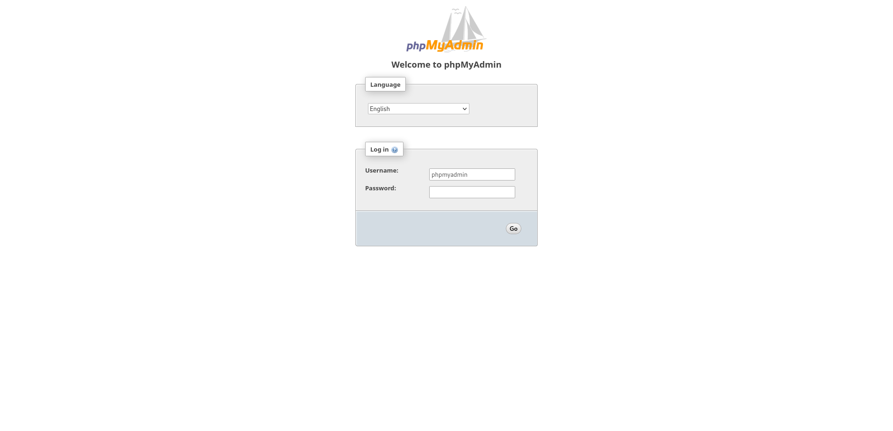

It is a phpMyAdmin page. We tried to log in with the default credentials, but it didn't work. Let's move on to the `/wordpress` directory.

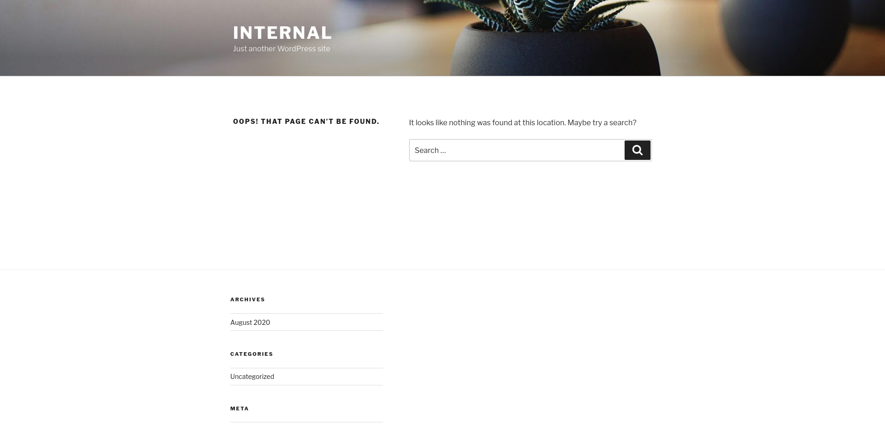

It says that the page cannot be found. We can see a login button at the bottom of the page. Let's visit the login page.

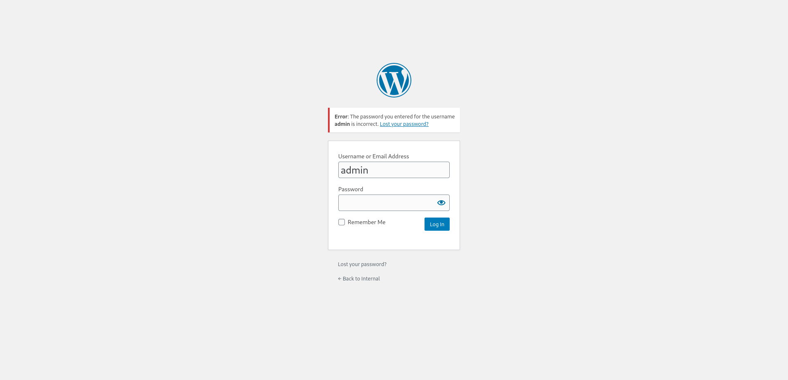

We tried to log in with the default credentials, but it didn't work. Now that we know the machine is running WordPress, we can run a WPScan to find vulnerabilities.

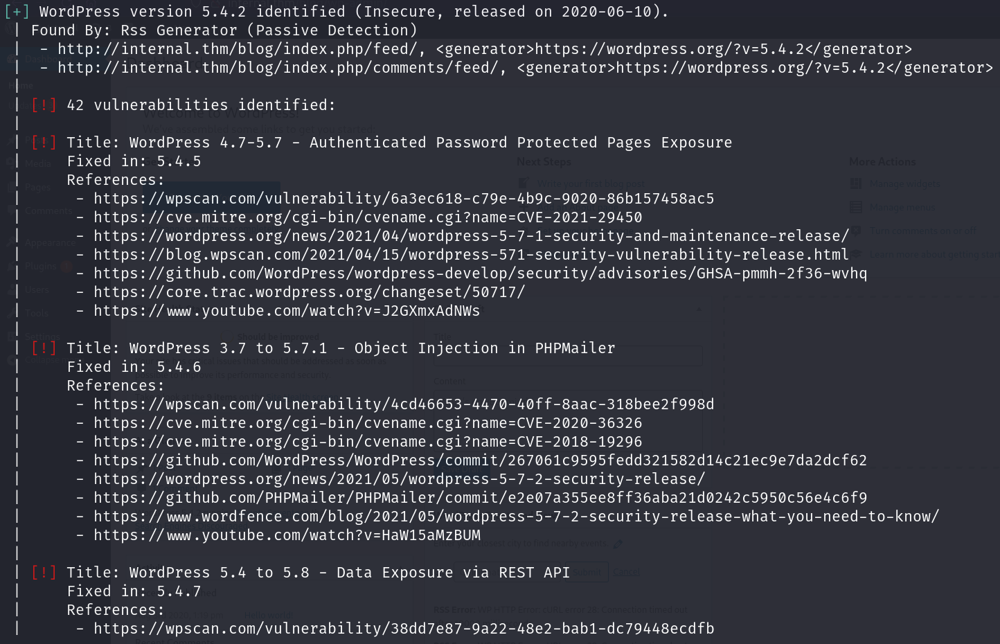

Thanks to WPScan, not only that we know the version of WordPress and the theme being used, we also know that this WordPress version has 42 vulnerabilities and some of them are related to authentication. From the previous guess, we can confirm that there is a username `admin`. We can try to brute force the password with wpscan.

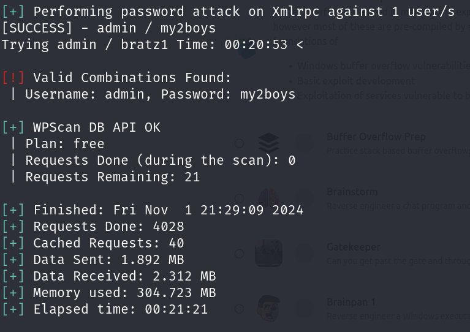

We found the password for the `admin` user. Time to log in.

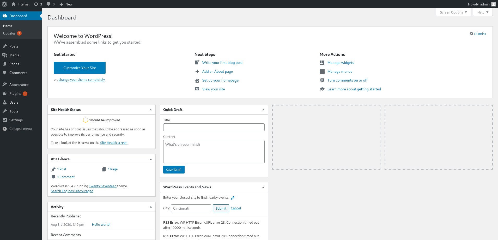

We are in! As we are admin, we can modify the page to include a reverse shell. We are going to add the Pentest Monkey PHP reverse shell to the `404.php` file.

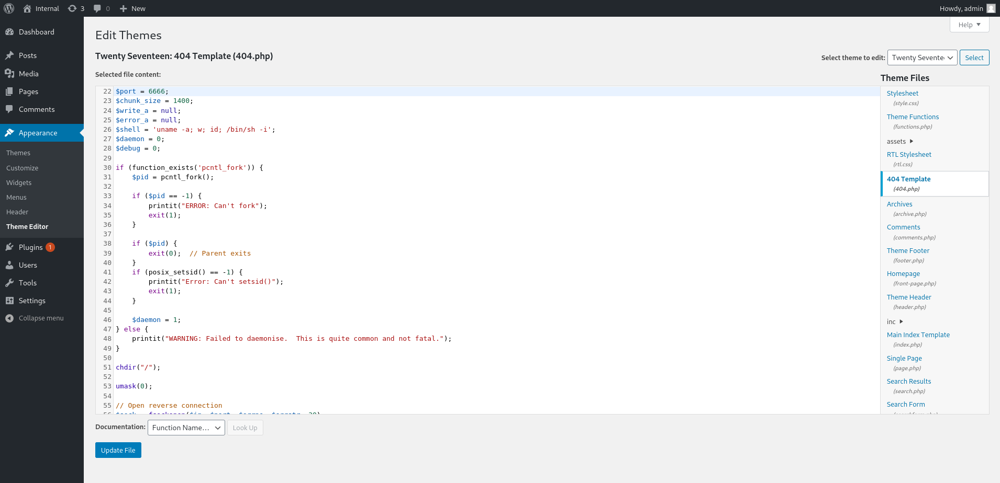

Now all we need to do is to start a listener on our machine and make a search for a non-existent blog so that the `404.php` file is executed.

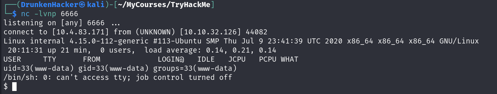

Now that we have a reverse shell, we can start enumerating the machine. Let's use LinPEAS to find vulnerabilities.

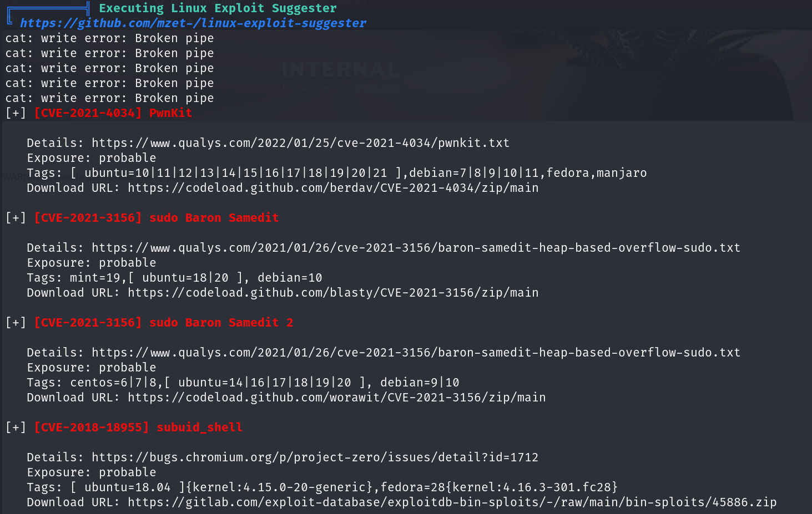

LinPEAS found quite some vulnerabilities. From the output, we can see that the machine is running `Ubuntu 18.04.4 LTS` with a kernel version of `4.15.0-112-generic`, the sudo version is `1.8.21p2` and LinPEAS suggested some exploits that we can use for this sudo version.

After a few try, we found that there is no `gcc` installed on the machine. Therefore, to exploit the sudo version, we may need to opt for a Python payload. There is one of **worawit** that we found on GitHub that is an exploit of CVE-2021-3156. We can download the exploit and run it.

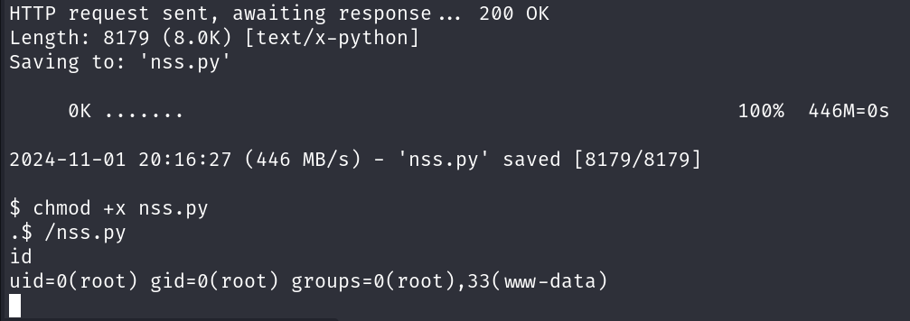

And we are root! Time to find the flags.

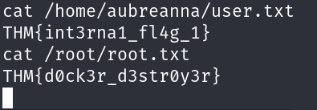

And we are done!