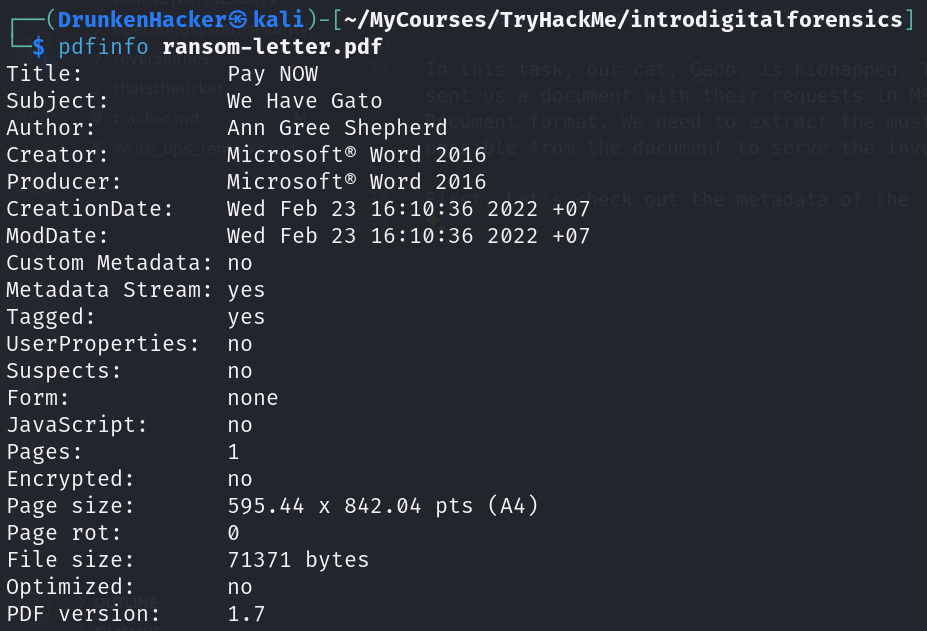
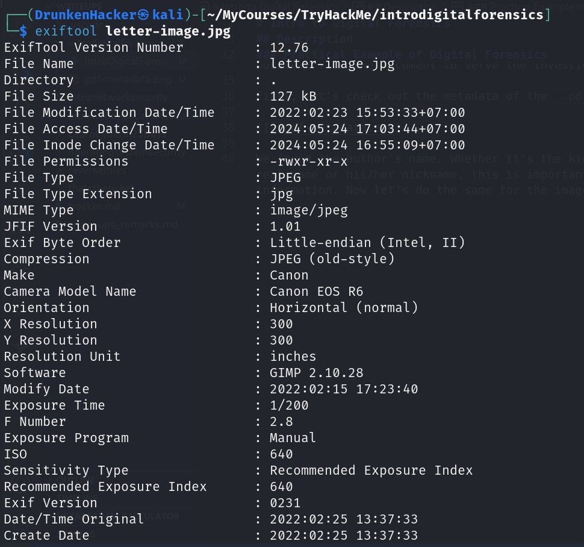

# Intro to Digital Forensics

## Description

Learn about digital forensics and related processes and experiment with a practical example.
* Category: Walkthrough

### Introduction To Digital Forensics

**Forensics** is the application of science to investigate crimes and establish facts. With the use and spread of digital systems, such as computers and smartphones, a new branch of forensics was born to investigate related crimes: computer forensics, which later evolved into, *digital forensics*.

**Digital forensics** is the application of computer science to investigate digital evidence for a legal purpose. Digital forensics is used in two types of investigations:
1. **Public-sector investigations** refer to the investigations carried out by government and law enforcement agencies. They would be part of a crime or civil investigation.
2. **Private-sector investigations** refer to the investigations carried out by corporate bodies by assigning a private investigator, whether in-house or outsourced. They are triggered by corporate policy violations.

Whether investigating a crime or a corporate policy violation, part of the evidence is related to digital devices and digital media. This is where digital forensics comes into play and tries to establish what has happened. Without trained digital forensics investigators, it won’t be possible to process any digital evidence properly.

### Digital Forensics Process

As a digital forensics investigator, when arrive at the crime scene, after getting the proper legal authorization, the basic plan goes as follows:
1. **Acquisition**: Collect the digital evidence.
2. **Establishing the Chain of Custody**: Document the evidence and who has handled it.
3. **Secure the Evidence**: Ensure the evidence is not tampered with and remains undamaged.
4. **Transfer the Evidence**: Move the evidence to the digital forensics lab.

At the lab, the process goes as follows:
1. **Retrieval**: Retrieve the digital evidence from the secure container.
2. **Create a Forensic Image**: Create a forensic image of the digital evidence.
3. **Return the Original Evidence**: Return the original evidence to the secure container. You will work with the forensic image. If the image is damaged, you can always create another one from the original evidence.
4. **Analysis**: Analyze the forensic image to find out what happened.

### Practical Example of Digital Forensics

In this task, our cat, Gado, is kidnapped. The kidnapper sent us a document with their requests in MS Word Document format. We need to extract the most information possible from the document to serve the investigation.

First, Let's check out the metadata of the `.pdf` file.

We found the author's name. Whether it's the kidnapper's real name or his/her nickname, this is important information. Now let's do the same for the image.

There is a lot of information in the image metadata. After thorough analysis, we found the model name of the camera used to take the picture. There is also a GPS location of where the picture was taken. Let's put the coordinates into Google Maps and see where it leads us.

They took me Gado all the way to London! This is unacceptable! I'm coming for you, Gado!