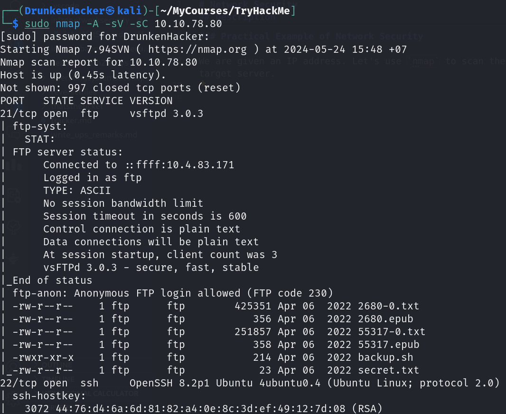
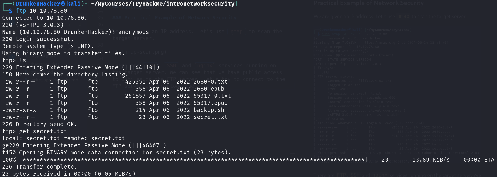
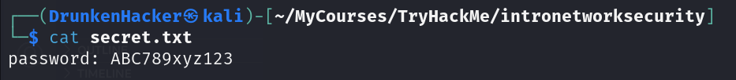
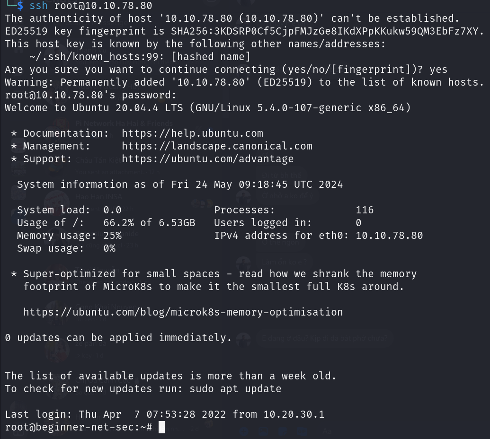

# Network Security

## Description

Learn about network security, understand attack methodology, and practice hacking into a target server.  
* Category: Walkthrough

### Introduction

A computer network is a group of computers and devices connected with each other. Network security focuses on protecting the security of these devices and the links connecting them.

**Network Security** consists of different hardware and software solutions to achieve the set security goals. **Hardware solutions** refer to the devices you set up in your network to protect your network security.

Examples of hardware appliances include:
* **Firewall appliance**: The firewall allows and blocks connections based on a predefined set of rules. It restricts what can enter and what can leave a network.
* **Intrusion Detection System (IDS) appliance**: An IDS detects system and network intrusions and intrusion attempts. It tries to detect attackers' attempts to break into your network.
* **Intrusion Prevention System (IPS) appliance**: An IPS blocks detected intrusions and intrusion attempts. It aims to prevent attackers from breaking into your network.
* Virtual Private Network (VPN) concentrator appliance: A VPN ensures that the network traffic cannot be read nor altered by a third party. It protects the confidentiality and integrity of the sent data.

On the other hand, we have software security solutions. Common examples are:
* **Antivirus software**: Detect malicious files and block them from executing.
* **Host firewall**: Unlike the firewall appliance, a hardware device, this is part of the system.

### Methodology

Every *"operation"* requires some form of planning to achieve success. Breaking into a target network usually includes a number of steps. These steps are often referred to as the **Cyber Kill Chain**:
1. **Reconnaissance (Recon)**: Gather information about the target.
2. **Weaponization**: Prepare a file with malicious component.
3. **Delivery**: Send the malicious file to the target.
4. **Exploitation**: Execute the malicious file.
5. **Installation**: Install a backdoor or other malicious software.
6. **Command and Control (C2)**: Establish a connection to the target to control it.
7. **Actions on Objectives**: Achieve the goal of the attack.

### Practical Example of Network Security

We are given an IP address. Let's use `nmap` to scan the target server.

There are `FTP`, `SSH` and `nginx` services running on the target server. We can see that we have public access to 6 files on the FTP server. Let's try to connect to the FTP server and download the files.

Now we checkout the files we downloaded. First, we check the `secret.txt` file.

We found a password but we don't know what it is for or who it belongs to. Let's take a blind guess and try to connect as `root` using the password we found.

And we are in! As now we are `root`, we can do anything we want on the server. As we look around, we find a file named `flag.txt` at the `/root` directory and the home directory of the user `librarian`.