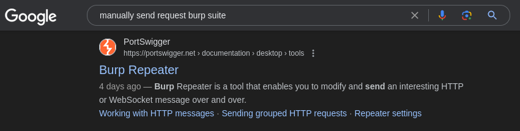
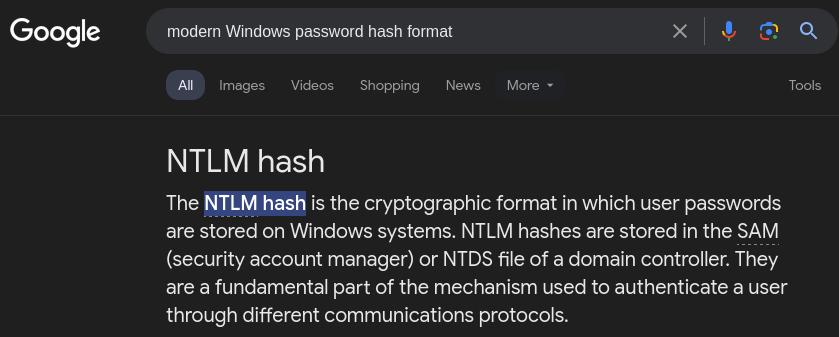
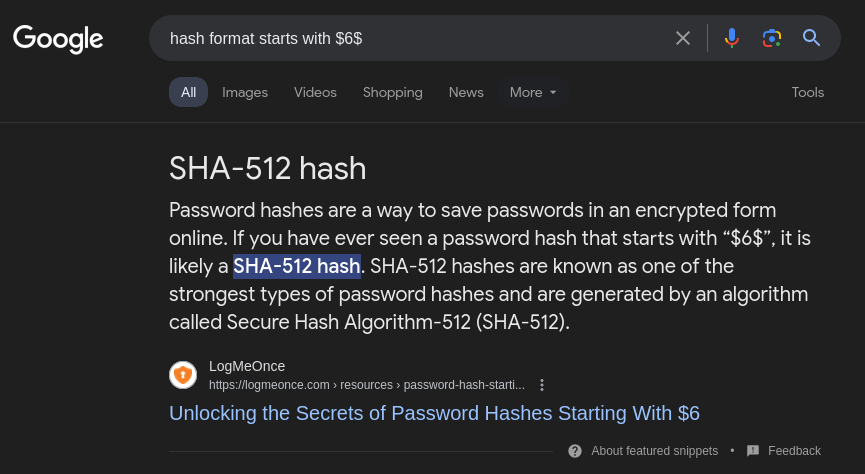
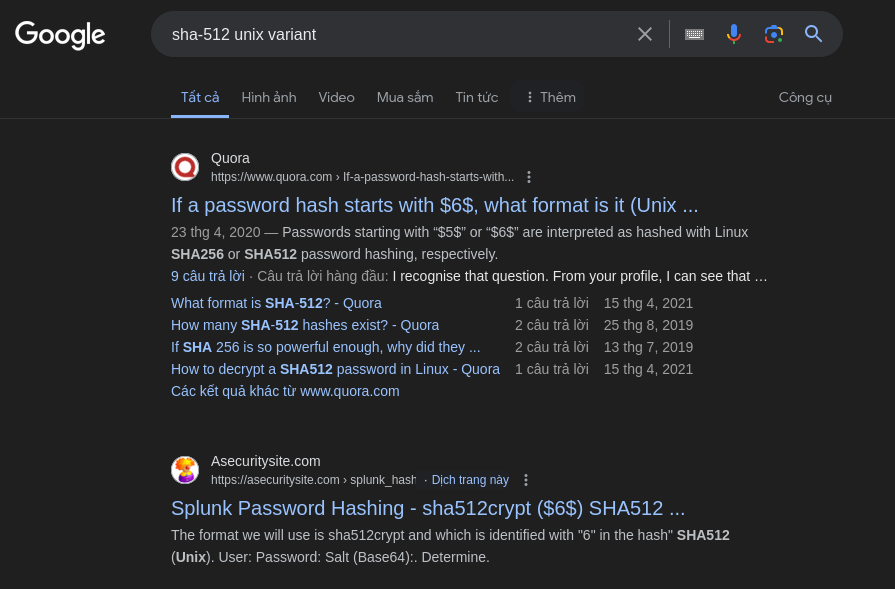
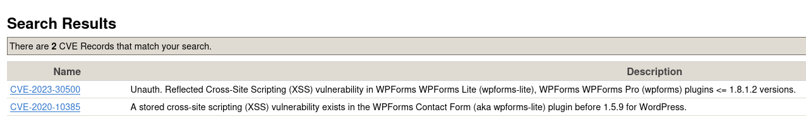
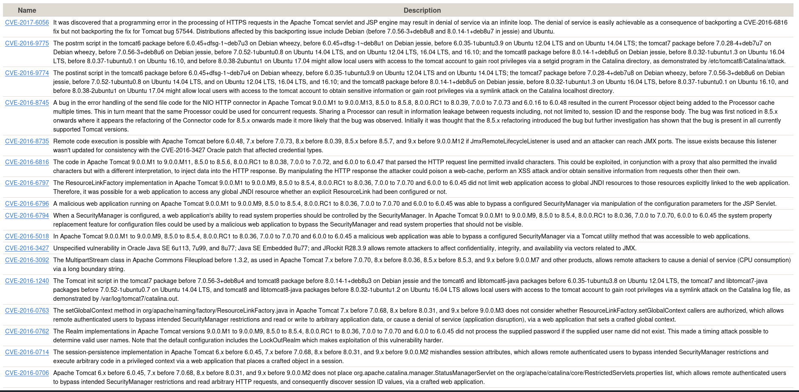
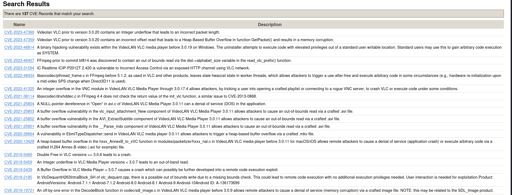
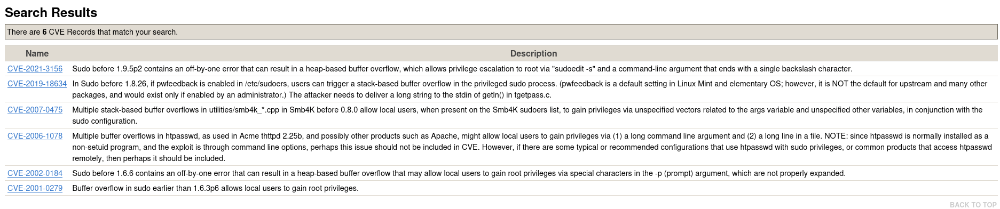

# Introductory Researching

## Description

A brief introduction to research skills for pentesting.
* Category: Walkthrough

### Introduction

The ability to research effectively is the most important quality for a hacker. Hacking requires vast knowledge base. Unfortunately, no one knows everything. Everyone will encounter problems which they don't automatically know how to solve. This is where research comes in.

As your experience level increases, you will find that the things you're researching scale in their difficulty accordingly; however, in the field of information security, there will never come a point where you don't need to look things up.

### Example research question

We are given several questions. Let's practice the technique of researching.

1. *In the Burp Suite Program that ships with Kali Linux, what mode would you use to manually send a request (often repeating a captured request numerous times)?*

Let's search for `manually send request in Burp Suite` on Google.

And the first link gives us information of what we are looking for.

2. *What hash format are modern Windows login passwords stored in?*

Let's search for `modern Windows password hash format` on Google.

And immediately there is an answer for us.

3. *What are automated tasks called in Linux?*

Let's search for `automated tasks in Linux` on Google.

And there are a lot of links that give us the answer.

4. *What number base could you use as a shorthand for base 2 (binary)?*

Let's search for `shorthand for binary` on Google.

The preview of the first link gives us the answer.

5. *If a password hash starts with \$6\$, what format is it (Unix variant)?*

Let's search for `hash format starts with $6$` on Google.

It tells us that the answer should be `SHA-512`. However, this is not the answer. Maybe the Unix variant has different name for the hash format. Let's search for `SHA-512 Unix variant`.

The second link gives us the answer.

### Vulnerability Searching

Some place to look if we want to exploit specific software:
* [Exploit Database](https://www.exploit-db.com/)
* [NVD](https://nvd.nist.gov/vuln/search)
* [CVE Mitre](https://cve.mitre.org/)

NVD keeps track of CVEs (Common Vulnerabilities and Exposures) - whether or not there is an exploit publicly available - so it's a good place to look when searching for vulnerabilities in a specific piece of software. CVEs take the form: `CVE-YEAR-IDNUMBER`.

ExploitDB is very useful for hackers as it contains exploits that can be downloaded and used straight out of the box. This is often the first stop when encountering a software during CTF and pentest.

Kali has a pre-installed tool called `searchsploit`. This is a dowwloaded version of ExploitDB that can be searched from the command line.

Let's try to search for requested CVEs using CVE Mitre.

1. *What is the CVE for the 2020 Cross-Site Scripting (XSS) vulnerability found in WPForms?*

Let's search for `WPForms XSS`.

We found 2 results and only one of them is in 2020.

2. *There was a Local Privilege Escalation vulnerability found in the Debian version of Apache Tomcat, back in 2016. What's the CVE for this vulnerability?*

Let's search for `Debian Tomcat 2016`.

There are 17 records. We notice there is one specificly mentions gaining root privileges from local user that has access to tomcat account. It affects many OS, one of which is Debian. That's the one we are looking for.

3. *What is the very first CVE found in the VLC media player?*

Let's search for `VLC`.

There are 137 records. As we scroll down, we see the first CVE is in 2007.

4. *If you wanted to exploit a 2020 buffer overflow in the sudo program, which CVE would you use?*

Let's search for `sudo buffer overflow 2020`.

We found 6 results. Since we want to exploit a 2020 buffer overflow in the sudo program, it is possible that we are looking for one that was discovered in 2019. And it was indeed the case.

### Manual Pages

Manual pages are accessible from the command line using the `man` command. They are a great resource for learning about the commands available on a system.