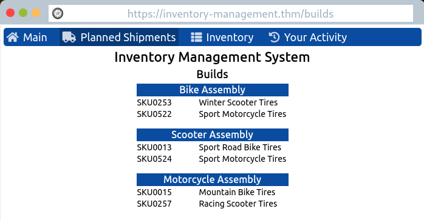
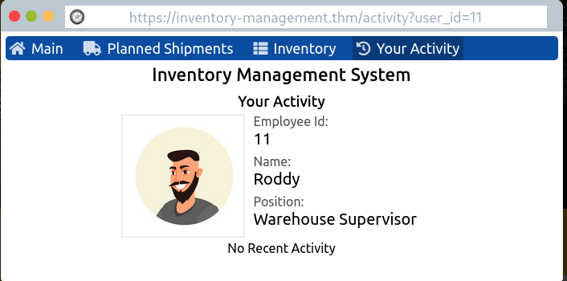
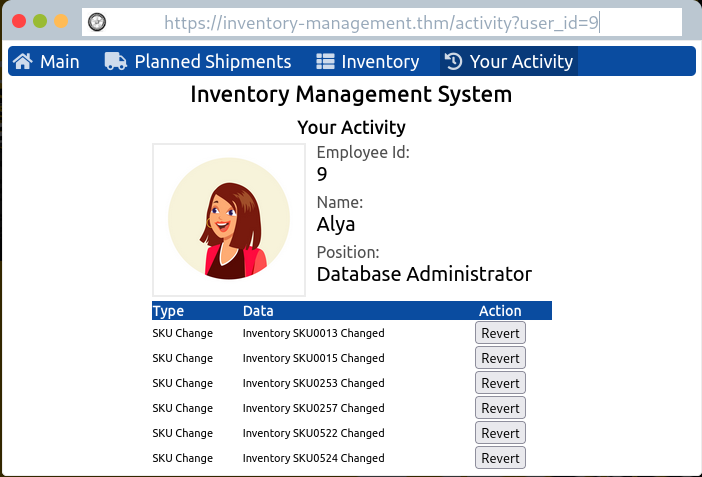

# Web Application Security

## Description

Learn about web applications and explore some of their common security issues.  
Categories: Walkthrough

### Introduction

Everyone uses different programs on our computers. Generally, programs that run on our computers use our computer's processing power and storage. But to use a program, we need to install it. What if we can use any program without installation?

A **web application** is a *"program"* that we can use without installation as long as we have a modern standard web browser. Consequently, instead of installing every program you need, you only need to browse the related page.

The idea of a **web application** is that it is a program running on a remote server. A **server** refers to a computer system running continuously to *"serve"* the client. In this case, the server will run a specific type of program that can be accessed by web browsers. Servers can sometimes use databases to store data. From the user's perspective, all the technical infrastructure is hidden, only elegant and user-friendly interfaces are shown.

### Web Application Security Risks

Here are some formal categories from OWASP (Open Web Application Security Project) Top 10.

1. **Identification and Authentication Failure**  
**Identification** refers to the ability to identify a user uniquely. **Authentication** refers to the ability to prove that the user is who they claim to be. For certain applications, the user must be identified and authenticated before they can use the system. However, this step is prone to different types of weaknesses such as brute force attacks, weak passwords, plain text storage, etc.

2. **Broken Access Control**  
**Access control** ensures that each user can only access files (documents, images, etc.) related to their role or work.

3. **Injection**  
An **injection** attack refers to a vulnerability in the web application where the user can insert malicious code as part of their input. One cause of this vulnerability is the lack of proper validation and sanitization of user's input.

4. **Cryptographic Failures**  
This category refers to the failures related to cryptography. **Cryptography** focuses on the processes of encryption and decryption of data.  
**Encryption** scrambles cleartext into ciphertext, which should be gibberish to anyone who doesn't have the secret key to decrypt it. In other words, encryption ensures that no one can read the data without knowing the secret key.  
**Decryption** converts ciphertext back into the original cleartext using the secret key.  
Examples of cryptographic failures include:
   * Sending sensitive data in cleartext
   * Relying on a weak cryptographic algorithm
   * Using default or weak keys

### Practical Example of Web Application Security

The task is about a vulnerable website that uses *Insecure Direct Object References* (IDOR). **IDOR** falls under the category of **Broken Access Control**.

The website that we are given is an inventory management system that manages shipments related to tires. According to the company, a competitor sent a group of malicious actors to sabotage our logistics. he attackers used the account of one of the employees and mixed up the planned shipments. If incorrect shipments are sent, production will be delayed.

Our objective is to undo the attackers' steps. First, let's check out the planned shipments.

Just as the company said, the planned shipments are scrambled. Let's check out our activities.

Of course we didn't do anything! We are not the attackers! (Duh!) Here we notice that the user ID is requested in the URL. Maybe we can change the user ID to see the activities of other users.

After going through many user IDs starting from 1, we found that most of the users didn't have any activities, except for one. The serial numbers of the inventories that were changed by this user also match those found in the planned shipments. We can conclude that user's account was compromised. Now we can undo the changes made by the attackers. And after that, a pop-up message shows up and gives us the flag.