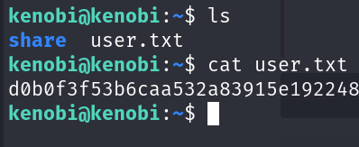

# Kenobi

## Description

Walkthrough on exploiting a Linux machine. Enumerate Samba for shares, manipulate a vulnerable version of proftpd and escalate your privileges with path variable manipulation.
* Category: Walkthrough

## Deploy the vulnerable machine

We are given the IP address of the machine. Let's start by scanning the machine with `nmap`.

The machine has 7 ports open: 21 (ProFTPD 1.3.5), 22 (OpenSSH 7.2p2), 80 (Apache httpd 2.4.18), 111 (rpcbind), 139 (Samba smbd 3.X - 4.X), 445 (Samba smbd 4.3.11), and 2049 (NFS).

## Enumerate Samba for shares

Now that we know the machine has Samba running, let's enumerate its shares with scripts from `nmap`.

There is a share named `anonymous` that we can access. Let's try to connect to it.

We can access the share and see a file named `log.txt`. Let's download it and see what's inside.

It is a log of a user named `kenobi` creating SSH keys and information about ProFTPD and Samba.

Our earlier scan showed that the machine has port 111 running `rpcbind`. Let's use scripts from `nmap` to enumerate it.

We can see that the machine has an NFS share named `/var`.

## Gain initial access with ProFTPD

Let's try to connect to the FTP server with netcat.

The FTP server is running ProFTPD 1.3.5. Let's try searching for known vulnerabilities with `searchsploit`.

We can see there are exploits from ProFTPD's mod_copy module. Let's use the exploit to copy the SSH private key of the user `kenobi`. We know from the log file that the key is located at `/home/kenobi/.ssh/id_rsa`. We also know that the `/var` directory is shared via NFS so it is our target directory.

We have successfully copied the SSH private key of the user `kenobi`. Time to mount the NFS share, get the key and login as `kenobi`.

We have successfully logged in as `kenobi`. Let's look around the machine.

We have found the user flag.

## Privilege Escalation with Path Variable Manipulation

We need to find a way to escalate our privileges. Let's start by finding files with the SUID bit set.

Among the files with the SUID bit set, we see `/usr/bin/menu` is kind of suspicious. Let's run it.

We can see that as we run the menu, we are given 3 types of actions to run. As we choose the first option `status check`, we can see that it is suspiciously familiar to the `curl` command. Let's try to manipulate the PATH variable to escalate our privileges.

Our idea is to create a script named `curl` that is actually going to run `/bin/bash`. The script will be in the `/tmp` directory and we will add `/tmp` to the PATH variable. When we run the menu and choose the first option, it will run our script instead of the actual `curl` command.

We have successfully escalated our privileges. Time to find the root flag.

We have found the root flag.