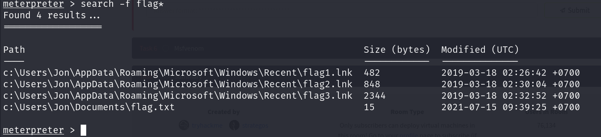

# Metasploit: Exploitation

## Description

Using Metasploit for scanning, vulnerability assessment and exploitation.
* Category: Walkthrough

## Scanning

### Port Scanning

Metasploit has a number of modules to scan open ports on the target system and network. We can list potential port scanning modules available using the `search portscan` command.

Port scanning modules will require us to set a few options:
* **CONCURRENCY**: Number of targets to be scanned simultaneously.
* **PORTS**: Port range to be scanned. Please note that 1-1000 here will not be the same as using Nmap with the default configuration. Nmap will scan the 1000 most used ports, while Metasploit will scan port numbers from 1 to 10000.
* **RHOSTS**: Target or target network to be scanned.
* **THREADS**: Number of threads that will be used simultaneously. More threads will result in faster scans.

As for information gathering, if our engagement requires a speedier approach to port scanning, Metasploit may not be our first choice. However, a number of modules make Metasploit a useful tool for the scanning phase.

### UDP service identification

The `scanner/discovery/udp_sweep` module will allow us to quickly identify services running over the UDP (User Datagram Protocol). This module will not conduct an extensive scan of all possible UDP services but does provide a quick way to identify services such as DNS or NetBIOS.

### SMB Scans

Metasploit offers several useful auxiliary modules that allow us to scan specific services. Especially useful in a corporate network would be `smb_enumshares` and `smb_version` but we should spend some time to identify scanners that the Metasploit version installed on our system offers.

When performing service scans, it would be important not to omit more "exotic" services such as NetBIOS. NetBIOS (Network Basic Input Output System), similar to SMB, allows computers to communicate over the network to share files or send files to printers.

The NetBIOS name of the target system can give us an idea about its role and even importance (e.g. CORP-DC, DEVOPS, SALES, etc.). We may also run across some shared files and folders that could be accessed either without a password or protected with a simple password.

Metasploit has many modules that can help us have a better understanding of the target system and possibly help us find vulnerabilities. It is always worth performing a quick search to see if there are any modules that could be helpful based on our target system.

## The Metasploit Database

Metasploit has a database function to simplify project management and avoid possible confusion when setting up parameter values.

We will first need to start the PostgreSQL database, which Metasploit will use with the following command: `systemctl start postgresql`.

Then we will need to initialize the Metasploit Database using the `msfdb init` command.

We can then launch `msfconsole` and check the database status using the `db_status` command.

The database feature will allow us to create workspaces to isolate different projects. When first launched, we should be in the default workspace. We can list available workspaces using the `workspace` command.

We can add a workspace using the `-a` parameter or delete a workspace using the `-d` parameter, respectively.

We can use the workspace command to navigate between workspaces simply by typing `workspace` followed by the desired workspace name.

We can use the `workspace -h` command to list available options for the workspace command.

Different from regular Metasploit usage, once Metasploit is launched with a database, the `help` command will show the Database Backends Commands menu.

If we run a Nmap scan using the `db_nmap`, all results will be saved to the database.

We can then reach information relevant to hosts and services running on target systems with the `hosts` and `services` commands, respectively.

The `hosts -h` and `services -h` commands can help us become more familiar with available options.

Once the host information is stored in the database, we can use the `hosts -R` command to add this value to the RHOSTS parameter.

## Vulnerability Scanning

Metasploit allows us to quickly identify some critical vulnerabilities that could be considered as "low hanging fruit". The term "low hanging fruit" usually refers to easily identifiable and exploitable vulnerabilities that could potentially allow us to gain a foothold on a system and, in some cases, gain high-level privileges such as root or administrator.

Finding vulnerabilities using Metasploit will rely heavily on our ability to scan and fingerprint the target. The better we are at these stages, the more options Metasploit may provide us.

## Exploitation

As the name suggests, Metasploit is an exploitation framework. Exploits are the most populated module category.

We can search exploits using the `search` command, obtain more information about the exploit using the `info` command, and launch the exploit using `exploit`. While the process itself is simple, a successful outcome depends on a thorough understanding of services running on the target system.

Most of the exploits will have a preset default payload. However, we can always use the `show payloads` command to list other commands we can use with that specific exploit. Once we have decided on the payload, we can use the `set payload` command to make our choice.

Choosing a working payload could become a trial and error process due to environmental or OS restrictions such as firewall rules, anti-virus, file writing, or the program performing the payload execution isn't available.

Some payloads will open new parameters that we may need to set, running the `show options` command once more can show these.

Once a session is opened, we can background it using `CTRL+Z` or abort it using `CTRL+C`. Backgrounding a session will be useful when working on more than one target simultaneously or on the same target with a different exploit and/or shell.

### Working with sessions

The `sessions` command will list all active sessions. The `sessions` command supports a number of options that will help us manage sessions better.

We can interact with any existing session using the `sessions -i` command followed by the session ID.

### Practical Example

First, we need to setup our workspace by initializing the database. Before we start, we need to ensure that the PostgreSQL database is running.

Now we initialize the database using the `msfdb init` command.

Next, we launch `msfconsole` and check the database status using the `db_status` command.

We can see that the database is connected and ready to use. We can now create a new workspace using the `workspace -a` command.

We can now start scanning the target system. We can use the `db_nmap` command to scan the target system and save the results to the database.

We can now list the hosts using the `hosts` command.

We can see that the host is saved in the database. Let's check the services running on the target system using the `services` command.

We can see that there are NetBIOS, SMB and RPC services running on the target system. Let's search for an SMB scanner module.

Let's use the EternalBlue scanner module to find out if the target system is vulnerable to the EternalBlue exploit. But before we do that, we need to set the `RHOSTS` parameter to the target system.

Time to run the scanner module.

The result says that the target is vulnerable to MS17-010. We can now search for an exploit module for MS17-010.

Let's use the `exploit/windows/smb/ms17_010_eternalblue` module to exploit the target system. Let's use `show options` to see the required parameters.

We need to set the `RHOSTS`, the `LHOST` and the `LPORT` parameters.

Now we can run the exploit.

We have successfully exploited the target system and have a Meterpreter session. Now let's search for the flag.

We found the location of the flag. Let's navigate to the location and read the flag.

We got the flag! Now let's try dumping credentials hashes from the target system.

And we have successfully dumped the credentials hashes from the target system.

## Msfvenom

Msfvenom, which replaced Msfpayload and Msfencode, allows us to generate payloads.

Msfvenom will allow us to access all payloads available in the Metasploit framework. Msfvenom allows us to create payloads in many different formats (PHP, exe, dll, elf, etc.) and for many different target systems (Apple, Windows, Android, Linux, etc.).

### Output formats

We can either generate stand-alone payloads (e.g. a Windows executable for Meterpreter) or get a usable raw format (e.g. python). The `msfvenom --list formats` command can be used to list supported output formats.

### Encoders

Contrary to some beliefs, encoders do not aim to bypass antivirus installed on the target system. As the name suggests, they encode the payload. While it can be effective against some antivirus software, using modern obfuscation techniques or learning methods to inject shellcode is a better solution to the problem.

### Handlers

Similar to exploits using a reverse shell, we will need to be able to accept incoming connections generated by the MSFvenom payload.

When using an exploit module, this part is automatically handled by the exploit module, we will remember how the payload options title appeared when setting a reverse shell. The term commonly used to receive a connection from a target is 'catching a shell'.

Reverse shells or Meterpreter callbacks generated in MSFvenom payload can be easily caught using a handler.

### Other Payloads

Based on the target system's configuration (operating system, install webserver, installed interpreter, etc.), msfvenom can be used to create payloads in almost all formats.

