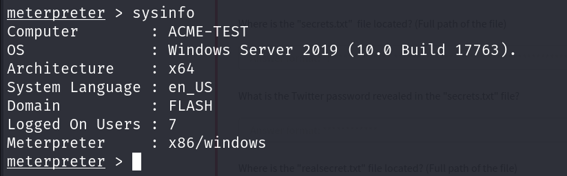

# Metasploit: Meterpreter

## Description

Take a deep dive into Meterpreter, and see how in-memory payloads can be used for post-exploitation.
* Category: Walkthrough

## Introduction to Meterpreter

Meterpreter is a Metasploit payload that supports the penetration testing process with many valuable components. Meterpreter will run on the target system and act as an agent within a command and control architecture. We will interact with the target operating system and files and use Meterpreter's specialized commands.

Meterpreter has many versions which will provide different functionalities based on the target system.

### How does Meterpreter work?

Meterpreter runs on the target system but is not installed on it. It runs in memory and does not write itself to the disk on the target. This feature aims to avoid being detected during antivirus scans.

By default, most antivirus software will scan new files on the disk. Meterpreter runs in memory to avoid having a file that has to be written to the disk on the target system. This way, Meterpreter will be seen as a process and not have a file on the target system.

Meterpreter also aims to avoid being detected by network-based IPS (Intrusion Prevention System) and IDS (Intrusion Detection System) solutions by using encrypted communication with the server where Metasploit runs. If the target organization does not decrypt and inspect encrypted traffic coming to and going out of the local network, IPS and IDS solutions will not be able to detect its activities.

While Meterpreter is recognized by major antivirus software, this feature provides some degree of stealth.

It is also worth noting that Meterpreter will establish an encrypted (TLS) communication channel with the attacker's system.

## Meterpreter Flavors

Metasploit payloads can be initially divided into two categories: inline (also called single) and staged.

Staged payloads are sent to the target in two steps. An initial part is installed and requests the rest of the payload. This allows for a smaller initial payload size.The inline payloads are sent in a single step.

Meterpreter payloads are also divided into stagged and inline versions. However, Meterpreter has a wide range of different versions we can choose from based on our target system.

The easiest way to have an idea about available Meterpreter versions could be to list them using `msfvenom -l payloads | grep meterpreter`.

The list will show Meterpreter versions available for the following platforms:
* Android
* Apple iOS
* Java
* Linux
* OSX
* PHP
* Python
* Windows

Our decision on which version of Meterpreter to use will be mostly based on three factors:
* The target operating system
* Components available on the target system
* Network connection types we can have with the target system

If we are not using Meterpreter as a standalone payload generated by Msfvenom, our choice may also be limited by the exploit. Some exploits will have a default Meterpreter payload.

We can also list other available payloads using the `show payloads` command with any module.

## Meterpreter Commands

Typing `help` on any Meterpreter session (shown by `meterpreter>` at the prompt) will list all available commands.

Every version of Meterpreter will have different command options, so running the help command is always a good idea. Commands are built-in tools available on Meterpreter. They will run on the target system without loading any additional script or executable files.

Meterpreter will provide us with three primary categories of tools:
* Built-in commands
* Meterpreter tools
* Meterpreter scripting

Meterpreter commands are listed under different categories:
* Core commands
* File system commands
* Networking commands
* System commands
* User interface commands
* Webcam commands
* Audio output commands
* Elevate commands
* Password database commands
* Timestomp commands

### Meterpreter Commands

Core commands will be helpful to navigate and interact with the target system. Below are some of the most commonly used.

Core commands:
* `background`: Backgrounds the current session
* `exit`: Terminate the Meterpreter session
* `guid`: Get the session GUID (Globally Unique Identifier)
* `help`: Displays the help menu
* `info`: Displays information about a Post module
* `irb`: Opens an interactive Ruby shell on the current session
* `load`: Load one or more Meterpreter extensions
* `migrate`: Allows us to migrate Meterpreter to another process
* `run`: Executes a Meterpreter script or Post module
* `sessions`: Quickly switch to another session

File system commands:
* `cd`: Will change directory
* `ls`: Will list files in current directory
* `pwd`: Prints the current working directory
* `edit`: Allows us to edit a file
* `cat`: Will display the contents of a file to the screen
* `rm`: Will delete the specified file
* `search`: Will search for files
* `upload`: Will upload a file or directory
* `download`: Will download a file or directory

Networking commands:
* `arp`: Display the host ARP (Address Resolution Protocol) cache
* `ifconfig`: Display network interfaces available on the target system
* `netstat`: Display the network connections
* `portfwd`: Forward a local port to a remote service
* `route`: Allows us to view and modify the routing table

System commands:
* `clearev`: Clears the event logs
* `execute`: Executes a command
* `getpid`: Shows the current process identifier
* `getuid`: Shows the user that Meterpreter is running as
* `kill`: Terminates a process
* `pkill`: Terminates a process by name
* `ps`: Lists running processes
* `reboot`: Reboots the remote computer
* `shell`: Drops into a system command shell
* `shutdown`: Shuts down the remote computer
* `sysinfo`: Gets information about the remote system

Other commands:
* `idletime`: Returns the number of seconds the remote user has been idle
* `keyscan_dump`: Dumps the keystrokes buffer
* `keyscan_start`: Starts capturing keystrokes
* `keyscan_stop`: Stops capturing keystrokes
* `screenshare`: Allows us to watch the remote user's desktop in real-time
* `screenshot`: Grabs a screenshot of the interactive desktop
* `record_mic`: Records audio from the default microphone for X seconds
* `webcam_chat`: Starts a video chat
* `webcam_list`: Lists webcams
* `webcam_snap`: Take a snapshot from the specified webcam
* `webcam_stream`: Plays a video stream from the specified webcam
* `getsystem`: Attempts to elevate our privileges to that of local system
* `hashdump`: Dumps the contents of the SAM database

Although all these commands may seem available under the help menu, they may not all work.

## Post-Exploitation Challenge

We are given a scenario where we have initially compromised a target system over SMB. As we already have the username and password, we can use the `exploit/windows/smb/psexec` module to run a Meterpreter session on the target system.

First, let's open the module and check the options.

As we can see, we need to set the `RHOSTS`, `SMBUser`, `SMBPass` and `LHOST` options. After setting these options, we can run the exploit.

After running the exploit, we have a Meterpreter session on the target system. We can now interact with the target system using Meterpreter commands.

Let's get the computer's name and domain with the `sysinfo` command.

Now let's look for some shares by running the `run post/windows/gather/enum_shares` command.

We found 3 shares on the target system. Among these shares, the `speedster` share is most likely to be created by a user.

Next, we need to dump some NTLM hashes. We can do this by running `hashdump`.

And we found the hash for `jchambers` user. Let's try to crack this hash with **CrackStation**.

And it is cracked! Nice advice for a password right there.

Now let's try to find a `secrets.txt` file on the target system. We can do this by running the `search -f secrets.txt` command.

We found the `secrets.txt` file and its location. Let's navigate to the directory and read the file.

And we found the secret Twitter password!

Next, we search for the `realsecret.txt` file.

All there is to do left is to read the file.

Wow! How surprising! Like we haven't known that already.