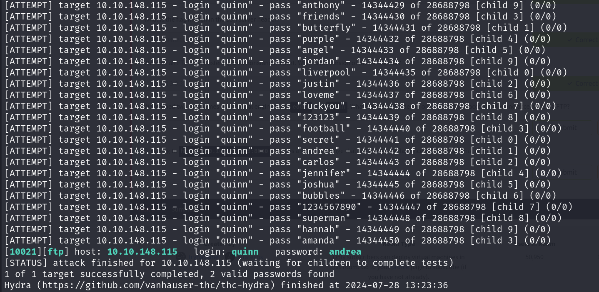

# Net Sec Challenge

## Description

Practice the skills you have learned in the Network Security module.
* Difficulty: **Medium**
* Category: **Reconnaissance**, **Network Protocol**, **IDS Evasion**, **Password Attack**

## Challenge

We are given an IP address. Let's start by scanning the target machine using Nmap.

We can see from the result that there are 6 ports open on the target machine. We can see that port 80 is open. Let's open the target machine's IP address in the browser.

Nothing interesting on the website. Let's check out the headers of the website.

We found a flag in the headers. Maybe there are more flags hidden in the headers of other services. Let's check the headers of SSH with `telnet`.

There is a flag here too. From the `nmap` scan, we know that port 10021 is open but we don't know what service is running on that port. Let's scan it with `nmap`.

The port is running an FTP service of version `vsftpd 3.0.3`. We are given 2 usernames `eddie` and `quinn`. Let's use `hydra` to brute force the password for the FTP service.

We got the password for both users. Let's login to the FTP service with the credentials of `eddie`.

There is nothing here. Let's check out the FTP service with the credentials of `quinn`.

There is a flag here. Let's download the flag and check the contents.

There is another service we haven't checked yet. Let's check out the HTTP service on port 8080.

Oops! Sounds like our last `nmap` scan triggered the Intrusion Detection System. We need to redo the scan in a way that doesn't trigger the IDS. After some experimentation, we found that one of the best ways to avoid triggering the IDS is to scan the target machine using Null Scan.

And we found the flag. We have successfully completed the challenge.