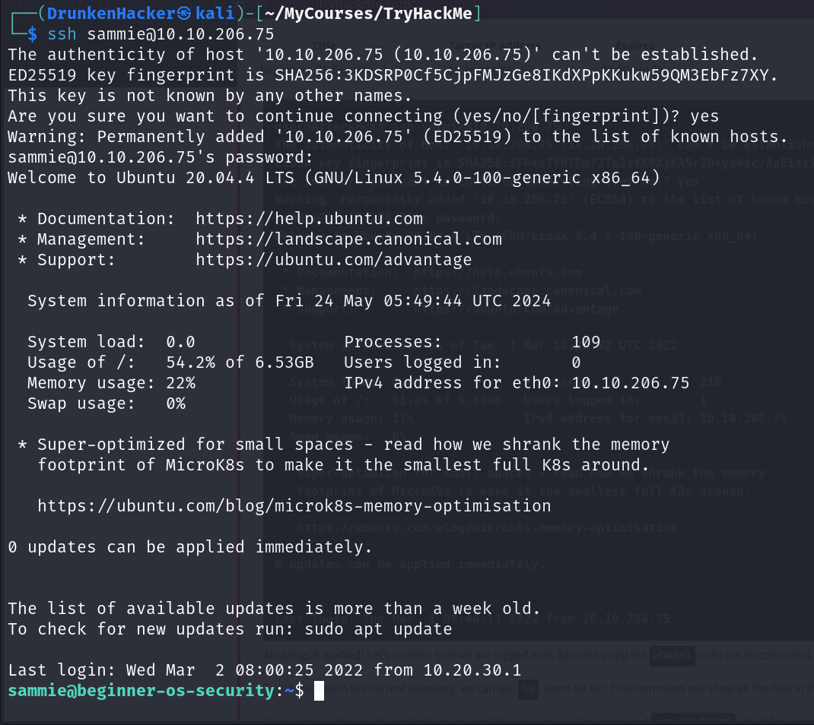
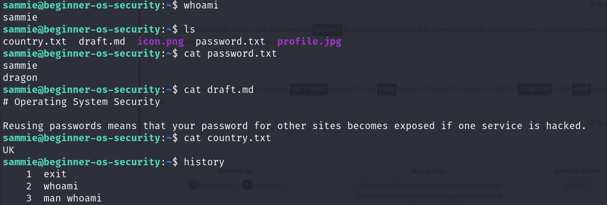
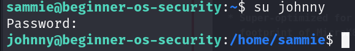
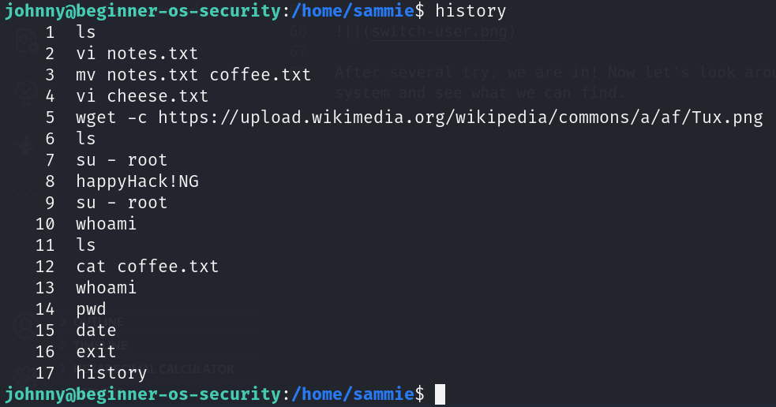
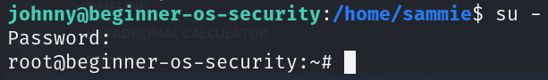

# Operating System Security

## Description

This room introduces to operating system security and demonstrates SSH authentication on Linux.  
* Categories: Walkthrough

### Introduction to Operating System Security

Every smartphone, laptop or any type of computer has an operating system. Operating systems include *MS Windows, MacOS, iOS, Android, Chrome OS* and *Linux*. But what is an operating system? To define it, we need to visit one computer term: hardware.

**Computer hardware** refers to all the computer parts and peripherals that you can touch. Hardware includes the screen, keyboard, printer, USB flash memory and the desktop board. The desktop board contains many components, in particular, a central processing unit (CPU) and memory chips (RAM). The desktop board is usually connected to a storage device (HDD or SSD).

The desktop board is the main part of the computer, all other pieces of hardware connect to it. However, the hardware components by themselves are useless so we need an operating system to control them.

The **Operating System** (OS) is the layer sitting in between the hardware and the applications and programs you are running. All the programs and applications cannot run directly on the computer hardware, they run on top of the operating system. The operating system allows the programs to access the hardware according to specific rules.

Typically, your devices store a lot of private data. Of course you don't want someone you don't trust to access your data. Therefore it is important to secure your devices and its operating system.

When we talk about security, we should think of protecting three things:
* **Confidentiality**: Ensuring that only authorized users can access the data.
* **Integrity**: Ensuring that the data is not altered by unauthorized users.
* **Availability**: Ensuring that the data is available when needed.

### Common Examples of OS Security

1. **Authentication and Weak Passwords**

**Authentication** is the act of verifying your identity, be it a local or a remote system. Authentication can be achieved via 3 main ways:
* **Something you know**: Passwords, PINs, etc.
* **Something you have**: Phone number
* **Something you are**: Fingerprint

Since passwords are the most common form of authentication, they are also the most attacked. Many users tend to use easy-to-guess passwords or the same password on many websites. Others rely on personal details such as date of birth or name of their pet, thinking it is easy to remember and unknown to attackers. However, attackers are aware of this tendency among users.

2. **Weak File Permissions**

Proper security dictates the principal of least privilege. Least privilege means that any file is accessible only by those who need to access it to get the work done.

Weak file permissions make it easy for the adversary to attack confidentiality and integrity. They can attack confidentiality as weak permissions allow them to access files they should not be able to access. They can attack integrity as they can modify files they should not be able to edit.

3. **Access to Malicious Programs**

**Trojan horses** give the attacker access to the system.

**Randomware** encrypts the user's files, making the files become gibberish without decryption. The attackers offer the user the ability to restore the files by giving them the decryption key if they pay a ransom.

### Practical Example of OS Security

In a typical attack, the attacker seeks to gain access to a remote system. This can be accomplished by tricking the target into running a malicious file or obtaining a username and password. After that they will try to escalate their privileges to gain more control over the system.

In this task, we can follow the instructions to gain access to a remote system via SSH. First, we found a sticky note with 2 words `sammie` and `dragon`. This could be a username and password. We also have the IP address of the target system. Let's try to connect to the target system using SSH.

We successfully connected to the target system. Let's look around the system and see what we can find.

We did not find anything interesting. Let's look at the `home` directory and see if there is any other user.

There are other users on the system. Let's try to switch to `johnny` user. Since we don't have the password, we can try to guess it. Let's use some of the common passwords and see if we can get any luck.

After several try, we are in! Now let's look around the system and see what we can find.

From the command history, we can see that the user has mistakenly type the password in the command to switch to `root`. Let's try this out.

We are now `root` user! And there is a flag in the `root` directory.