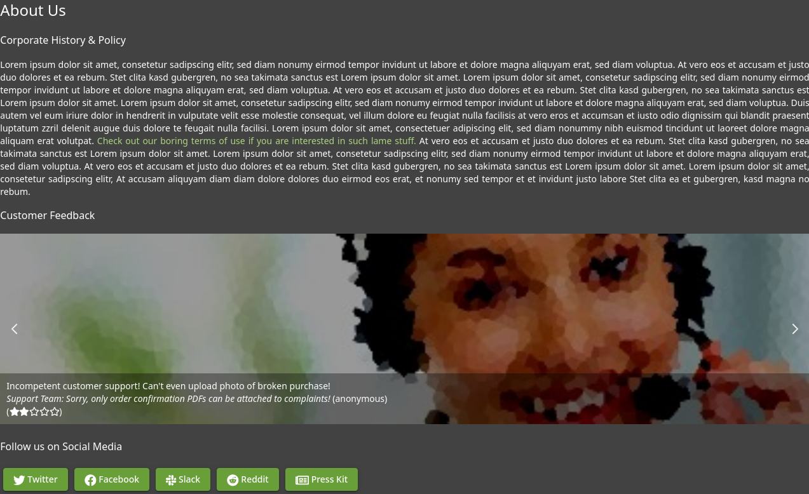
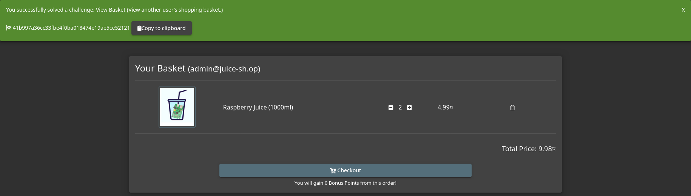

# OWASP Juice Shop

## Description

This room uses the Juice Shop vulnerable web application to learn how to identify and exploit common web application vulnerabilities.
* Category: Walkthrough

### Open for business!

Juice Shop is an intentionally insecure web application developed by OWASP for security training.

Some topics covered in this room include:
* Injection
* Broken Authentication
* Sensitive Data Exposure
* Broken Access Control
* Cross-Site Scripting (XSS)

### Let's go on an adventure!

    Question 1: What's the Administrator's email address?

The reviews show each user's email address. Which, by clicking on the Apple Juice product, shows us the Admin email!

    Question 2: What parameter is used for searching?

As we try searching for a product, we can see the parameter `q` is used for searching.

    Question 3: What show does Jim reference in his review?

First, we need to find Jim's review. We found one review by Jim on the Green Smoothie product.

He mentions something about a replicator. Let's search to see if we can find a show that has a replicator.

And we found the name of the show!

### Inject the juice

    Question 1: Log into the administrator account!

First, let's turn on the Burp Suite and intercept the login request.

Let's try SQL injection by adding `' OR 1=1--` to the email field.

And lucky for us, we are now logged in as the administrator!

    Question 2: Log into the Bender account!

Let's use the same trick as before, but this time we will use Bender's email address. The payload will be `bender@juice-sh.op' --`.

### Who broke my lock!?

    Question 1: Bruteforce the Administrator account's password!

We have intercepted the login request before, let's send the request to Intruder and brute force the password. We first need to set the payload position to the password field.

Then, we load the `best1050.txt` wordlist and start the attack. The only request that receives a 200 status code is the correct password.

    Question 2: Reset Jim's password!

To reset Jim's password, we first need to take a look at the reset password page.

As we enter Jim's email address, the security question asks for the name of Jim's eldest sibling's middle name. We know from the previous task that Jim has something to do with Star Trek. Let's search for `Jim Star Trek` and see if anything comes up.

The result gives us `James T. Kirk`. There is also a Wikipedia page about him. Let's look at it and see if we can find anything about his siblings.

There is a section about his family and we can see that he has one brother. Let's try this guy's middle name.

And we successfully reset Jim's password!

### AH! Don't look!

    Question 1: Access the Confidential Document!

Let's first look around to see if there is any place that can lead to confidential documents exposal. As we go to the About Us page, we see a link to see the Terms of Use.

Funny enough, the link is `<IP>/ftp/legal.md`. We can assume that there is an FTP service open to the public. Let's try to access it.

Not only there is legal documents here, there is also a lot of other interesting files! After downloading the documents, we got the flag as we return to the home page.

    Question 2: Log into MC SafeSearch's account!

We haven't seen MC SafeSearch's account yet. Let's try looking around to see if we can find it.

We found a comment by MC SafeSearch. His name is kind of weird. It can be a good idea to try to search for him for more information.

After searching for MC SafeSearch, we found [a video](https://www.youtube.com/watch?v=v59CX2DiX0Y) of him rapping about password. That was dope, dough! Anyway, he mentioned his password in the video. He also mentioned that he has replaced the letter `o` with the number `0`. Let's try to log in with his email and password.

And we are in!

    Question 3: Download the Backup file!

We have seen the FTP service before. Let's try to access it again and see if we can find the backup file.

There is a backup file `.bak`. However, the website does not allow us to download it. It says that only `.md` and `.pdf` files are allowed. Let's try to bypass this restriction with the Null Byte Poisoning technique. We can do this by adding `%00` to the end of the URL. However, this is not enough since the server is still checking the file extension. We need to add `.pdf` to the end of the URL as well.

We got a bad request error. This could be because we have not encoded the URL properly. Let's encode the `%` character to `%25` and try again.

And we successfully downloaded the backup file!

### Who's flying this thing?

    Question 1: Access the administration page!

We need to look around to see if there is any place that can lead to the administration page. Let's use the debug console to see if we can find anything.

We found a bunch of JavaScript files. Let's look at the `main-es2015.js` file and see if we can find anything related to the administration page.

There is one mention of the administration path. Let's try to access it. It seems like we keep getting redirected to the home page. This makes sense since we are not logged in as an administrator. Let's try to log in as the administrator and see if we can access the administration page.

And we are in!

    Question 2: View another user's shopping basket!

It is a good idea to first look at our own shopping basket. Note that after the last task, we are logged in as admin.

Let's turn on the Burp Suite proxy and intercept the request for the basket.

We can see that the basket ID is in the URL. Let's try to change the ID to another user's ID with Burp Suite and see if we can access their shopping basket.

And we successfully accessed another user's shopping basket!

    Question 3: Remove all 5-star reviews!

We have seen the reviews before when we accessed the administration page. Let's try to remove all 5-star reviews.

And we successfully removed all 5-star reviews!

### Where did that come from?

    Question 1: Perform a DOM XSS!

It is common practice that the search bar will send a request to the server in which it will then send back the related information. Without correct input sanitation, we are able to perform an XSS attack against the search bar.

With that in mind, let's try to perform a DOM XSS attack. We can do this by entering the following payload into the search bar: `<iframe src="javascript:alert('xss')">`.

We successfully performed a DOM XSS attack and got the flag!

    Question 2: Perform a persistent XSS!

First, let's try to find a place where we can perform a persistent XSS attack. We can try to leave a comment on a product.

Well that didn't work. Let's look somewhere else. After looking around with admin account, we found a Last Login IP page. Let's try to perform a persistent XSS attack here.

We suspect that as we log out, our IP address will be sent to the server and saved. If we can change the IP address to our XSS payload, we can perform a persistent XSS attack.

First, we need to turn on the Burp Suite proxy and intercept the logout request.

We received a 304 status code. This could be because that our IP address has been saved and still has not changed. Let's try to change it by adding a header to the request.

We can add the `True-Client-IP` header with the value of our XSS payload. This is similar to the `X-Forwarded-For` header. If there is no sanitization on the server side, we can perform our persistent XSS attack.

Now let's access the Last Login IP page and see if our XSS payload is executed.

We successfully performed a persistent XSS attack! And we got the flag!

    Question 3: Perform a reflected XSS!

Let's try to find a place where we can perform a reflected XSS attack.

As we look around, we found an order tracker page. There is a parameter for the order ID. Let's try to perform a reflected XSS attack by entering the following payload: ``<iframe src="javascript:alert(`xss`)">``.

We successfully performed a reflected XSS attack! And we got the flag!

### Exploration!

    Access the /#/score-board/ page

