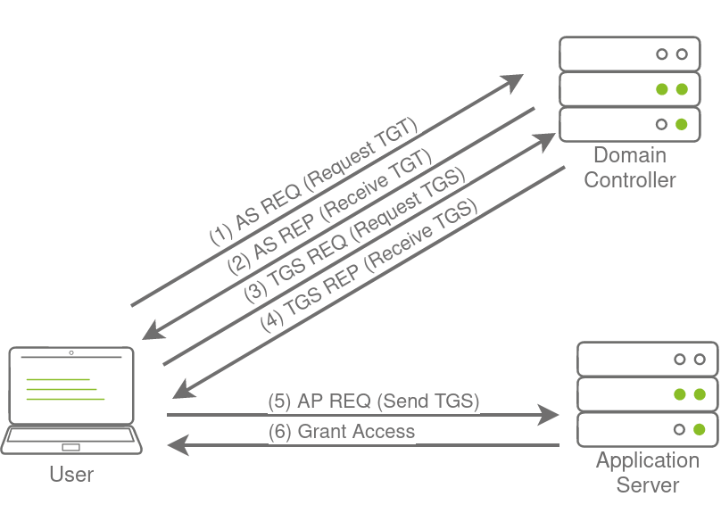

# Persisting Active Directory

## Description

Learn about common Active Directory persistence techniques that can be used post-compromise to ensure the blue team will not be able to kick you out during a red team exercise.
* Category: Walkthrough

## Introduction

During our attack against AD, we need to make sure that we deploy persistence. This will ensure that the blue team can't kick us out by simply rotating some credentials.

As mentioned before, the process of compromising AD is cyclic. We would deploy persistence as we compromise the AD estate and not just at the very end. This ensures that if one of our positions gets burnt by the blue team, we have several fallbacks.

In this persistence phase, we will use several techniques that can ensure our gained access cannot simply be revoked. These persistence techniques are dependent on the specific permissions and privileges we have acquired thus far.

## Persistence through Credentials

The first and least reliable persistence technique that we will discuss is credentials. Several of the lateral techniques discussed in previous rooms would have resulted in the attacker gaining access to credentials.

When using the word credentials, it can mean a username and password pair, but in the context of AD, even the password hash is sufficient for authentication through pass-the-hash techniques.

### DC Sync

It is not sufficient to have a single domain controller per domain in large organisations. These domains are often used in multiple regional locations, and having a single DC would significantly delay any authentication services in AD. As such, these organisations make use of multiple DCs. The question then becomes, how is it possible for us to authenticate using the same credentials in two different offices?

The answer to that question is domain replication. Each domain controller runs a process called the **Knowledge Consistency Checker (KCC)**. The KCC generates a replication topology for the AD forest and automatically connects to other domain controllers through **Remote Procedure Calls (RPC)** to synchronise information. This includes updated information such as the user's new password and new objects such as when a new user is created. This is why we usually have to wait a couple of minutes before we authenticate after we have changed our password since the DC where the password change occurred could perhaps not be the same one as the one where we are authenticating to.

The process of replication is called DC Synchronisation. It is not just the DCs that can initiate replication. Accounts such as those belonging to the Domain Admins groups can also do it for legitimate purposes such as creating a new domain controller.

A popular attack to perform is a DC Sync attack. If we have access to an account that has domain replication permissions, we can stage a DC Sync attack to harvest credentials from a DC.

### Not All Credentials Are Created Equal

Before starting our DC Sync attack, let's first discuss what credentials we could potentially hunt for. While we should always look to dump privileged credentials such as those that are members of the Domain Admins group, these are also the credentials that will be rotated (a blue team term meaning to reset the account's password) first. As such, if we only have privileged credentials, it is safe to say as soon as the blue team discovers us, they will rotate those accounts, and we can potentially lose our access.

The goal then is to persist with near-privileged credentials. We don't always need the full keys to the kingdom; we just need enough keys to ensure we can still achieve goal execution and always make the blue team look over their shoulder. As such, we should attempt to persist through credentials such as the following:
* **Credentials that have local administrator rights on several machines:** Usually, organisations have a group or two with local admin rights on almost all computers. These groups are typically divided into one for workstations and one for servers. By harvesting the credentials of members of these groups, we would still have access to most of the computers in the estate.
* **Service accounts that have delegation permissions:** With these accounts, we would be able to force golden and silver tickets to perform Kerberos delegation attacks.
* **Accounts used for privileged AD services:** If we compromise accounts of privileged services such as Exchange, Windows Server Update Services (WSUS), or System Center Configuration Manager (SCCM), we could leverage AD exploitation to once again gain a privileged foothold.

When it comes to what credentials to dump and persist through, it is subject to many things. We will have to get creative in our thinking and take it on a case-by-case basis. However, for this room, we are going to have some fun, make the blue team sweat, and dump every single credential we can get our hands on!

## Persistence through Tickets

As discussed in the previous tasks, we often want to persist through service accounts with delegation permissions to forge silver and golden tickets. But what are those exactly, and why does every blue team tabletop exercise end with someone shouting: ***"Flush all golden and silver tickets!"***.

### Tickets to the Chocolate Factory

Before getting into golden and silver tickets, we first just need to do a quick recap on Kerberos authentication. The diagram below shows the normal flow for Kerberos authentication:

The user makes an *AS-REQ* to the **Key Distribution Centre (KDC)** on the DC that includes a timestamp encrypted with the *user's NTLM hash*. Essentially, this is the request for a *Ticket Granting Ticket (TGT)*. The DC checks the information and sends the TGT to the user. This TGT is signed with the **KRBTGT** account's password hash that is only stored on the DC. The user can now send this TGT to the DC to request a *Ticket Granting Service (TGS)* for the resource that the user wants to access. If the TGT checks out, the DC responds to the TGS that is encrypted with the *NTLM hash of the service* that the user is requesting access for. The user then presents this TGS to the service for access, which can verify the TGS since it knows its own hash and can grant the user access.

### Golden Tickets

Golden Tickets are forged TGTs. What this means is we bypass steps 1 and 2 of the diagram above, where we prove to the DC who we are. Having a valid TGT of a privileged account, we can now request a TGS for almost any service we want. In order to forge a golden ticket, we need the **KRBTGT** account's password hash so that we can sign a TGT for any user account we want. Some interesting notes about Golden Tickets:
* By injecting at this stage of the Kerberos process, we don't need the password hash of the account we want to impersonate since we bypass that step. The TGT is only used to prove that the KDC on a DC signed it. Since it was signed by the KRBTGT hash, this verification passes and the TGT is declared valid no matter its contents.
* Speaking of contents, the KDC will only validate the user account specified in the TGT if it is older than 20 minutes. This means we can put a disabled, deleted, or non-existent account in the TGT, and it will be valid as long as we ensure the timestamp is not older than 20 minutes.
* Since the policies and rules for tickets are set in the TGT itself, we could overwrite the values pushed by the KDC, such as, for example, that tickets should only be valid for 10 hours. We could, for instance, ensure that our TGT is valid for 10 years, granting us persistence.
* By default, the KRBTGT account's password never changes, meaning once we have it, unless it is manually rotated, we have persistent access by generating TGTs forever.
* The blue team would have to rotate the KRBTGT account's password twice, since the current and previous passwords are kept valid for the account. This is to ensure that accidental rotation of the password does not impact services.
* Rotating the KRBTGT account's password is an incredibly painful process for the blue team since it will cause a significant amount of services in the environment to stop working. They think they have a valid TGT, sometimes for the next couple of hours, but that TGT is no longer valid. Not all services are smart enough to release the TGT is no longer valid (since the timestamp is still valid) and thus won't auto-request a new TGT.
* Golden tickets would even allow us to bypass smart card authentication, since the smart card is verified by the DC before it creates the TGT.
* We can generate a golden ticket on any machine, even one that is not domain-joined (such as our own attack machine), making it harder for the blue team to detect.

Apart from the KRBTGT account's password hash, we only need the domain name, domain SID, and user ID for the person we want to impersonate. If we are in a position where we can recover the KRBTGT account's password hash, we would already be in a position where we can recover the other pieces of the required information.

### Silver Tickets

Silver Tickets are forged TGS tickets. So now, we skip all communication (Step 1-4 in the diagram above) we would have had with the KDC on the DC and just interface with the service we want access to directly. Some interesting notes about Silver Tickets:
* The generated TGS is signed by the machine account of the host we are targeting.
* The main difference between Golden and Silver Tickets is the number of privileges we acquire. If we have the KRBTGT account's password hash, we can get access to everything. With a Silver Ticket, since we only have access to the password hash of the machine account of the server we are attacking, we can only impersonate users on that host itself. The Silver Ticket's scope is limited to whatever service is targeted on the specific server.
* Since the TGS is forged, there is no associated TGT, meaning the DC was never contacted. This makes the attack incredibly dangerous since the only available logs would be on the targeted server. So while the scope is more limited, it is significantly harder for the blue team to detect.
* Since permissions are determined through SIDs, we can again create a non-existing user for our silver ticket, as long as we ensure the ticket has the relevant SIDs that would place the user in the host's local administrators group.
* The machine account's password is usually rotated every 30 days, which would not be good for persistence. However, we could leverage the access our TGS provides to gain access to the host's registry and alter the parameter that is responsible for the password rotation of the machine account. Thereby ensuring the machine account remains static and granting us persistence on the machine.
* While only having access to a single host might seem like a significant downgrade, machine accounts can be used as normal AD accounts, allowing us not only administrative access to the host but also the means to continue enumerating and exploiting AD as we would with an AD user account.

## Persistence through Certificates

***A quick note here. The techniques discussed from this point forward are incredibly invasive and hard to remove. Even if we have signoff on our red team exercise to perform these techniques, we must take the utmost caution when performing these techniques. In real-world scenarios, the exploitation of most of these techniques would result in a full domain rebuild. Make sure we fully understand the consequences of using these techniques and only perform them if we have prior approval on our assessment and they are deemed necessary. In most cases, a red team exercise would be dechained at this point instead of using these techniques. Meaning we would most likely not perform these persistence techniques but rather simulate them.***

The last two persistence techniques relied on credentials. While we can definitely make the blue team's lives complicated, they can ultimately rotate enough credentials to kick us out. So while these techniques are great to keep the blue team busy while we keep them busy, we should look to use persistence techniques that are credential agnostic, meaning the rotation of these will not kick us out. The first of these we will be looking at is certificates.

### The Return of AD CS

In the Exploiting AD room, we leveraged certificates to become Domain Admins. However, certificates can also be used for persistence. All we need is a valid certificate that can be used for Client Authentication. This will allow us to use the certificate to request a TGT.

The beauty of this? We can continue requesting TGTs no matter how many rotations they do on the account we are attacking. The only way we can be kicked out is if they revoke the certificate we generated or if it expires. Meaning we probably have persistent access by default for roughly the next 5 years.

Depending on our access, we can take it another step further. We could simply steal the private key of the root CA's certificate to generate our own certificates whenever we feel like it. Even worse, since these certificates were never issued by the CA, the blue team has no ability to revoke them. This would be even worse for the blue team since it would mean a rotation of the CA, meaning all issued certificates would have to be revoked by the blue team to kick us out. Imagine we've just spent the last two days performing a domain takeback by rotating the credentials of every single privileges account, resetting all the golden and silver tickets, just to realise the attackers persisted by becoming our CA. Yikes!

### Extracting the Private Key

The private key of the CA is stored on the CA server itself. If the private key is not protected through hardware-based protection methods such as an Hardware Security Module (HSM), which is often the case for organisations that just use Active Directory Certificate Services (AD CS) for internal purposes, it is protected by the machine Data Protection API (DPAPI).

This means we can use tools such as Mimikatz and SharpDPAPI to extract the CA certificate and thus the private key from the CA. Mimikatz is the simplest tool to use.

### Generating our own Certificates

Now that we have the private key and root CA certificate, we can use the SpectorOps ForgeCert tool to forge a Client Authenticate certificate for any user we want. We can use Rubeus to request a TGT using the certificate to verify that the certificate is trusted.

### We Are No Longer Friends With the Blue Team

Certificate persistence is significantly harder to defend against. Even if we rotate the credentials of the compromised account, the certificate will still be valid. The only way to remove the persistence is to issue a revocation of the certificate. However, this would only be possible if we generated the certificate through legitimate channels. Since we exported the CA and generated the certificate ourselves, it does not appear on AD CS's list of issued certificates, meaning the blue team will not be able to revoke our certificate.

So what's the only solution to remove the persistence? Well, this is why we are no longer friends. They will have to revoke the root CA certificate. But revoking this certificate means that all certificates issued by AD CS would all of a sudden be invalid. Meaning they will have to generate a new certificate for every system that uses AD CS. We should start to see why this type of persistence is incredibly dangerous and would require full rebuilds of systems if performed.

## Persistence through SID History

The Security IDentifiers (SIDs) have been discussed before. But for a recap, SIDs are used to track the security principal and the account's access when connecting to resources. There is, however, an interesting attribute on accounts called the SID history.

The legitimate use case of SID history is to enable access for an account to effectively be cloned to another. This becomes useful when an organisation is busy performing an AD migration as it allows users to retain access to the original domain while they are being migrated to the new one. In the new domain, the user would have a new SID, but we can add the user's existing SID in the SID history, which will still allow them to access resources in the previous domain using their new account. While SID history is good for migrations, we, as attackers, can also abuse this feature for persistence.

### History Can Be Whatever We Want It To Be

The thing is, SID history is not restricted to only including SIDs from other domains. With the right permissions, we can just add a SID of our current domain to the SID history of an account we control. Some interesting notes about this persistence technique:
* We normally require Domain Admin privileges or the equivalent thereof to perform this attack.
* When the account creates a logon event, the SIDs associated with the account are added to the user's token, which then determines the privileges associated with the account. This includes group SIDs.
* We can take this attack a step further if we inject the Enterprise Admin SID since this would elevate the account's privileges to effective be Domain Admin in all domains in the forest.
* Since the SIDs are added to the user's token, privileges would be respected even if the account is not a member of the actual group. Making this a very sneaky method of persistence. We have all the permissions we need to compromise the entire domain (perhaps the entire forest), but our account can simply be a normal user account with membership only to the Domain Users group. We can up the sneakiness to another level by always using this account to alter the SID history of another account, so the initial persistence vector is not as easily discovered and remedied.

We could use something like Mimikatz to add SID history. However, the latest version of Mimikatz has a flaw that does not allow it to patch LSASS to update SID history. Hence we need to use something else. We can use the **DSInternals** tools to directly patch the `ntds.dit` file, the AD database where all information is stored.

The NTDS database is locked when the NTDS service is running. In order to patch our SID history, we must first stop the service. We must restart the NTDS service after the patch, otherwise, authentication for the entire network will not work anymore.

### Pitchforks and Torches from the Blue Team

If we were to RDP into one of the hosts and use the AD Users and Groups snap-in, we would be able to view the SID history attribute added to our user. However, even with the highest possible privileges, we would not be able to remove the attribute since it is protected. In order to remove this, we would have to use tools such as the AD-RSAT PowerShell cmdlets to remove SID history.

However, before we can even think about removing malicious SID history attributes, we first need to find them. None of the regular tools will tell us that something is wrong. That user will not all of a sudden pop up as a member of the Domain Admins group. So unless we are actively filtering through the attributes of our users, this is incredibly hard to find. This is because the SID history is only applied and used once the user authenticates.

Imagine that we are the blue team dealing with an incident where we have just performed a domain takeback. We rotated the **krbtgt** account's password twice, removed golden and silver tickets, and rebuilt our entire CA server from scratch, just to see that the attacker is still performing DA commands with a low-privileged account. This would not be a great day.

## Persistence through Group Membership

If we don't want to tamper with SID histories, we can just add ourselves directly to AD groups for persistence. While SID history is a great persistence technique, credential rotation and cleanup can still remove our persistence. In certain cases, it may be better to perform persistence by targeting the AD groups themselves.

As discussed previously, the most privileged account, or group, is not always the best to use for persistence. Privileged groups are monitored more closely for changes than others. Any group that classifies as a protected group, such as Domain Admins or Enterprise Admins, receive additional security scrutiny. So if we want to persist through group membership, we may need to get creative regarding the groups we add our own accounts to for persistence:
* The IT Support group can be used to gain privileges such as force changing user passwords. Although, in most cases, we won't be able to reset the passwords of privileged users, having the ability to reset even low-privileged users can allow us to spread to workstations.
* Groups that provide local administrator rights are often not monitored as closely as protected groups. With local administrator rights to the correct hosts through group membership of a network support group, we may have good persistence that can be used to compromise the domain again.
* It is not always about direct privileges. Sometimes groups with indirect privileges, such as ownership over Group Policy Objects (GPOs), can be just as good for persistence.

### Nested Groups

In most organisations, there are a significant amount of recursive groups. A recursive group is a group that is a member of another group. We can think of this as group nesting.

Group nesting is used to create a more organised structure in AD. Take the IT Support group, for example. IT Support is very generic. So perhaps there are subgroups like Helpdesk, Access Card Managers, and Network Managers underneath this group. We can add all of these groups as members to the IT Support group, which gives all users in these subgroups the permissions and privileges associated with the IT Support group, but we can then assign more granular permissions and privileges for each of the subgroups.

While group nesting helps to organise AD, it does reduce the visibility of effective access. Take our IT Support example again. If we query AD for membership of the IT Support group, it would respond with a count of three. However, this count is not really true since it is three groups. To get an idea for effective access, we would now have to enumerate those subgroups as well. But those subgroups can also have subgroups. So the question becomes: ***"How many layers deep should we enumerate to get the real effective access number?"***

This also becomes a monitoring problem. Let's say, for instance, we have an alert that fires off when a new member is added to the Domain Admins group. That is a good alert to have, but it won't fire off if a user is added to a subgroup within the Domain Admins group. This is a very common problem since AD is managed by the AD team, and alerting and monitoring are managed by the InfoSec team. All we need is a little bit of miscommunication, and the alert is no longer valid since subgroups are used.

As an attacker, we can leverage this reduced visibility to perform persistence. Instead of targeting the privileged groups that would provide us with access to the environment, we focus our attention on the subgroups instead. Rather than adding ourselves to a privileged group that would raise an alert, we add ourselves to a subgroup that is not being monitored.

### Annoying More Than Just the Blue Team

If this was a real organisation, we would not be creating new groups to nest. Instead, we would make use of the existing groups to perform nesting. However, this is something we would never do on a normal red team assessment and almost always dechain at this point since it breaks the organisation's AD structure, and if we sufficiently break it, they would not be able to recover. At this point, even if the blue team was able to kick us out, the organisation would more than likely still have to rebuild their entire AD structure from scratch, resulting in significant damages.

## Persistence through ACLs

Sometimes, we need more than just persisting to normal AD groups. What if we want to persist to all protected groups simultaneously?

### Persisting through AD Group Templates

While we can just add an account we control to every single privileged group we can find, the blue team would still be able to perform cleanup and remove our membership. In order to ensure a bit better persistence and make the blue team scratch their heads, we should rather inject into the templates that generate the default groups. By injecting into these templates, even if they remove our membership, we just need to wait until the template refreshes, and we will once again be granted membership.

One such template is the AdminSDHolder container. This container exists in every AD domain, and its Access Control List (ACL) is used as a template to copy permissions to all protected groups. Protected groups include privileged groups such as Domain Admins, Administrators, Enterprise Admins, and Schema Admins.

A process called SDProp takes the ACL of the AdminSDHolder container and applies it to all protected groups every 60 minutes. We can thus write an ACE that will grant us full permissions on all protected groups. If the blue team is not aware that this type of persistence is being used, it will be quite frustrating. Every time they remove the inappropriate permission on the protected object or group, it reappears within the hour. Since this reconstruction occurs through normal AD processes, it would also not show any alert to the blue team, making it harder to pinpoint the source of the persistence.

### It Is Going Downhill For The Blue Team

Imagine combining this with the nesting groups of the previous task. Just as the blue team finished revoking our access through numerous group changes, 60 minutes later, we can just do it all again. Unless the blue team understands that the permissions are being altered through the AdminSDHolder group, they would be scratching their heads every 60 minutes.

Since the persistence propagates through a legitimate AD service, they would most likely be none the wiser every time it happens. If we really want to persist, we can grant full control to the Domain Users group in the AdminSDHolder group, which means any low-privileged user would be granted full control over all Protected Groups. Combining this with a full DC Sync means the blue team will have to reset every single credential in the domain to flush us out completely.

## Persistence through GPOs

The last persistence technique we will review is persistence through Group Policy Objects (GPOs). At this point, we should be familiar with GPOs based on all the different enumeration, attack, and exploitation techniques we have discussed. However, GPOs are also excellent for deploying persistence.

Group Policy Management in AD provides a central mechanism to manage the local policy configuration of all domain-joined machines. This includes configuration such as membership to restricted groups, firewall and AV configuration, and which scripts should be executed upon startup. While this is an excellent tool for management, it can be targeted by attackers to deploy persistence across the entire estate. What is even worse is that the attacker can often hide the GPO in such a way that it becomes almost impossible to remove it.

### Domain Wide Persistence

The following are some common GPO persistence techniques:
* Restricted Group Membership - This could allow us administrative access to all hosts in the domain
* Logon Script Deployment - This will ensure that we get a shell callback every time a user authenticates to a host in the domain.

There are many different hooks that can be deployed. We can play around with GPOs to learn about other hooks. Since we already used the first hook, Restricted Group Membership, in the Exploiting AD room. Let's now focus on the second hook.

While having access to all hosts are nice, it can be even better by ensuring we get access to them when administrators are actively working on them. To do this, we will create a GPO that is linked to the Admins OU, which will allow us to get a shell on a host every time one of them authenticates to a host.

By default, all authenticated Users must have the ability to read the policy. This is required because otherwise, the policy could not be read by the user's account when they authenticate to apply User policies. If we did not have our logon script, we could also remove this permission to make sure that almost no one would be able to read our Policy.

We could replace Authenticated Users with Domain Computers to ensure that computers can still read and apply the policy, but prevent any user from reading the policy. Let's do this to test, but remember this can result in us not getting a shell callback upon authentication since the user will not be able to read the PowerShell script, so make sure to test our shell before performing these steps. There is no going back after this!

By performing these steps, we can ensure that even with the highest level of permissions, the blue team would not be able to remove our GPO unless they impersonated the machine account of a Domain Controller. This makes it extra hard to firstly discover, and even if they discover the GPO, it would be incredibly hard to remove. We don't even have the required permissions to interface with our policy anymore, so one will have to stay there until a network reset is performed.

## Conclusion

There are several different ways that we can persist in AD. Some of these techniques persist better than others. In order to ensure that our persistence cannot be removed by the blue team, we will have to think creatively about our persistence. Furthermore, we should not wait until the full domain compromise to deploy persistence. After each round of lateral movement and privilege escalation, persistence should be deployed.

### Additional Persistence Techniques

In this network, we covered several techniques that can be used to persist in AD. This is by no means an exhaustive list. Here is a list of persistence techniques that also deserve mention:
* Skeleton keys - Using Mimikatz, we can deploy a skeleton key. Mimikatz created a default password that will work for any account in the domain. Normal passwords will still work, making it hard to know that this attack has taken place. This default password can be used to impersonate any account in the domain.
* Directory Service Restore Mode (DSRM) - Domain controllers have an internal break glass administrator account called the DSRM account. This password is set when the server is promoted to a DC and is seldom changed. This password is used in cases of emergencies to recover the DC. An attacker can extract this password using Mimikatz and use this password to gain persistent administrative access to domain controllers in the environment.
* Malicious Security Support Provider (SSP) - Exploiting the SSP interface, it is possible to add new SSPs. We can add Mimikatz's mimilib as an SSP that would log all credentials of authentication attempts to a file. We can specify a network location for logging, which would allow mimilib to send us credentials as users authenticate to the compromised host, providing persistence.
* Computer Accounts - The passwords for machine accounts are normally rotated every 30 days. However, we can alter the password of a machine account which would stop the automatic rotation. Together with this, we can grant the machine account administrative access to other machines. This will allow us to use the computer account as a normal account, with the only sign of the persistence being the fact that the account has administrative rights over other hosts, which is often normal behaviour in AD, so that it may go undetected.

We should also note that this room focussed on persistence techniques in AD. Several local persistence techniques can also allow for persistence on hosts. If these hosts are domain joined, it will allow for persistence in AD as well.

### Mitigations

AD persistence can be a pain to defend against. In certain cases, the persistence can be so deeply rooted that a complete domain rebuild is required. However, there are a couple of things that we can do to detect deployed persistence:
* Anomalous account logon events are the most common alert for persistence. Any time credentials break the tiering model, it can be as a result of persistence.
* For each of the persistence techniques mentioned, specific detection rules can be written, such as cases when a machine account's password changes, ACLs are permissively updated, or new GPOs are created.
* The best defence against persistence is to protect privileged resources. Although low privileged access can be used to deploy persistence, the truly scary techniques only become available once an attacker has acquired privileged access to the domain.

This concludes the AD module. We have learned about the basics of AD, how to breach an AD environment, enumerate it, perform exploitation, and deeply root ourselves in with persistence. This module is just an introduction. There is still a lot to learn about AD security. Time to spread our wings and do some of our own exploration!