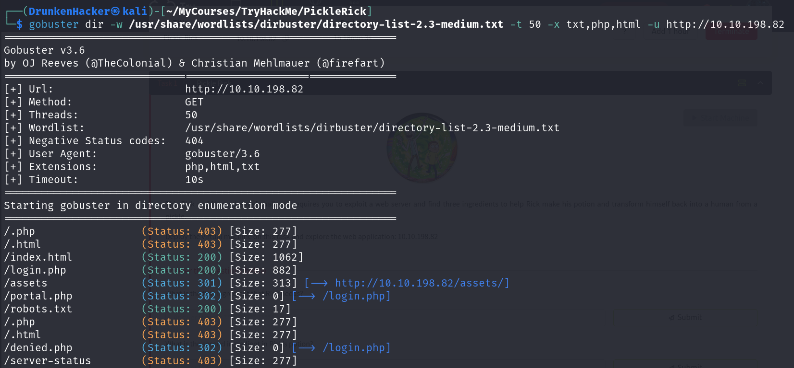

# Pickle Rick

## Description

A Rick and Morty CTF. Help turn Rick back into a human!
* Difficulty: **Easy**
* Categories: **Web Exploitation**, **Privilege Escalation**

## Writeup

Our goal is to find the three ingredients to make the potion to turn Rick back into a human. To do that, we need to exploit a web server. As we are given the IP, let's use `nmap` to scan the server and see what is on it.

There is an SSH service running on port 22 and a website on port 80. Next stop: the website. Let's open the website in our browser.

Great! Typical Rick! Every time he calls us, he's in panic mode, burping all the way and of course he doesn't remember his password. Looks like we are on our own to save this old man. Let's start by checking the page source.

Classic username from Rick. Now we know his username is `R1ckRul3s`. But this is not enough. We need to look around more. Oh by the way, not cool Rick! Not cool! Enough talking, let's use `gobuster` to find hidden directories.

We found a login page, a `portal.php` page that redirects us to the login page which means we may need to login to access the portal. There is also 2 text files that are interesting: `clue.txt` and `robots.txt`. Let's check out the `clue.txt` file first.

This is a message from Rick. He say we need to look around the file system for the ingredients. Let's check out the `robots.txt` file.

What is this? Some kind of weird text. But what can we say? Rick is a weird guy. This could be the password. It's time we head to the login page.

We have the username, we have the password. Let's login.

And we are at the portal. Let's look around to see if there is any ingredient.

Nothing much here. Let's back to the portal. There is a command panel there. Let's try to run some commands.

Seems like we can run commands as if we are in the server. Let's try to list the files in the current directory.

There is a `Sup3rS3cretPickl3Ingred.txt` file. Let's read it with the `cat` command.

The command is not allowed. We need to find another way. Let's be sneaky and try to read the file with `base64`.
Our command will be `base64 Sup3rS3cretPickl3Ingred.txt | base64 -d`.

We got the first ingredient! Let's find the other two. According to the `clue.txt` file, we need to look around the file system.

We can see that in the `/home` directory, there are 2 users: `rick` and `ubuntu`. Let's check out the `rick` directory.

There is a `second ingredients` file. Let's read it.

Two down, one more to go! This is getting tough! We cannot find anything interesting. The last one could be well hidden in the `/root` directory. But we need more than just `www-data` privilege to access it. We have to do some privilege escalation. Let's check out our current privilege with `sudo -l`.

Jesus Christ! We can run any command as `root` without a password! Time to look into the `/root` directory.

There is a `3rd.txt` file. Let's read it.

And we got the last ingredient! We have all the ingredients to make the potion. Time to save Rick!