# Relevant

## Description

Penetration testing challenge.
* **Difficulty**: *Medium*
* **Categories**: SMB Exploitation, EternalBlue

## Pre-engagement Briefing

We have been assigned to a client that wants a penetration test conducted on an environment due to be released to production in seven days.

### Scope of Work

The client requests that an engineer conducts an assessment of the provided virtual environment. The client has asked that minimal information be provided about the assessment, wanting the engagement conducted from the eyes of a malicious actor (black box penetration test). The client has asked that us secure two flags (no location provided) as proof of exploitation:
* `User.txt`
* `Root.txt`

Additionally, the client has provided the following scope allowances:
* Any tools or techniques are permitted in this engagement, however we are asked to attempt manual exploitation first
* Locate and note all vulnerabilities found
* Submit the flags discovered to the dashboard
* Only the IP address assigned to our machine is in scope
* Find and report ALL vulnerabilities (yes, there is more than one path to root)

## Write-up

We are given the IP address of the target machine. Let's start with an Nmap scan to see what ports are open.

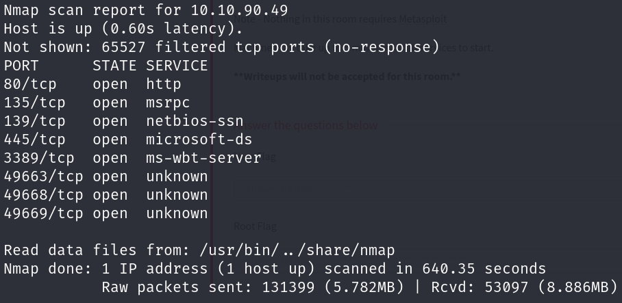

We found 8 open ports. Let's further scan the services running on these ports with Nmap.

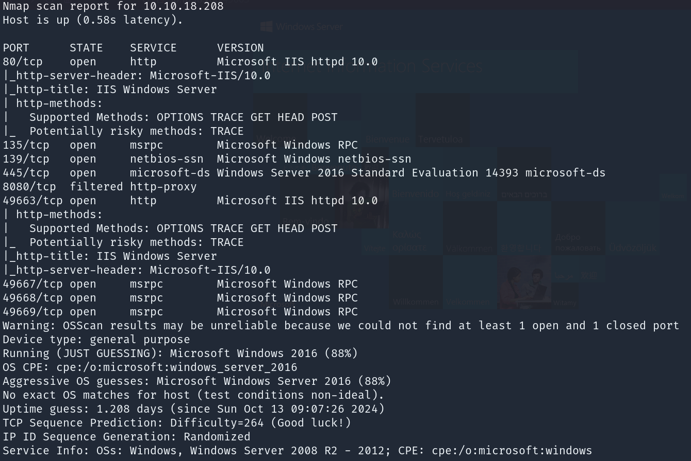

We can see 2 ports running HTTP services on ports 80 and 49663. There are also SMB on port 445 and RDP on port 3389. Let's start by visiting the web server on port 80.

Nothing much here. Let's try running a gobuster scan against the web server.

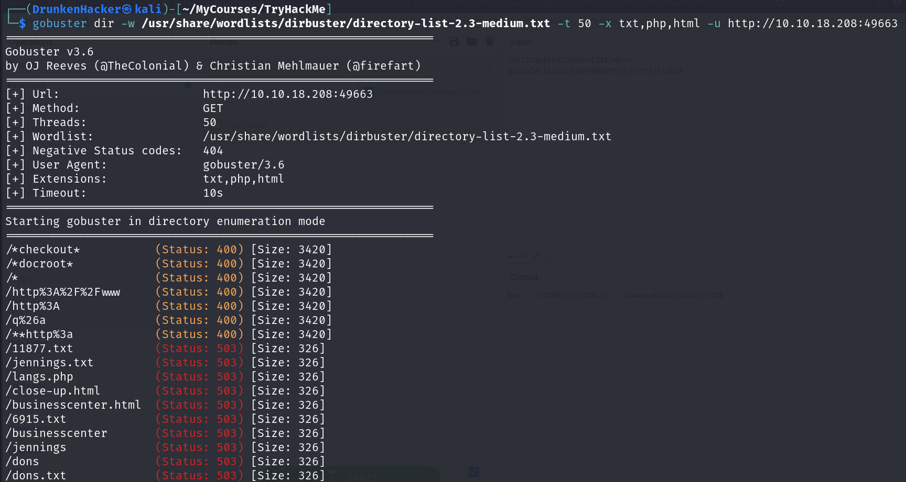

Nothing interesting was found. Let's try looking at the SMB service.

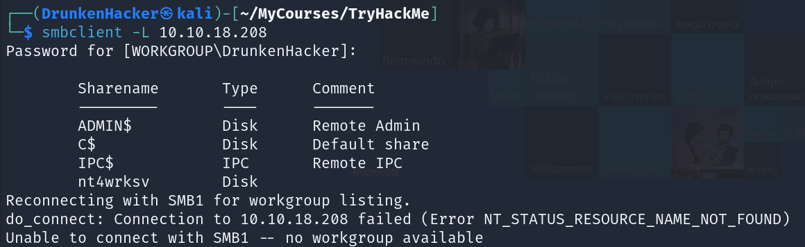

We found an abnormal share here. Let's try to access it.

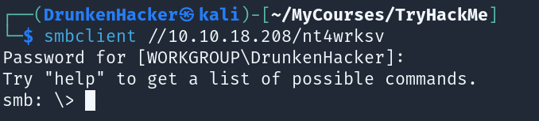

We can access the share without a password. Let's see what's inside.

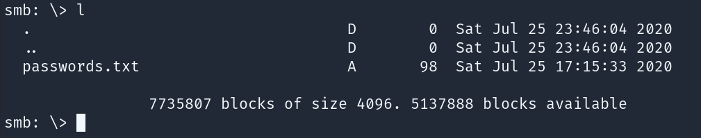

There is a `passwords.txt` file. Let's download it and see what's inside.

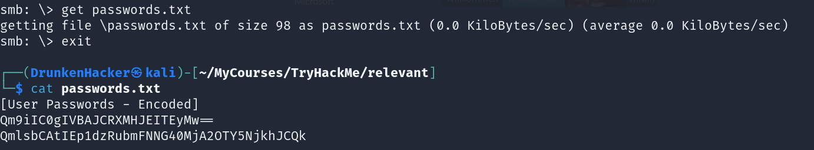

It is a file of encoded users' passwords. Let's try to decode it.

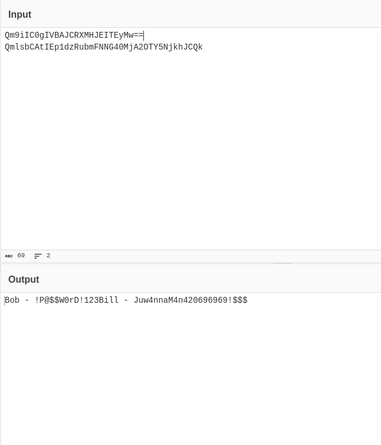

With the help of CyberChef, we now have the passwords of 2 users - Bob and Bill. However, we have not found any usernames yet. We need to look around more. It seems like the SMB is not well secured. Let's try to find vulnerabilities in the SMB service.

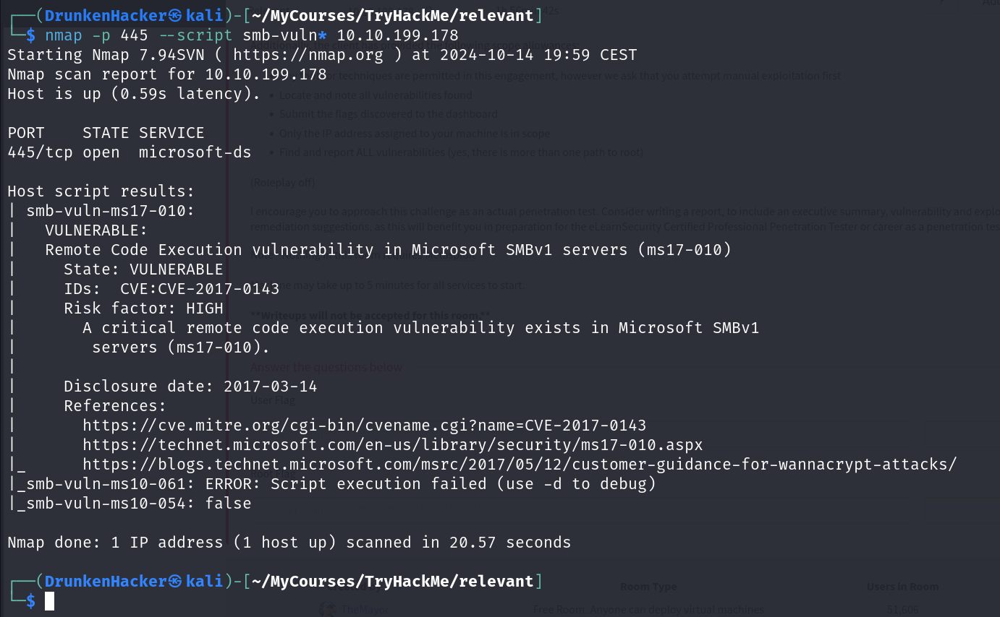

Thanks to Nmap, we found that the SMB service is vulnerable to CVE-2017-0143. Let's find an exploit for this vulnerability on Metasploit.

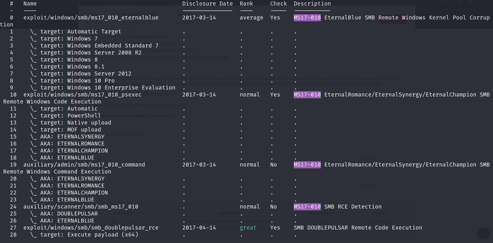

There are a lot of exploits for this vulnerability. The one we will be using is `exploit/windows/smb/ms17_010_psexec`. Now we need to set the required options and run the exploit.

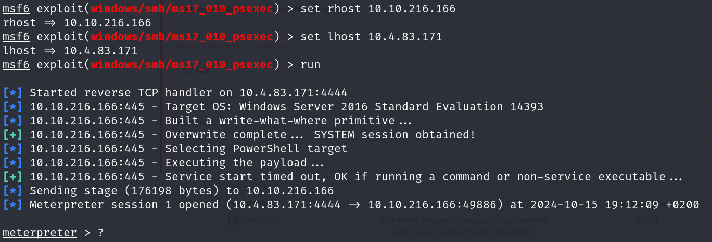

We have exploited the machine and have a Meterpreter session. Now we launch a shell and look around the machine.

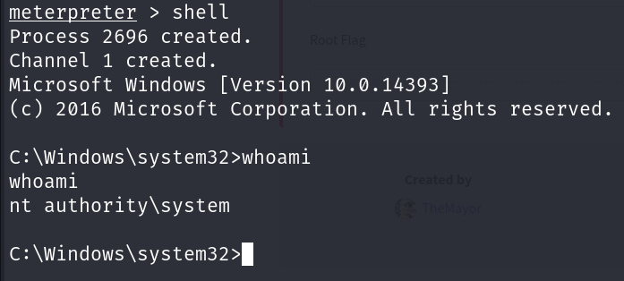

We have a shell and luckily we are already `NT AUTHORITY\SYSTEM`. Let's find the flags.

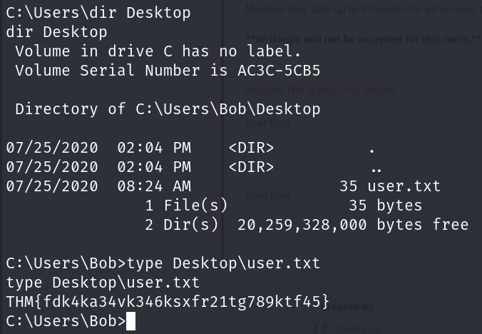

We found the `user.txt` flag at the Desktop of the user `Bob`. Let's find the `root.txt` flag.

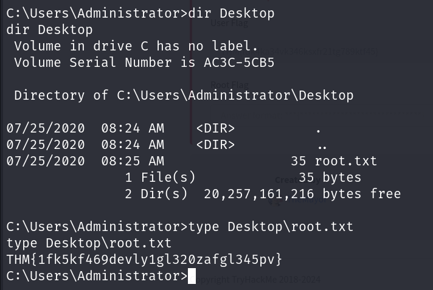

We found the `root.txt` flag at the Desktop of the user `Administrator`. We have successfully completed the challenge.