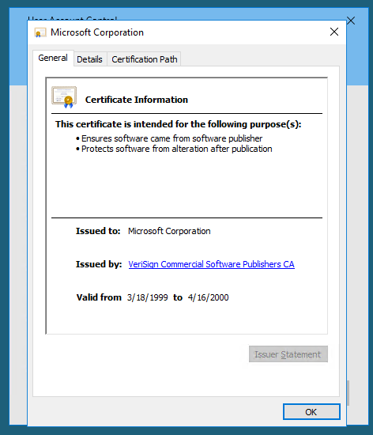

# Retro

## Description

New high score!
* Difficulty: **Hard**
* Category: Pwn

## Challenge

As always, we are given an IP address. Let's start with an nmap scan.

```bash
┌──(DrunkenHacker㉿kali)-[~/MyCourses/TryHackMe]
└─$ sudo nmap -sS -v -T4 -p- $TARGET_IP -Pn
[REDACTED]
Nmap scan report for $TARGET_IP
Host is up (0.52s latency).
Not shown: 65533 filtered tcp ports (no-response)
PORT     STATE SERVICE
80/tcp   open  http
3389/tcp open  ms-wbt-server
```

We have two ports open, 80 and 3389. Time to check out the website.


This is a default IIS page. Let's run a gobuster scan.

```bash
┌──(DrunkenHacker㉿kali)-[~/MyCourses/TryHackMe]
└─$ gobuster dir -w /usr/share/wordlists/dirbuster/directory-list-2.3-medium.txt -t 50 -x txt,php,html -u http://$TARGET_IP
===============================================================
Gobuster v3.6
by OJ Reeves (@TheColonial) & Christian Mehlmauer (@firefart)
===============================================================
[+] Url:                     http://$TARGET_IP
[+] Method:                  GET
[+] Threads:                 50
[+] Wordlist:                /usr/share/wordlists/dirbuster/directory-list-2.3-medium.txt
[+] Negative Status codes:   404
[+] User Agent:              gobuster/3.6
[+] Extensions:              txt,php,html
[+] Timeout:                 10s
===============================================================
Starting gobuster in directory enumeration mode
===============================================================
/retro                (Status: 301) [Size: 149] [--> http://$TARGET_IP/retro/]
===============================================================
Finished
===============================================================
```

We have a directory called `/retro`. Let's check it out.


Seems to be a blog about retro games. Let's look around and see what's here. It seems like this one guy Wade is posting almost everything. Let's checkout his profile.


Wade had made several posts but there is one that he recently commented on. Let's check it out.


Kinda weird but we can guess that this is his password. Let's try to login to RDP with his name and this password.


We are in! And there is a flag on the desktop too. Now we need to escalate our privileges. The hint says to figure out what the user last was trying to find. Could be a hint to check the browser history.


CVE-2019-1388? Is this a hint that the system is vulnerable to this? Let's check out the exploit. We need the `hhupd.exe` file to exploit this. Luckily, it's already here in the Recycle Bin.


We are going to restore this file and run it.


This is demanding Administator password. We don't have that so let's click on `Show more details`.


The CVE is related to the certificate prompt so we need to click on `Show information about the publisher's certificate`.



We can see informations about the certificate. Now we click on the link of the issuer.


We cannot continue because Windows does not show us any option to open the link of the issuer even though we have Internet Explorer and Google Chrome ready on the machine. This is a bug in Windows. How pathetic! We need to find another way to escalate our privileges.


As we enumerate the system, we found that the OS version is 10.0.14393. This is vulnerable to CVE-2017-0213. We can serve the exploit from our machine, download it on the target machine and run it.


We have escalated our privileges. All that is left is to get the flag from the Administrator's desktop.