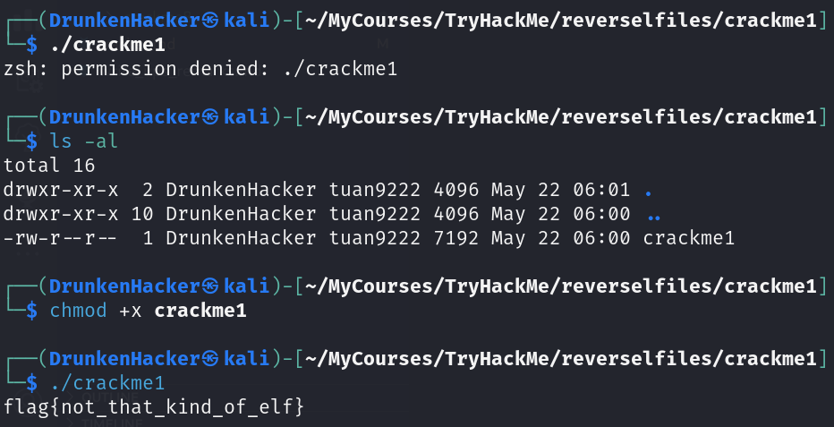

# Reversing ELF

## Task 1 - Crackme1

* Category: Reverse Engineering
* Difficulty: **Easy**

### Challenge

We received a binary file named `crackme1`. The task is asking if we can run the binary. Kinda weird, but let's try it.

We got the flag. But this is not reversing. Let's move on to the next task.