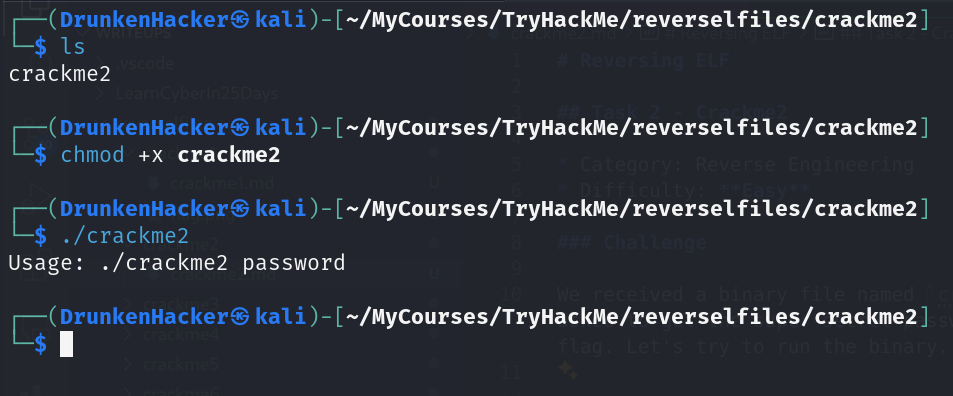
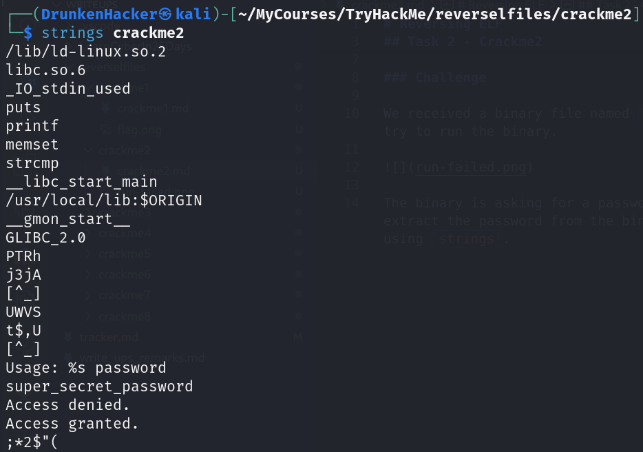
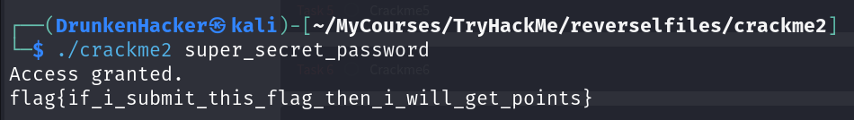

# Reversing ELF

## Task 2 - Crackme2

* Category: Reverse Engineering
* Difficulty: **Easy**

### Challenge

We received a binary file named `crackme2`. Let's try to run the binary.

The binary is asking for a password. We need to extract the password from the binary. Let's try using `strings`.

Seems like we found the password. Let's try running the binary again.

And we got the flag! Let's move on to the next task.