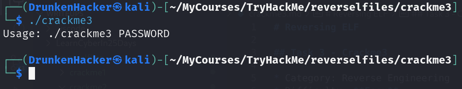

# Reversing ELF

## Task 3 - Crackme3

* Category: Reverse Engineering
* Difficulty: **Easy**

### Challenge

We received a binary file named `crackme3`. Let's try to run the binary.

Again, the binary is asking for a password. We need to extract the password from the binary. Let's try using `strings`.

Doesn't seem like we found the password yet. But there is a suspicious base64 string. Let's decode the base64 string.

This could be the password. Let's try running the binary again.

It is correct and is indeed our flag. Let's move on to the next task.