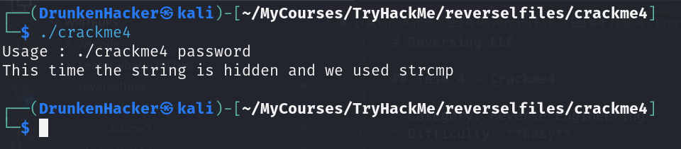
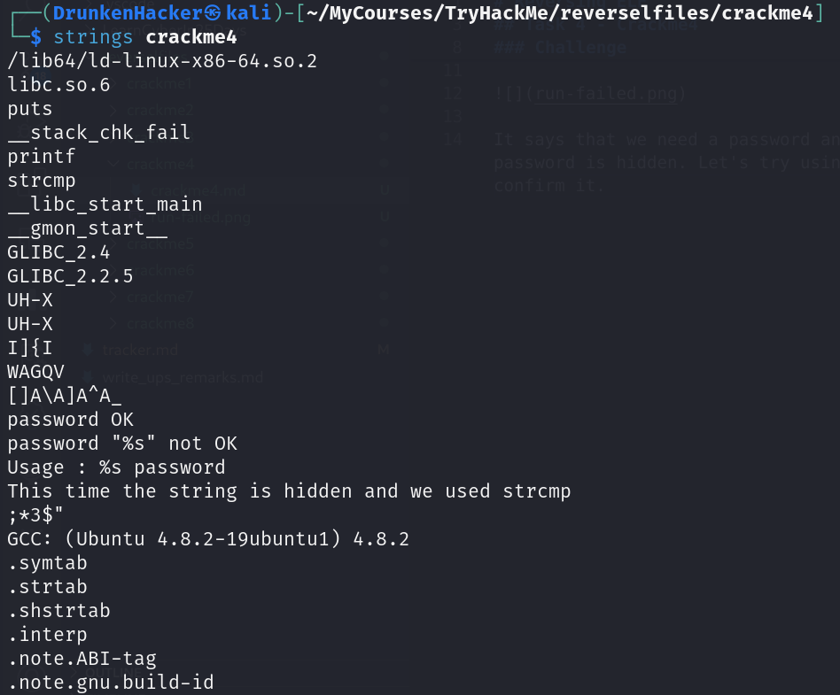
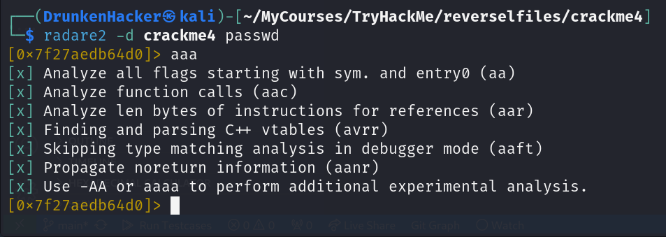
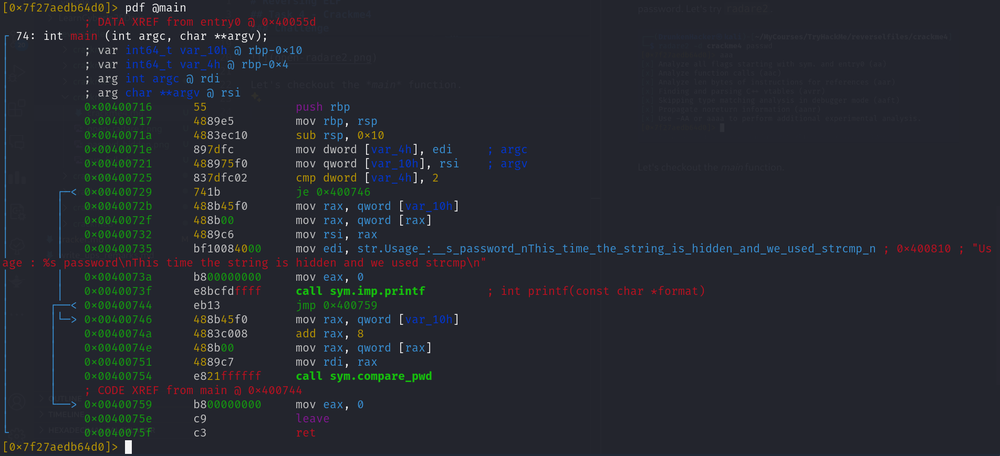
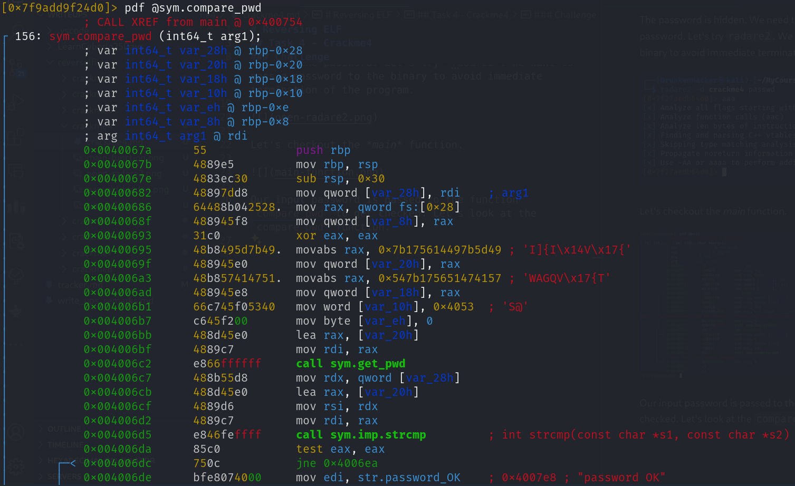
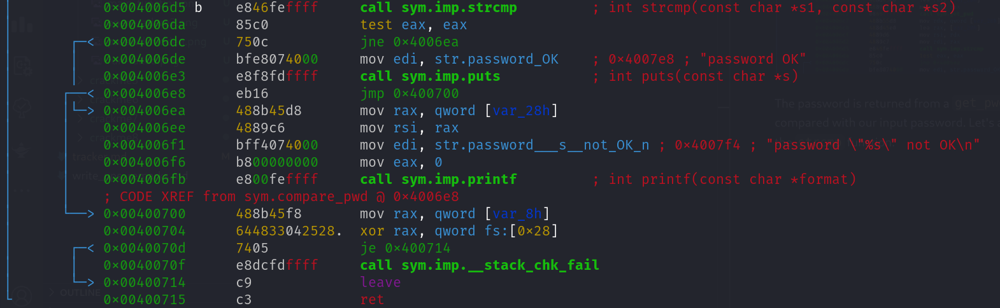
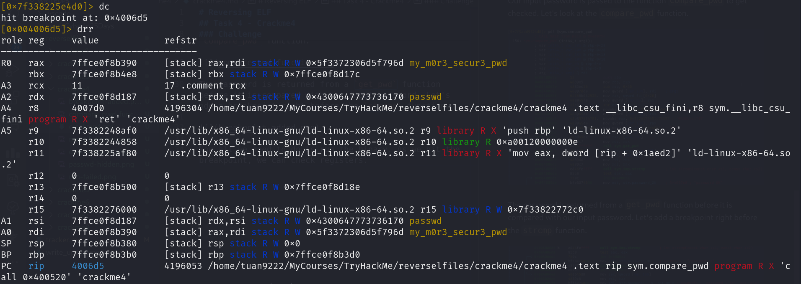
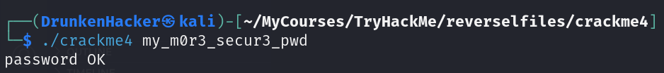

# Reversing ELF

## Task 4 - Crackme4

* Category: Reverse Engineering
* Difficulty: **Easy**

### Challenge

We received a binary file named `crackme4`. Let's try to run the binary.

It says that we need a password and this time the password is hidden. Let's try using `strings` and confirm it.

The password is hidden. We need to use another tool to extract the password. Let's try `radare2`. We want to pass a password to the binary to avoid immediate termination of the program.

Let's checkout the *main* function.

Our input password is passed to the function `compare_pwd` to get checked. Let's look at the `compare_pwd` function.

The password is returned from a `get_pwd` function before it is compared with our input password. Let's add a breakpoint right before the `strcmp` function.

Now all we need to do is run the binary. As we hit the breakpoint, we can check registers.

The password is stored in the `rax` register. Let's verify it.

Let's move on to the next task.