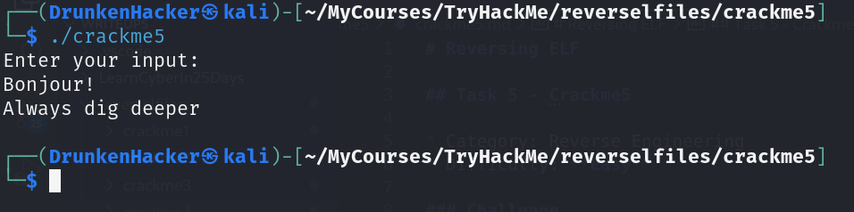
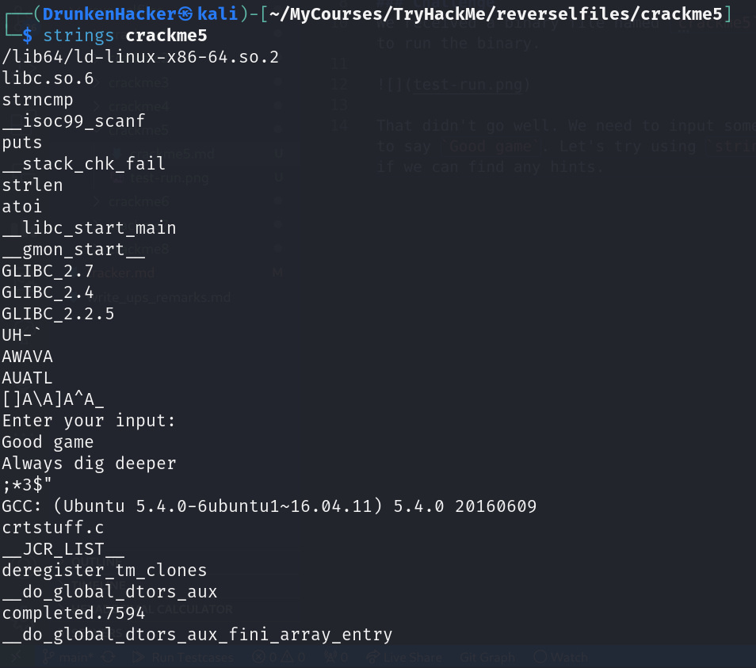
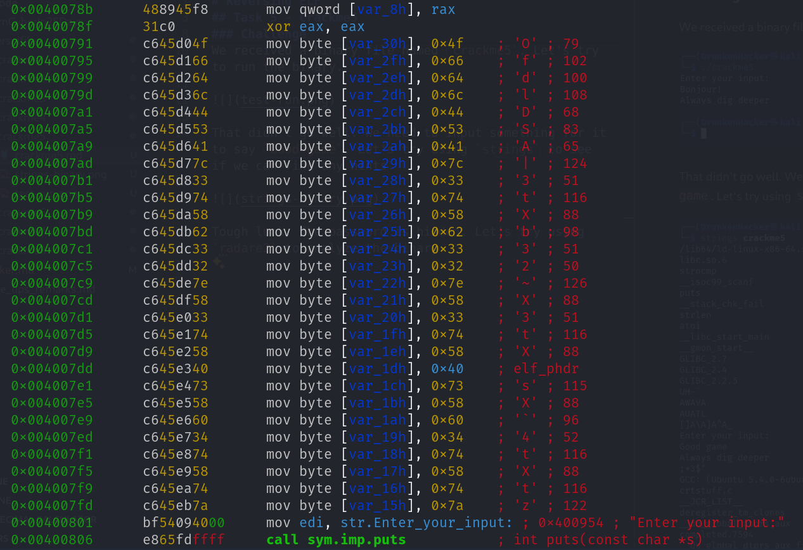
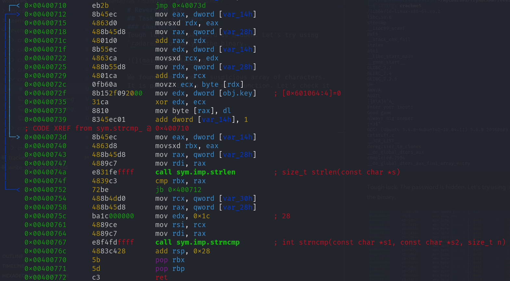
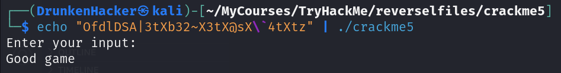

# Reversing ELF

## Task 5 - Crackme5

* Category: Reverse Engineering
* Difficulty: **Easy**

### Challenge

We received a binary file named `crackme5`. Let's try to run the binary.

That didn't go well. We need to input something for it to say `Good game`. Let's try using `strings` to see if we can find any hints.

Tough luck. The password is hidden. Let's try using `radare2` to analyze the binary.

We found some kind of suspicious array of characters. It is passed into a `strcmp_` function with our input. Let's check it out.

The function uses `strncmp` to compare our input with the array of characters. The number of characters to compare is 28. Let's try the string made up of 28 first characters of the array that we found.

And GG! We move on to the next one.