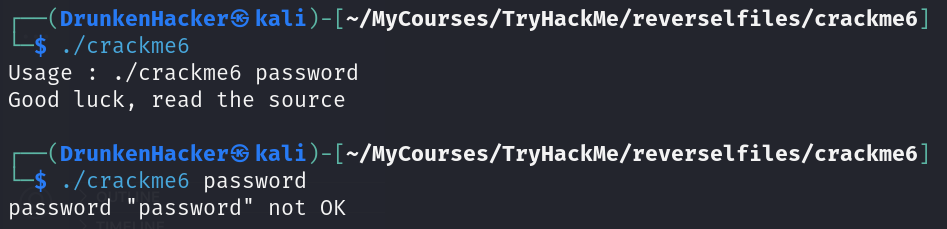
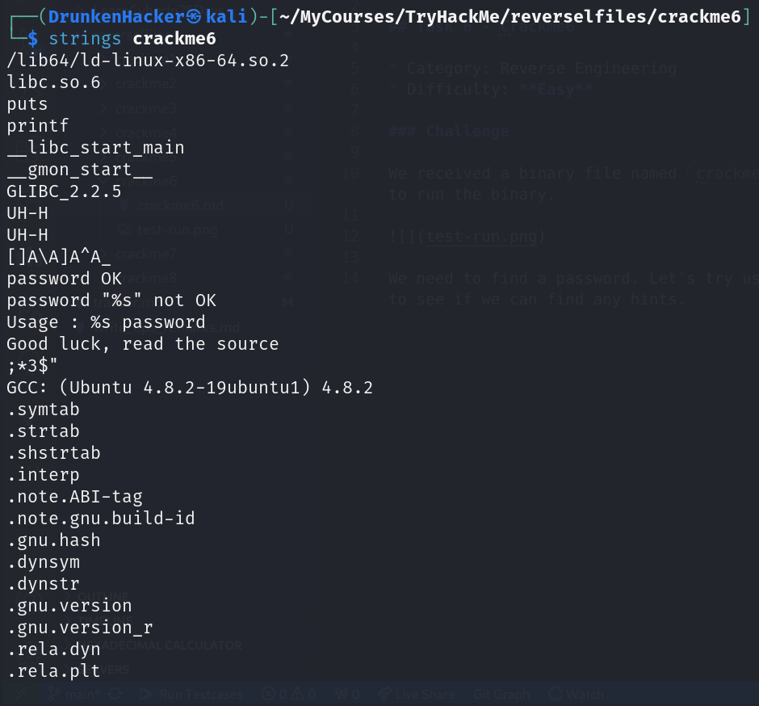
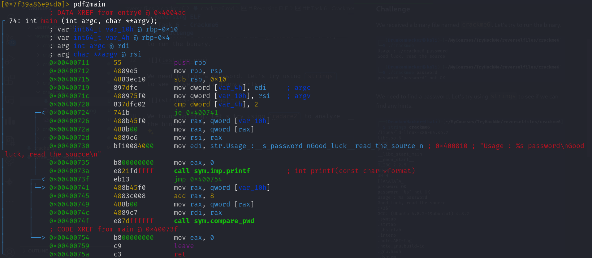
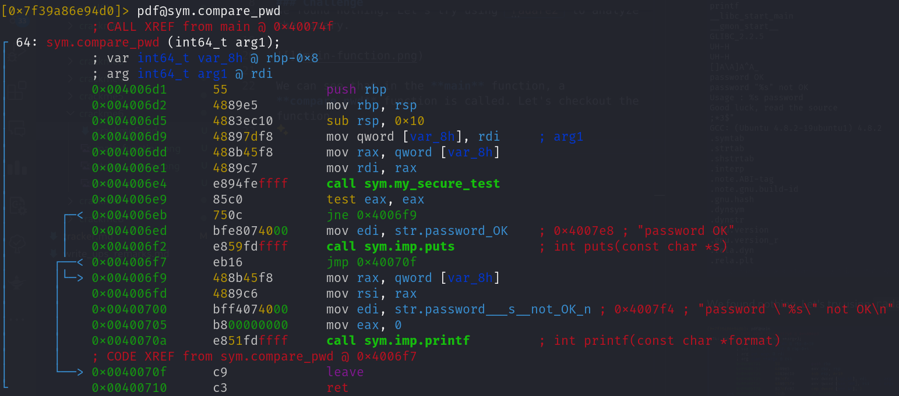
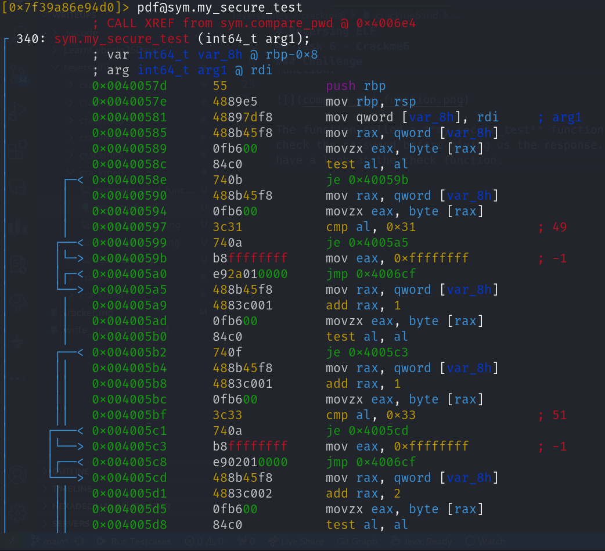
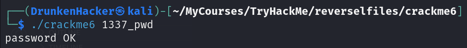

# Reversing ELF

## Task 6 - Crackme6

* Category: Reverse Engineering
* Difficulty: **Easy**

### Challenge

We received a binary file named `crackme6`. Let's try to run the binary.

We need to find a password. Let's try using `strings` to see if we can find any hints.

We found nothing. Let's try using `radare2` to analyze the binary.

We can see that in the **main** function, a **compare_pwd** function is called. Let's checkout the function.

The function called a **my_secure_test** function to check the password before giving us the response. Let's have a look at the check function.

That is a hell lot of jumps! The code looks very intimidating at first glance! However, these are just a series of if-else statements. The function simply checks each character of the password we entered. By reversing from *hex* to *characters*, then combining them we can get the password. Finally, we can verify the password.

Let's move on to the next task.